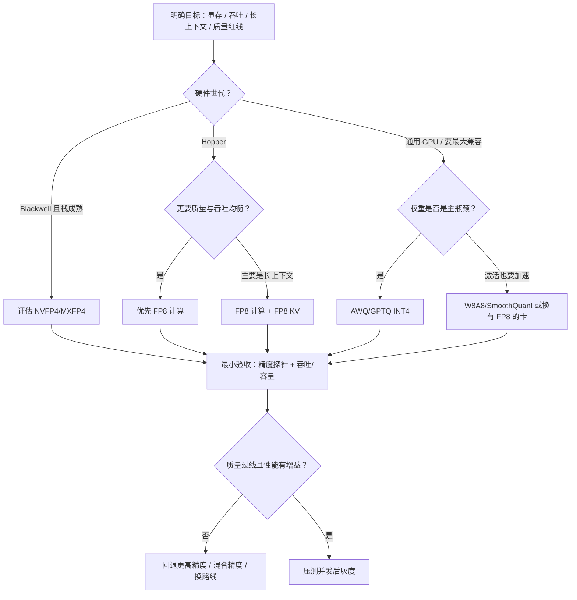
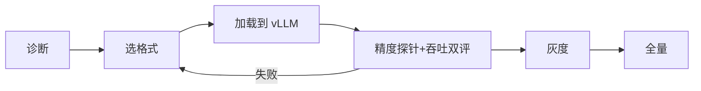

原理章节已经把武器库摆齐：W8A8/SmoothQuant、INT4（GPTQ/AWQ）、KV 量化、FP8/NVFP4。真正让人失眠的是——**明天上线该开哪一个？** 这一节给出可执行的决策树，落到 vLLM 的常见启用方式，并补上最小验收：**精度探针 + 吞吐/容量指标**，相对同一 FP16/BF16 基线、同一负载说话。目标不是评出"永远的第一名"，而是建立"瓶颈 → 格式 → 验证 → 回滚"的闭环。

<!-- more -->

## 📑 目录

- [1. 选型之前先定义瓶颈](#1-选型之前先定义瓶颈)
- [2. 量化决策树](#2-量化决策树)
- [3. vLLM 启用：四条常见路径](#3-vllm-启用四条常见路径)
- [4. 最小验收：精度探针与吞吐](#4-最小验收精度探针与吞吐)
- [5. 对比实验怎么做才不算自欺](#5-对比实验怎么做才不算自欺)
- [6. 组合拳与兼容性陷阱](#6-组合拳与兼容性陷阱)
- [7. 上线检查清单](#7-上线检查清单)
- [8. 权衡小结](#8-权衡小结)
- [总结](#-总结)
- [自我检验清单](#-自我检验清单)
- [参考资料](#-参考资料)

---

## 1. 选型之前先定义瓶颈

量化不是"比特越低越强"。先用数据和 profiler 回答：

| 你的主诉 | 更可能的方向 | 主要依据章节 |
|---|---|---|
| 模型权重大到装不下 / 要降并行度 | Weight-only INT4（AWQ/GPTQ） | [4.3](./4.3-Weight-only-INT4.md) |
| Decode 吞吐不够，且在 Hopper，质量要求高 | FP8（权重/激活） | [4.5](./4.5-FP8与NVFP4.md) |
| 要吃 INT8 Tensor Core，且已有 SmoothQuant 配方 | W8A8 | [4.2](./4.2-W8A8-SmoothQuant.md) |
| 长上下文 OOM / 抢占狂刷 | FP8 KV（或更激进 KV 方案） | [4.4](./4.4-KV-Cache量化.md) |
| 集群已上 Blackwell，引擎栈成熟 | 评估 NVFP4/MXFP4 | [4.5](./4.5-FP8与NVFP4.md) |

📌 **关键点**：**先诊断瓶颈，再选量化。** 用 INT4 去救"激活算力吃不满"，或用 FP8 去救"只是权重装不下且卡不是 Hopper"，都可能选错药。

---

## 2. 量化决策树

按顺序回答，避免同时开三个开关却无法归因：



一句话压缩（配合硬件前提）：

- **精度与 Hopper 吞吐** → FP8；
- **极致省权重显存、要兼容多代 GPU** → INT4；
- **长上下文状态胀** → KV 量化；
- **有 INT8 栈与校准能力** → W8A8；
- **Blackwell 就绪** → 再评估 NVFP4/MXFP4。

取舍句：决策树选的是**第一刀与验证顺序**，不是宣称某一格式在所有 SLA 上全面优于其它格式。

---

## 3. vLLM 启用：四条常见路径

以下示例基于 vLLM 常见用法；**参数枚举与默认值随版本变化**，以你环境中的文档与 `vllm serve --help` 为准。

### 3.1 AWQ

```python
from vllm import LLM

llm = LLM(
    model="Qwen/Qwen2.5-7B-Instruct-AWQ",
    quantization="awq",
    dtype="float16",
    gpu_memory_utilization=0.90,  # 约值；以当前文档为准
)
```

### 3.2 GPTQ

```python
llm = LLM(
    model="your-org/your-model-GPTQ",
    quantization="gptq",
    dtype="float16",
)
```

### 3.3 FP8

```python
llm = LLM(
    model="your-org/your-model-FP8",
    quantization="fp8",
)
```

### 3.4 compressed-tensors

`compressed-tensors` 是一种更统一的量化描述/装载路径，适合承载多种压缩方案（含部分 W8A8/FP8 等，取决于权重如何导出）：

```python
llm = LLM(
    model="your-org/model-compressed-tensors",
    quantization="compressed-tensors",
)
```

命令行侧同理：

```bash
vllm serve Qwen/Qwen2.5-7B-Instruct-AWQ --quantization awq
vllm serve your-org/model-FP8 --quantization fp8
# 长上下文容量问题再叠加 KV dtype（名称以当前文档为准）
# vllm serve ... --kv-cache-dtype fp8
```

🔑 **核心概念**：在 vLLM 里，**量化格式是"模型产物 + 引擎后端"的契约**。只改 `quantization=` 而权重并非对应格式，轻则报错，重则静默走错路径。

💡 **提示**：优先选用**官方或可信渠道发布的、标明适配 vLLM 的量化权重**。自己量化时，选与目标引擎测试矩阵一致的工具链（AutoAWQ、llm-compressor 等）。

---

## 4. 最小验收：精度探针与吞吐

上线前至少跑通下面两张表；**全部相对同一基线、同一 Prompt 集、同一采样与并发模型**。

### 4.1 精度探针（质量一票否决）

| 探针 | 目的 | 不过线时 |
|---|---|---|
| 短对话 / 指令遵循抽检（数十条即可） | 抓明显胡话、拒答异常 | 回退或换格式 |
| 业务核心集（代码编译、检索问答、工具 JSON…） | 对齐真实 SLA | 混合精度或放弃该比特 |
| 长上下文针检索（若开了 KV 量化或长文服务） | 抓长距离依赖损伤 | 关 KV 量化或降激进程度 |
| 与权重×KV 组合相关的坏例复测 | 防双重近似 | 单变量定位后重组 |

不必一上来就上完整学术榜；**先用小而狠的探针拦住灾难性掉点**，再谈大规模评测。

### 4.2 吞吐与容量（证明药吃对了）

| 指标 | 相对基线你要证明什么 |
|---|---|
| 峰值显存 / KV 池可用 Token 数 | 容量目标是否达成 |
| 吞吐 tok/s（固定并发与长度） | 成本是否下降 |
| TTFT / TPOT（P50/P99） | 体验是否可接受 |
| preemption 次数 | 长上下文是否真缓解 |
| Kernel/日志 | 是否命中预期后端（Marlin/FP8 GEMM 等） |

示例判定（数字需按业务改，这里给的是**形态**而非万能阈值）：在目标负载下，INT4 相对 FP16 显存明显下降且业务探针掉点 < 约定阈值，同时 tok/s **不劣化**（或 P99 可接受）——才进入灰度。若体积小了但 tok/s 几乎不动，先查 Kernel，而不是加并发掩盖。

⚠️ **注意**：短 Prompt、`batch=1` 的笔记本体感，常常错估服务场景收益。验收负载应接近生产的并发与长度。

---

## 5. 对比实验怎么做才不算自欺

建议固定四组对照：

1. **BF16/FP16 基线**（质量天花板与性能基线）；
2. **候选量化 A**（如 AWQ）；
3. **候选量化 B**（如 FP8，若硬件允许）；
4. **量化 + KV dtype**（若长上下文是目标）。

同一套：

- Prompt 集（含长文、工具调用、代码、安全拒答）；
- 采样参数（temperature / max_tokens）；
- 并发模型（离线吞吐 vs 在线 `max_num_seqs`）。

记录至少：任务分或人工盲评、TTFT/TPOT、吞吐、峰值显存/抢占次数。比较时写明：**模型、硬件、vLLM 版本、并发、输入/输出长度**——缺少前提的加速比不要写进结论。

---

## 6. 组合拳与兼容性陷阱

常见叠加：

- INT4 权重 + 更大 `gpu_memory_utilization` → 把显存还给 KV；
- FP8 权重 + FP8 KV → Hopper 长上下文；
- 量化 + Prefix Cache → 共享前缀仍有效，但要确认 dtype 一致；
- 量化 + Speculative Decoding → 见第 5 章相关节，接受率与草稿模型精度都会变。

陷阱：

- 某量化后端与 CUDA Graph、多 LoRA、编码器-解码器结构不兼容；
- 权重是 AWQ，却按 GPTQ 加载；
- 只比模型体积，不比 Kernel 是否命中；
- 同时改精度与 `max_num_seqs`，无法解释吞吐变化来自哪。

📌 **关键点**：把"特性兼容矩阵"和"单变量实验"当成和精度同等重要的上线门槛。

---

## 7. 上线检查清单

- [ ] 瓶颈结论写清楚（显存 / 吞吐 / 上下文）
- [ ] 格式与硬件世代匹配
- [ ] 权重来源可信，`quantization` 与产物一致
- [ ] 精度探针过线（含长上下文，若适用）
- [ ] 吞吐/容量指标相对同负载基线有预期增益
- [ ] Profiler/日志确认预期 Kernel
- [ ] 压测并发下无异常抢占与内存泄漏
- [ ] 回滚方案：可一键切回 FP16/BF16 或上一版本量化权重



---

## 8. 权衡小结

| 你想要 | 往往要付出 |
|---|---|
| 更低比特 / 更高密度 | 更高的精度与兼容性风险 |
| 更快上线（用现成 INT4） | 可能吃不到 FP8 那种计算规格 |
| Hopper 上 FP8 均衡 | 可移植性弱于通用 INT4 |
| 叠加权重+KV 量化 | 双重近似与归因成本 |
| 一次改很多开关 | 无法解释，也无法安全回滚 |

适用：已有基线看板、能做探针与压测的团队。  
若连 FP16 基线的质量集与负载模型都没有，先补观测，再谈量化选型——否则你只是在换一种方式偶遇问题。

---

## 📝 总结

- 量化选型由瓶颈与硬件世代驱动：INT4 偏权重容量，W8A8/FP8 偏计算，KV 量化偏长上下文。
- 决策树规定第一刀与验证顺序，不产出"全面优于"的总冠军。
- vLLM 常见入口包括 `awq`、`gptq`、`fp8`、`compressed-tensors`；契约是"权重格式 + 后端"一致。
- 最小验收两件事：精度探针（含长文若适用）与同负载下的吞吐/容量/抢占；并确认 Kernel 命中。
- 上线前确认兼容性、单变量归因与回滚路径。

## 🎯 自我检验清单

- 能根据三种主诉（装不下 / 跑不快 / 上下文太长）给出首选量化方向
- 能复述决策树的主干分支，并指出每条分支的硬件前提
- 能写出 vLLM 加载 AWQ 与 FP8 的最小示例
- 能说明 compressed-tensors 适合作为何种统一装载入口
- 能设计一套最小精度探针（短对话 / 业务集 / 长文）
- 能说明吞吐验收必须固定哪些负载前提
- 能列出至少三条量化与其它推理特性叠加时的风险

## 📚 参考资料

- [vLLM — Quantization](https://docs.vllm.ai/en/latest/features/quantization/)
- [vLLM — Engine Arguments](https://docs.vllm.ai/en/latest/configuration/engine_args.html)
- [vLLM — Compressed Tensors](https://docs.vllm.ai/en/latest/features/quantization/compressed_tensors.html)
- [LLM Compressor](https://github.com/vllm-project/llm-compressor)
- [AutoAWQ](https://github.com/casper-hansen/AutoAWQ)
