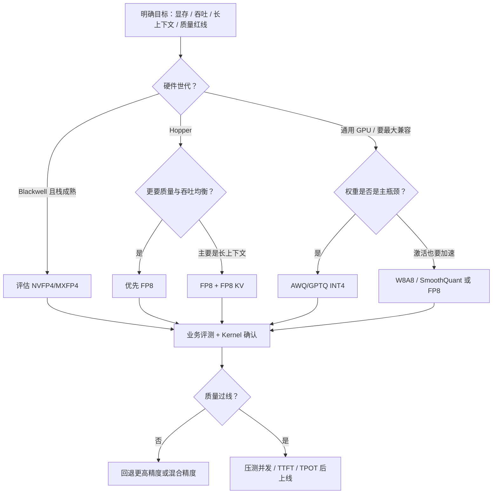
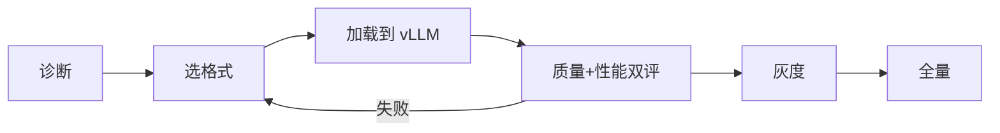

原理章节已经把武器库摆齐：W8A8/SmoothQuant、INT4（GPTQ/AWQ）、KV 量化、FP8/NVFP4。真正让人失眠的是——**明天上线该开哪一个？** 这一节给出可执行的决策树，并落到 vLLM 的常见启用方式：compressed-tensors、GPTQ、AWQ、FP8。目标不是背参数名，而是建立"瓶颈 → 格式 → 验证"的闭环。

<!-- more -->

## 📑 目录

- [1. 选型之前先定义瓶颈](#1-选型之前先定义瓶颈)
- [2. 量化决策树](#2-量化决策树)
- [3. vLLM 启用：四条常见路径](#3-vllm-启用四条常见路径)
- [4. 对比实验怎么做才不算自欺](#4-对比实验怎么做才不算自欺)
- [5. 组合拳与 compatibility 陷阱](#5-组合拳与-compatibility-陷阱)
- [6. 上线检查清单](#6-上线检查清单)
- [总结](#-总结)
- [自我检验清单](#-自我检验清单)
- [参考资料](#-参考资料)

---

## 1. 选型之前先定义瓶颈

量化不是"比特越低越强"。先用数据和 profiler 回答：

| 你的主诉 | 更可能的方向 |
|---|---|
| 模型权重大到装不下 / 要降并行度 | Weight-only INT4（AWQ/GPTQ） |
| Decode 吞吐不够，且在 Hopper，质量要求高 | FP8（权重/激活） |
| 要吃 INT8 Tensor Core，且已有 SmoothQuant 配方 | W8A8 |
| 长上下文 OOM / 抢占狂刷 | FP8 KV（或更激进 KV 方案） |
| 集群已上 Blackwell，追求新一代密度 | NVFP4/MXFP4（看引擎成熟度） |

📌 **关键点**：**先诊断瓶颈，再选量化。** 用 INT4 去救"激活算力吃不满"，或用 FP8 去救"只是权重装不下"，都可能选错药。

---

## 2. 量化决策树



把第 4 章一句话压缩：

- **精度优先** → W8A8 或 FP8；
- **极致省权重显存** → INT4；
- **长上下文** → KV 量化；
- **Hopper** → 认真评估 FP8；
- **Blackwell** → 跟踪 NVFP4/MXFP4。

---

## 3. vLLM 启用：四条常见路径

以下示例基于 vLLM 常见用法；**参数枚举随版本变化**，以你环境中的文档与 `vllm serve --help` 为准。

### 3.1 AWQ

```python
from vllm import LLM

llm = LLM(
    model="Qwen/Qwen2.5-7B-Instruct-AWQ",
    quantization="awq",
    dtype="float16",
    gpu_memory_utilization=0.90,
)
```

### 3.2 GPTQ

```python
llm = LLM(
    model="your-org/your-model-GPTQ",
    quantization="gptq",
    dtype="float16",
)
```

### 3.3 FP8

```python
llm = LLM(
    model="your-org/your-model-FP8",
    quantization="fp8",
)
```

### 3.4 compressed-tensors

`compressed-tensors` 是一种更统一的量化描述/装载路径，适合承载多种压缩方案（含部分 W8A8/FP8 等，取决于权重如何导出）：

```python
llm = LLM(
    model="your-org/model-compressed-tensors",
    quantization="compressed-tensors",
)
```

命令行侧同理：

```bash
vllm serve Qwen/Qwen2.5-7B-Instruct-AWQ --quantization awq
vllm serve your-org/model-FP8 --quantization fp8
```

🔑 **核心概念**：在 vLLM 里，**量化格式是"模型产物 + 引擎后端"的契约**。只改 `quantization=` 而权重并非对应格式，轻则报错，重则静默走错路径。

💡 **提示**：优先选用**官方或可信渠道发布的、标明适配 vLLM 的量化权重**。自己量化时，选与目标引擎测试矩阵一致的工具链（AutoAWQ、llm-compressor 等）。

---

## 4. 对比实验怎么做才不算自欺

建议固定四组对照：

1. **BF16/FP16 基线**（质量天花板与性能基线）；
2. **候选量化 A**（如 AWQ）；
3. **候选量化 B**（如 FP8）；
4. **量化 + KV dtype**（若长上下文是目标）。

同一套：

- Prompt 集（含长文、工具调用、代码、安全拒答）；
- 采样参数（temperature / max_tokens）；
- 并发模型（离线吞吐 vs 在线 `max_num_seqs`）。

记录至少：

| 指标 | 为什么需要 |
|---|---|
| 任务分 / 人工盲评 | 防止"PPL 还行但产品不可用" |
| TTFT / TPOT | 用户体验 |
| 吞吐 tok/s | 成本 |
| 峰值显存 / 抢占次数 | 容量是否真解放 |

⚠️ **注意**：短 Prompt、batch=1 的"本地感测"常常低估或高估量化收益。服务场景请用接近生产的并发与长度。

---

## 5. 组合拳与 compatibility 陷阱

常见叠加：

- INT4 权重 + 更大 `gpu_memory_utilization` → 把显存还给 KV；
- FP8 权重 + FP8 KV → Hopper 长上下文；
- 量化 + Prefix Cache → 共享前缀仍有效，但要确认 dtype 一致；
- 量化 + Speculative Decoding → 见第 5.4 节，接受率与草稿模型精度都会变。

陷阱：

- 某量化后端与 CUDA Graph、多 LoRA、编码器-解码器结构不兼容；
- 权重是 AWQ，却按 GPTQ 加载；
- 只比模型体积，不比 Kernel 是否命中 Marlin/FP8 GEMM。

📌 **关键点**：把"特性兼容矩阵"当成和精度同等重要的上线门槛。

---

## 6. 上线检查清单

- [ ] 瓶颈结论写清楚（显存 / 吞吐 / 上下文）
- [ ] 格式与硬件世代匹配
- [ ] 权重来源可信，`quantization` 与产物一致
- [ ] 质量评测过线（含长上下文抽检）
- [ ] Profiler/日志确认预期 Kernel
- [ ] 压测并发下无异常抢占与内存泄漏
- [ ] 回滚方案：可一键切回 FP16/BF16 或上一版本量化权重



---

## 📝 总结

- 量化选型由瓶颈驱动：INT4 偏权重容量，W8A8/FP8 偏计算，KV 量化偏长上下文。
- 决策树应同时纳入硬件世代与质量红线，而不是只看比特数。
- vLLM 常见入口包括 `awq`、`gptq`、`fp8`、`compressed-tensors`；契约是"权重格式 + 后端"一致。
- 对比实验要固定数据与采样，覆盖质量、延迟、吞吐、显存/抢占。
- 上线前确认兼容性、Kernel 命中与回滚路径。

## 🎯 自我检验清单

- 能根据三种主诉（装不下 / 跑不快 / 上下文太长）给出首选量化方向
- 能画出或复述本节决策树的主干分支
- 能写出 vLLM 加载 AWQ 与 FP8 的最小示例
- 能说明 compressed-tensors 适合作为何种"统一装载"入口
- 能设计一组 FP16 vs INT4 vs FP8 的公平对比实验
- 能列出至少三条量化与其它推理特性叠加时的风险

## 📚 参考资料

- [vLLM — Quantization](https://docs.vllm.ai/en/latest/features/quantization/)
- [vLLM — Engine Arguments](https://docs.vllm.ai/en/latest/configuration/engine_args.html)
- [vLLM — Compressed Tensors](https://docs.vllm.ai/en/latest/features/quantization/compressed_tensors.html)
- [LLM Compressor](https://github.com/vllm-project/llm-compressor)
- [AutoAWQ](https://github.com/casper-hansen/AutoAWQ)
