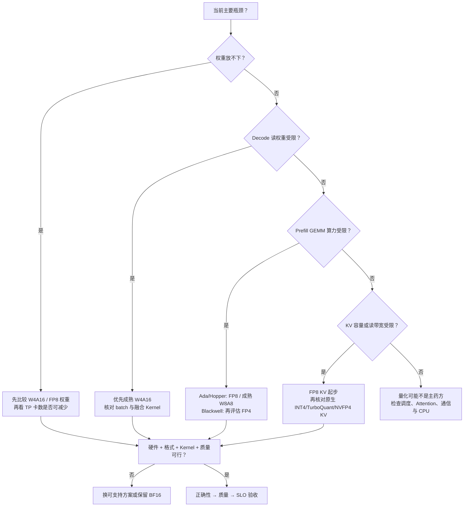

## 📑 目录
- [1. 先诊断瓶颈，再选择 bit](#1-先诊断瓶颈再选择-bit)
- [2. 决策树：五类瓶颈对应什么方案](#2-决策树五类瓶颈对应什么方案)
- [3. 权重容量受限](#3-权重容量受限)
- [4. Decode 权重带宽受限](#4-decode-权重带宽受限)
- [5. Prefill 算力受限](#5-prefill-算力受限)
- [6. KV 容量或 Attention 带宽受限](#6-kv-容量或-attention-带宽受限)
- [7. 硬件与 Kernel 是可行域](#7-硬件与-kernel-是可行域)
- [8. 组合量化为何风险相乘](#8-组合量化为何风险相乘)
- [9. 正确性、质量与 SLO 三层验收](#9-正确性质量与-slo-三层验收)
- [10. vLLM：格式支持与 Kernel 可用性案例](#10-vllm格式支持与-kernel-可用性案例)
- [11. 7B 与 70B 选型算例](#11-7b-与-70b-选型算例)
- [12. 最终选择原则](#12-最终选择原则)
- [总结](#总结)
- [自我检验](#自我检验)
- [参考资料](#参考资料)

---

## 1. 先诊断瓶颈，再选择 bit
量化方案不是按位宽从高到低升级，它们改变的是不同资源项：
```text
W8A8 / FP8 W8A8：权重 + 激活 + 低精度 GEMM
W4A16：            固定权重容量与读取带宽
低位 KV：           每请求 KV 容量与 Attention 读取
NVFP4 / MXFP4：    Blackwell 上的更低精度权重/激活路径
```
开始选型前，先把服务写成三本账。

### 1.1 容量账
$$
M_{\text{total}}=M_W+M_{\text{KV}}+M_{\text{activation}}
+M_{\text{workspace}}+M_{\text{graph}}+M_{\text{communication}}+M_{\text{margin}}
$$
问清 OOM 来自模型加载、峰值 workspace，还是活跃 token 增长。

### 1.2 Roofline 账
$$P=\min(P_{\text{peak}},BW_{\text{HBM}}\times I)$$
问清关键阶段受计算还是带宽限制，并分别判断 Prefill、短 Decode 与长上下文 Decode。

### 1.3 SLO 账
- TTFT：Prefill、排队和调度共同影响；
- TPOT/ITL：Decode 每步关键路径；
- throughput 是单位时间完成量，Goodput 是满足 TTFT、TPOT、P99 与质量门槛的有效吞吐。
如果目标只是“更快”，就没有足够信息选择量化对象。

## 2. 决策树：五类瓶颈对应什么方案


树中每个叶子都是候选，不是结论。
同一服务可能同时有两类瓶颈，但应先隔离主变量，再考虑组合。

## 3. 权重容量受限
权重本体近似为 $\displaystyle M_W=N\frac{b_W}{8}$。
7B/70B 在 BF16 下约为 14/140 GB；raw INT8 或 FP8 约为 7/70 GB；raw INT4/FP4 约为 3.5/35 GB。
容量目标常见于：
- 模型无法装入单卡或目标卡数；
- Tensor Parallel 卡数过高；
- 权重挤压 KV 池，或多副本成本受固定权重支配。

### 3.1 首选候选
成熟 W4A16 通常提供最直接的权重压缩。
FP8 权重压缩较温和，但数值风险和格式复杂度可能更低，并可能配合原生 FP8 计算。
Blackwell 上可把 NVFP4/MXFP4 纳入候选，但不能把 FP4 文件直接视为可执行 Kernel。

### 3.2 容量不能只看 checkpoint
实际进程还要加：
- group/block scales、zero-points、未量化层和预打包副本；
- CUDA Graph、workspace、KV Cache 和通信 buffer。
若 loader 把低比特权重展开为 BF16，磁盘压缩不会成为运行时容量收益。

### 3.3 卡数变化是离散收益
例如 70B BF16 的 raw 权重约 140 GB；两张 80 GB 卡即使容得下权重本体，完整运行状态的余量也可能不足，而 INT4 可能释放足够空间。
但能否从 TP=4 降到 TP=2，还要重新计算每卡 KV、workspace、通信和局部 shape。
少卡可能减少 collective 成本，也可能让单卡内存更紧。
这属于新系统配置，不能只沿用原 TP 的性能比例。

## 4. Decode 权重带宽受限
小 batch Decode 中，每生成一个 token 都要读取大量 Linear 权重。
若 profiler 显示 HBM 流量高、Tensor Core 利用率低，W4A16 与问题最匹配。

理想情况下，BF16 到 INT4 将 raw codes 降为四分之一。
真实上限由以下因素缩小：
- scale 与 zero-point 流量；
- 解包和反量化指令；
- group size；
- Marlin 类 Kernel 的 shape 匹配；
- 非 Linear 算子比例；
- KV Attention 与通信时间。

连续批处理增大 $M$ 后，权重被更多 token 复用。
因此同一 W4A16 Kernel 在 batch 1 和高并发下的优势可能不同。

W8A8/FP8 也能减少权重字节，但还要在线处理激活。
若主要问题只是权重搬运，成熟 W4A16 往往是更直接的第一候选，而不是无条件的最终赢家。

若上下文很长，先确认 Decode 时间是否已经由 KV 读取主导。
量化权重不会减少历史 K/V 字节。

## 5. Prefill 算力受限
长 Prompt 和较大 batch 的 Prefill 形成大 GEMM。
权重被大量 token 复用，算术强度较高，系统更可能接近计算上界。

此时应优先寻找能真正提高 GEMM 计算吞吐的路径：
- Ada/Hopper：都支持原生 FP8 Tensor Core，仍需核对模型、格式和 Kernel 覆盖；也可评估硬件/软件成熟的 INT8 W8A8；
- Blackwell：在 FP8 基础上，再评估 NVFP4/MXFP4 等原生 FP4 路径；
- 无相应低精度硬件：保留 BF16，避免只为格式转换付费。

SmoothQuant 的价值在于让激活离群通道更适合静态 W8A8，而不是单纯缩小权重。
FP8 则用指数与 scaling 处理动态范围。

Prefill 加速仍受 Amdahl 定律约束。
Attention、Norm、位置编码、通信和调度没有全部变成低精度 GEMM。

因此要观察 TTFT 的阶段分解，而不是用低精度峰值 FLOPS 直接换算。

## 6. KV 容量或 Attention 带宽受限
KV 数据本体为：
$$
M_{\text{KV}}
=L\left(\sum_rT_r\right)2H_{kv}D_h\frac{b_{kv}}8
$$

若瓶颈随活跃 token 数增长，而不是模型加载时立即出现，应优先检查 KV。

### 6.1 容量只需约减半
FP8 KV 是较温和的候选。
raw 数据从 16 bit 降到 8 bit，同时保留指数范围；仍要验证 scale、backend 与长上下文质量。

### 6.2 需要更激进压缩
KIVI 类 2-bit 方案利用 K per-channel、V per-token 和高精度 residual。
它的 raw 压缩更大，但误差、scale、残差占比和 Kernel 复杂度也更高。

KIVI 在这里是论文算法与第三方实现的研究参照，不是 vLLM v0.27.1 原生 `CacheDType`，不能把它当作改一个 vLLM 配置即可启用的生产选项。

### 6.3 vLLM v0.27.1 的原生低位 KV 边界
该版本的原生低位 KV 路径应按具体 Attention backend 核对，主要包括：
- FP8 KV，包括 per-tensor scale，以及受支持 backend 上更细的 per-token-head scale；
- `int4_per_token_head`；
- TurboQuant 系列 KV 格式；
- NVFP4 KV 路径。

这些名称也不代表任意 GPU、模型和 Attention backend 都可互换使用；格式、scale 粒度、页布局与 Kernel 必须同时匹配。

### 6.3 Attention 读带宽
长上下文 Decode 每步重复读取历史 K/V。
只有 Attention Kernel 直接消费压缩页并片上解码，容量压缩才更可能成为带宽收益。

PagedAttention 改善分配，KV 量化改变每元素位宽，Prefix Cache 减少重复 token。
三者可叠加，但不能把各自理想比例直接相乘。

## 7. 硬件与 Kernel 是可行域
量化算法先给出“希望怎样近似”，硬件与 Kernel 决定“哪些方案能执行得好”。

选择前要建立可行域：

```text
GPU 架构
× 权重/激活/KV 格式
× scale 粒度
× M/N/K 与对齐
× TP/PP 后局部 shape
× Attention backend
× 推理引擎版本
```

典型硬边界：
- Ada 与 Hopper 都提供原生 FP8 Tensor Core，但不等于支持所有 FP8 checkpoint 布局；
- Blackwell 才是本章 NVFP4 计算路线的主要硬件落点；
- W4A16 依赖融合解包/反量化 Kernel；
- act-order、group size 或 zero-point 可能排除某些 Kernel；
- FP8 KV 依赖 Attention backend，而不只是 Linear Kernel；
- 多卡 shard 可能破坏 group 或 tile 对齐。

如果候选方案落在可行域之外，继续调整量化误差没有意义。
先确定可执行集合，再在集合内比较质量与 SLO。

## 8. 组合量化为何风险相乘
权重量化与 KV 量化解决不同问题，因此可以组合：

```text
W4A16：减少固定权重
FP8 KV：减少每请求状态
```

容量收益可以叠加，误差和兼容约束也会叠加。

### 8.1 数值误差不保证线性相加
权重误差会改变每层 hidden state，也会改变新写入的 K/V。
KV 量化再近似这些已经变化的状态。

最终输出误差包含交叉项，不能由两项单独 MSE 相加推断。
采样 token 一旦不同，后续自回归轨迹还会分叉。

### 8.2 兼容矩阵扩大
组合必须同时满足：
- Linear quantization Kernel；
- Attention KV quantization Kernel；
- 同一 GPU 架构；
- TP/PP 与 page layout；
- CUDA Graph、LoRA、投机解码等所需功能组合。

分别可用的两个特性不保证组合可用。

### 8.3 隔离变量
理论上应保持四个对照：

```text
浮点权重 + 浮点 KV
量化权重 + 浮点 KV
浮点权重 + 量化 KV
量化权重 + 量化 KV
```

这不是要求每节重复一套部署实验，而是为了区分主效应与交叉效应。
完整实验设计、灰度和回滚方法统一回指第 9～11 章。

## 9. 正确性、质量与 SLO 三层验收
三层门槛回答不同问题，不能互相替代。

### 9.1 正确性：系统是否按声明执行
- checkpoint、tokenizer 和模型结构能否一致加载；
- shape、dtype、并行 shard 是否正确，是否出现 NaN/Inf 或 rank 不一致；
- 目标 Kernel 是否命中，是否发生 silent fallback；
- 长度、batch 和功能组合变化时语义是否保持。
正确性通过只说明“这条路径可信”，不说明模型质量足够。

### 9.2 质量：近似后的模型是否仍完成任务
- 公共任务与业务任务指标；
- 数学、代码、领域数据等敏感子集；
- 长上下文、结构化输出、安全与拒答行为；
- 平均值之外的最差子集和失败类型。
质量门槛应预先定义；“某些样例看起来正常”不是统计证据。

### 9.3 SLO：资源收益是否转为可用服务
- 实际权重与峰值显存；
- KV token slots 和稳定并发；
- TTFT、TPOT、P95/P99；
- input/output throughput 与满足门槛的 Goodput；
- 不同输入/输出长度和并发下的拐点。
SLO 层必须固定 workload、硬件和版本边界；理论压缩比不是 SLO。

## 10. vLLM：格式支持与 Kernel 可用性案例
vLLM 在本章不是模型转换教程，而是观察四层契约如何落地的案例。
一条量化路径经过：
```text
checkpoint 元数据与张量
→ loader / quantization config 识别
→ 内部量化方法选择
→ 当前 GPU 与 shape 的 Kernel 分派
→ 与 Attention、调度和并行功能组合
```
其生态可见 compressed-tensors、GPTQ、AWQ、FP8、Marlin 类路径以及新硬件量化格式等入口。
支持集合随版本、GPU 和模型架构变化，列表名称不构成跨版本承诺。

### 10.1 “格式支持”只回答第一半
引擎能识别 checkpoint，至少要理解：
- packed codes、scale/zero-point；
- group/block 轴、act-order/index 与未量化模块。
识别成功不代表当前 GPU 上有高性能 Kernel。

### 10.2 Kernel 可用性回答第二半
分派还要看：
- compute capability、dtype 与量化方法；
- group size、zero-point、对齐和局部 $M,N,K$；
- TP shard、已启用功能与 backend。
不满足时可能拒绝加载、切换实现或 fallback。
只有实际执行路径与 profiler 证据能区分这些情况。

### 10.3 KV 格式是另一条分派链
FP8、`int4_per_token_head`、TurboQuant 与 NVFP4 KV 是否可用，主要依赖 Attention backend、page layout 与 scale 语义。
Linear 的 FP8/W4A16 Kernel 可用，不能推出 FP8 KV 也可用。
KIVI 不在 vLLM v0.27.1 的这条原生分派链中；评估论文或第三方实现时，需要把自定义 Kernel、页布局和维护成本单独纳入合同。
vLLM 的价值在于把“格式—硬件—Kernel—服务”连接起来。
本节不提供转换 Python、`serve`、`curl` 或 `bench` 命令；这些版本化操作应查当前官方文档，生产验证回到第 9～11 章。

## 11. 7B 与 70B 选型算例
### 11.1 7B：模型放得下，但 Decode TPOT 偏高
假设 7B BF16 权重约 14 GB，目标 GPU 容量充足，短上下文下 profiler 显示 Decode Linear 读取权重主导。
1. 目标是减少每步权重流量，而不是解决权重或 KV 容量；
2. 先核对成熟 W4A16 Kernel 与目标 batch，再在 AWQ/GPTQ 中按质量选择；
3. 若高并发使 GEMM 转为计算受限，再与 FP8/W8A8 比较。
“7B 较小”不表示量化没价值，但端到端加速上限可能受非 Linear 固定成本限制。

### 11.2 70B：权重与长上下文都挤压容量
假设 70B BF16 权重约 140 GB，多卡后每个副本剩余 KV 池不足；业务还需要长上下文。
1. W4A16/FP8 权重先处理固定项，并重算 TP、workspace 与局部 Kernel shape；
2. 若释放后 KV 仍是主项，再独立评估 FP8 KV，两个单项过线后才组合；
3. 最终比较满足长上下文质量与 P99 的稳定并发。
教学 70B 若使用 8 KV heads，每 token BF16 KV 约 320 KiB；不能用参数量代替实际结构计算。

### 11.3 Ada、Hopper 与 Blackwell
Ada 或 Hopper 上 Prefill compute-bound 时，FP8 是自然候选；Blackwell 上可进一步评估 NVFP4/MXFP4。
硬件越新只是候选越多，更低 bit 仍需证明质量与 Kernel coverage。

## 12. 最终选择原则
把全章收束为六步：

1. **定位对象**：固定权重、动态激活，还是按请求增长的 KV；
2. **定位瓶颈**：容量、HBM 带宽、计算、Attention、通信或 CPU；
3. **限定可行域**：GPU、格式、粒度、Kernel、shape 与功能组合；
4. **选择算法**：SmoothQuant、GPTQ、AWQ、原生低位 KV 或低比特浮点 scaling；KIVI 只作为论文/第三方研究路线单列；
5. **分层验收**：正确性、质量、SLO 均过线；
6. **保留基线**：若收益不覆盖误差与复杂度，继续使用 BF16/FP16。

不同目标的第一候选：

```text
权重放不下          → W4A16 / FP8 权重
小 batch Decode 带宽 → 成熟 W4A16 融合 Kernel
Prefill GEMM 算力    → Ada/Hopper FP8 / 成熟 W8A8；Blackwell 再看 FP4
KV 容量与长序列读取  → FP8 KV；再核对原生 INT4/TurboQuant/NVFP4 KV
格式或 Kernel 不可用 → 换可支持组合，而不是只改 checkpoint 名称
质量或 SLO 不过线    → BF16/FP16
```

量化成功的定义不是 bit 最低，而是在明确硬件、workload 与质量合同下，提高可用容量或 Goodput。

## 总结
量化选型从瓶颈开始：W4A16 对准权重容量和 Decode 带宽，W8A8/FP8 对准可利用低精度 Tensor Core 的计算，KV 量化对准按请求增长的状态。

硬件和 Kernel 先限定可行域，算法再在其中争取质量。
组合量化会同时组合误差与兼容条件，必须用正确性、质量、SLO 三层门槛收束。

vLLM 展示的是格式识别、Kernel 分派和服务功能如何连接，不是一条通用转换命令。

## 自我检验
1. 为什么“模型 OOM”不足以直接选择 INT4？
2. Decode 权重带宽受限和 KV 带宽受限怎样区分？
3. Prefill compute-bound 时，为什么 FP8/W8A8 可能比 W4A16 更匹配？
4. Ada/Hopper 与 Blackwell 分别把哪些方案带入原生可行域？
5. 为什么两个单独可用的量化特性组合后仍可能不可用？
6. 正确性、质量与 SLO 三层分别回答什么？
7. vLLM 识别 checkpoint 为什么不等于命中高性能 Kernel？
8. 什么情况下保留 BF16/FP16 是更好的工程决策？

## 参考资料
- [vLLM Quantization 文档](https://docs.vllm.ai/en/latest/features/quantization/).
- [第 9 章：性能分析与 Benchmark](/AIInfraGuide/inference/模块四-推理优化/第9章-性能分析与benchmark/第9章-性能分析与benchmark)
- [第 10 章：生产部署与运维](/AIInfraGuide/inference/模块四-推理优化/第10章-生产部署与运维/第10章-生产部署与运维)
- [第 11 章：推理优化选型与端到端实战](/AIInfraGuide/inference/模块四-推理优化/第11章-推理优化选型与端到端实战/第11章-推理优化选型与端到端实战)
- [第 4 章导览](/AIInfraGuide/inference/模块四-推理优化/第4章-量化/第4章-量化)
