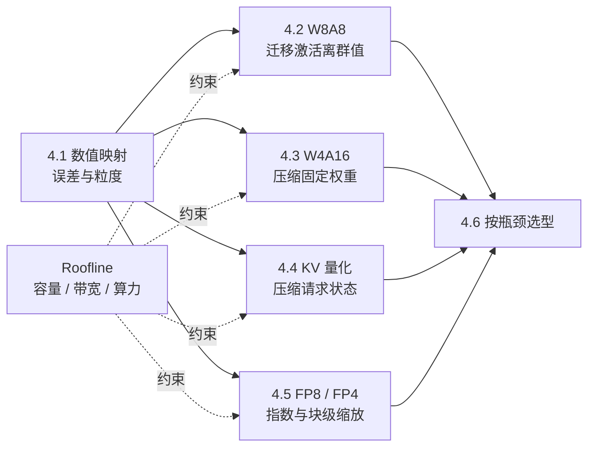

## 📑 本章导航
- [1. 为什么推理需要量化](#1-为什么推理需要量化)
- [2. 从 Roofline 看量化收益](#2-从-roofline-看量化收益)
- [3. 四层量化坐标系](#3-四层量化坐标系)
- [4. 一张知识图看完本章](#4-一张知识图看完本章)
- [5. 贯穿全章的 7B 与 70B 算例](#5-贯穿全章的-7b-与-70b-算例)
- [6. 六节标题与承诺](#6-六节标题与承诺)
- [7. 阅读时始终追问的六件事](#7-阅读时始终追问的六件事)
- [总结](#总结)
- [自我检验](#自我检验)
- [参考资料](#参考资料)

---

## 1. 为什么推理需要量化
第 1 章已经建立两本账：显存账和 Roofline 账。
权重、激活与 KV Cache 都占容量并消耗搬运带宽，矩阵乘和 Attention 还消耗计算吞吐。

量化用更少的 bit 近似原数值，试图改变三项成本：
1. **容量**：同一张卡能否放下模型、更多请求或更长上下文；
2. **带宽**：每一步从 HBM 读取多少权重与 KV；
3. **计算**：硬件能否使用更高吞吐的低精度矩阵单元。

代价是离散化误差、scale 元数据、量化/反量化工作和更严格的 Kernel 约束。
“无损”“显存减半”或“加速四倍”都只能是带条件的实验结论，不能由位宽直接推出。

## 2. 从 Roofline 看量化收益
算术强度与设备性能上界为：
$$
I=\frac{\text{FLOPs}}{\text{Bytes}},\qquad
P=\min(P_{\text{peak}},BW_{\text{HBM}}\times I)
$$
量化可能减少分母中的字节，也可能提高 $P_{\text{peak}}$；只有硬件、布局和 Kernel 真正消费低精度数据，这两项才会兑现。

**Prefill** 一次处理许多 token，权重被批内复用，大 GEMM 常有较高算术强度。
若它受计算限制，W8A8 或 FP8 的原生 Tensor Core 路径更可能有意义。

**Decode** 每个序列每步通常只新增一个 token，小批量时常反复读取大量权重。
若它受 HBM 限制，Weight-only INT4 可通过少搬权重获益。
长上下文 Decode 还会扫描历史 K/V；此时 KV Cache 量化改变的是另一笔带宽账。

同一方案在 Prefill 与 Decode 上没有理由获得相同加速。

## 3. 四层量化坐标系
阅读任何“低比特模型”说明时，都应拆成四层：
1. **数值表示**：INT8、INT4、E4M3、E5M2 或 FP4 能表示哪些数，scale 怎样共享；
2. **量化算法**：PTQ、QAT、SmoothQuant、GPTQ、AWQ、KIVI 怎样分配或补偿误差；
3. **Kernel**：数据怎样打包、读取、反量化、累加，是否命中原生指令；
4. **服务**：容量、TTFT、TPOT、吞吐、尾延迟和质量是否满足同一合同。

算法决定近似是否足够好，Kernel 决定低 bit 是否真的少搬快算，服务层决定局部收益是否成为 Goodput。

## 4. 一张知识图看完本章

学习从共同的数值基础开始，再分别处理激活、权重、KV Cache 和低比特浮点，最后回到瓶颈、硬件与 SLO。

## 5. 贯穿全章的 7B 与 70B 算例
全章使用两个只为建立数量级的教学模型：
```text
7B：  32 层，hidden size 4096，32 个 Query/KV heads，head dim 128
70B： 80 层，hidden size 8192，64 个 Query heads，8 个 KV heads，head dim 128
```
实际结构必须以配置文件为准；名称中的“7B/70B”也不保证精确参数量。

$N$ 个参数的权重本体为：
$$
M_W=N\frac{b_W}{8}
$$
7B 的 BF16/INT8/INT4 权重本体约为 14/7/3.5 GB，70B 约为 140/70/35 GB。
这些下界没有包含 scale、zero-point、未量化层、对齐、通信缓冲、工作区和 KV Cache。

KV Cache 每 token 的本体近似为：
$$
m_{\text{KV/token}}=L\times2\times H_{kv}\times D_h\times\frac{b_{kv}}8
$$
按教学结构，BF16 下 7B 约为 512 KiB/token，70B 约为 320 KiB/token。
70B 参数更多却有更小的每 token KV，是因为它使用 8 个 KV heads 的 GQA，而教学 7B 使用 32 个 KV heads 的 MHA。

贯穿算例提醒我们：
- 权重位宽主要改变固定成本；
- KV 位宽主要改变随活跃 token 增长的成本；
- GQA、并行切分和分页会改变实际账本；
- 参数规模不能单独决定服务容量。

## 6. 六节标题与承诺
### [4.1 量化基础](/AIInfraGuide/inference/模块四-推理优化/第4章-量化/41-量化基础)
从 affine 映射推导 scale、zero-point、粒度、PTQ/QAT 与误差来源，并手算 INT8，划清伪量化与真实加速。

### [4.2 W8A8 / SmoothQuant](/AIInfraGuide/inference/模块四-推理优化/第4章-量化/42-w8a8-smoothquant)
解释激活离群通道为何破坏共享刻度，并用等价缩放和两通道算例理解 $\alpha$。

### [4.3 Weight-only INT4](/AIInfraGuide/inference/模块四-推理优化/第4章-量化/43-weight-only-int4)
沿 W4A16 数据路径比较 GPTQ、AWQ，并分析 group size、act-order、packing 和 Marlin 类 Kernel。

### [4.4 KV Cache 量化](/AIInfraGuide/inference/模块四-推理优化/第4章-量化/44-kv-cache量化)
从逐 token 容量公式比较 FP8 KV 与 KIVI 2-bit，再连接 PagedAttention、长上下文和并发。

### [4.5 FP8 / NVFP4 / MXFP4](/AIInfraGuide/inference/模块四-推理优化/第4章-量化/45-fp8与nvfp4)
用符号、指数、尾数和 block scaling 区分 E4M3/E5M2、MXFP4/NVFP4 及 Hopper/Blackwell 前提。

### [4.6 选型与 vLLM 落地](/AIInfraGuide/inference/模块四-推理优化/第4章-量化/46-量化选型与vllm实战)
按权重容量、Decode 带宽、Prefill 算力、KV 容量和硬件能力决策；vLLM 只作格式与 Kernel 案例。

## 7. 阅读时始终追问的六件事
1. 被量化的是权重、激活，还是每个请求的 KV Cache？
2. 误差由舍入、截断、离群值、共享 scale，还是校准失配主导？
3. 低比特数据在运行时保持压缩，还是加载后被展开？
4. Kernel 原生计算低精度，还是边读边反量化？
5. 收益发生在 Prefill、Decode、Attention，还是仅发生在磁盘？
6. 质量与 SLO 不通过时，是否应保留 BF16/FP16？

## 总结
量化是在数值误差、容量、带宽与计算吞吐之间重新定价。
本章沿“问题 → 数学机制 → Kernel 兑现 → Prefill/Decode 差异 → 精度与性能取舍 → 选型”展开。

## 自我检验
- [ ] 能用 Roofline 解释量化为何可能帮助 Decode，也可能帮助 Prefill。
- [ ] 能区分数值格式、量化算法、Kernel 与服务四层。
- [ ] 能估算 7B/70B 权重与 KV，并说明它们为何不等于进程显存。
- [ ] 面对“INT4 四倍加速”时，能列出至少四个必要条件。
- [ ] 能按知识图说明六节的推导顺序。

## 参考资料
- [第 1 章：LLM 推理基础](/AIInfraGuide/inference/模块四-推理优化/第1章-llm推理基础/第1章-llm推理基础)
- Xiao et al., [SmoothQuant](https://proceedings.mlr.press/v202/xiao23c.html), ICML 2023.
- Frantar et al., [GPTQ](https://arxiv.org/abs/2210.17323), ICLR 2023.
- Lin et al., [AWQ](https://proceedings.mlsys.org/paper_files/paper/2024/hash/42a452cbafa9dd64e9ba4aa95cc1ef21-Abstract-Conference.html), MLSys 2024.
- Liu et al., [KIVI](https://proceedings.mlr.press/v235/liu24bz.html), ICML 2024.
- Micikevicius et al., [FP8 Formats for Deep Learning](https://arxiv.org/abs/2209.05433).
