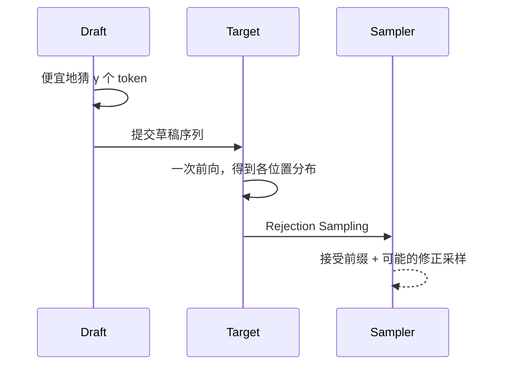

第 1 章强调过：自回归 Decode 每步只产出一个 Token，且常常 Memory Bound——搬完整份权重，却只算一个位置。**Speculative Decoding（投机解码）**想做的事很激进：让系统在一步里"多往前走几格"，同时**不改变**目标大模型的输出分布。这一节只打地基：Draft + Verify 流程，以及 Rejection Sampling 为何能在数学上保真。

<!-- more -->

## 📑 目录

- [1. 串行 Decode 的矛盾](#1-串行-decode-的矛盾)
- [2. Draft + Verify 框架](#2-draft--verify-框架)
- [3. Rejection Sampling：正确性直觉](#3-rejection-sampling正确性直觉)
- [4. 接受长度与加速比](#4-接受长度与加速比)
- [5. 和普通"小模型级联"有何不同](#5-和普通小模型级联有何不同)
- [6. 实现时必须守住的不变量](#6-实现时必须守住的不变量)
- [7. 走一轮具体例子](#7-走一轮具体例子)
- [总结](#-总结)
- [自我检验清单](#-自我检验清单)
- [参考资料](#-参考资料)

---

## 1. 串行 Decode 的矛盾

标准自回归：

1. 输入已有前缀；
2. Target 模型前向一次，得到下一 Token 分布；
3. 采样 1 个 Token，追加，再重复。

在 Memory Bound 区域，前向的主要成本是**读权重**；算 1 个 Token 与在同一前缀上并行验证 $k$ 个草稿 Token，边际计算差往往小于"多读 $k$ 次权重"。投机解码正是赌这一点：**用一次 Target 前向，尝试验证多个草稿位置**。

📌 **关键点**：投机解码加速的前提是——**草稿便宜、验证可并行、接受率足够高**。三者缺一，故事就不成立。

---

## 2. Draft + Verify 框架

标准流程（Speculative Sampling）：

1. **Draft**：用更便宜的机制（小模型、N-gram、Self-Draft 头等）从当前前缀快速生成 $\tilde{t}_{1..\gamma}$ 共 $\gamma$ 个候选 Token；
2. **Verify**：Target 模型以该草稿序列为假设续写，**一次前向**得到各位置的条件分布 $p_{\text{target}}$；
3. **Accept / Reject**：按 Rejection Sampling 规则从左到右决定接受多长的前缀；在拒绝点按修正分布采样一个 Token，然后进入下一轮。

🔑 **核心概念**：**Draft 负责猜，Target 负责拍板；拍板规则必须保证最终 Token 仍服从 Target 分布。**

---

## 3. Rejection Sampling：正确性直觉

设草稿模型分布为 $q$，目标为 $p$。对某一位置上草稿采样出的 token $x$，经典规则的直觉是：

- 若 $p(x) \ge q(x)$，倾向于接受（草稿没有"高估"这个 token 的概率）；
- 若 $p(x) < q(x)$，则以概率 $p(x)/q(x)$ 接受；拒绝时，从归一化后的 $\mathrm{norm}(\max(0, p-q))$ 一类修正分布中再采样。

更重要的不是背公式细节，而是定理级结论（Leviathan et al. / Chen et al. 等给出的框架）：

> 在正确的 Acceptance 规则下，**输出序列的分布与直接从 Target 采样相同**。

也就是说：投机解码是**无损加速**（相对 Target 采样分布），不是"用小模型近似大模型输出"。

💡 **提示**：无损指的是**分布意义**下的正确性。若你改温度、改 top-p、或实现有 bug，当然仍会偏离。工程上要把采样配置与验证逻辑当成同一套规范。

用类比：Draft 像考生打草稿，Target 像阅卷老师按标准答案逐空核对。核对规则保证：最终卷面分数分布，和老师自己从头做题一样——草稿只影响"一次能批多空"，不改变得分分布。

---

## 4. 接受长度与加速比

设平均每轮接受 $\alpha$ 个草稿 Token（含规则细节下的有效前进），Draft 成本为 $c_d$，Target 一次验证成本为 $c_t$。粗略加速比可直觉写成：

$$
\text{Speedup} \approx \frac{\text{每轮有效前进 Token 数}}{\text{折合 Target 步数成本}}
$$

当 Draft 很便宜且 $\alpha$ 接近 $\gamma$ 时，加速明显；当 $\alpha \to 0$，你几乎每轮都白做 Draft + 一次 Target，还可能更慢。

| 📊 因素 | 对加速的影响 |
|---|---|
| Acceptance Rate 高 | 每轮前进更多 |
| $\gamma$ 过大 | 尾部更易拒绝，浪费 Draft |
| Draft 太慢 | 吃掉并行验证省下的时间 |
| Batch 很大 | Target 更易算力瓶颈，投机收益结构变化 |

⚠️ **注意**：单请求 Decode 上很好看的加速，换到高并发 Continuous Batching 后可能缩水——第 5.4 节专门讨论收益边界。

---

## 5. 和普通"小模型级联"有何不同

常见误解：投机解码 = 小模型生成、大模型重写。

| 方式 | 分布保证 | 典型用途 |
|---|---|---|
| 小模型直接回答 | ❌ 无 | 降本，接受质量差 |
| 小模型草稿 + 大模型润色 | ❌ 通常无严格保证 | 应用层流水线 |
| Speculative Decoding | ✅ 与 Target 同分布 | 推理引擎内加速 |

只有第三种配得上"对 Target 无损"的说法。Medusa/EAGLE 等变体改变的是 **Draft 怎么来**，一般仍试图守住 Verify 的正确性框架（实现细节需核对具体方法）。

---

## 6. 实现时必须守住的不变量

1. **验证必须用 Target 的真实条件分布**，不能用近似 logits 偷懒（除非方法显式放弃无损）；
2. **从左到右**处理接受/拒绝，拒绝点之后的草稿全部丢弃；
3. 采样参数（temperature、top-k/top-p）应作用于框架规定的分布，前后一致；
4. KV Cache：Target 对已接受前缀的 KV 可保留；草稿路径的投机 KV 管理要能回滚；
5. 与分页/连续批处理集成时，不能破坏其它请求的调度公平性。

📌 **关键点**：读任何投机解码论文或 vLLM 配置时，先问两句——**Draft 是谁？Verify 是否保持 Target 分布？**

---

## 7. 走一轮具体例子

假设当前前缀是 `The capital of France is`，取 $\gamma=3$。

1. Draft 快速吐出：`Paris`、`and`、`it`；
2. Target 一次前向，得到在三个位置上的条件分布 $p_1,p_2,p_3$；
3. 对位置 1：草稿 `Paris` 被接受（假设 $p$ 对该 token 足够支持）；
4. 对位置 2：草稿 `and` 被拒绝；框架在修正分布上采样，得到例如 `。`（句号）或其它合法续写；
5. 位置 3 及之后草稿作废；本轮有效前进 = 1 个接受的草稿 Token + 1 个修正采样 Token。

下一轮从新前缀继续。你会看到两个关键现象：

- **早拒绝会砍掉整段尾巴**，所以盲目加大 $\gamma$ 未必赚；
- **即使中途拒绝，Target 仍产出了符合自身分布的 Token**，质量承诺还在。

| 步骤 | 结果 | 前缀如何更新 |
|---|---|---|
| Draft | Paris, and, it | 仅候选，未提交 |
| Verify 位置1 | 接受 Paris | `... is Paris` |
| Verify 位置2 | 拒绝 and，修正采样 | 追加修正 token |
| 位置3 | 丢弃 | 不采用 |

💡 **提示**：把这个例子画进自己的笔记里，后面看 Medusa/EAGLE 的"树"时，只是把线性候选换成多分支，验证规则的精神不变。

---

## 📝 总结

- 投机解码利用 Memory Bound 下"一次 Target 前向可验证多 Token"的机会结构。
- 标准框架是 Draft 生成 $\gamma$ 个候选，Target 并行验证，再按 Rejection Sampling 接受前缀。
- 正确的 Acceptance 规则保证输出与 Target 采样同分布，因此是无损加速而非小模型替代。
- 端到端加速由接受率、Draft 成本、$\gamma$ 选择与服务并发形态共同决定。
- 实现必须守住验证分布、回滚与采样配置等不变量。

## 🎯 自我检验清单

- 能画完 Draft → Verify → Accept/Reject 的时序
- 能说明为何说投机解码可以"分布无损"
- 能解释接受率与 $\gamma$ 如何影响加速比
- 能区分投机解码与"小模型级联润色"
- 能列出至少三条实现上必须守住的不变量

## 📚 参考资料

- [Leviathan et al., Fast Inference from Transformers via Speculative Decoding](https://arxiv.org/abs/2211.17192)
- [Chen et al., Accelerating Large Language Model Decoding with Speculative Sampling](https://arxiv.org/abs/2302.01318)
- [vLLM — Speculative Decoding](https://docs.vllm.ai/en/latest/features/speculative_decoding.html)
- [DeepMind Blog — Speculative Decoding](https://deepmind.google/discover/blog/speculative-decoding/)
