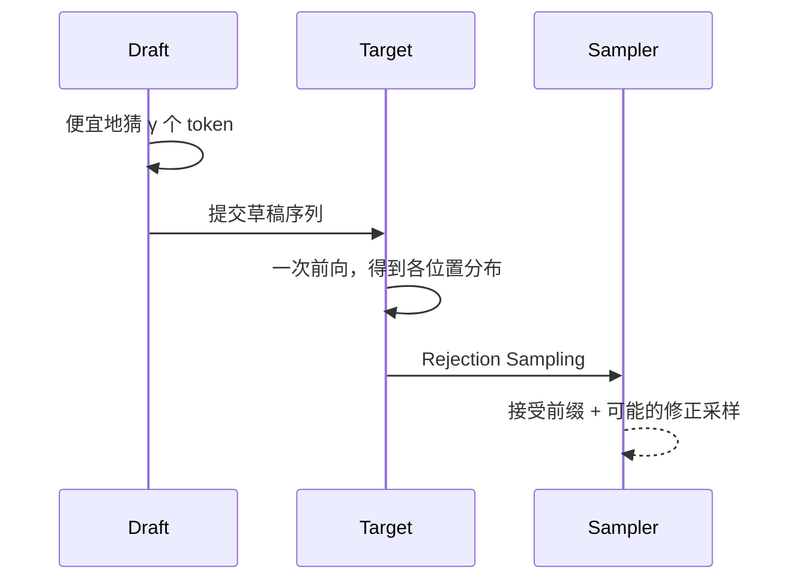

第 1–2 章把 Decode 钉在 Memory Bound 上：每步读完整份权重，却只推进约 1 个 Token。第 4 章用更少比特砍权重流量；本章换另一条杠杆——**在同一步里尝试验证多个候选 Token**，同时尽量不改目标模型的采样分布。这一节只打地基：Draft + Verify 流程、Rejection Sampling 为何能保真，以及一笔带毫秒单位的加速粗算；草稿从哪来（小模型 / N-gram / Self-Draft）留给 5.2–5.3，收益边界留给 5.4。

<!-- more -->

## 📑 目录

- [1. 串行 Decode 的矛盾](#1-串行-decode-的矛盾)
- [2. Draft + Verify 框架](#2-draft--verify-框架)
- [3. Rejection Sampling：正确性直觉](#3-rejection-sampling正确性直觉)
- [4. 手算：接受长度与加速比](#4-手算接受长度与加速比)
- [5. 和普通"小模型级联"有何不同](#5-和普通小模型级联有何不同)
- [6. 实现时必须守住的不变量](#6-实现时必须守住的不变量)
- [7. 走一轮具体例子](#7-走一轮具体例子)
- [8. 代价与权衡](#8-代价与权衡)
- [总结](#-总结)
- [自我检验清单](#-自我检验清单)
- [参考资料](#-参考资料)

---

## 1. 串行 Decode 的矛盾

标准自回归：

1. 输入已有前缀；
2. Target 模型前向一次，得到下一 Token 分布；
3. 采样 1 个 Token，追加，再重复。

在 Memory Bound 区域，前向的主要成本是**读权重**；算 1 个 Token 与在同一前缀上并行验证 $\gamma$ 个草稿 Token，边际计算差往往小于"多读 $\gamma$ 次权重"。投机解码正是赌这一点：**用一次 Target 前向，尝试验证多个草稿位置**。

这与 Continuous Batching（[2.2](../第2章-推理引擎核心技术/2.2-Continuous%20Batching.md)）、调度器 Token Budget（[3.4](../第3章-深入vLLM/3.4-调度器源码导读.md)）不冲突：批处理解决的是"一步里塞进多少请求"，投机解决的是"单个请求一步里走多远"。两者叠加时的张力见 5.4。

📌 **关键点**：投机解码加速的前提是——**草稿便宜、验证可并行、接受率足够高**。三者缺一，故事就不成立。

---

## 2. Draft + Verify 框架

标准流程（Speculative Sampling，Leviathan / Chen 等）：

1. **Draft**：用更便宜的机制（小模型、N-gram、Self-Draft 头等）从当前前缀快速生成 $\tilde{t}_{1..\gamma}$ 共 $\gamma$ 个候选 Token；
2. **Verify**：Target 模型以该草稿序列为假设续写，**一次前向**得到各位置的条件分布 $p_{\text{target}}$；
3. **Accept / Reject**：按 Rejection Sampling 规则从左到右决定接受多长的前缀；在拒绝点按修正分布采样一个 Token，然后进入下一轮。



教学伪代码（**非逐字源码**；省略 KV 回滚与批处理）：

```python
def speculative_step(prefix, gamma):
    draft_tokens = draft.sample(prefix, n=gamma)          # 便宜提议
    # Target 一次前向：对 prefix + draft 各位置给出 logits / 分布
    p = target.forward_distributions(prefix, draft_tokens)
    accepted = []
    for i, x in enumerate(draft_tokens):
        if rng.uniform() < min(1.0, p[i][x] / q[i][x]):  # q 为 Draft 分布
            accepted.append(x)
        else:
            y = sample_from_residual(p[i], q[i])          # 修正分布
            return prefix + accepted + [y]
    # 全部接受时，还可再从 Target 多采 1 个（视具体算法）
    bonus = sample(p[gamma])
    return prefix + accepted + [bonus]
```

🔑 **核心概念**：**Draft 负责猜，Target 负责拍板；拍板规则必须保证最终 Token 仍服从 Target 分布。**

---

## 3. Rejection Sampling：正确性直觉

设草稿模型分布为 $q$，目标为 $p$。对某一位置上草稿采样出的 token $x$，经典规则的直觉是：

- 若 $p(x) \ge q(x)$，倾向于接受（草稿没有"高估"这个 token 的概率）；
- 若 $p(x) < q(x)$，则以概率 $p(x)/q(x)$ 接受；拒绝时，从归一化后的 $\mathrm{norm}(\max(0, p-q))$ 一类修正分布中再采样。

更重要的不是背公式细节，而是定理级结论（Leviathan et al. / Chen et al. 等给出的框架）：

> 在正确的 Acceptance 规则下，**输出序列的分布与直接从 Target 采样相同**。

也就是说：在框架假设成立时，投机解码是**相对 Target 采样分布的无损加速**，不是"用小模型近似大模型输出"。

💡 **提示**：无损指的是**分布意义**下的正确性。若你改温度、改 top-p、或实现有 bug，当然仍会偏离。工程上要把采样配置与验证逻辑当成同一套规范；同种子开关对比是最小回归（见 5.4 / 5.5）。

用类比：Draft 像考生打草稿，Target 像阅卷老师按标准答案逐空核对。核对规则保证：最终卷面分数分布，和老师自己从头做题一样——草稿只影响"一次能批多空"，不改变得分分布。

---

## 4. 手算：接受长度与加速比

把"可能更快"说成可核对的数量级。以下为**教学粗算**，前提：

- 单请求 Decode，忽略调度与其它请求干扰；
- Draft 成本按恒定开销计入；
- Target 一次验证（含 $\gamma$ 位置）墙钟近似等于一次普通 Decode 步（Memory Bound 直觉上界，真实会略贵）。

设：

| 符号 | 含义 | 示例取值 |
|---|---|---|
| $T_t$ | 一次 Target Decode / 验证步 | 10 ms |
| $T_d$ | 生成 $\gamma$ 个草稿的额外墙钟 | 2 ms（小 Draft 或 ngram） |
| $\gamma$ | 草稿深度 | 5 |
| $\bar{a}$ | 平均每轮有效前进 Token 数（含拒绝点修正采样） | 3.0 token/轮 |

无投机时，推进 $\bar{a}$ 个 Token 约需 $\bar{a}\times T_t = 30\,\mathrm{ms}$。  
有投机时，同一前进大约花 $T_d + T_t = 12\,\mathrm{ms}$。

粗加速比：

$$
\text{Speedup} \approx \frac{\bar{a}\cdot T_t}{T_d + T_t} = \frac{3\times 10}{2+10} = 2.5\times
$$

换一组低接受率（开放对话常见）：$\bar{a}=1.2$，$T_d=3\,\mathrm{ms}$（Draft 更贵），则

$$
\text{Speedup} \approx \frac{1.2\times 10}{3+10} \approx 0.92\times
$$

| 情景 | $\bar{a}$ | $T_d$ | 粗加速比 | 解读 |
|---|---|---|---|---|
| 高结构、Draft 便宜 | 3.0 | 2 ms | ~2.5× | 有望净赚 |
| 中等接受、Draft 中等 | 2.0 | 4 ms | ~1.4× | 边缘，需看 P95 |
| 低接受、Draft 偏贵 | 1.2 | 3 ms | ~0.9× | **可能更慢** |

取舍句：在**单请求、Memory Bound、Draft≪Target** 的前提下，加速比主要由 $\bar{a}/(1+T_d/T_t)$ 决定；$\bar{a}$ 掉到接近 1 且 Draft 不免费时，投机可以变成净亏损——这不是实现bug，而是账本身。

⚠️ **注意**：上表是上界直觉，不是你机器上的 tok/s。高并发下 Target 更偏 Compute Bound、$T_t$ 不再近似"与 $\gamma$ 无关"，收益结构会变（5.4）。

---

## 5. 和普通"小模型级联"有何不同

常见误解：投机解码 = 小模型生成、大模型重写。

| 方式 | 分布保证 | 典型用途 |
|---|---|---|
| 小模型直接回答 | ❌ 无 | 降本，接受质量差 |
| 小模型草稿 + 大模型润色 | ❌ 通常无严格保证 | 应用层流水线 |
| Speculative Decoding | ✅ 与 Target 同分布（规则正确时） | 推理引擎内加速 |

只有第三种配得上"对 Target 无损"的说法。Medusa/EAGLE 等变体改变的是 **Draft 怎么来**，一般仍试图守住 Verify 的正确性框架（实现细节需核对具体方法；部分 Self-Draft 论文的保证力度不同，见 5.3）。

---

## 6. 实现时必须守住的不变量

1. **验证必须用 Target 的真实条件分布**，不能用近似 logits 偷懒（除非方法显式放弃无损）；
2. **从左到右**处理接受/拒绝，拒绝点之后的草稿全部丢弃；
3. 采样参数（temperature、top-k/top-p）应作用于框架规定的分布，前后一致；
4. KV Cache：Target 对已接受前缀的 KV 可保留；草稿路径的投机 KV 管理要能回滚（PagedAttention 块级语义见 [2.1](../第2章-推理引擎核心技术/2.1-PagedAttention.md)）；
5. 与分页/连续批处理集成时，不能破坏其它请求的调度公平性（Scheduler 主序见 [3.4](../第3章-深入vLLM/3.4-调度器源码导读.md)）。

📌 **关键点**：读任何投机解码论文或 vLLM 配置时，先问两句——**Draft 是谁？Verify 是否保持 Target 分布？**

---

## 7. 走一轮具体例子

假设当前前缀是 `The capital of France is`，取 $\gamma=3$。

1. Draft 快速吐出：`Paris`、`and`、`it`；
2. Target 一次前向，得到在三个位置上的条件分布 $p_1,p_2,p_3$；
3. 对位置 1：草稿 `Paris` 被接受（假设 $p$ 对该 token 足够支持）；
4. 对位置 2：草稿 `and` 被拒绝；框架在修正分布上采样，得到例如句号或其它合法续写；
5. 位置 3 及之后草稿作废；本轮有效前进 = 1 个接受的草稿 Token + 1 个修正采样 Token。

| 步骤 | 结果 | 前缀如何更新 |
|---|---|---|
| Draft | Paris, and, it | 仅候选，未提交 |
| Verify 位置1 | 接受 Paris | `... is Paris` |
| Verify 位置2 | 拒绝 and，修正采样 | 追加修正 token |
| 位置3 | 丢弃 | 不采用 |

你会看到两个关键现象：

- **早拒绝会砍掉整段尾巴**，所以盲目加大 $\gamma$ 未必赚；
- **即使中途拒绝，Target 仍产出了符合自身分布的 Token**，质量承诺还在。

💡 **提示**：把这个例子画进笔记里，后面看 Medusa/EAGLE 的"树"时，只是把线性候选换成多分支，验证规则的精神不变。

---

## 8. 代价与权衡

| 选择 | 收益 | 代价 / 不适用 |
|---|---|---|
| 开启投机 | 高接受率时摊薄 Target 步数 | Draft 开销、实现复杂度、观测成本 |
| 加大 $\gamma$ | 理论上限更高 | 尾部连续命中难，白算 Draft |
| 更强 Draft | 接受率可能升 | 显存与调度成本升，可能挤占 KV 池 |
| 坚持严格 Verify | 分布与 Target 一致 | 必须付 Target 前向；无法"跳过验证"省算力 |

适用：Decode 墙钟敏感、续写局部可预测（代码/模板/复述）、且能监控 Acceptance Rate 的在线服务。  
若流量高熵、或集群已 Compute Bound、或你只想用小模型降本——投机不是正确工具；后者应走级联/路由，而不是挂 Draft+Verify。

---

## 📝 总结

- 投机解码利用 Memory Bound 下"一次 Target 前向可验证多 Token"的机会结构。
- 标准框架是 Draft 生成 $\gamma$ 个候选，Target 并行验证，再按 Rejection Sampling 接受前缀。
- 正确的 Acceptance 规则保证输出与 Target 采样同分布；这是相对 **Verify 所用 Target** 的无损，不是魔法。
- 粗算表明：$\bar{a}$ 高且 $T_d\ll T_t$ 时才有净加速；低接受率下可能更慢。
- 实现必须守住验证分布、回滚与采样配置等不变量；并发与量化叠加见后文。

## 🎯 自我检验清单

- 能画完 Draft → Verify → Accept/Reject 的时序
- 能说明为何说投机解码可以"分布无损"，以及该承诺相对谁成立
- 能用 $T_t$、$T_d$、$\bar{a}$ 手算一笔粗加速比，并指出何时 $<1$
- 能解释接受率与 $\gamma$ 如何影响加速比
- 能区分投机解码与"小模型级联润色"
- 能列出至少三条实现上必须守住的不变量

## 📚 参考资料

- [Leviathan et al., Fast Inference from Transformers via Speculative Decoding](https://arxiv.org/abs/2211.17192)
- [Chen et al., Accelerating Large Language Model Decoding with Speculative Sampling](https://arxiv.org/abs/2302.01318)
- [vLLM — Speculative Decoding](https://docs.vllm.ai/en/latest/features/speculative_decoding.html)
- [DeepMind Blog — Speculative Decoding](https://deepmind.google/discover/blog/speculative-decoding/)
- [本模块 2.2 Continuous Batching](../第2章-推理引擎核心技术/2.2-Continuous%20Batching.md)
- [本模块 3.4 调度器源码导读](../第3章-深入vLLM/3.4-调度器源码导读.md)
