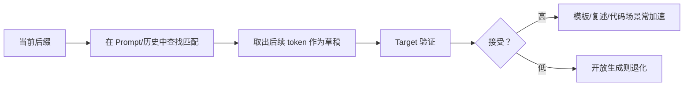

5.1 把 Draft + Verify 的数学骨架搭好了；接下来的分水岭是——**草稿从哪来？** 最经典的答案是再挂一个更小的 LM 做 Draft；另一类答案更省：不引入新模型，直接用 N-gram / Suffix 一类匹配从 Prompt 与历史里抄候选。这一节把两条路的选型标准、Acceptance Rate 逻辑，以及一笔显存/接受长度账讲清楚；Self-Draft（Medusa/EAGLE）留给 5.3，vLLM 开关留给 5.5。

<!-- more -->

## 📑 目录

- [1. Draft 质量的唯一货币：Acceptance Rate](#1-draft-质量的唯一货币acceptance-rate)
- [2. 独立小模型 Draft](#2-独立小模型-draft)
- [3. N-gram / Suffix：无模型投机](#3-n-gram--suffix无模型投机)
- [4. 手算：$\gamma$、接受长度与 Draft 显存](#4-手算gamma接受长度与-draft-显存)
- [5. 工程代价对比](#5-工程代价对比)
- [6. 在 vLLM 中的位置](#6-在-vllm-中的位置)
- [7. 接受率诊断清单](#7-接受率诊断清单)
- [8. 代价与权衡](#8-代价与权衡)
- [总结](#-总结)
- [自我检验清单](#-自我检验清单)
- [参考资料](#-参考资料)

---

## 1. Draft 质量的唯一货币：Acceptance Rate

无论草稿多 fancy，落到系统里先看一个数：**Acceptance Rate（接受率）**——草稿 Token 最终被 Target 接受的比例，或更实用的 **平均每轮接受长度** $\bar{a}$（与 5.1 粗算同一符号）。

- 接受率高：每轮有效前进长，Target 前向被摊薄；
- 接受率低：Draft 变成纯开销。

接受率由三件事决定：

1. Draft 与 Target 的**条件分布有多像**；
2. 任务是否"好猜"（代码补全、公文套话 vs 开放闲聊）；
3. $\gamma$ 是否贪心过大（越往后越难连续猜对）。

📌 **关键点**：优化 Draft，本质是在 **便宜程度** 与 **像不像 Target** 之间找甜区——不是找另一个更强的助手。

---

## 2. 独立小模型 Draft

### 2.1 为什么要"独立小模型"

用同族更小的 LM（例如 Target 70B，Draft 7B/1B）生成 $\gamma$ 步，再交给 Target 验证。小模型足够快时，即使接受率中等，也可能净加速。

### 2.2 选型要点

| 维度 | 建议 |
|---|---|
| 体量比 | 常见 Draft ≪ Target；过近则草稿不够便宜 |
| 词表 | 最好一致或可可靠映射，否则对齐成本高 |
| 能力域 | 在目标任务上别太弱；代码任务可用代码小模型 |
| 采样 | 草稿可用更贪心/低温策略提高"可验证前缀"稳定性（需与框架匹配） |
| 部署 | 额外权重、额外显存、额外调度——这是真实成本 |

🔑 **核心概念**：**好的 Draft 模型不是"另一个更强的助手"，而是"更像 Target 的廉价预言机"。** 与 Target 同分布族、同 tokenizer 往往比"更聪明但风格迥异"更有用。

### 2.3 失败模式

- 小模型太慢（同卡争用、或根本不小）；
- 词表/聊天模板不一致导致草稿从第一步就歪；
- 只在英文通用对话训过，Target 却在中文工具调用上服务。

⚠️ **注意**：Draft 与 Target 同时常驻显存时，可能挤占 KV 池（PagedAttention 块池见 [2.1](../第2章-推理引擎核心技术/2.1-PagedAttention.md)），反而降低并发。加速比要用**系统吞吐**衡量，而不是单请求墙钟自嗨——边界展开见 [5.4](./5.4-收益边界与限制.md)。

---

## 3. N-gram / Suffix：无模型投机

一类实践证明很有效的草稿来源：**从已有文本里匹配后缀/N-gram，抄后面的续写当草稿**。

典型信号出现在：

- 用户 Prompt 里已有要复述的段落；
- 模型正在做代码补全，文件前文高度可抄；
- 模板化输出（JSON 字段名、Markdown 结构）反复出现。



优点：

- 无额外模型显存；
- 实现相对轻；
- 在"可复用片段"任务上接受率可极高。

缺点：

- 对开放创意生成帮助有限；
- 匹配规则过于死板时，无效草稿增多；
- 需要仔细处理分词边界与停用条件。

💡 **提示**：把 N-gram/Suffix 看成"**有结构可抄时的免费 Draft**"。它不是万能投机方案，但是成本最低的那一档。

---

## 4. 手算：$\gamma$、接受长度与 Draft 显存

### 4.1 $\gamma$ 与期望接受长度

$\gamma$ 不是越大越好：后部连续命中概率大致随深度衰减。教学示意（**非实测**；假设每位置条件接受概率近似 $r$，且独立——真实不独立，仅数量级）：

| $\gamma$ | $r=0.8$（偏代码）期望接受草稿数 | $r=0.4$（偏闲聊）期望接受草稿数 |
|---|---|---|
| 3 | $0.8+0.8^2+0.8^3 \approx 1.95$ | $0.4+0.4^2+0.4^3 \approx 0.54$ |
| 5 | $\approx 2.62$ | $\approx 0.66$ |
| 7 | $\approx 3.14$ | $\approx 0.67$ |

读表：在高 $r$ 下加长 $\gamma$ 仍有回报；在低 $r$ 下从 5 提到 7 几乎不增加 $\bar{a}$，却多付 Draft 与验证尾部开销。

实务上常用小范围扫参（如 3/5/7），画"接受长度 vs 额外耗时"曲线。N-gram 的有效 $\gamma$ 还受匹配长度限制——没有长匹配时，应尽早放弃本轮投机。

### 4.2 Draft 权重显存粗算

设 Target 70B、Draft 7B，均 BF16，**只计权重、不计 KV/激活**（与 [4.1](../第4章-量化/4.1-量化基础.md) 同口径）：

| 模型 | 权重体积 |
|---|---|
| Target 70B BF16 | $70\times 10^9 \times 2\,\mathrm{B} = 140\,\mathrm{GB}$ |
| Draft 7B BF16 | $14\,\mathrm{GB}$ |
| 合计（仅权重） | $154\,\mathrm{GB}$ |

相对"只跑 Target"：多付约 **14 GB** 权重显存；若两模型同卡，这 14 GB 直接挤占本可用于 KV 块池的空间。若 Draft 再量化到 INT8（约 7 GB 量级），能缓和，但接受率与 Kernel 路径要重测（量化叠加见 5.4）。

取舍句：独立 Draft 用 **约 +10% 量级的权重显存（7B vs 70B）** 换可能更高的通用接受率；若流量以复述/代码为主，先上 ngram 往往用 **≈0 额外权重** 拿到大部分收益——不要默认"有小模型才叫投机"。

| 场景 | 接受率直觉 | $\gamma$ 倾向 |
|---|---|---|
| 代码补全 / 复述 | 高 | 可稍大 |
| 模板 JSON | 中高 | 中等 |
| 开放对话 | 中低 | 偏小或换 Self-Draft |
| 高创意采样（高温度） | 低 | 谨慎开启 |

---

## 5. 工程代价对比

| 方案 | 额外显存 | 实现复杂度 | 适用面 |
|---|---|---|---|
| 独立 Draft LM | 高（整模型权重） | 中 | 通用，依赖模型配对 |
| N-gram/Suffix | 极低 | 低到中 | 强结构/可抄场景 |
| Self-Draft（下一节） | 中（改 Target 结构） | 高 | 追求更高接受率 |

📌 **关键点**：若你的流量里"可抄比例"很高，先上 N-gram 类往往是 ROI 冠军；若对话开放且质量敏感，再评估小模型 Draft 或 EAGLE/Medusa。

---

## 6. 在 vLLM 中的位置

vLLM 将投机解码作为可选特性，支持包括 **ngram**、**draft model**、以及 EAGLE 等路径（配置骨架见 [5.5](./5.5-vLLM投机解码实战.md)）。选型时建议：

1. 先用日志/离线回放估计任务可预测性；
2. 对代码/补全集群优先试 ngram；
3. 对通用对话再考虑 draft model，并盯紧显存与调度；
4. 始终以 Acceptance Rate + 端到端吞吐做门禁。

```bash
# 概念示意（非逐字 CLI；字段名以当前 vLLM 文档为准）
vllm serve <target-model> \
  --speculative-config '{"method":"ngram","num_speculative_tokens":5,...}'
```

---

## 7. 接受率诊断清单

接受率上不去时，按下面顺序查，避免一上来就换更大 Draft：

1. **任务是否可预测**：抽样看续写是否真有"可抄/可猜"结构；
2. **模板与词表**：独立 Draft 是否用了同一 chat template；
3. **$\gamma$ 是否过大**：先降到 3，看平均接受长度是否反而上升；
4. **采样温度**：Target 高温度时，任何 Draft 都更难连续命中；
5. **领域漂移**：线上已切到新工具 schema，而 Draft 仍按旧分布猜。

| 症状 | 更可能原因 | 动作 |
|---|---|---|
| 代码高、闲聊低 | 正常现象 | 路由化启用 |
| 两类都极低 | 配置/模板问题 | 先修配对 |
| 接受长度短但 Acc% 不低 | $\gamma$ 太大 | 减小投机深度 |
| 显存打满并发跌 | Draft 过重 | 改 ngram 或更小 Draft |

📌 **关键点**：接受率是**诊断仪表**，不是唯一 KPI；最终仍要回到 TPOT 与系统吞吐。

---

## 8. 代价与权衡

| 选择 | 收益 | 代价 / 不适用 |
|---|---|---|
| N-gram/Suffix | 近零额外权重，结构场景 Acc 高 | 开放生成几乎失效 |
| 独立 Draft LM | 通用任务更稳的 Acc 潜力 | 显存、调度、模板对齐成本 |
| 更大 Draft | 可能更像 Target | 草稿不再便宜，净加速易塌 |
| 更大 $\gamma$ | 高 $r$ 时抬 $\bar{a}$ | 低 $r$ 时白算尾部 |

适用：已确认 Decode 是瓶颈，且能按任务类型选草稿机制。  
若显存已紧、KV 池打满（第 3 章抢占频发），先解决容量再挂第二模型——Draft 权重会直接恶化并发。

---

## 📝 总结

- Acceptance Rate / 平均接受长度是衡量 Draft 价值的核心货币。
- 独立小模型 Draft 要在"像 Target"与"足够便宜"之间权衡，并计入显存与调度成本。
- N-gram/Suffix 用匹配生成草稿，适合复述、模板与代码等可抄场景，额外权重≈0。
- $\gamma$ 需按场景扫参；低接受率下加长深度几乎不抬 $\bar{a}$。
- 工程上先识别流量结构，再选择免费 ngram 还是付费 draft model。

## 🎯 自我检验清单

- 能定义 Acceptance Rate，并说明它如何影响加速
- 能列出独立 Draft 模型选型的至少四条标准
- 能说明 N-gram/Suffix 为何在代码/复述场景特别有效
- 能用简化的 $r$ 模型解释 $\gamma$ 过大为何可能变慢
- 能对 70B+7B 手算一笔 Draft 额外权重显存（带 GB 单位）
- 能根据"开放对话 vs 代码补全"给出不同的 Draft 策略偏好

## 📚 参考资料

- [Leviathan et al., Speculative Decoding](https://arxiv.org/abs/2211.17192)
- [Stern et al., Blockwise Parallel Decoding（相关并行解码思路）](https://arxiv.org/abs/1811.03115)
- [vLLM — Speculative Decoding](https://docs.vllm.ai/en/latest/features/speculative_decoding.html)
- [本模块 4.1 量化基础（显存粗算口径）](../第4章-量化/4.1-量化基础.md)
- [本模块 5.4 收益边界与限制](./5.4-收益边界与限制.md)
- [本模块 5.5 vLLM 投机解码实战](./5.5-vLLM投机解码实战.md)
