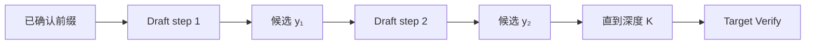

5.1 把 Proposer 抽象成分布 $q$，但没有回答 $q$ 从哪里来。
Proposal 层面对一组直接冲突的目标：候选要足够便宜、足够像 Target、足够长，还要能落在同一个 Token 空间中。
独立 Draft 用一个较小语言模型预测未来；N-gram 与 suffix proposal 则从已有 Token 序列中复制未来。
后两者几乎不做模型计算，却不代表总成本为零，也不代表候选会被 Target 接受。

本节围绕“怎样构造 Proposal”比较这两类机制。
接受/拒绝与残差正确性沿用 5.1，不在这里重复证明；Self-Draft 的内部结构留到 5.3。

<!-- more -->

## 📑 本节导航
- [1. Proposal 层真正优化什么](#1-proposal-层真正优化什么)
- [2. 独立 Draft：第二条自回归链](#2-独立-draft第二条自回归链)
- [3. 强 Draft 与便宜 Draft 的张力](#3-强-draft-与便宜-draft-的张力)
- [4. 逐位置存活率比平均接受率更重要](#4-逐位置存活率比平均接受率更重要)
- [5. Tokenizer 与 Vocabulary 兼容](#5-tokenizer-与-vocabulary-兼容)
- [6. N-gram：从当前后缀复制已有续写](#6-n-gram从当前后缀复制已有续写)
- [7. Suffix Proposal：让复用范围更广](#7-suffix-proposal让复用范围更广)
- [8. 为什么零模型成本仍可能低接受](#8-为什么零模型成本仍可能低接受)
- [9. 统一算例中的 Proposal 账](#9-统一算例中的-proposal-账)
- [10. 额外权重、KV 与索引内存](#10-额外权重kv-与索引内存)
- [11. 如何按工作负载选择](#11-如何按工作负载选择)
- [12. 系统代价与本节边界](#12-系统代价与本节边界)
- [总结](#总结)
- [自我检验](#自我检验)
- [参考资料](#参考资料)

---

## 1. Proposal 层真正优化什么
Proposer 的任务不是独立完成回答，而是给 Target 提供值得验证的未来。
衡量它时必须同时保留总览的两组量：

- 成本侧：$t_D(K,B,C)$。
- 质量侧：$s_i=P(A\ge i)$，以及由此得到的 $\mathbb E[A]$ 和 $\mathbb E[L]$。

只看 $t_D$ 会偏爱“什么都不懂但很快”的 Proposal。
只看接受率会偏爱“几乎复制 Target 但同样昂贵”的 Draft。
真正需要的是用较小的 $t_D$ 换来较大的连续存活前缀。

完整轮次仍满足：

$$t_{\text{round}}=t_D+t_V+t_O$$

Proposal 层能直接改变 $t_D$，也会通过候选数量与形状间接改变 $B_V$ 和 $t_V$。
它还会改变 $(s_1,\ldots,s_K)$，从而改变：

$$\mathbb E[L]=1+\sum_{i=1}^{K}s_i$$

这里沿用总览的非终止内轮假设：accepted prefix 不触发 EOS/stop，且剩余输出配额至少为 $K+1$；终止轮的 $L$ 应按实际提交长度统计。
因此不能脱离 Target Verify 评价 Proposer。
“Draft tokens/s 很高”只描述候选生产速度，没有说明这些候选是否减少 Target 串行轮次。

一个可用 Proposal 至少要回答五个问题：

1. 生成 $K$ 个候选要付出多少 $t_D$？
2. 第 $i$ 位仍存活的概率 $s_i$ 是多少？
3. Proposal 与 Target 能否在同一 Token 空间解释？
4. 额外权重、KV 或索引占用多少内存？
5. 生产域变化后，上述量会怎样漂移？

## 2. 独立 Draft：第二条自回归链
独立 Draft 是一个完整但更小的语言模型。
它读取同一已确认前缀，沿自己的条件分布连续产生候选：

$$y_i\sim q_i(\cdot\mid x_{<t},y_{<i}),\qquad i=1,\ldots,K$$

这条链与 Target 的普通 Decode 结构相似：



Draft 的第 $i+1$ 个候选依赖第 $i$ 个候选，所以普通小模型 Draft 仍有 $K$ 个串行 step。
它之所以可能有利，不是因为这条链消失，而是因为每个 Draft step 比 Target step 便宜得多。

Draft 通常维护自己的状态：

- 较小模型的权重；
- 已确认前缀对应的 Draft KV；
- 本轮候选产生的暂存状态；
- 随机 Proposal 所需的 $q_i$；
- 与 Target 同步所需的 Token 和位置元数据。

一轮首次拒绝后，建立在被拒候选上的 Draft 后缀状态也失效。
下一轮必须从最终已提交前缀继续，不能把 Proposal 历史当成已确认历史。

独立 Draft 的优势是覆盖面广。
即使当前文本没有重复片段，它仍能根据语言建模能力提出未来。
代价是引入第二条模型执行链，以及第二份与上下文长度 $C$ 共同增长的状态。

## 3. 强 Draft 与便宜 Draft 的张力
更强的 Draft 往往让 $q$ 更接近 $p_T$，前部与后部存活率都可能提高。
但模型更大也可能增加权重读取、计算、KV 流量和设备同步，使 $t_D$ 增大。

更小的 Draft 可能拥有很低的单 step 延迟，却在第一、第二位就偏离 Target。
此时 Target 仍为更深候选付出 Verify，最终 $\mathbb E[L]$ 只略高于 1。

所以选择目标不是单独最小化：

$$t_D(K,B,C)$$

也不是单独最大化：

$$\mathrm{AR}=\frac{\mathbb E[A]}{K}$$

而是观察同一 $K$、$B$、$C$ 下，$t_D$ 与整条存活率向量如何共同改变单位提交 Token 的轮次成本。
最终是否盈利由 5.4 的统一不等式判断。

参数量只能作为早期线索，不能替代测量。
同样大小的 Draft 可能因架构、量化、并行方式和 kernel 形状得到完全不同的 $t_D$。
同样 benchmark 分数的 Draft，也可能在 Target 的局部 Token 分布上差异很大。

### 3.1 同家族为什么常是起点
同一模型家族的大小模型通常更可能共享：
- Tokenizer 与特殊 Token；
- 训练语料的语言比例；
- 代码、数学和标点习惯；
- 对话模板与角色边界；
- 对齐阶段形成的局部表达偏好。

这会降低兼容成本，也可能提高 $s_i$。
但“同家族”不是分布相同的证明。
Target 若经过领域 SFT、安全对齐或专有数据继续训练，其 $p_T$ 仍可能明显偏离原始小模型的 $q$。

### 3.2 Domain Shift 怎样出现
Proposal 匹配的是线上条件分布，而不是模型卡上的平均能力。
以下变化都会造成域偏移：

- 通用对话切换到代码补全；
- 中文客服切换到多语言开放问答；
- 低温结构化生成切换到高温创作；
- 基础 Target 切换到经过强对齐的 Target；
- 旧版 Prompt 模板切换到新模板；
- 某个 LoRA 或业务适配器改变 Target 偏好。

域偏移通常先表现为深处 $s_i$ 下滑，然后才反映到平均 $\mathrm{AR}$。
所以评估必须按真实请求类型分桶，不能只报一个混合平均值。

## 4. 逐位置存活率比平均接受率更重要
最大深度同为 $K$ 的两个 Proposal，即使 $\mathrm{AR}$ 相同，也可能有不同系统价值。
投机只能提交从第一位开始的连续前缀，因此早期错误会让后部候选全部失效。

本章统一定义：

$$s_i=P(A\ge i)$$

它已经包含“前 $i-1$ 位都接受”的条件。
必然有：

$$1\ge s_1\ge s_2\ge\cdots\ge s_K\ge0$$

独立 Draft 的误差会沿候选链传播。
一旦某位选择偏离 Target，后续 Draft 又在错误的候选前缀上继续预测，深部存活率往往更快下降。

比较 Proposal 时应同时看：
- $s_1$：是否值得进入投机；
- $s_2,s_3$：是否真正减少多轮 Target step；
- 接近 $K$ 的 $s_i$：更深 Proposal 是否仍有边际价值；
- $\mathbb E[A]=\sum_i s_i$：平均接受多少 Draft Token；
- $\mathbb E[L]=1+\mathbb E[A]$：在上述非终止内轮口径下一轮平均提交多少 Token；包含终止轮时应直接统计实际提交数。

一个只提高末位命中、却不提高前部连续存活的方案，可能几乎没有价值。
一个适度提高 $s_1$ 的方案，反而可能让整条后缀都有机会被检查。

N-gram 与 suffix proposal 也必须按同一向量评价。
“命中了一段历史”只是 Proposal 事件，不等于那段历史与当前 Target 路径一致。

## 5. Tokenizer 与 Vocabulary 兼容
5.1 的严格比较发生在 Token 概率空间。
要计算 $p_T(v)/q(v)$，两边的 $v$ 必须表示同一个离散事件。

最简单、最稳妥的独立 Draft 组合满足：
- 词表大小一致；
- Token ID 到字节串的映射一致；
- BOS、EOS、PAD 等特殊 Token 语义一致；
- added tokens 一致；
- 对话模板在进入模型前形成同一 Target 前缀。

只比较 Tokenizer 名称不够。
即使两边都能解码成相同文本，也可能采用不同切分：

```text
Target: [" inference", " optimization"]
Draft:  [" in", "ference", " optim", "ization"]
```

这时 Draft 的一步与 Target 的一步不是同一个随机事件。
简单把 Token ID 对齐，会使 $q(v)$ 失去概率意义。

跨词表映射还面临：
- 一个 Draft Token 对应多个 Target Token；
- 多个 Draft Token 合并成一个 Target Token；
- 空格、Unicode 规范化与字节回退差异；
- 特殊 Token 不允许映射；
- 映射后概率需要重新归一化。

若映射只保留两边共享 Token，Proposal 分布本身也会被截断并重归一化。
这可能降低覆盖面，使 $q$ 与 $p_T$ 更远。

N-gram 与请求内 suffix proposal 通常直接在 Target 已有 Token ID 上匹配与复制，因此天然处于 Target Token 空间。
这是它们的重要简化：没有第二个 Tokenizer，不代表没有匹配歧义，但至少候选 ID 的语义一致。

## 6. N-gram：从当前后缀复制已有续写
N-gram Proposal 不运行语言模型。
它观察当前 Token 序列的末尾，在更早历史中查找相同后缀，并复制当时跟随其后的 Token。

设当前已确认序列末尾为：

```text
..., SELECT, user_id, ",", event_time
```

更早的 Prompt 中出现过：

```text
SELECT, user_id, ",", event_time, ",", event_type, FROM, events
```

那么匹配后的：

```text
",", event_type, FROM, events
```

可以成为最多深度 $K$ 的候选。
Proposal 的根据不是“理解 SQL”，而是“相同 Token 后缀曾经跟随这段续写”。

若匹配与后继选择规则完全确定，可以把所选候选理解为 one-hot Proposal 分布 $q$。
若从多个历史后继的频率中随机选择，$q$ 就必须对应实际归一化后的经验抽样法则。
这只定义 Proposal 语义；严格验收与拒绝后的校正仍沿用 5.1，不能简化成“Target 看过就接受”。

### 6.1 窗口长度的权衡
匹配窗口较短时：
- 更容易找到历史位置；
- 同一后缀可能对应许多不同续写；
- Proposal 第一位就可能错。

匹配窗口较长时：
- 命中后上下文更明确；
- 一个空格、缩进或特殊 Token 差异就可能无法命中；
- 短 Prompt 可搜索的历史不足。

因此 N-gram 的问题不是单纯“窗口越长越准”，而是匹配覆盖与后继歧义之间的权衡。

### 6.2 多个历史匹配
同一个后缀可能在历史中出现多次，并拥有不同后继。
选择最近位置、最高频后继或最长可复制段，都会改变 $s_i$ 与查找成本。

无论采用哪种选择规则，都必须避免匹配当前尾部自己。
当前尾部后面没有已知 Token；允许重叠自复制会制造并不存在的未来。

### 6.3 没有候选也是合法结果
若找不到可靠匹配，Proposer 可以返回空候选并让请求走普通 Target Decode。
这比为了保持固定 $K$ 而填充低质量候选更合理。
运行时能否高效容纳变长或空 Proposal，属于 5.5 的集成问题。

## 7. Suffix Proposal：让复用范围更广
Suffix proposal 与 N-gram 的共同点是复用已有 Token 后继，而不是运行第二个语言模型。
“Suffix”强调用当前序列后缀去检索可复用的延续，数据来源可以比单次 Prompt 更广。

可能的数据范围包括：
- 当前 Prompt；
- 当前请求已经生成的输出；
- 同一隔离域内过去请求的已确认序列；
- 由重复模板形成的后继统计。

与只返回一次匹配相比，suffix 索引还可以保存多个后继及其出现频率。
频率能帮助选择更常见的续写，也可以决定某个后缀只值得提出较浅候选。

它仍不是 Target 的概率模型。
历史频率只表示缓存中的经验重复，不保证当前语义、用户意图或 Target 分布相同。

跨请求复用还引入数据边界：
- 不同租户的 Token 是否能进入同一索引；
- 敏感 Prompt 是否会被后续请求间接复用；
- 模型 revision 或模板变化后旧索引是否失效；
- 热门模板是否压制新的后继；
- 淘汰策略是否让命中统计失真。

这些问题不会出现在请求内 N-gram 的最简形式中。
因此更广的复用范围提高潜在命中，也提高内存、治理和域污染代价。

## 8. 为什么零模型成本仍可能低接受
“不运行 Draft Model”只说明没有第二套模型前向，不说明 Proposal 与 Target 接近。
N-gram 或 suffix proposal 低接受通常有四类原因。

### 8.1 后缀相同，语义状态不同
短语“the result is”可能出现在数学证明、日志解释和客服回复中，后继高度分叉。
表面 Token 后缀一致，隐藏语义却不同。

### 8.2 历史后继只是旧路径
过去文本记录的是某一次已发生续写。
当前 Target 可能因前文、采样随机性或新指令走向另一条路径。

### 8.3 重复只覆盖前部
结构化文本常在键名、标点处重复，但具体值变化。
前两位可以存活，不代表深到 $K$ 仍可靠。
这正是需要查看 $(s_1,\ldots,s_K)$ 的原因。

### 8.4 未命中与错误命中必须一起计入
只统计“查找到候选”的请求会夸大效果。
生产平均还包含无匹配、短匹配和高歧义匹配。
若无匹配能快速回退，主要损失是查找；若错误匹配仍进入 Verify，还会增加 $B_V$、$t_V$ 与候选 KV。

此外，零模型计算也不等于 $t_D=0$。
后缀扫描、哈希索引、CPU/GPU 数据移动、并发同步和变长打包都计入同一个 $t_D(K,B,C)$。

## 9. 统一算例中的 Proposal 账
沿用总览教学点：

$$B=1,\quad K=4,\quad t_T=10\text{ ms}$$

Proposal 与验证成本为：

$$t_D=3\text{ ms},\quad t_V=12\text{ ms},\quad t_O=1\text{ ms}$$

位置存活率为：

$$(s_1,s_2,s_3,s_4)=(0.80,0.60,0.40,0.20)$$

因此：

$$\mathbb E[A]=2.0,\qquad \mathrm{AR}=0.50,\qquad \mathbb E[L]=3.0$$

这一组数可以代表某个已测得的 Proposer，而不是“独立 Draft 必然如此”。
它给 Proposal 比较提供了共同坐标：

- 若换成 N-gram 后 $t_D$ 下降，但存活率向量保持，轮次成本会降低。
- 若查找很快但 $s_1$ 明显下降，更深候选大多不会产生提交价值。
- 若更强 Draft 提高深部 $s_i$，却让 $t_D$ 接近 Target step，收益仍可能消失。
- 若 N-gram 无可靠匹配并直接回退，本轮不应假装拥有 $K=4$ 的候选。

在统一教学点上：

$$t_{\text{round}}=3+12+1=16\text{ ms}$$

普通 Target 生成期望三个 Token 约需 $30\text{ ms}$，得到 $1.875\times$ 的教学估计。
换 Proposer 时必须重新测 $t_D$ 和整条 $s_i$，不能只把“无模型”替换进公式而保留原接受数据。

## 10. 额外权重、KV 与索引内存
### 10.1 独立 Draft
独立 Draft 的在线内存至少包括：
- Draft 权重；
- 与上下文长度 $C$ 相关的 Draft KV；
- 候选 logits 或 $q$ 的表示；
- 采样与通信 workspace；
- 暂存候选状态。

这些内存若与 Target 同卡，会挤占 Target KV 容量。
若 Draft 放到其他设备，则增加候选、概率和状态同步，相关时间进入 $t_D$ 或 $t_O$。

### 10.2 N-gram
请求内朴素查找没有额外模型权重，也不需要 Draft KV。
但更快的索引可能保存后缀哈希、匹配位置和 Token 历史副本。
长上下文与大量请求仍会增加 CPU 内存、GPU 显存或数据搬运。

### 10.3 Suffix
跨请求 suffix 缓存会保存更多历史、后继频率和淘汰元数据。
它把“模型显存成本”换成“索引内存与治理成本”，不是把资源成本删除。

对三者都要继续计入 Target 候选 KV。
Proposal 本身不保存第二套模型，并不意味着 Verify 产生的临时候选 K/V 免费。

## 11. 如何按工作负载选择
| 维度 | 独立 Draft | N-gram / 请求内 Suffix | 跨请求 Suffix |
|---|---|---|---|
| Proposal 来源 | 小语言模型 | 当前序列重复 | 历史请求与后继统计 |
| $t_D$ 主项 | $K$ 个 Draft step、KV、采样 | 查找与打包 | 查找、同步、缓存维护 |
| 无重复文本 | 仍可提案 | 常无候选 | 取决于历史覆盖 |
| Token 空间 | 必须核对兼容或映射 | 直接复用 Target ID | 需保证缓存版本一致 |
| 额外权重 | 有 | 无 | 无 |
| 主要内存 | 权重与 Draft KV | 请求内索引 | 全局索引与缓存 |
| 域偏移 | Draft 与 Target 统计偏移 | 局部后继不再重复 | 历史缓存污染或过期 |

代码编辑、RAG 引用、SQL、JSON 和日志模板通常具有较强局部重复，值得先评估 N-gram 或 suffix proposal。
开放对话、创意生成和高温采样的分支更宽，独立 Draft 更可能持续给出候选，但也更依赖统计匹配。

对混合流量，不必强迫所有请求使用同一种 Proposal。
可以先按任务识别重复性，再用实测 $t_D$ 与 $s_i$ 决定是否进入投机。

选择顺序应围绕工作负载，而不是方案名称：
1. 文本是否存在可复用的 Token 后继？
2. Target 是否有词表兼容且统计匹配的小模型？
3. 额外权重会不会挤掉必要的 Target KV？
4. 生产域和采样策略是否稳定？
5. 无候选或低置信时能否平滑回到普通 Decode？

## 12. 系统代价与本节边界
Proposal 越长，不代表一轮提交越长。
只有连续通过 Target 的部分进入 $A$，后部候选存活率低时，增大 $K$ 主要增加 Draft、Verify 与候选 KV。

独立 Draft 在高 $B$ 下可能形成自己的大 batch，也可能与 Target 争抢计算。
N-gram/Suffix 没有第二套模型，但变长候选会让打包、padding 与 $B_V$ 更不规则。
这些效果最终都应回到同一个 $t_D+t_V+t_O$ 成本账。

本节没有重新证明标准拒绝采样，也没有把某个确定性检索规则自动称为“严格随机无损”。
具体 Proposal 怎样进入 Scheduler、候选 KV 怎样提交或回收，留到 5.5。

---

## 总结
- Proposal 的目标是在较小 $t_D$ 下获得较高且连续的 $(s_1,\ldots,s_K)$，而不是单独追求最快或最准。
- 独立 Draft 是第二条小模型自回归链，覆盖面广，但带来权重、KV、采样和同步成本。
- 同家族 Draft 更容易满足词表和统计兼容，却仍会因对齐、领域和模板变化发生偏移。
- N-gram 从当前 Token 后缀查找已有续写；Suffix 可扩展到更广历史和后继统计。
- 无模型 Proposal 仍有查找与索引成本，也可能因无重复、歧义和域变化得到很低的存活率。
- 请求内复用天然使用 Target Token ID；跨词表 Draft 必须明确映射后的概率语义。
- 换 Proposer 时必须同时重测 $t_D$、$s_i$、额外内存和 Target Verify 形状。

## 自我检验
- [ ] 能说明为什么最小 Draft 不一定得到最低单位提交成本。
- [ ] 能区分 $s_i$、$\mathbb E[A]$、$\mathrm{AR}$ 与 $\mathbb E[L]$。
- [ ] 能解释同家族 Draft 仍可能发生 Domain Shift。
- [ ] 能指出字符串相同为什么不等于 Token 概率事件相同。
- [ ] 能手工描述一次最长后缀匹配与后继复制。
- [ ] 能解释为什么 N-gram 未命中请求也必须进入平均评估。
- [ ] 能说明零模型权重不等于 $t_D=0$，也不等于高接受。
- [ ] 能比较独立 Draft、请求内复用和跨请求 Suffix 的内存代价。

## 参考资料

1. Leviathan, Kalman, Matias, [Fast Inference from Transformers via Speculative Decoding](https://proceedings.mlr.press/v202/leviathan23a.html), ICML 2023.
2. Saxena, [Prompt Lookup Decoding](https://arxiv.org/abs/2311.04934), 2023.
3. Oliaro et al., [SuffixDecoding: Extreme Speculative Decoding for Emerging AI Applications](https://arxiv.org/abs/2411.04975), NeurIPS 2025.
4. vLLM v0.27.1, [N-Gram Proposer](https://docs.vllm.ai/en/v0.27.1/features/speculative_decoding/n_gram/).
5. vLLM v0.27.1, [Suffix Decoding](https://docs.vllm.ai/en/v0.27.1/features/speculative_decoding/suffix/).
