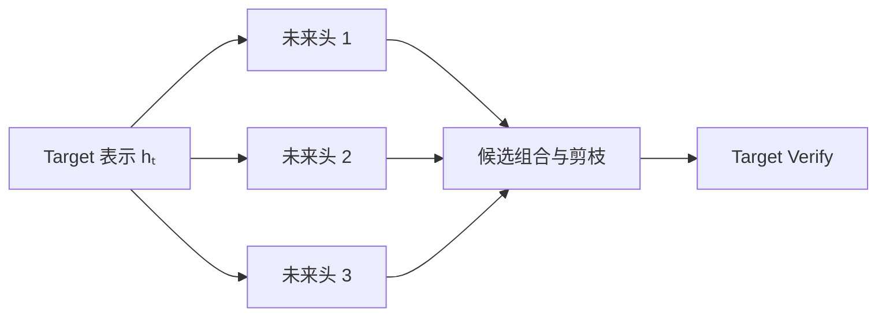

独立 Draft 要再运行一套完整语言模型。
Self-Draft 追问的是：Target 已经计算出高质量隐藏表示，能否只增加少量结构，就更便宜地产生与 Target 匹配的候选？

Medusa、EAGLE、EAGLE-2 和 MTP 都围绕这个问题，但它们交换成本的方式不同。
Medusa 用多个并行预测头换取低 Proposal 延迟；EAGLE 用轻量特征级自回归保留候选间条件关系；EAGLE-2 再按上下文动态分配树节点；MTP 则把多 Token 预测能力放进主模型 checkpoint 的训练合同。

本节不把它们写成算法百科，而是沿着一条主线展开：

> 怎样复用 Target 的已有信息，以更小的 $t_D$ 产生更高的逐位置存活率，同时控制候选树带来的 $B_V$？

<!-- more -->

## 📑 本节导航
- [1. Self-Draft 在复用什么](#1-self-draft-在复用什么)
- [2. 候选从单链变成树](#2-候选从单链变成树)
- [3. Medusa：从同一隐藏状态并行看未来](#3-medusa从同一隐藏状态并行看未来)
- [4. EAGLE：在特征空间轻量自回归](#4-eagle在特征空间轻量自回归)
- [5. EAGLE-2：让候选树随上下文变化](#5-eagle-2让候选树随上下文变化)
- [6. MTP：模型原生的多 Token 预测结构](#6-mtp模型原生的多-token-预测结构)
- [7. 节点数、深度与 Target 验证形状](#7-节点数深度与-target-验证形状)
- [8. 候选树为什么需要祖先因果关系](#8-候选树为什么需要祖先因果关系)
- [9. 统一算例：质量提升不能脱离 B_V](#9-统一算例质量提升不能脱离-b_v)
- [10. 训练与部署代价](#10-训练与部署代价)
- [11. 系统代价与适用边界](#11-系统代价与适用边界)
- [总结](#总结)
- [自我检验](#自我检验)
- [参考资料](#参考资料)

---

## 1. Self-Draft 在复用什么
Target 完成一次前向后，不只留下一个最终 Token 分布，还产生了逐层隐藏表示。
这些表示已经编码当前前缀的词法、句法、语义和任务状态。
独立 Draft 从 Token 序列重新建立这些信息；Self-Draft 尝试直接复用它们。

抽象地看，Target 在当前已确认位置产生表示 $h_t$。
Self-Draft 增加轻量模块 $g$，由 $h_t$ 或多个层的表示产生未来候选：

$$\text{candidates}=g(h_t,\text{候选 Token 状态})$$
这并不意味着未来已经包含在 $h_t$ 中。
$h_t$ 只描述当前条件，未来仍有多个可能分支。
附加结构要做的是以较低成本近似这些分支，而最终决定权仍属于 Target Verify。

Self-Draft 相比独立 Draft 通常减少：

- 第二套完整 Transformer 权重；
- 从原始 Token 重新抽取全部语义的工作；
- 独立长上下文 Draft KV 的一部分或全部；
- 两个完整模型之间的状态同步。

但它不会自动消除：

- 附加头或轻量模块权重；
- Proposal 计算与候选选择；
- 候选树打包和 Target Verify；
- 临时候选状态；
- 与特定 Target revision 的结构耦合。

因此“Self”表示信息来源更接近 Target，不表示零成本。

## 2. 候选从单链变成树
线性候选只有一条假设路径：

```text
root → y₁ → y₂ → y₃ → y₄
```
第一个候选错误时，后面全部失效。
如果轻量结构能便宜地产生多个高概率选项，就可以把宽度用在不确定位置：

```text
root
├── the
│   ├── model
│   │   └── can
│   └── system
└── a
    └── model
        └── may
```
树的深度回答“最多希望一次前进多远”，对应统一变量 $K$。
树的宽度回答“每个不确定位置保留多少替代路径”。
Target 真正需要验证的是所有被保留节点，所以成本更直接由 $B_V$ 反映。

树能提高的是：

$$P(\text{至少存在一条较长的可接受路径})$$
它不能让所有分支同时成为输出。
一轮最终仍只提交一条从根开始的合法路径；仅在该路径尚未触发终止条件时，再加校正或 bonus Token。

若每层都无约束地扩展多个分支，节点数会随深度快速增长。
因此实际结构不会保留所有组合，而会在固定节点预算下选择少量高价值分支。

树设计本质上是在两种稀缺资源之间分配：

- 深度：提高单轮可能提交的 Token 数；
- 宽度：降低早期押错唯一分支的风险。

增加任何一项都可能提高存活机会，也都会增加 Verify 工作。

## 3. Medusa：从同一隐藏状态并行看未来
普通 LM Head 用当前隐藏状态预测紧接着的下一个 Token：

$$p_T(x_{t+1}\mid x_{\le t})=\operatorname{softmax}(W_{\mathrm{LM}}h_t)$$
Medusa 在同一个 Target 表示上增加多个未来预测头。
若把第一个 Medusa 头编号为 $k=1$，它预测的是普通 LM Head 之后的第 $k$ 个额外未来位置，即 $x_{t+k+1}$：

$$q_k(x_{t+k+1}\mid x_{\le t})=\operatorname{softmax}(W_k g_k(h_t)),\qquad k=1,\ldots,K$$
多个头共享起点 $h_t$，所以可以并行计算。
它不需要像独立 Draft 那样先完成候选 1，才启动候选 2 的完整模型前向。
这使 Proposal 的串行部分很短，$t_D$ 通常较小。


### 3.1 并行的代价：远期头缺少中间条件
预测 $x_{t+3}$ 的头没有看到最终会提交的 $x_{t+1}$ 和 $x_{t+2}$。
它面对的是从当前前缀出发的多种未来被混合后的不确定性：

$$q_3(x_{t+3}\mid x_{\le t})$$
如果第一步可能是 `the`、`a` 或另一个 Token，第三步的合理选择往往依赖前两步究竟走了哪条分支。
远期头只能从 $h_t$ 猜测这种边缘化未来，深处候选更容易失准。

### 3.2 多头输出怎样成为路径
各头可以返回少量高分 Token，再按预设形状组合为候选树。
不能简单取每个头的所有 top-k 做完整笛卡尔积，因为节点数会指数增长。

常见思想是把更多节点预算留给：

- 第一头的多个高分选择；
- 最可能分支上的较深路径；
- 少量早期替代分支；
- 在训练数据中经常成功的树形。

这里的关键不是某套固定树模板，而是：Medusa 用极低的 Proposal 串行性换来多个独立 offset 预测，再用剪枝控制 $B_V$。

### 3.3 训练含义
可以冻结 Target，只训练附加未来头；这样不会修改主干参数，训练侵入较小。
也可以联合调整主干与预测头，以提高候选质量，但这会产生新的 Target checkpoint，并需要重新验证原任务质量。

无论哪种方式，未来头都必须和 Target 的 hidden size、词表以及 revision 匹配。
把某组 Medusa 头接到“架构相同但权重不同”的 Target，候选分布也可能明显偏移。

## 4. EAGLE：在特征空间轻量自回归
Medusa 的远期头主要从同一 $h_t$ 独立看不同 offset。
EAGLE 选择另一种交换：保留候选之间的自回归条件，但把这条链放在更轻的特征预测模块中。

概念流程是：

```text
Target 当前特征
→ 轻量模块预测下一特征
→ 由下一特征产生候选 Token
→ 将已选候选 Token 信息送回轻量模块
→ 继续预测更远特征
```
可抽象为：

$$\hat h_{t+i+1},q_{i+1}=g(\hat h_{t+i},e(y_i),h_t),\qquad i\ge0$$
其中 $y_0=x_{t+1}$ 是 Target LM Head 在当前边界给出的首个候选，$e(y_i)$ 表示已经选出的当前候选 Token 的 embedding；Draft 用这份 shifted-token 输入预测下一位置的特征与分布。
下一步显式知道上一候选走了哪条离散路径，所以比独立远期头保留了更强条件关系。

### 4.1 为什么在特征空间起草
Target 高层特征已经压缩了长前缀的语义。
轻量模块无需从所有历史 Token 重新经过完整主干，只需学习局部特征怎样随候选推进。
这使每个 Draft step 比完整独立模型更轻。

### 4.2 为什么仍输入候选 Token
连续特征本身可能对应多个离散 Token 分支。
若下一步只看预测特征，不知道刚才实际选择了哪个 Token，误差会把不同分支混在一起。
把候选 Token embedding 回送给 Draft，相当于告诉它当前正在沿哪条离散路径继续。

### 4.3 它仍有串行部分
EAGLE 的第 $i+1$ 步依赖第 $i$ 步候选，因此 Proposal 不像 Medusa 多头那样完全并行。
它希望以轻量串行换取更好的深部条件匹配，使 $s_2,s_3,\ldots$ 不至于过快下降。

最终收益取决于：

- 轻量模块每步有多便宜；
- 深处存活率提高多少；
- 为多个分支滚动特征需要多少节点；
- 候选树使 $B_V$ 增加多少。

### 4.4 特征耦合
EAGLE 权重不仅与词表相关，还与 Target 的内部特征分布相关。
Target 的层数、hidden size、抽取层、微调 revision 或量化路径变化，都可能让原 Draft 模块失配。
“同一个基础架构”不能代替精确匹配验证。

## 5. EAGLE-2：让候选树随上下文变化
固定树假设每个上下文都适合同样的宽深分配，但语言的不确定性并不固定。

```text
"2 + 2 ="          分支集中，适合向深处扩展
"写一个故事："     分支很宽，更需要保留早期替代
```
EAGLE-2 的核心不是换掉 EAGLE 的特征级起草，而是让树节点预算根据当前 Draft 置信度动态分配。
高分路径可以继续向深处扩，多个接近的早期分支则分享宽度。

### 5.1 动态扩展的逻辑
可以把每条候选路径的 Proposal 分数理解为逐步条件概率的累积：

$$\log q(y_{1:d})=\sum_{i=1}^{d}\log q_i(y_i\mid y_{<i},h_t)$$
在固定节点预算下，构树过程反复做三件事：

1. 选择当前最值得继续扩展的前沿节点。
2. 产生少量子候选并更新路径分数。
3. 达到节点预算后，保留父子关系完整的紧凑树。

这不是要找出绝对最高概率的所有字符串，而是要把有限的 Target Verify 位置放到更可能形成长接受路径的节点上。

### 5.2 为什么动态树可能更省
确定性上下文不必浪费大量兄弟节点，可以把预算放在深度上。
高不确定上下文不必把所有预算压在一条深链上，可以保留早期替代。
同一个最大深度 $K$ 下，不同请求因此可能拥有不同 $B_V$ 和树形。

### 5.3 置信度不是 Target 接受率
动态策略依据的是 Draft 分数，而最终接受由 Target 决定。
当数据域变化时，Draft 可能对错误路径仍很自信。
若高 Draft 分数不再对应高 $s_i$，节点预算就会被系统性分错。

因此动态树需要关注校准关系：

```text
Draft 路径分数较高
是否真的对应更高的 Target 连续存活概率？
```
动态构树还增加排序、变长打包与 shape 不规则性，这些成本进入 $t_D$ 或 $t_O$。

## 6. MTP：模型原生的多 Token 预测结构
Multi-Token Prediction 在模型训练时加入多个未来位置目标。
抽象损失可以写成：

$$\mathcal L=\mathcal L_{\text{next-token}}+\sum_{k=2}^{K}\lambda_k\mathcal L_k$$
其中 $\mathcal L_k$ 训练某个附加头或模块预测更远 Token。
这些结构若保留在 checkpoint 中，推理时就能作为原生 Proposer。

### 6.1 “原生”是最重要的差别
MTP 不是给任意已有模型打开一个运行时选项。
主模型在训练阶段就知道存在多 Token 目标，checkpoint 中也必须保存相应预测模块和配置。
运行时只能消费已有能力，不能凭空补出 MTP 权重。

### 6.2 MTP 不等于一种固定拓扑
有些设计从同一主干状态并行放出多个未来头，概念上接近 Medusa 的 offset 预测。
另一些设计让多个轻量 MTP 模块顺序推进，并把候选 Token 信息送入下一模块，概念上更接近条件链。

所以看到“MTP”时应先问：

- 多个未来位置是并行头还是顺序模块？
- 后一步是否看到前一步候选 Token？
- embedding 与 LM Head 是否共享？
- 是否产生额外轻量状态？
- checkpoint 实际保留了多少预测深度？

不能仅凭名称推断 $t_D$、候选形状或 KV 共享方式。

### 6.3 与 Medusa、EAGLE 的概念位置
Medusa 强调在已有 Target 上附加多 offset 预测头。
EAGLE 强调从 Target 特征出发建立轻量自回归 Draft。
MTP 强调多 Token 目标属于模型自身训练与 checkpoint 合同。

一个具体 MTP 实现的内部结构可能接近前两者，但部署前置不同：它依赖原生模型支持，而不是任意外挂 speculator。

## 7. 节点数、深度与 Target 验证形状
统一变量 $K$ 表示根到叶的最大未来深度，不表示 Target 只验证 $K$ 个节点。
在线性单链中，每个请求有 $K$ 个候选，因此：

$$B_V\approx BK$$
在候选树中，每个深度可以有多个节点，$B_V$ 是当前 batch 所有实际打包节点之和。
两个树可以拥有相同 $K$，却有完全不同的 $B_V$。

沿用 $B=1$、$K=4$：

```text
单链各深度节点数：1, 1, 1, 1
总验证候选位置：B_V = 4
```
若在前两层保留替代分支：

```text
树各深度节点数：2, 3, 2, 1
最大深度：K = 4
总验证候选位置：B_V = 8
```
第二棵树没有把“可提交上限”从 $K+1$ 变成 $9$。
它只是用四个额外旁支提高找到一条可接受深路径的机会。

Target 验证成本因此应写成：

$$t_V(B_V,C)$$
不能只写成 $t_V(K,C)$。
树越宽，Target 的矩阵工作、Attention query、候选 KV、mask 和元数据越多。

### 7.1 深度的边际收益
增加一层深度，只有到达该层的路径仍存活时才增加期望提交长度。
深处 $s_i$ 已很低时，继续增加 $K$ 的主要效果可能是扩大 Draft 与 Verify。

### 7.2 宽度的边际收益
增加兄弟节点只在它提供了有价值的替代路径时有用。
若多个候选高度重复，或 Draft 排名与 Target 不一致，旁支会增加 $B_V$，却几乎不提高连续存活。

### 7.3 Batch 的放大
当活跃请求数为 $B$ 时，每个请求的小树会被合并成更大的验证形状。
树的平均节点数翻倍，$B_V$ 也近似翻倍。
这就是结构层必须把节点预算与深度分开记录的原因。

## 8. 候选树为什么需要祖先因果关系
把树节点压成一段数组后，物理上排在前面的节点不一定是当前节点的逻辑祖先。
Target 验证每个节点时，只能看到：

```text
全部已确认历史
+ 从根到父节点的祖先候选
+ 当前节点
```
它不能看到兄弟分支或其他路径的节点。
否则 logits 将对应一个从未存在的混合前缀，候选验证失去语义。

设节点 $u$ 的祖先集合为 $\operatorname{Anc}(u)$，树内可见性应满足：

$$M_{uv}=0\ \text{当且仅当}\ v\in\operatorname{Anc}(u)\cup\{u\}$$
其余树节点在 Attention 中应被屏蔽。
所有节点仍可读取共同的已确认历史。

逻辑 position 也由路径深度决定，而不是由 packed array 下标决定。
同一深度的兄弟节点共享相同逻辑位置，但拥有不同祖先链。

这解释了为什么候选树不是“把若干 Token 拼成普通 sequence”。
Target Verify 需要显式的 parent、depth、position 与可见性信息。
至于这些节点的 KV 怎样暂存、提交和回收，属于 5.5 的运行时所有权问题。

## 9. 统一算例：质量提升不能脱离 B_V
沿用总览统一教学点：

$$B=1,\quad K=4,\quad t_T=10\text{ ms}$$
单链 Proposal 的存活率为：

$$(s_1,s_2,s_3,s_4)=(0.80,0.60,0.40,0.20)$$
所以：

$$\mathbb E[A]=2.0,\quad \mathrm{AR}=0.50,\quad \mathbb E[L]=3.0$$
并沿用：

$$t_D=3\text{ ms},\quad t_V=12\text{ ms},\quad t_O=1\text{ ms}$$
得到教学点 $t_{\text{round}}=16\text{ ms}$ 与 $1.875\times$ Decode 加速估计。

现在考虑结构变化：

- Medusa 可能降低 Proposal 串行性，从而降低 $t_D$。
- EAGLE 可能通过条件化候选提高深处 $s_i$，但仍有轻量串行 Draft。
- EAGLE-2 可能把节点放到更有价值的分支，提高同一节点预算的存活机会。
- MTP 可能减少外挂权重与状态搬运，但其 $t_D$ 取决于原生模块结构。

任何变化都不能只改公式分子。
若单链 $B_V=4$ 扩成八节点树，原来的 $t_V=12\text{ ms}$ 不能原样保留。
必须重新测 $t_V(8,C)$ 与 $t_O$，再观察新的 $(s_1,\ldots,s_4)$。

结构优化的目标不是最大化候选节点数，而是让：

$$\frac{t_D+t_V+t_O}{\mathbb E[L]}$$
下降。
这个统一分母把 Proposal 质量与验证形状锁在同一账本里。

## 10. 训练与部署代价
| 结构 | 主要复用 | Proposal 串行性 | 训练前置 | Target 耦合 |
|---|---|---|---|---|
| Medusa | 当前 Target 隐藏状态 | 多头大体并行 | 训练未来头；可冻结或联合调主干 | 高 |
| EAGLE | Target 特征与候选 Token | 轻量自回归 | 训练匹配特征分布的 Draft 模块 | 很高 |
| EAGLE-2 | EAGLE 特征 Draft | 轻量自回归 + 动态构树 | EAGLE 训练并校准树分数 | 很高 |
| MTP | checkpoint 原生多 Token 模块 | 取决于具体拓扑 | 主训练或继续训练阶段纳入 MTP | 原生绑定 |

### 10.1 离线训练成本
Medusa 只训练附加头时侵入较小，但远期独立预测的上限仍受 $h_t$ 限制。
联合训练主干可能提高候选质量，却需要确认 Target 原输出能力没有被辅助目标破坏。

EAGLE 要读取或生成 Target 特征，并让轻量模块学习多步展开。
训练数据、Target revision 与特征抽取位置不匹配时，在线存活率会下降。

EAGLE-2 还依赖 Draft 分数能正确排序 Target 接受机会。
这既是训练问题，也是生产域上的校准问题。

MTP 的前置侵入最大：多 Token 目标和模块要进入模型训练及 checkpoint。
已有普通 checkpoint 通常不能通过少量部署配置变成原生 MTP。

### 10.2 在线部署成本
Self-Draft 虽不加载第二套完整 LLM，仍可能需要：

- 附加头或 speculator 权重；
- Target 中间特征的保留与传递；
- 候选树构建、排序和打包；
- 额外 logits 与临时激活；
- 特定模型结构的执行路径；
- 对动态 shape 的图执行支持。
这些成本分别进入 $t_D$、$t_V$、$t_O$ 和额外显存。

## 11. 系统代价与适用边界
Self-Draft 最适合 Target 已有高质量可复用表示、附加模块较轻，并且低并发 Verify 能有效利用空闲计算的场景。
它可能在以下条件下失去优势：

- 附加模块或特征搬运使 $t_D$ 过大；
- 候选树太宽，使 $B_V$ 和 $t_V$ 增长过快；
- 深处 $s_i$ 很低，增加 $K$ 只制造无效节点；
- Target revision 改变，附加权重统计失配；
- 动态树分数在生产域失去校准；
- 额外权重、激活和候选状态挤压服务容量。
某些实现会采用 typical acceptance 或其他启发式验收。
这些规则是否近似、是否保持 Target 分布，不能由“使用 Medusa/EAGLE/MTP”这个结构名称决定。
严格与近似的界线仍以 5.1 的概率合同为准。
## 总结
- Self-Draft 复用 Target 隐藏表示或原生预测模块，目标是以较低 $t_D$ 产生更高质量候选。
- Medusa 多头并行预测不同未来 offset，Proposal 快，但远期头缺少中间 Token 条件。
- EAGLE 在特征空间轻量自回归，后一步显式依赖前一步候选，通常更有利于深处存活。
- EAGLE-2 用 Draft 置信度动态分配树节点，效果依赖分数与 Target 接受率的校准。
- MTP 属于模型训练与 checkpoint 的原生合同，具体内部拓扑仍需逐模型理解。
- $K$ 是路径深度，$B_V$ 是实际验证节点总数；树提高路径覆盖，也会增加 Verify。
- 训练权重、特征耦合、候选树、临时状态与动态 shape 都是 Self-Draft 的真实代价。

## 自我检验
- [ ] 能说明 Self-Draft 复用了 Target 的什么，又没有消除什么。
- [ ] 能区分候选树的深度 $K$ 与验证位置总数 $B_V$。
- [ ] 能解释 Medusa 远期头为什么缺少中间条件。
- [ ] 能解释 EAGLE 为什么同时使用特征与候选 Token 信息。
- [ ] 能说明 EAGLE-2 动态树为什么依赖置信度校准。
- [ ] 能判断普通 checkpoint 为什么不能靠开关获得原生 MTP。
- [ ] 能解释树节点为何只能看共同历史和自己的祖先。
- [ ] 能用统一算例说明树变宽后必须重新测 $t_V$。

## 参考资料
1. Cai et al., [Medusa: Simple LLM Inference Acceleration Framework with Multiple Decoding Heads](https://proceedings.mlr.press/v235/cai24b.html), ICML 2024.
2. Li et al., [EAGLE: Speculative Sampling Requires Rethinking Feature Uncertainty](https://arxiv.org/abs/2401.15077), ICML 2024.
3. Li et al., [EAGLE-2: Faster Inference of Language Models with Dynamic Draft Trees](https://aclanthology.org/2024.emnlp-main.422/), EMNLP 2024.
4. Gloeckle et al., [Better & Faster Large Language Models via Multi-token Prediction](https://arxiv.org/abs/2404.19737), 2024.
5. DeepSeek-AI, [DeepSeek-V3 Technical Report](https://arxiv.org/abs/2412.19437), 2024.
