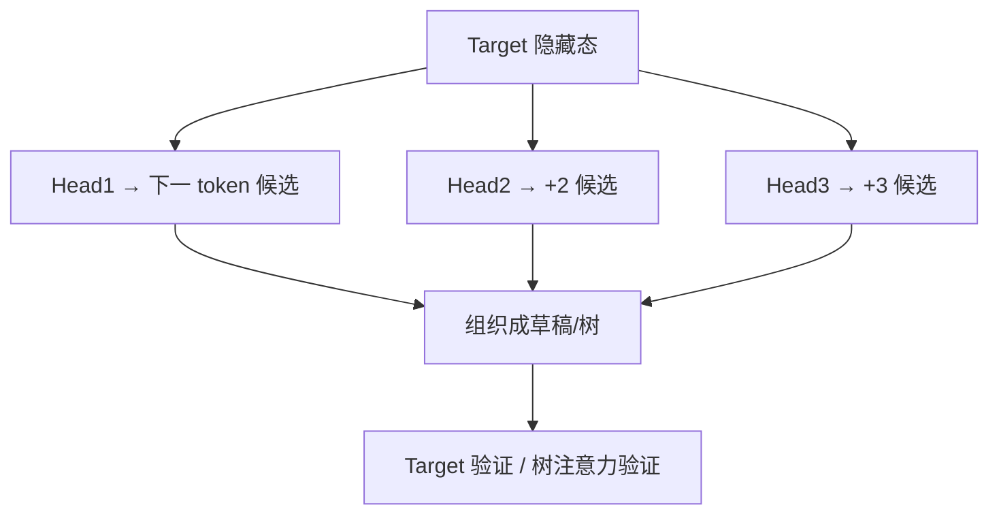

独立小模型要额外显存；N-gram 又怕开放生成接受率不够（[5.2](./5.2-Draft模型与N-gram.md)）。Self-Draft 试图走第三条路：**让 Target 自己长出廉价的草稿能力**——或加多个 Decoding Head，或加一个轻量 Draft 模块，在共享主干特征上预测未来多 Token。这一节抓住 Medusa 与 EAGLE-2/3 的主线，用一笔树 vs 线性的期望长度粗算说明 Draft Tree 为何更值钱，并把训练/部署成本说清楚；vLLM 配置见 5.5。

<!-- more -->

## 📑 目录

- [1. Self-Draft 要解决什么](#1-self-draft-要解决什么)
- [2. Medusa：多 Decoding Head](#2-medusa多-decoding-head)
- [3. 从线性草稿到 Draft Tree](#3-从线性草稿到-draft-tree)
- [4. 手算：树为何抬期望接受长度](#4-手算树为何抬期望接受长度)
- [5. EAGLE-2/3：动态树与校准](#5-eagle-23动态树与校准)
- [6. 训练与部署形态](#6-训练与部署形态)
- [7. 和独立 Draft / N-gram 怎么选](#7-和独立-draft--n-gram-怎么选)
- [8. 读论文/文档时的抓手](#8-读论文文档时的抓手)
- [9. 代价与权衡](#9-代价与权衡)
- [总结](#-总结)
- [自我检验清单](#-自我检验清单)
- [参考资料](#-参考资料)

---

## 1. Self-Draft 要解决什么

Self-Draft 的目标函数很明确：

- Draft **足够像** Target（共享表示，分布更近）；
- Draft **足够便宜**（不要再跑一个完整大 LM）；
- 尽量提高**每轮接受的期望 Token 数**。

它仍然遵循 5.1 的 Verify 框架：草稿只是提议，Target（或其等价验证路径）负责保证分布正确，或给出方法声明的近似保证。

📌 **关键点**：Self-Draft 不是放弃验证，而是把"猜"的成本内化进 Target 周边的轻量结构。

---

## 2. Medusa：多 Decoding Head

**Medusa** 的直观做法：在主干之上挂多个 Decoding Head，分别预测 $t+1, t+2, \ldots$ 位置的 Token（或候选集）。一次取出主干特征，多个头并行吐出短草稿，再交给验证。

相对独立小模型：

- 不需第二份完整权重；
- 与 Target 表示强绑定，接受率潜力高；
- 需要额外训练/微调头；
- 头的能力随预测步变远而变差，直线草稿仍易在远端断裂。

🔑 **核心概念**：**Medusa = 用多个廉价头，从同一表示预测未来多步。** 它把 Draft 从"另一个模型"变成"几个头"。

---

## 3. 从线性草稿到 Draft Tree

直线草稿只有一条路径：一旦第 2 个 Token 被拒，后面全废。若 Draft 在每步提供**多个候选**，并把它们组织成树，Target 可以用一次（或少量）结构化验证，同时探查多条假设路径——这就是 **Draft Tree**。

收益来自组合：

- 提高"至少有一条路径走得更远"的概率；
- 更好利用验证阶段的并行算力；
- 与树状注意力/掩码 Kernel 配合时，效率远好于朴素多次前向。

| 草稿形态 | 拒绝后的命运 | 对接受长度的影响 |
|---|---|---|
| 线性序列 | 断点后全部丢弃 | 方差大，易早停 |
| 候选树 | 可回退到兄弟节点继续 | 期望接受长度通常更高 |

💡 **提示**：树不是无脑加宽。过宽会稀释算力、增加构造与掩码复杂度。EAGLE 系列的重要贡献之一，就是**动态决定树的形状**。

---

## 4. 手算：树为何抬期望接受长度

用极度简化的概率玩具说明机制（**非论文公式复述、非实测**）。假设每步 Top-1 草稿命中概率为 $r$，且各步独立；线性路径上连续走 $k$ 步的概率为 $r^k$。

对比深度 2：

| 形态 | 假设 | 走到深度 ≥2 的概率（示意） |
|---|---|---|
| 线性 | 每步只提 1 个候选 | $r^2$ |
| 宽度 2 的树 | 每步 2 候选，至少一中即可续 | 粗近似 $(1-(1-r)^2)^2$（仅教学） |

代入 $r=0.5$：

| 形态 | 走到深度 ≥2（示意） |
|---|---|---|
| 线性 | $0.5^2=0.25$ |
| 宽 2 树（上式） | $(1-0.25)^2=0.5625$ |

数字只说明方向：**分支把"早拒绝就整段作废"的风险摊开了**。真实系统还有置信度剪枝、树注意力开销、候选相关性——所以宽度不是越大越好。工程上应以测得的 $\bar{a}$ 与 P95 TPOT 为准，而不是用这张玩具表做容量承诺。

取舍句：Draft Tree 用**更多验证位置上的并行算力**换更高的期望接受长度；若验证 Kernel 未优化或并发已 Compute Bound，多出来的树节点可能只增加步时长，不见端到端收益（见 [5.4](./5.4-收益边界与限制.md)）。

---

## 5. EAGLE-2/3：动态树与校准

**EAGLE** 家族（含 EAGLE-2、EAGLE-3 等演进）把 Self-Draft 推到更实用的位置，核心思想包括：

1. **轻量 Draft 模块**利用 Target 特征自回归地提议后续 Token，比"互不交流的静态多头"更贴近真实续写；
2. **EAGLE-2** 强调基于置信度的 **动态 Draft Tree**：更有希望的分支多展开，没希望的早停；
3. 后续版本（如 **EAGLE-3**）继续在训练目标、特征利用与推理效率上加压，使接受率与墙钟加速更稳。

可以把演进粗理解为：

⚠️ **注意**：不同论文对"完全无损 vs 轻微近似"的承诺细节可能不同；接入引擎时要阅读该方法在 vLLM 中的实现说明，不要假设所有 Self-Draft 都与经典 Rejection Sampling 定理（5.1）逐字等价。

---

## 6. 训练与部署形态

Self-Draft 通常不是"改个开关即得"，常见形态：

- 发布方提供带 Medusa/EAGLE 头的合并权重；
- 或提供 Draft 模块 checkpoint，与 Target 搭配加载；
- 推理引擎需要对应的树验证 Kernel / speculative config。

部署成本项：

- 训练或获取兼容权重；
- 引擎版本是否支持该方法；
- 额外参数量（通常远小于完整 Draft LM，但仍非零——例如多头/小模块相对 70B 主干常是个位数百分比量级，以具体 checkpoint 为准）；
- 与 Continuous Batching、Prefix Cache 的集成成熟度。

粗算对比显存口径（**只谈权重量级直觉**，同 5.2）：

| 方案 | 额外权重直觉 |
|---|---|
| 独立 Draft 7B vs Target 70B | +14 GB（BF16） |
| Self-Draft 头/模块 | 通常 ≪ 一个完整 7B，但仍占显存与加载复杂度 |

📌 **关键点**：Self-Draft 的 ROI 出现在——**你愿意为高接受率支付一次性模型改造成本，且在线流量足够大、能摊销工程投入**。

---

## 7. 和独立 Draft / N-gram 怎么选

| 方案 | 额外模型 | 接受率潜力 | 工程门槛 | 适合 |
|---|---|---|---|---|
| N-gram/Suffix | 无 | 场景依赖 | 低 | 代码/复述/模板 |
| 独立 Draft LM | 有 | 中高 | 中 | 通用，快速试验 |
| Medusa/EAGLE | 轻量头/模块 | 高 | 高 | 生产级深优化 |

经验顺序：

1. 流量是否可抄？→ 先 ngram；
2. 需要通用加速且要快验证想法？→ 独立 Draft；
3. 接受率仍不够、且团队能维护专用权重？→ EAGLE/Medusa。

与量化（第 4 章）叠加时：先固定 Target 数值方案与质量基线，再挂 Self-Draft 头——头与主干精度不匹配会直接打歪草稿分布（[5.4](./5.4-收益边界与限制.md)）。

---

## 8. 读论文/文档时的抓手

Self-Draft 论文密集，建议只抓五个问题，避免淹没在符号里：

1. **草稿模块吃什么特征？**（最后一层隐藏态、多层特征、还是 token 嵌入）
2. **草稿如何展开？**（静态多头、自回归小头、动态树）
3. **验证如何批处理？**（树注意力 / 特制掩码是否一次完成）
4. **训练目标是什么？**（模仿 Target 下一 token，还是更复杂的特征回归）
5. **声称的保证是什么？**（严格同分布，还是经验上接近）

| 抓手 | Medusa 直觉 | EAGLE-2 直觉 |
|---|---|---|
| 草稿形态 | 多头候选 | 动态树扩展 |
| 便宜来源 | 少算主干 | 轻量模块 + 共享特征 |
| 关键增益点 | 并行多步提议 | 把算力花在高置信分支 |

💡 **提示**：把这五问当成阅读模板，5.5 节看 vLLM 配置时也能迅速判断："这个 method 到底改了 Draft 的哪一层"。

---

## 9. 代价与权衡

| 选择 | 收益 | 代价 / 不适用 |
|---|---|---|
| Self-Draft vs 独立 Draft | 更少完整第二模型显存、分布更近 | 要训练/获取专用权重，引擎支持门槛高 |
| Draft Tree vs 线性 | 期望接受长度通常更高 | 验证 Kernel 与调度复杂度上升 |
| 动态加宽树 | 把算力花在高置信分支 | 实现难；过宽仍可能拖长单步 |
| 上 EAGLE 族 | 开放任务 Acc 潜力更好 | 运维绑定特定 checkpoint 与版本 |

适用：结构流量不够吃满 ngram、独立 Draft 显存吃紧或 Acc 不够、且有能力维护专用权重的团队。  
若只是偶发批处理、或引擎版本对树验证支持不稳——先别上 Self-Draft，用 ngram/关闭投机更可控。

---

## 📝 总结

- Self-Draft 把草稿能力内化到 Target 周边，兼顾"像"与"便宜"。
- Medusa 用多 Decoding Head 并行预测未来多步。
- Draft Tree 通过多候选路径提高期望接受长度，优于易早断的线性草稿；加宽有代价。
- EAGLE-2/3 以动态树与更强 Draft 模块/训练，把 Self-Draft 推近生产可用。
- 选型应按场景从 ngram → 独立 Draft → Self-Draft 递增投入，并核对方法的分布保证力度。

## 🎯 自我检验清单

- 能说明 Self-Draft 相对独立小模型的显存与相似性优势
- 能用一句话概括 Medusa 多头在做什么
- 能解释 Draft Tree 为何通常优于线性草稿，并指出加宽的代价
- 能用简化概率说明树如何抬高"走到更深"的机会（不要求背公式）
- 能指出 EAGLE-2"动态树 + 置信度"要解决的问题
- 能给出 ngram / 独立 Draft / EAGLE 的递进选型顺序
- 能列出读 Self-Draft 论文时的五问抓手

## 📚 参考资料

- [Cai et al., Medusa: Simple LLM Inference Acceleration Framework with Multiple Decoding Heads](https://arxiv.org/abs/2401.10774)
- [Li et al., EAGLE: Speculative Sampling Requires Rethinking Feature Uncertainty](https://arxiv.org/abs/2401.15077)
- [Li et al., EAGLE-2: Faster Inference of Language Models with Dynamic Draft Trees](https://arxiv.org/abs/2406.16858)
- [Li et al., EAGLE-3: Scaling up Inference Acceleration of Large Language Models via Training-Time Test](https://arxiv.org/abs/2503.01840)
- [vLLM — Speculative Decoding](https://docs.vllm.ai/en/latest/features/speculative_decoding.html)
- [本模块 5.1 核心原理](./5.1-核心原理.md)
- [本模块 5.2 Draft 模型与 N-gram](./5.2-Draft模型与N-gram.md)
