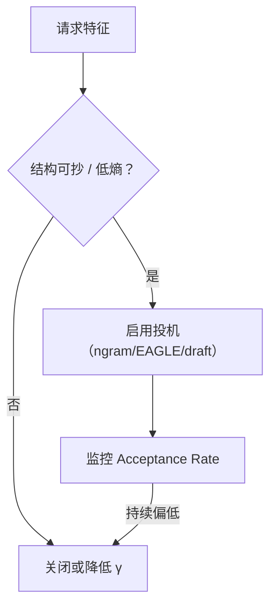

前面三节容易给人一种错觉：只要挂上 Draft，Decode 就稳加速。真实服务里，投机解码是**条件收益**——在某些流量上像开了挂，在另一些流量上接近零甚至为负；再和量化、Continuous Batching 叠在一起，调度与精度风险还会放大。这一节专门画边界，避免把实验室的单请求曲线直接写进容量规划。

<!-- more -->

## 📑 目录

- [1. 高接受率 vs 低接受率场景](#1-高接受率-vs-低接受率场景)
- [2. 加速比为什么会"算得漂亮、跑得一般"](#2-加速比为什么会算得漂亮跑得一般)
- [3. 与量化叠加的风险](#3-与量化叠加的风险)
- [4. 与 Continuous Batching 的张力](#4-与-continuous-batching-的张力)
- [5. 其它现实限制](#5-其它现实限制)
- [6. 决策：什么时候该关投机](#6-决策什么时候该关投机)
- [7. 一套最小测量协议](#7-一套最小测量协议)
- [总结](#-总结)
- [自我检验清单](#-自我检验清单)
- [参考资料](#-参考资料)

---

## 1. 高接受率 vs 低接受率场景

| 场景 | 接受率直觉 | 原因 | 投机价值 |
|---|---|---|---|
| 代码补全 / 填空 | 高 | 局部语法与上下文强约束 | 高 |
| 文档复述 / RAG 引用 | 高 | 可抄原文 | 高 |
| 模板 JSON / 工具调用骨架 | 中高 | 结构可预测 | 中高 |
| 开放多轮闲聊 | 中低 | 分支多、温度敏感 | 有限 |
| 高温度创意写作 | 低 | Target 自身熵高 | 常不划算 |
| 强安全拒答/策略分支 | 不稳 | 草稿易走错分支 | 需谨慎评测 |

📌 **关键点**：投机解码不是通用"Decode 加速器"，而是 **可预测续写加速器**。先给流量分类，再决定默认开还是按路由开。

---

## 2. 加速比为什么会"算得漂亮、跑得一般"

纸面模型常假设：

- 单请求；
- Draft 成本可忽略；
- Target 永远 Memory Bound；
- 接受率稳定。

生产里这些假设会被打破：

1. **Draft 并不免费**（尤其独立小模型同卡争带宽）；
2. **高并发下 Target 更偏 Compute Bound**，"一次验证多 Token"的相对优势下降；
3. **接受率随领域漂移**（新版本提示词、新工具 schema）；
4. **树/掩码 Kernel** 若未优化，验证本身变慢。

因此要用：

$$
\text{端到端吞吐或 P95 TPOT}
$$

而不是只看"平均接受长度 × 理论式"。

⚠️ **注意**：出现"Acceptance Rate 还行但 TPOT 变差"，优先查 Draft 开销与调度，而不是先怪算法论文。

---

## 3. 与量化叠加的风险

量化与投机都在"近似"，但近似对象不同：

- 量化近似**数值**；
- 投机的 Draft 近似**Token 提议**（Verify 仍可保 Target 分布）。

叠加油箱时的典型风险：

| 组合 | 可能现象 |
|---|---|
| INT4 Target + 未量化 Draft | 分布更不一致 → 接受率下降 |
| Target/Draft 都激进量化 | 接受率与尾部质量双杀 |
| FP8/INT4 + Self-Draft 头 | 头与主干量化不匹配导致草稿漂 |
| 只量化权重、KV 仍 FP16 | 通常对投机影响较小，但仍需测 |

💡 **提示**：经典 Rejection Sampling 保证的是：**在你实际用来 Verify 的那个 Target 分布上无损**。若 Target 已被量化，保证的是"量化 Target"，不是"原 BF16 Target"。产品评测仍要以量化后的质量为准。

正确姿势：

1. 先固定量化方案，建立质量基线；
2. 再开投机，看接受率与质量有无额外回归；
3. Draft 链路的数值精度尽量不要比 Target 更残（除非测过）。

---

## 4. 与 Continuous Batching 的张力

Continuous Batching（第 2.2 节）希望每步灵活拼进/退出请求；投机解码希望单个请求在一步里走得更远。张力来自：

- **步时长变得更不均匀**：有的请求验证大树，有的只走 1 Token；
- **批内气泡**：低接受率请求浪费验证算力，拖累同批其它请求；
- **KV/块管理更复杂**：草稿路径的推测写入需要回滚，与 PagedAttention 交互变细；
- **调度策略**：是否允许投机、允许多深，可能要变成 per-request 策略。

🔑 **核心概念**：单请求投机加速 ≠ 系统吞吐加速。在高负载下，要用**全局 tok/s 与尾延迟**重新标定。

---

## 5. 其它现实限制

- **前缀缓存命中后**：Prefill 已很便宜，投机主要仍作用于 Decode；别指望它修复 Prefill 瓶颈。
- **多 LoRA / 多模型热切换**：Draft 与 Target 的配对更难维护。
- **可观测性不足**：不开 Acceptance Rate 监控，等于盲目飞行。
- **正确性 bug**：实现错误会悄悄破坏"无损"承诺，必须有对数测试（同种子对比是否开启投机）。

---

## 6. 决策：什么时候该关投机

建议在以下情况默认关闭或降级：

1. 滚动窗口内 Acceptance Rate 低于阈值；
2. 集群已接近 Compute Bound，投机不提升全局吞吐；
3. 质量红线任务（合规输出）上出现不可接受漂移；
4. 与新量化/新内核组合尚未完成回归。

可用路由策略：代码路由开 ngram/EAGLE，闲聊路由关闭——往往比全局一刀切更划算。

📌 **关键点**：投机解码应是**可动态开关的性能特性**，不是永久焊死的默认。

---

## 7. 一套最小测量协议

上线前用同一协议说话，避免"我本地快 40%"与"集群慢 10%"各说各话：

1. **固定硬件与引擎版本**，记录 CUDA / vLLM commit；
2. **两套负载**：低并发（看单请求潜力）与目标生产并发（看系统真相）；
3. **两套数据**：高结构（代码/模板）与低结构（开放对话）；
4. **三态对比**：关闭投机 / 仅 ngram / Draft 或 EAGLE；
5. **输出表格**：Acceptance Rate、平均接受长度、P50/P95 TPOT、全局 tok/s、坏例数。

| 并发 | 任务 | 方法 | Acc | P95 TPOT | 全局吞吐 | 结论 |
|---|---|---|---|---|---|---|
| 1 | 代码 | ngram | | | | 潜力 |
| 目标 | 代码 | ngram | | | | 是否保收益 |
| 目标 | 对话 | eagle | | | | 是否值得 |

若"并发=1 很快、目标并发无增益"，结论应写进容量文档：**该特性仅适合低负载或特定路由**，而不是删掉数字假装没发生。

⚠️ **注意**：测量时关闭其它噪声源（随机抢占尖峰、热更新权重、同时开启实验性 Kernel），否则接受率与 TPOT 会对不上。

---

## 📝 总结

- 高接受率集中在代码、复述、模板等低熵续写；开放高温度对话收益有限。
- 纸面加速比在高并发、Draft 有成本、Kernel 不理想时会缩水。
- 与量化叠加时，保证的是"当前 Verify 模型"的分布；接受率与质量都要重测。
- 与 Continuous Batching 叠加会引入步长不均、批内气泡与 KV 回滚复杂度。
- 应用 Acceptance Rate 与全局吞吐门禁，必要时按路由关闭投机。

## 🎯 自我检验清单

- 能列举至少三类高接受率与两类低接受率场景
- 能解释为何单请求加速不能直接外推到服务吞吐
- 能说明量化后"无损"到底相对谁无损
- 能描述投机与 Continuous Batching 的主要张力来源
- 能给出一套"何时关闭投机"的运维阈值思路

## 📚 参考资料

- [Leviathan et al., Speculative Decoding](https://arxiv.org/abs/2211.17192)
- [vLLM — Speculative Decoding](https://docs.vllm.ai/en/latest/features/speculative_decoding.html)
- [vLLM — Continuous Batching / Scheduling 相关设计文档](https://docs.vllm.ai/en/latest/)
- [Liu et al., Online Speculative Decoding（在线服务视角相关讨论可参考）](https://arxiv.org/abs/2310.07177)
