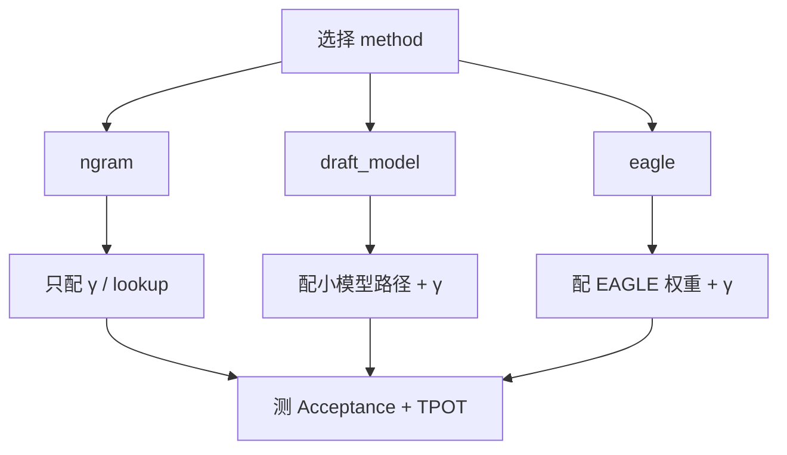

原理与边界都清楚之后，剩下的是把开关打开、把指标看懂。这一节聚焦 vLLM：如何配置 **ngram**、**EAGLE**、**独立 Draft 模型**三类常见路径，怎样读 Acceptance Rate，以及如何用同一套实验对比"代码生成 vs 开放对话"。参数名随版本演进，文中给的是稳定的配置骨架，上线前请以你安装版本的官方文档为准。

<!-- more -->

## 📑 目录

- [1. 实战前的准备](#1-实战前的准备)
- [2. 配置 ngram 投机](#2-配置-ngram-投机)
- [3. 配置独立 Draft 模型](#3-配置独立-draft-模型)
- [4. 配置 EAGLE](#4-配置-eagle)
- [5. 对比实验：代码 vs 对话](#5-对比实验代码-vs-对话)
- [6. 排错与生产建议](#6-排错与生产建议)
- [总结](#-总结)
- [自我检验清单](#-自我检验清单)
- [参考资料](#-参考资料)

---

## 1. 实战前的准备

确认三件事：

1. vLLM 版本支持你要的 speculative method；
2. Target 模型在该版本可正常服务（先不含投机跑通）；
3. 有可复现的评测集：至少 **代码补全 50+ 条** 与 **开放对话 50+ 条**。

观测指标建议同时打点：

| 指标 | 含义 |
|---|---|
| Acceptance Rate / 平均接受长度 | Draft 是否值钱 |
| TPOT / 吞吐 | 用户是否真的更快 |
| GPU 利用率与显存 | Draft 是否挤占 KV |
| 质量抽检 | 防实现偏离或组合回归 |

📌 **关键点**：没有 Acceptance Rate 的投机上线，等于不开仪表飞行。

---

## 2. 配置 ngram 投机

ngram 适合作为第一刀：零额外模型，配置失败成本低。

```bash
# 示意：以 speculative_config 传入 ngram（字段名请核对当前文档）
vllm serve meta-llama/Llama-3.1-8B-Instruct \
  --speculative-config '{
    "method": "ngram",
    "num_speculative_tokens": 5,
    "prompt_lookup_max": 5
  }'
```

Python 侧概念等价于构造引擎时传入同样的投机配置（API 随版本可能封装为 `speculative_config` 字典）。

调参直觉：

- `num_speculative_tokens`（$\gamma$）：代码场景可试 5–7，对话偏 3–5；
- 查找窗口过大：浪费 CPU 侧匹配；过小：错失长模板。

💡 **提示**：若业务大量"复述 Prompt 中的代码块/条款"，ngram 往往比上一个 7B Draft 更香。

---

## 3. 配置独立 Draft 模型

```bash
vllm serve meta-llama/Llama-3.1-70B-Instruct \
  --speculative-config '{
    "method": "draft_model",
    "model": "meta-llama/Llama-3.1-8B-Instruct",
    "num_speculative_tokens": 5
  }'
```

检查清单：

- Draft 与 Target **tokenizer 一致**或官方声明兼容；
- 显存：两模型权重 + 两套运行时状态，必要时降 `gpu_memory_utilization` 或减并发；
- 聊天模板一致，避免草稿第一步就偏移；
- 先在同系列小配对（8B→70B）验证，再换异构组合。

⚠️ **注意**：Draft 太大时，"投机"会退化成"两个慢模型接力"。体量比是第一约束。

---

## 4. 配置 EAGLE

EAGLE 需要 **兼容的 EAGLE 权重/头** 与引擎支持，不能只改 method 名硬套普通 Instruct 模型。

```bash
vllm serve <target-model> \
  --speculative-config '{
    "method": "eagle",
    "model": "<eagle-draft-or-heads>",
    "num_speculative_tokens": 5
  }'
```

实战要点：

- 严格使用文档列出的模型配对；
- 关注树宽/深度相关参数（若版本暴露）——过宽可能损吞吐；
- 升级 vLLM 后重新做接受率基线，Kernel 变化会影响墙钟收益。

🔑 **核心概念**：在 vLLM 里，**method 决定草稿机制，model 字段在 draft/EAGLE 路径上指向辅助权重，ngram 路径通常不需要第二模型。**



---

## 5. 对比实验：代码 vs 对话

用同一 Target、同一硬件、同一并发，只改任务集：

| 实验 | 配置 | 期望 |
|---|---|---|
| A0 | 无投机 | 基线 TPOT/吞吐 |
| A1 | ngram | 代码集接受率显著更高 |
| A2 | draft_model | 对话集可能优于 ngram |
| A3 | eagle（若可得） | 综合接受率更强 |

记录表示例：

| 任务 | 方法 | Acc. Rate | 平均接受长 | 相对 TPOT | 备注 |
|---|---|---|---|---|---|
| 代码补全 | ngram | 高 | ↑ | 常明显改善 | 优先 |
| 开放对话 | ngram | 低 | ↓ | 可能无增益 | 可关 |
| 开放对话 | draft/EAGLE | 中 | 中 | 视成本 | 需算总账 |

📌 **关键点**：若代码流量与对话流量比例悬殊，**按路由启用投机**几乎总是优于全局统一配置。

---

## 6. 排错与生产建议

常见问题：

1. **启动报错找不到 speculative 配置**：版本过旧或字段名变更 → 查当前文档；
2. **能跑但更慢**：$\gamma$ 过大、Draft 太重、或高并发已 Compute Bound → 降 $\gamma$/换 ngram/按路由关闭；
3. **接受率异常低**：模板不一致、量化组合不当、任务高熵 → 先修配对再谈算法；
4. **质量疑似漂移**：做同种子开关对比，排查实现或采样配置不一致。

生产建议：

- 把 Acceptance Rate 与 TPOT 纳入看板；
- 灰度：先 5% 流量；
- 与第 4 章量化组合时，走 5.4 的叠加回归；
- 保留一键关闭投机的配置开关。

```python
# 伪代码：评测时对比开/关投机
# baseline = serve(spec=None)
# treatment = serve(spec=ngram_cfg)
# report(accept_rate, tpot, quality)
```

---

## 📝 总结

- vLLM 投机实战三条主路：ngram、独立 Draft 模型、EAGLE（需专用权重）。
- 先跑通无投机基线，再开投机，并始终监控 Acceptance Rate 与 TPOT。
- ngram 是低成本首选；Draft/EAGLE 用显存与运维换更高通用接受率。
- 代码集与对话集必须分开测；路由化启用通常更优。
- 生产要具备灰度、看板与一键关闭能力，并与量化组合回归。

## 🎯 自我检验清单

- 能写出 ngram 与 draft_model 的配置骨架，并解释关键字段
- 能说明 EAGLE 为何不能随意用普通小模型冒充
- 能设计代码 vs 对话的对照表并解释期望差异
- 能列出至少三种"能跑但更慢"的排查方向
- 能给出生产灰度与监控的最小方案

## 📚 参考资料

- [vLLM — Speculative Decoding](https://docs.vllm.ai/en/latest/features/speculative_decoding.html)
- [vLLM — Engine Arguments](https://docs.vllm.ai/en/latest/configuration/engine_args.html)
- [EAGLE 项目主页/论文入口](https://arxiv.org/abs/2401.15077)
- [Medusa 论文](https://arxiv.org/abs/2401.10774)
- [Leviathan et al., Speculative Decoding](https://arxiv.org/abs/2211.17192)
