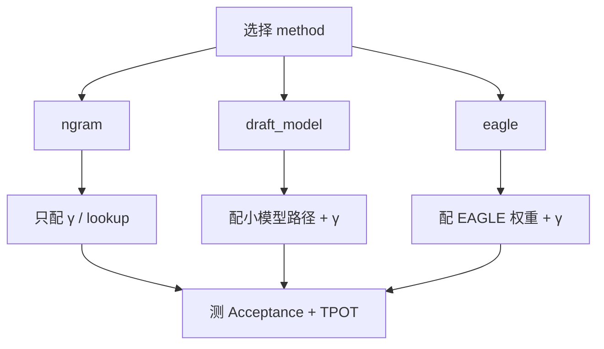

原理（5.1–5.3）与边界（5.4）清楚之后，剩下的是把开关打开、把指标看懂。这一节聚焦 vLLM：如何配置 **ngram**、**EAGLE**、**独立 Draft 模型**三类常见路径，怎样读 Acceptance Rate，以及如何用同一套实验对比"代码生成 vs 开放对话"。文中 CLI/字段名为**配置骨架示意，非某一 commit 的逐字拷贝**；上线前以你安装版本的官方文档为准。

<!-- more -->

## 📑 目录

- [1. 实战前的准备](#1-实战前的准备)
- [2. 配置 ngram 投机](#2-配置-ngram-投机)
- [3. 配置独立 Draft 模型](#3-配置独立-draft-模型)
- [4. 配置 EAGLE](#4-配置-eagle)
- [5. 对比实验：代码 vs 对话](#5-对比实验代码-vs-对话)
- [6. 排错与生产建议](#6-排错与生产建议)
- [7. 代价与权衡](#7-代价与权衡)
- [总结](#-总结)
- [自我检验清单](#-自我检验清单)
- [参考资料](#-参考资料)

---

## 1. 实战前的准备

确认三件事：

1. vLLM 版本支持你要的 speculative method；
2. Target 模型在该版本可正常服务（先不含投机跑通）；
3. 有可复现的评测集：至少 **代码补全 50+ 条** 与 **开放对话 50+ 条**。

观测指标建议同时打点：

| 指标 | 含义 |
|---|---|
| Acceptance Rate / 平均接受长度 $\bar{a}$ | Draft 是否值钱 |
| TPOT / 吞吐 | 用户是否真的更快 |
| GPU 利用率与显存 | Draft 是否挤占 KV |
| 质量抽检 | 防实现偏离或组合回归 |

基线约定（与 5.4 测量协议一致）：

- 同一硬件、同一 vLLM commit、同一 `max_num_seqs` / 显存利用率；
- 先记 **关闭投机** 的 P50/P95 TPOT 与全局 tok/s；
- 再开投机，只改 speculative 相关项。

📌 **关键点**：没有 Acceptance Rate 的投机上线，等于不开仪表飞行。

---

## 2. 配置 ngram 投机

ngram 适合作为第一刀：零额外模型，配置失败成本低（机制见 [5.2](./5.2-Draft模型与N-gram.md)）。

```bash
# 示意骨架（非逐字；字段名请核对当前文档）
vllm serve meta-llama/Llama-3.1-8B-Instruct \
  --speculative-config '{
    "method": "ngram",
    "num_speculative_tokens": 5,
    "prompt_lookup_max": 5
  }'
```

Python 侧概念等价于构造引擎时传入同样的投机配置（API 随版本可能封装为 `speculative_config` 字典）。

调参直觉：

- `num_speculative_tokens`（$\gamma$）：代码场景可试 5–7，对话偏 3–5；
- 查找窗口过大：浪费 CPU 侧匹配；过小：错失长模板。

💡 **提示**：若业务大量"复述 Prompt 中的代码块/条款"，ngram 往往比上一个 7B Draft 更香——额外权重为 0，却可能吃到最高 Acc 段。

---

## 3. 配置独立 Draft 模型

```bash
# 示意骨架（非逐字）
vllm serve meta-llama/Llama-3.1-70B-Instruct \
  --speculative-config '{
    "method": "draft_model",
    "model": "meta-llama/Llama-3.1-8B-Instruct",
    "num_speculative_tokens": 5
  }'
```

检查清单：

- Draft 与 Target **tokenizer 一致**或官方声明兼容；
- 显存：两模型权重 + 两套运行时状态；70B+8B BF16 仅权重就约 $140+16=156\,\mathrm{GB}$ 量级（口径同 [4.1](../第4章-量化/4.1-量化基础.md) / 5.2），必要时降 `gpu_memory_utilization` 或减并发；
- 聊天模板一致，避免草稿第一步就偏移；
- 先在同系列小配对（8B→70B）验证，再换异构组合。

⚠️ **注意**：Draft 太大时，"投机"会退化成"两个慢模型接力"。体量比是第一约束；同卡争用还会抬高 5.1 粗算里的 $T_d$。

---

## 4. 配置 EAGLE

EAGLE 需要 **兼容的 EAGLE 权重/头** 与引擎支持（机制见 [5.3](./5.3-Self-Draft方案.md)），不能只改 method 名硬套普通 Instruct 模型。

```bash
# 示意骨架（非逐字；model 指向文档要求的 EAGLE 权重）
vllm serve <target-model> \
  --speculative-config '{
    "method": "eagle",
    "model": "<eagle-draft-or-heads>",
    "num_speculative_tokens": 5
  }'
```

实战要点：

- 严格使用文档列出的模型配对；
- 关注树宽/深度相关参数（若版本暴露）——过宽可能损吞吐；
- 升级 vLLM 后重新做接受率基线，Kernel 变化会影响墙钟收益。

🔑 **核心概念**：在 vLLM 里，**method 决定草稿机制，model 字段在 draft/EAGLE 路径上指向辅助权重，ngram 路径通常不需要第二模型。**



---

## 5. 对比实验：代码 vs 对话

用同一 Target、同一硬件、同一并发，只改任务集。实验设计：

| 实验 | 配置 | 期望（方向，非承诺） |
|---|---|---|
| A0 | 无投机 | 基线 TPOT/吞吐 |
| A1 | ngram | 代码集 $\bar{a}$ 显著高于对话集 |
| A2 | draft_model | 对话集可能优于 ngram，但吃显存 |
| A3 | eagle（若可得） | 综合接受率更强，依赖专用权重 |

教学示意记录表（**虚构但数量级合理的数字**，用于练习读表；前提：单卡、中等并发、8B 级 Target、温度 0.7；**勿当作公开 benchmark**）：

| 任务 | 方法 | Acc. Rate | $\bar{a}$ | P95 TPOT vs A0 | 备注 |
|---|---|---|---|---|---|
| 代码补全 | ngram | 0.70 | 2.9 | -35% | 优先保留 |
| 代码补全 | draft | 0.68 | 2.7 | -28% | 显存更贵，未必更优 |
| 开放对话 | ngram | 0.25 | 1.2 | +5%（变差） | 路由关闭 |
| 开放对话 | draft/EAGLE | 0.42 | 1.8 | -8% | 算总账后再定 |

取舍句：若代码：对话流量 = 7:3，全局默认 ngram 可能仍净赚；若比例倒转，**按路由启用**几乎总是优于全局统一配置——不要用代码集的 -35% TPOT 说服自己"对话也该开"。

📌 **关键点**：对照实验的价值在于**分桶决策**，不在于得到一个能写进海报的单一加速比。

---

## 6. 排错与生产建议

常见问题：

1. **启动报错找不到 speculative 配置**：版本过旧或字段名变更 → 查当前文档；
2. **能跑但更慢**：$\gamma$ 过大、Draft 太重、或高并发已 Compute Bound → 降 $\gamma$/换 ngram/按路由关闭（机制见 [5.4](./5.4-收益边界与限制.md)）；
3. **接受率异常低**：模板不一致、量化组合不当、任务高熵 → 先修配对再谈算法；
4. **质量疑似漂移**：做同种子开关对比，排查实现或采样配置不一致。

生产建议：

- 把 Acceptance Rate、$\bar{a}$、P95 TPOT、全局 tok/s 纳入看板；
- 灰度：先 5% 流量，分代码/对话桶看；
- 与第 4 章量化组合时，走 5.4 的叠加回归；
- 保留一键关闭投机的配置开关（配置热更新能力视版本而定，至少要能快速滚版本）。

```python
# 评测伪代码（非 vLLM 内部 API）
# baseline = serve(spec=None)
# treatment = serve(spec=ngram_cfg)
# assert same_seed_outputs_match_distribution_tests(...)
# report(accept_rate, mean_accept_len, p95_tpot, global_tok_s)
```

与调度的交接：投机使单请求每步消耗更多 Token 预算时，可能改变同批其它请求的推进节奏——读日志时结合 [3.4](../第3章-深入vLLM/3.4-调度器源码导读.md) 的 Token Budget 视角，避免把批内抖动误判成模型退化。

---

## 7. 代价与权衡

| 选择 | 收益 | 代价 / 不适用 |
|---|---|---|
| 先上 ngram | 失败成本低，结构流量 Acc 高 | 开放对话常无效甚至变慢 |
| 上 draft_model | 通用 Acc 潜力 | 显存与 $T_d$ 上升，挤占 KV |
| 上 EAGLE | 更高 Self-Draft 潜力 | 绑定专用权重与引擎版本 |
| 全局统一 $\gamma$ | 配置简单 | 分桶最优 $\gamma$ 不同，易两边不讨好 |
| 路由化投机 | ROI 高 | 要分类器/业务标签与分桶监控 |

适用：已完成 5.4 边界判断、有分场景评测集、能灰度与回滚的环境。  
若连无投机基线都跑不稳（OOM、频繁抢占），先回到容量与量化章节，而不是叠加 speculative_config。

---

## 📝 总结

- vLLM 投机实战三条主路：ngram、独立 Draft 模型、EAGLE（需专用权重）；CLI 以当前文档为准。
- 先跑通无投机基线，再开投机，并始终监控 Acceptance Rate、$\bar{a}$ 与 TPOT。
- ngram 是低成本首选；Draft/EAGLE 用显存与运维换更高通用接受率。
- 代码集与对话集必须分开测；路由化启用通常更优。
- 生产要具备灰度、看板与一键关闭能力，并与量化组合回归。

## 🎯 自我检验清单

- 能写出 ngram 与 draft_model 的配置骨架，并解释关键字段
- 能说明 EAGLE 为何不能随意用普通小模型冒充
- 能设计代码 vs 对话的对照表，并能根据示意数字做去留决策
- 能列出至少三种"能跑但更慢"的排查方向
- 能给出生产灰度与监控的最小方案
- 能说明投机与 Token Budget / 批调度可能如何互相影响

## 📚 参考资料

- [vLLM — Speculative Decoding](https://docs.vllm.ai/en/latest/features/speculative_decoding.html)
- [vLLM — Engine Arguments](https://docs.vllm.ai/en/latest/configuration/engine_args.html)
- [EAGLE 项目主页/论文入口](https://arxiv.org/abs/2401.15077)
- [Medusa 论文](https://arxiv.org/abs/2401.10774)
- [Leviathan et al., Speculative Decoding](https://arxiv.org/abs/2211.17192)
- [本模块 5.4 收益边界与限制](./5.4-收益边界与限制.md)
- [本模块 3.4 调度器源码导读](../第3章-深入vLLM/3.4-调度器源码导读.md)
- [本模块 4.1 量化基础](../第4章-量化/4.1-量化基础.md)
