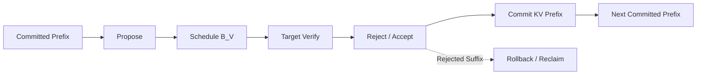

“实战”不应等同于记住一组启动参数。
投机算法进入推理引擎后，真正困难的是让调度、模型执行、采样约束、KV Cache 和请求状态共同遵守同一提交边界。

本节以 vLLM v0.27.1 为实现坐标，讨论算法怎样映射成可靠运行时。
版本号只约束实现事实；5.1 的正确性不变量与总览的成本变量不随接口名称改变。
本节不提供 CLI、API、压测脚本、参数大全或源码文件清单。

<!-- more -->
## 📑 本节导航
- [1. 从算法轮次到运行时事务](#1-从算法轮次到运行时事务)
- [2. Scheduler 怎样看待 Proposal 与 Verify](#2-scheduler-怎样看待-proposal-与-verify)
- [3. 一轮数据怎样流过 vLLM](#3-一轮数据怎样流过-vllm)
- [4. 候选 KV 的所有权](#4-候选-kv-的所有权)
- [5. Accepted Prefix 提交与 Rejected Suffix 回收](#5-accepted-prefix-提交与-rejected-suffix-回收)
- [6. 采样、Grammar 与 Logit Processor 顺序](#6-采样grammar-与-logit-processor-顺序)
- [7. Batch 内不同请求怎样共存](#7-batch-内不同请求怎样共存)
- [8. 并行执行必须同步什么](#8-并行执行必须同步什么)
- [9. 图执行与动态 Shape](#9-图执行与动态-shape)
- [10. 回退为什么也要保持事务性](#10-回退为什么也要保持事务性)
- [11. 可观测性：既看接受，也看系统代价](#11-可观测性既看接受也看系统代价)
- [12. 统一算例的一轮运行时账本](#12-统一算例的一轮运行时账本)
- [13. 正确性与故障检查](#13-正确性与故障检查)
- [14. v0.27.1 的版本边界](#14-v0271-的版本边界)
- [总结](#总结)
- [自我检验](#自我检验)
- [参考资料](#参考资料)
## 1. 从算法轮次到运行时事务
5.1 的一轮只有三步：Proposal、Target Verify、Commit。
运行时必须把它展开为一个带暂存状态的事务：

```text
读取已确认前缀
→ 产生候选
→ 为候选预留执行与 KV 空间
→ Target 计算候选位置
→ 应用采样语义并逐位验收
→ 提交 accepted prefix 与校正/bonus Token
→ 撤销 rejected suffix
→ 从新的已确认边界开始下一轮
```
事务开始时，请求有一个稳定的已确认长度。
事务中间可能计算 $K$ 个甚至更多树节点，但这些位置只是“已计算”，不等于“已提交”。
事务结束后，输出 Token、逻辑长度、采样历史、grammar 状态与可复用 KV 必须停在同一个边界。
这给出最核心的运行时不变量：
> 任意时刻可对外观察的请求前缀，只能由已经通过 Target 语义的 Token 组成；候选计算不能提前泄漏成已提交状态。
运行时因此至少要区分三种数量：

- 已提交 Token 数；
- Target 已计算但仍可能回滚的候选位置数；
- 下一轮待调度的 Proposal 数。
若用一个“当前长度”同时表示三者，拒绝、取消和异步执行很容易破坏状态。
## 2. Scheduler 怎样看待 Proposal 与 Verify
vLLM v0.27.1 的 Scheduler 不需要把请求永久划分成“Prefill 请求”或“Decode 请求”。
它更一般地比较：

```text
请求希望拥有的 Token 状态
与
已经完成模型计算的 Token 状态
```
普通 Decode 的差距通常是一个位置。
投机请求把待验证候选临时加入希望计算的范围，差距可以达到 $K$。
Scheduler 再按全局 Token Budget 决定本轮实际调度多少位置。

这种表示有三个好处：

1. Proposal 可以是变长的，不要求所有请求都拥有相同 $K$。
2. 候选可以与 Chunked Prefill、普通 Decode 一起竞争统一预算。
3. 若预算不足，Scheduler 可以只容纳候选前缀，而不是假装整段都已执行。
对应总览变量，Scheduler 真正放入 Target 验证批次的是：

$$B_V=\text{本轮所有请求实际调度的候选位置总数}$$
固定单链且预算充足时可近似 $B_V\approx BK$。
但请求提前结束、Proposal 为空、grammar 截断、树节点和预算裁剪都会让等式不成立。

候选进入调度账本时仍未被接受。
Scheduler 只承诺为这些位置安排 Target 计算与 KV 空间，不承诺它们成为输出。
## 3. 一轮数据怎样流过 vLLM
以 v0.27.1 的整体职责划分，一轮可以理解为六个阶段。
### 3.1 形成 Proposal
Proposer 根据当前已确认前缀产生候选 Token。
若标准随机路径需要 Proposal 概率，候选与相应 $q$ 必须保持位置对应关系。
若没有候选，请求可以在本轮退化为普通 Target Decode。
### 3.2 进入调度
候选 ID 被附着到请求的暂存状态。
Scheduler 结合 Token Budget、KV 可用空间和其他请求，决定本轮实际验证多少候选。
未被调度的候选不能被当成已经验证。
### 3.3 构造 Verify Batch
运行时把普通 Decode、变长候选和可能的其他工作压成模型可执行形状。
线性 Proposal 需要正确 position；候选树还需要 parent 与祖先可见性。
每个请求在 batch 中拥有自己的长度、采样元数据和候选边界。
### 3.4 Target 前向
Target 在候选输入上前向，产生与各候选验收位置及“全接受后的 bonus 决策”对齐的 logits，并为实际输入位置写入新 K/V。
这些 K/V 先属于本轮候选事务，不因前向完成而自动成为稳定历史。
### 3.5 验收与采样
运行时构造有效 $p_T$，按请求的 Greedy 或随机语义验证候选。
结果是一段 accepted prefix；若未在其中触发 EOS/stop 或输出长度上限，再加首次拒绝处的校正 Token；若全部接受，则加 bonus Token。
### 3.6 更新请求
输出处理把最终 Token 列表交给请求状态。
已接受位置保留，拒绝数量用于回退已计算长度，后续 Proposal 被清空或重建。
下一轮只能从更新后的已确认前缀继续。


## 4. 候选 KV 的所有权
KV Cache 的难点不是“是否算过”，而是“算过的状态能否被下一轮当作真实历史”。

运行时可以把每个请求的 KV 逻辑上分成：

```text
稳定区：已确认前缀的 KV
暂存区：本轮候选节点的 KV
空闲区：尚未分配或已回收 slot
```
稳定区属于请求的可复用历史。
暂存区也可能使用请求已分配的 paged blocks，但其逻辑所有权受本轮提交结果约束。
物理 block 已分配，不代表 block 中每个候选位置都已提交。
### 4.1 线性候选
线性候选的 K/V 按候选顺序写入。
若接受前 $A$ 个 Draft Token，只有对应 accepted prefix 的候选状态有机会保留。
建立在首次拒绝 Token 及其后缀上的候选 K/V 不能成为下一轮祖先。
### 4.2 候选树
树中每个节点都有自己的新增 K/V，但多个节点共享稳定历史。
最终只会选中一条根到节点的路径。
兄弟分支即使与 accepted path 位于同一个物理 buffer，也必须在逻辑上失效。
### 4.3 Block 粒度与逻辑长度
Paged KV 按 block 管理，提交边界却可能落在 block 中间。
因此回滚不一定表现为“释放整个最后 block”。
运行时可以保留含 accepted prefix 的部分 block，同时把逻辑长度截到提交边界；完全位于后缀的 block 才能回到空闲池。
这也是为什么只检查显存是否下降不足以验证回滚正确。
真正要检查的是下一轮 Attention 能否只看到稳定区与正确 accepted path。
## 5. Accepted Prefix 提交与 Rejected Suffix 回收
设某请求本轮调度 $K$ 个线性候选，验收得到 $A$ 个 Draft Token。
若 accepted prefix 不触发 EOS/stop 且剩余输出配额至少为 $K+1$，最终提交长度遵守：

$$L=A+1$$
终止轮必须按实际提交长度更新状态，此时可能有 $L\le A+1$。
状态更新需要同时处理五个对象。
### 5.1 输出 Token
非终止内轮把 $A$ 个 accepted Draft Token 和一个校正/bonus Token 加入请求输出；终止轮只提交到实际终止边界。
不能把完整 Proposal 先写入对外输出再删除，因为流式消费者可能已经看到错误后缀。
### 5.2 已计算长度
Target 可能为全部候选完成前向。
首次拒绝后，运行时要把“已计算长度”回退被拒候选数，使它重新与有效前缀一致。
v0.27.1 在调度输出处理阶段显式根据 proposed、accepted 与 rejected 数量完成这类回退。
### 5.3 KV 可见范围
accepted prefix 对应的候选 K/V 保留。
校正 Token 是否已有可直接复用的 K/V，取决于验证布局；运行时必须按实际 logits 与输入位置关系处理，不能仅凭 Token 已采出就假设状态存在。
rejected suffix 的 K/V 从后续 block table 与逻辑长度中排除。
### 5.4 Proposer 状态
独立 Draft、EAGLE 或其他有状态 Proposer 也必须对齐到最终提交前缀。
如果 Draft 在错误候选上滚动到深处，那部分轻量状态同样不能跨轮复用。
### 5.5 请求控制状态
EOS、stop 条件、最大输出长度、流式输出序号与取消状态都应基于提交 Token 更新。
被拒候选不能提前触发“请求完成”，也不能消耗永久输出配额。
Commit 不是单纯复制 Token ID，而是让这五类状态原子地移动到同一逻辑位置。
## 6. 采样、Grammar 与 Logit Processor 顺序
5.1 的 $p_T$ 指实际采样使用的有效 Target 分布。
运行时必须先构造这个分布，再执行接受比例或 Greedy 比较。

逻辑顺序可以写成：

```text
已确认历史与当前候选祖先
→ Target logits
→ 当前位置允许的 Token / grammar mask
→ 依赖历史的 logit processor 与 penalty
→ temperature 等缩放
→ min-p、top-k、top-p 等随机采样约束
→ 有效 p_T
→ 接受/拒绝与 residual correction
→ Commit
→ 推进 grammar 与请求历史
```
具体 processor 的内部先后由版本定义，但两个边界不可改变：

1. 验收使用的 $p_T$ 必须与该位置普通 Target 采样语义一致。
2. 只有最终提交 Token 才能永久推进 grammar 和历史状态。
### 6.1 Grammar 先约束候选可行性
Structured Output 的 grammar 状态由已确认 Token 前缀决定。
对候选链，第 $i$ 位的允许集合还依赖前 $i-1$ 个候选祖先。
若某候选在当前 grammar 状态下非法，它及依赖它的后缀都不能成为合法路径。

vLLM v0.27.1 会在候选进入后续调度时校验 structured-output 约束，并对无效候选进行截断或占位处理。
这减少无意义 Verify，但不能替代 Target 概率验收。
### 6.2 History-dependent Processor 必须看对前缀
repetition、frequency、presence penalty，bad words 和自定义 processor 可能依赖此前 Token。
为候选位置 $i$ 计算 logits 时，历史应是：

$$\text{committed history}+y_{<i}$$
不能让第 $i$ 位看到兄弟分支，也不能忽略已接受候选祖先。
v0.27.1 的投机采样路径会把候选前缀纳入相关历史处理，再构造 Target 的有效 logits。
### 6.3 随机约束必须进入 p 与 q 的定义
temperature、top-k 和 top-p 会改变归一化概率。
标准随机验收中的 $p_T/q$ 必须对应实际 Proposal 法则与实际 Target 法则。
若 $q$ 是变换前分布而候选来自变换后分布，严格证明不再适用。
### 6.4 Bonus Token 也走普通采样语义
全接受时的 bonus Token 来自 Target。
它应使用该位置正常的 grammar、processor 与采样约束，而不是把未经处理的 argmax 当作 bonus。
## 7. Batch 内不同请求怎样共存
真实 batch 可以同时包含：

- 没有 Proposal 的普通 Decode；
- 只提出一个 Token 的请求；
- 提出到最大深度 $K$ 的请求；
- 被 grammar 截短的请求；
- 候选树节点数不同的请求；
- 正在做 Chunked Prefill 的请求。

运行时通常把变长请求压成紧凑表示，并保留每个请求的边界索引。
Target logits、Draft 概率、候选 ID 和采样结果都必须使用同一边界映射。

若请求 $r$ 实际拥有 $K_r$ 个线性候选，则：

$$B_V\approx\sum_{r=1}^{B}K_r$$
树式候选时，应把 $K_r$ 换成该请求实际验证的节点数，但最大路径深度仍由统一变量 $K$ 表示。
### 7.1 Padding 不能成为有效 Token
为图 shape 或对齐加入的占位值必须在验收与输出阶段明确标为无效。
它不能参与 $q$、不能被提交，也不能永久推进 grammar。
### 7.2 某个请求拒绝不应阻塞全 batch
每个请求拥有独立的首次拒绝位置与 $L$。
一个请求只接受零个 Draft Token，不应迫使其他请求丢弃自己的合法 accepted prefix。
### 7.3 提前 EOS
若某请求在本轮提交段中遇到 EOS，EOS 之后的候选与 bonus 都不能对外出现。
对应 KV、长度与流式输出也必须停在 EOS 边界。
## 8. 并行执行必须同步什么
Target 可能使用 Tensor Parallel、Data Parallel、Pipeline Parallel 或 Expert Parallel。
Proposal 模块也可能与 Target 使用不同并行度。

无论具体组合如何，所有参与同一请求的执行单元必须一致知道：

- 实际 $B_V$ 与每请求候选边界；
- 候选 Token ID 与位置；
- Proposal 概率或验证所需信息；
- 每个请求 accepted 数量；
- 校正/bonus Token；
- 最终提交长度与 KV 回退长度。
### 8.1 Tensor Parallel
Target logits 常分布在多个 rank 上。
Greedy 需要一致的全局选择，随机验收需要一致的候选概率与随机状态。
若各 rank 对 accepted length 判断不同，下一轮 block table 和 collective 路径就会分叉。
### 8.2 Data Parallel
各副本通常独立服务请求，但动态深度策略仍要避免让同一 collective 组进入不同执行分支。
v0.27.1 中某些动态 speculative 组合存在明确并行限制，不能从一种方法的支持推断全部方法都支持。
### 8.3 Pipeline 与 Expert Parallel
Pipeline 需要让候选 shape 和提交结果跨 stage 对齐。
MoE Verify 会让被拒候选也参与专家路由；其 all-to-all 成本属于 $t_V$ 或 $t_O$，不会因最终未提交而消失。
并行兼容不是“能加载模型”这一项检查，而是 proposal、verify、sample、commit 四个阶段都能保持相同控制流。
## 9. 图执行与动态 Shape
CUDA Graph 一类图执行希望输入 shape 和内存地址稳定。
投机运行时却天然包含变长维度：

- 当前 $B$；
- 每请求实际候选数；
- 树节点数与父子布局；
- grammar 截断长度；
- 混合 Prefill/Decode 的 Token 数。
固定 $K$、固定树形和 shape bucket 更容易复用已捕获图。
动态 Proposal 可能需要 padding 到某个 bucket，或落到 eager 执行。

二者都有成本：

- Padding 增加 $B_V$，让 Target 计算无效位置；
- Eager 避开 padding，却失去图启动与内存规划收益；
- 捕获过多 shape 会占用额外显存；
- 图命中率下降会让 $t_O$ 抖动。
因此图执行优化不能只看 kernel 是否被 capture。
应比较实际 $B_V$、无效 padding、图命中与单位提交 Token 成本。

图未命中通常是执行路径回退，不代表可以放松采样正确性。
无论 graph 还是 eager，输出合同必须相同。
## 10. 回退为什么也要保持事务性
可靠运行时必须允许投机不可用或不划算时回到普通 Decode。
常见触发包括：

- Proposer 没有返回候选；
- 当前 $B$ 过大，动态策略选择 $K=0$；
- grammar 在第一位就截断候选；
- 当前显存不足以安全容纳候选；
- 某个模型、并行或图 shape 不支持该投机路径；
- 近期 $s_i$ 与单位提交成本持续退化。
安全回退应发生在稳定提交边界。
请求先拥有一致的输出、长度、grammar、RNG 与 KV 状态，再由普通 Target 产生下一 Token。
### 10.1 不能在半轮中随意重采
如果随机验收已经消费 RNG，并产生部分 accepted Token，再简单重跑普通 Decode，可能改变采样法则或重复输出。
运行时要么完成当前事务，要么恢复到事务开始前的完整状态，包括随机状态。
### 10.2 初始化失败应明确失败
模型权重、词表或结构不兼容时，静默切到近似 Proposal 会隐藏正确性问题。
安全策略是明确拒绝不支持组合，或在尚未开始请求前禁用投机。
### 10.3 性能回退与语义回退不同
Graph 退到 eager 仍可执行同一严格算法，属于性能路径变化。
Speculative 退到普通 Target Decode 则改变执行策略，但不应改变输出语义。
近似验收退到严格验收还涉及质量合同，应由显式策略控制。
## 11. 可观测性：既看接受，也看系统代价
只记录 tokens/s 无法解释投机运行时。
可观测性应让总览成本账中的每一项都能被近似归因。
### 11.1 Proposal 质量
至少记录：

- Draft 轮次数；
- 实际提出 Token 数；
- accepted Draft Token 数；
- 每个位置的存活计数；
- 空 Proposal、grammar 截断和回退次数。
由此可恢复：

$$\mathbb E[A]=\frac{\text{accepted Draft Token}}{\text{Draft 轮次}},\qquad \mathrm{AR}=\frac{\mathbb E[A]}{K}$$
包含终止轮时，实际提交长度必须独立统计：
$$\mathbb E[L_{\mathrm{actual}}]=\frac{\text{实际提交 Token}}{\text{Draft 轮次}}$$
只有筛选到不触发 EOS/stop 且剩余输出配额充足的非终止内轮后，才有 $\mathbb E[L]=1+\mathbb E[A]$。
逐位置计数除以轮次数，才得到总览中的 $s_i$。
实际提出 Token 数用于识别变长 Proposal，不能在不说明口径时替代统一定义中的最大深度 $K$。
### 11.2 轮次成本
分别观察 $t_D$、$t_V$ 与 $t_O$，而不是只看总请求时间。
$t_O$ 中还应能归因调度、采样、mask、通信与 KV 状态处理。
### 11.3 验证形状
记录当前 $B$、$C$、$K$ 与实际 $B_V$。
否则无法判断变慢来自接受率下降，还是候选树/padding 让 Verify 变宽。
### 11.4 服务结果
同时观察 TTFT、TPOT、吞吐、Goodput、显存峰值、KV 使用和最大稳定并发。
低并发 TPOT 改善不能替代高并发 SLO 数据。
### 11.5 正确性信号
记录 Greedy 基线差异、非法 grammar Token、回滚长度异常、EOS 后输出、NaN/Inf 与 fallback 原因。
这些信号应与模型 revision、运行时版本和 Proposal 类型关联。
## 12. 统一算例的一轮运行时账本
沿用全章教学点：

$$B=1,\quad C=\text{当前已确认上下文},\quad K=4$$
该账本只表示非终止内轮，假设剩余输出配额至少为 $K+1$。
单链候选使：

$$B_V\approx BK=4$$
逐位置存活率为：

$$(s_1,s_2,s_3,s_4)=(0.80,0.60,0.40,0.20)$$
所以：

$$\mathbb E[A]=2,\quad \mathbb E[L]=3$$
运行时一轮可按以下账本理解：

| 阶段 | 状态变化 | 成本 |
|---|---|---:|
| Proposal | 产生最多 4 个暂存候选 | $t_D=3\text{ ms}$ |
| Schedule | 为实际候选安排 4 个 Verify 位置 | 计入 $t_O$ |
| Target Verify | 计算候选 logits 与候选 KV | $t_V=12\text{ ms}$ |
| Sample/Commit | 平均接受 2 个 Draft，再提交 1 个校正/bonus | 计入 $t_O$ |
| Rollback | 排除 rejected suffix，保留 accepted prefix | 与调度等合计 $t_O=1\text{ ms}$ |

一轮总成本：

$$t_{\text{round}}=3+12+1=16\text{ ms}$$
普通 Target 生成期望三个 Token 约需：

$$\mathbb E[L]t_T=3\times10=30\text{ ms}$$
得到统一教学估计：

$$S_{\text{decode}}\approx\frac{30}{16}=1.875$$
运行时必须注意，“平均接受 2 个”不是每轮固定在第三位拒绝。
有的轮次 $A=0$，有的轮次 $A=4$；每轮都要根据实际 accepted prefix 更新输出、KV 与 grammar。

若 batch 增大或候选树让 $B_V$ 改变，原 $t_V=12\text{ ms}$ 不再可直接沿用。
这正是可观测性必须把 $B_V$ 与 $t_V$ 放在一起记录的原因。
## 13. 正确性与故障检查
运行时测试应围绕状态不变量，而不是围绕“服务能启动”。
### 13.1 Greedy 等价
在可控数值条件下，普通 Decode 与投机 Decode 应提交相同 Token ID。
若首次差异总出现在 block 边界、特定 batch shape 或 grammar 位置，应优先检查 position、mask、KV 回滚和 processor 历史。
### 13.2 随机分布
随机模式不要求单次文本或固定 seed 的随机数消费完全相同。
应对相同 Prompt 重复采样，比较 Token、长度、EOS 与结构化输出分布是否在统计误差内。
### 13.3 KV 边界
构造 $A=0$、中间拒绝和全接受三类轮次。
下一轮 Target 只能读取最终提交前缀，且 rejected suffix 的内容不能影响 logits。
### 13.4 Grammar 边界
让候选跨越 grammar 状态变化，例如 JSON 键结束、字符串闭合或枚举选择。
检查每个候选位置使用自己的祖先状态，只有提交 Token 永久推进 grammar。
### 13.5 Batch 隔离
同一 batch 放入不同 Proposal 长度、不同采样参数、提前 EOS 和普通 Decode 请求。
一个请求的 accepted length、RNG、processor 历史和候选边界不能污染另一个请求。
### 13.6 取消、抢占与异常
请求在 Proposal 后、Verify 中或 Commit 前取消时，暂存 KV 和 Proposer 状态都应最终释放。
若执行失败后回退，必须从已知稳定边界重试，不能留下半提交输出。
### 13.7 资源边界
覆盖最大 $B$、长 $C$、最大候选树和图 shape 切换。
检查显存峰值、block 回收、回退次数与 P99，而不只检查平均成功路径。
## 14. v0.27.1 的版本边界
以下思想相对稳定：

- Scheduler 必须把候选视为待计算工作，而非已提交输出；
- Target Verify 的实际形状由 $B_V$ 描述；
- 采样必须基于当前位置的有效 Target 分布；
- accepted prefix 与 rejected suffix 必须拥有不同 KV 命运；
- grammar、输出、长度与 Proposer 状态必须在同一 Commit 边界对齐。
以下事实容易随版本变化：

- 支持哪些 Proposal 类型与模型家族；
- 不同并行方式能否组合；
- 动态 $K$、树形与图执行的支持范围；
- 指标名称和导出格式；
- 候选打包、padding 与采样 kernel；
- 某些 processor、structured output 与 logprob 组合。
v0.27.1 中可以观察到的关键实现语义是：

1. Scheduler 用“希望计算的 Token”与“已计算 Token”的差距统一容纳投机、Decode 和 Prefill。
2. 实际候选受 Token Budget 裁剪，并作为本轮 Target 工作进入批次。
3. Structured Output 会在候选流转时校验 Proposal，非法后缀不会被当成正常候选。
4. Target 的 logits processor 与采样约束在拒绝采样前形成有效 logits。
5. 输出处理根据实际拒绝数量回退已计算范围，只让 accepted prefix 留在稳定状态。
这些陈述描述该版本如何承载理论，不承诺未来字段、类名或内部布局不变。
升级时应重新核对正确性不变量、状态边界和成本变量，而不是迁移旧命令。
## 总结
- 可靠投机运行时把一轮视为事务：候选先计算，accepted prefix 才提交，rejected suffix 必须回滚。
- vLLM v0.27.1 的 Scheduler 通过待计算与已计算 Token 的差距容纳变长 Proposal，并让其竞争统一 Token Budget。
- 候选 KV 属于暂存状态；物理 block 已分配不等于其中所有位置已提交。
- Grammar、history-dependent processor、temperature 与 top-k/top-p 必须在验收前共同定义有效 $p_T$。
- 只有提交 Token 才永久推进输出、grammar、长度、Proposer 与 KV 状态。
- 并行 rank、图执行与 fallback 都必须保持相同 accepted length 和语义边界。
- 可观测性要同时覆盖 $s_i$、$\mathbb E[L]$、$B_V$、$t_D/t_V/t_O$、SLO 与资源峰值。
## 自我检验
- [ ] 能把 Proposal、Verify、Commit 解释为一个运行时事务。
- [ ] 能说明 Scheduler 为什么把候选视为待计算 Token，而不是已输出 Token。
- [ ] 能区分物理 KV 分配、逻辑可见和最终提交。
- [ ] 能说明 accepted prefix 与 rejected suffix 分别如何处理。
- [ ] 能给出 grammar、logit processor、采样约束与验收的逻辑顺序。
- [ ] 能解释 batch 内变长候选为何需要边界索引和无效占位。
- [ ] 能区分 graph-to-eager 回退与 speculative-to-baseline 回退。
- [ ] 能用统一算例还原 $B_V=4$、$\mathbb E[L]=3$ 和 $16\text{ ms}$ 轮次账本。
## 参考资料
1. vLLM v0.27.1, [Speculative Decoding](https://docs.vllm.ai/en/v0.27.1/features/speculative_decoding/).
2. vLLM v0.27.1, [EAGLE Draft Models](https://docs.vllm.ai/en/v0.27.1/features/speculative_decoding/eagle/).
3. vLLM v0.27.1, [MTP](https://docs.vllm.ai/en/v0.27.1/features/speculative_decoding/mtp/).
4. vLLM v0.27.1, [Structured Outputs](https://docs.vllm.ai/en/v0.27.1/features/structured_outputs/).
5. Kwon et al., [Efficient Memory Management for Large Language Model Serving with PagedAttention](https://arxiv.org/abs/2309.06180), SOSP 2023.
