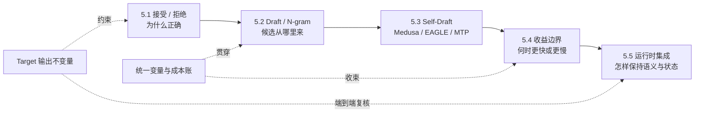

## 📑 本章导航
- [1. 投机解码真正解决什么](#1-投机解码真正解决什么)
- [2. 全章不可破坏的正确性不变量](#2-全章不可破坏的正确性不变量)
- [3. 一张知识图看完本章](#3-一张知识图看完本章)
- [4. 贯穿五节的统一算例](#4-贯穿五节的统一算例)
- [5. 五节标题与知识边界](#5-五节标题与知识边界)
- [6. 阅读时始终追问的六件事](#6-阅读时始终追问的六件事)
- [7. 版本与实现边界](#7-版本与实现边界)
- [8. 学完应具备的能力](#8-学完应具备的能力)
- [总结](#总结)
- [自我检验](#自我检验)
- [参考资料](#参考资料)

---

## 1. 投机解码真正解决什么
给定已确认前缀 $x_{<t}$，Target 必须先选出 $x_t$，才能知道计算 $x_{t+1}$ 时的真实条件：
$$
x_t\sim p_T(\cdot\mid x_{<t}),\qquad
x_{t+1}\sim p_T(\cdot\mid x_{<t},x_t)
$$
KV Cache 避免了重算历史 K/V，却没有消除这条逐 Token 的数据依赖。
低并发 Decode 又常是 memory-bound：一次 Target step 搬运大量权重和历史 KV，最终只确认一个新 Token。

投机解码先用便宜的 Proposer 给出若干候选，再让 Target 在一个验证批次中为多个已知位置并行打分。
它试图减少的是 **Target 位于关键路径上的串行 step 数**，不是取消自回归因果关系，也不保证减少总 FLOPs。
候选错误会带来 Draft、验证、KV 写入与回收等额外工作；候选正确，才可能用一次较宽的验证换掉多次较窄的 Decode。
因此，本章的中心问题不是“能一次猜几个”，而是：
> 怎样在不改变 Target 输出语义的前提下，用更少的 Target 串行轮次完成同一条生成链？

## 2. 全章不可破坏的正确性不变量
**标准随机算法的不变量**：最终序列必须服从用户原本要求的 Target 分布，而不是 Draft 分布。
若当前有效 Target 分布为 $p_T$，Proposal 分布为 $q$，候选 $y$ 的经典接受概率为：
$$
a(y)=\min\left(1,\frac{p_T(y)}{q(y)}\right)
$$
首次拒绝后不能直接“让 Target 随便重采一次”，而要从残差分布校正：
$$
r(v)=\frac{[p_T(v)-q(v)]_+}{\sum_u[p_T(u)-q(u)]_+}
$$
只有 Proposal 概率可得、接受/拒绝顺序正确、残差采样正确，并且采样变换在算法定义的位置一致生效，分布守恒才成立。
temperature、top-k/top-p、grammar、vocabulary mask 与其他 logit processor 都属于这个正确性边界。

**Greedy 路径的不变量**：每个已提交 Token 都必须等于 Target 在同一已确认前缀上的选择。
实现可以提交 Draft 与 Target argmax 逐位一致的最长前缀；遇到首个不一致位置，必须回到 Target 的选择。
“概率很接近”“最终让 Target 看过”或“文本看起来一样”都不足以证明 greedy 结果不变。
后续各节可以改变 Proposal 的来源和形状，但不能暗中把严格算法换成近似算法；若允许近似，必须单独声明质量合同。
## 3. 一张知识图看完本章

实线表示理论递进：先证明能正确前进，再研究谁来提案，继而比较结构，最后进入系统边界与运行时。
虚线表示两条贯穿约束：所有方法都受 Target 语义约束，所有“加速”都要回到同一组变量和成本账。
## 4. 贯穿五节的统一算例
后续 5.1～5.5 都沿用同一组符号，不在每节重新发明指标：
- $B$：当前活跃请求数；$C$：已确认上下文长度。
- $t_T(B,C)$：普通模式下一次 Target 单 Token Decode step 的时间。
- $K$：一次提议的最大未来深度；在线性候选中就是 Draft Token 数，在候选树中是根到叶路径长度。
- $t_D(K,B,C)$：生成这些候选的 Draft/Proposal 总成本。
- $A\in[0,K]$：一轮中被接受的 Draft Token 数，$s_i=P(A\ge i)$ 是第 $i$ 位存活率。
- $\mathrm{AR}=\mathbb E[A]/K$：平均候选接受率；它不能替代位置存活率向量 $(s_1,\ldots,s_K)$。
- $L$：非终止内轮中 $L=A+1$，额外的 1 是拒绝后的校正 Token 或全接受后的 bonus Token；若 accepted prefix 已触发 EOS/stop，或剩余 `max_tokens` 不足，实际提交长度满足 $L\le A+1$。
- $B_V$：Target 本轮打包验证的候选位置总数；固定深度的单链近似为 $BK$，候选树、padding 与 mask 会改变它。
- $t_V(B_V,C)$：Target 验证成本；它通常不等于 $K\,t_T$，也不会天然接近一次 $t_T$。
- $t_O$：采样、调度、mask、通信、候选 KV 提交与回收等其余轮次成本。

统一教学数值设为：$B=1$、$t_T=10\text{ ms}$、$K=4$、$t_D=3\text{ ms}$、$t_V=12\text{ ms}$、$t_O=1\text{ ms}$。
该算例只统计不触发 EOS/stop 且剩余输出配额至少为 $K+1$ 的非终止内轮，因此可以使用 $L=A+1$。
若位置存活率为 $(0.80,0.60,0.40,0.20)$，则：
$$
\mathbb E[A]=\sum_{i=1}^{K}s_i=2.0,\qquad
\mathrm{AR}=0.50,\qquad
\mathbb E[L]=1+\mathbb E[A]=3.0
$$
投机轮次成本为 $t_{\text{round}}=t_D+t_V+t_O=16\text{ ms}$；普通 Target 生成同样 3 个 Token 约需 $30\text{ ms}$。
这个教学点上的 Decode 加速估计为：
$$
S_{\text{decode}}\approx
\frac{\mathbb E[L]\,t_T}{t_D+t_V+t_O}
=\frac{30}{16}=1.875
$$
这不是性能承诺。改变 batch、上下文、Proposal、验证形状或显存压力，等式中的每一项都可能变化。
## 5. 五节标题与知识边界
### [5.1 Speculative Decoding 核心原理](/AIInfraGuide/inference/模块四-推理优化/第5章-speculative-decoding/51-核心原理)
承诺：只负责自回归串行瓶颈、严格 speculative sampling、greedy 等价路径，以及 $A$、$L$ 与正确性证明。
边界：不比较具体 Proposer，不提前讨论运行时参数或性能排名。
### [5.2 Draft Model、N-gram 与 Suffix](/AIInfraGuide/inference/模块四-推理优化/第5章-speculative-decoding/52-draft模型与n-gram)
承诺：只负责 Proposal 层，比较独立 Draft、上下文检索和后缀复用怎样交换 $t_D$、存活率、词表兼容与额外显存。
边界：不重复接受/拒绝证明，不展开 Self-Draft 内部结构，也不做部署步骤。
### [5.3 Self-Draft：Medusa、EAGLE 与 MTP](/AIInfraGuide/inference/模块四-推理优化/第5章-speculative-decoding/53-self-draft方案)
承诺：只负责结构层，解释多头预测、特征级自回归、动态候选树和原生多 Token 预测怎样形成候选及验证形状。
边界：不重讲 Proposal 通用选型，不把论文结构直接等同于某个框架开关。
### [5.4 收益边界与系统交互](/AIInfraGuide/inference/模块四-推理优化/第5章-speculative-decoding/54-收益边界与限制)
承诺：只负责成本与服务层，把 $t_T,t_D,t_V,t_O,K,B_V$ 接到 Roofline、KV、显存、batch、并发和 SLO。
边界：不再介绍算法家族，不用单请求接受率代替吞吐、尾延迟或 Goodput。
### [5.5 vLLM v0.27.1 投机解码实战](/AIInfraGuide/inference/模块四-推理优化/第5章-speculative-decoding/55-vllm投机解码实战)
承诺：只负责运行时集成层，用版本化实现说明候选打包、Scheduler、采样语义、KV 提交/回收、可观测性与安全回退。
边界：vLLM 只作实现坐标；本节不重复论文推导，也不把 CLI、API、安装或压测流程当作知识主线。
## 6. 阅读时始终追问的六件事
1. **正确性**：最终保持的是完整 Target 分布、Target greedy 路径，还是另行声明的近似质量合同？
2. **Proposal 质量**：逐位置存活率是多少，提升接受率付出了多少 $t_D$ 与训练成本？
3. **验证并行度**：本轮 $B_V$ 多大，Target 是摊薄权重读取，还是被计算、Attention 或 padding 限制？
4. **额外显存**：Draft 权重、候选 KV、树节点、workspace 会挤掉多少可服务请求和上下文？
5. **Batch 与并发**：候选 Token 是否占用本可推进其他请求的 Token Budget，负载升高后收益是否反转？
6. **SLO**：优化改善的是 TPOT、吞吐还是成本；TTFT、P99、Goodput 和回退路径是否仍满足合同？
## 7. 版本与实现边界
自回归依赖、拒绝采样、残差校正、greedy 等价条件和成本分解是相对稳定的算法理论。
vLLM 与 SGLang 的配置字段、支持方法、候选布局、指标名、并行限制和默认行为会快速变化。
因此，5.5 中的实现陈述必须绑定明确版本或源码 tag；示例只能证明该版本怎样映射理论，不能证明接口长期稳定。
阅读新版本时，应先复核正确性不变量、统一变量和状态边界，再核对产品文档，而不是迁移旧命令。
本总览只规定后续五节的理论合同，不提供 CLI、API、安装或 benchmark 操作步骤。
## 8. 学完应具备的能力
- 能解释投机解码为何减少 Target 串行 step，却不消除自回归依赖。
- 能分别证明严格随机采样的分布守恒与 greedy 路径等价。
- 能用 $t_T,t_D,t_V,t_O,K,B_V,\mathbb E[A],\mathbb E[L]$ 建立一轮成本账。
- 能按 Proposal 成本、逐位置存活率和显存代价比较 Draft、N-gram 与 Self-Draft。
- 能判断验证从 memory-bound 走向 compute/attention-bound 后，收益为何缩小。
- 能解释候选 KV、Continuous Batching、并发和 SLO 怎样改变单请求结论。
- 能把论文算法映射到特定版本运行时，同时识别稳定理论与易变接口。
## 总结
投机解码用“便宜提案 + Target 并行验证”换取更少的 Target 串行轮次。
它的第一约束是输出语义不变，第二约束才是 $t_D+t_V+t_O<\mathbb E[L]t_T$。
五节将按正确性、Proposal、结构、系统边界和运行时集成逐层推进，并始终复用同一算例与六个问题。
## 自我检验
- [ ] 能说明 KV Cache 为什么没有消除逐 Token 数据依赖。
- [ ] 能写出接受概率与拒绝后的残差分布。
- [ ] 能说明 greedy 模式允许提交哪一段候选。
- [ ] 能区分接受率、期望接受 Draft Token 数和期望提交长度。
- [ ] 能解释为什么 $B_V=BK$ 不等于 Target 仍做 $K$ 次串行 Decode。
- [ ] 能用统一算例算出 $1.875\times$，并列出可能让它失效的系统条件。
- [ ] 能复述五节各自负责的知识层，并指出 vLLM/SGLang 的版本边界。

## 参考资料
- Stern et al., [Blockwise Parallel Decoding for Deep Autoregressive Models](https://arxiv.org/abs/1811.03115), NeurIPS 2018.
- Leviathan et al., [Fast Inference from Transformers via Speculative Decoding](https://arxiv.org/abs/2211.17192), ICML 2023.
- Chen et al., [Accelerating Large Language Model Decoding with Speculative Sampling](https://arxiv.org/abs/2302.01318), 2023.
- Cai et al., [Medusa: Simple LLM Inference Acceleration Framework with Multiple Decoding Heads](https://arxiv.org/abs/2401.10774), ICML 2024.
- Li et al., [EAGLE: Speculative Sampling Requires Rethinking Feature Uncertainty](https://arxiv.org/abs/2401.15077), ICML 2024.
- Li et al., [EAGLE-2: Faster Inference of Language Models with Dynamic Draft Trees](https://arxiv.org/abs/2406.16858), EMNLP 2024.
- Gloeckle et al., [Better & Faster Large Language Models via Multi-token Prediction](https://arxiv.org/abs/2404.19737), 2024.
- [第 1 章：LLM 推理基础](/AIInfraGuide/inference/模块四-推理优化/第1章-llm推理基础/第1章-llm推理基础)
- [第 4 章：量化](/AIInfraGuide/inference/模块四-推理优化/第4章-量化/第4章-量化)

> 本章中的数值仅用于建立量纲；任何收益结论都必须回到目标模型、硬件、版本、workload 与 SLO。