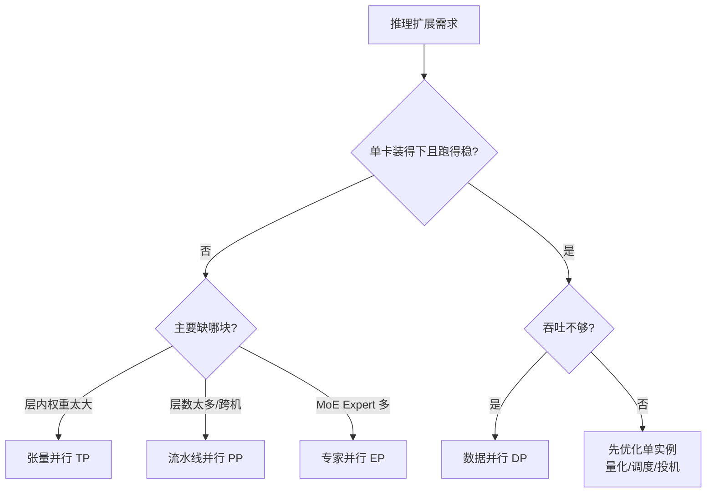

前五章把单实例推理跑通了：PagedAttention 与 Continuous Batching（第 2 章）、vLLM 调度与 KV（第 3 章）、量化（第 4 章）、投机解码（第 5 章）。下一步压力通常只有两类——**装不下**或**撑不住**。训练里你见过的 TP/PP/DP/EP 名字还在，但目标与通信瓶颈都变了。这一节先画并行维度地图，并钉死「何时才上分布式」的决策门槛：单卡先算账，再谈多卡。

<!-- more -->

## 📑 目录

- [1. 为什么推理需要并行](#1-为什么推理需要并行)
- [2. 单卡先算账：上分布式的门槛](#2-单卡先算账上分布式的门槛)
- [3. 训练并行 vs 推理并行](#3-训练并行-vs-推理并行)
- [4. 四类并行策略地图](#4-四类并行策略地图)
- [5. 适用场景对照表](#5-适用场景对照表)
- [6. 组合选型原则](#6-组合选型原则)
- [7. 与延迟指标的关系](#7-与延迟指标的关系)
- [8. 可落地的决策流程](#8-可落地的决策流程)
- [9. 代价与权衡](#9-代价与权衡)
- [总结](#-总结)
- [自我检验清单](#-自我检验清单)
- [参考资料](#-参考资料)

---

## 1. 为什么推理需要并行

推理侧并行通常由两类压力触发：

- **装不下**：权重 + KV Cache + 激活超过单卡显存。70B 级 Dense、数百 B 级 MoE，单卡很难完整放下。
- **跑不快**：单卡吞吐到顶，但业务要更高 QPS、更稳的 TTFT/TPOT，需要横向扩展。

这两类压力对应不同解法：前者偏**模型切分**（TP/PP/EP），后者偏**实例复制**（DP）。混为一谈就会选错刀——最常见的反例是「装不下却只加 DP」，结果是把 OOM 复制多份。

📌 **关键点**：先问清楚你是在解决「**放得下**」还是「**撑得住**」。目标不同，并行策略完全不同。

---

## 2. 单卡先算账：上分布式的门槛

上分布式之前，先在**单卡（或「尽量少卡」）**上把账算清楚。教学示意（**非某集群实测**；单位 GB）：

前提：Dense 70B、BF16 权重、单卡 80 GB；目标并发约 8 条长上下文，KV 粗估按「每请求约 4 GB」量级（口径同第 4 章显存粗算：只作门槛判断，不含激活尖峰）。

| 项 | 粗算 |
|---|---|
| 权重 | $70\times 2 \approx 140\,\mathrm{GB}$ |
| 目标并发 KV | $8\times 4 = 32\,\mathrm{GB}$ |
| 合计相对单卡 | $172\,\mathrm{GB} \gg 80\,\mathrm{GB}$ |

结论很硬：权重一项就已超过单卡，**必须先切模型（TP/PP，MoE 再加 EP）**，而不是先开 DP。

反过来，若量化后权重约 $40\,\mathrm{GB}$、目标 KV 池约 $20\,\mathrm{GB}$，合计 $<80\,\mathrm{GB}$，且单实例 P95 TPOT 已达标、只是 QPS 不够——这时才轮到 **DP**（或服务层多副本）。

取舍句：**能用量化 + 调并发把单实例装稳、延迟达标，就不要为了「看起来更分布式」先上跨节点 PP**；分布式每一轴都在买可扩展性，同时付通信、编排与故障面的账（见 6.5）。

决策门槛（过一条再动下一刀）：

1. **显存门槛**：权重+目标 KV 是否超出单卡？超出 → 切分；未超出 → 先别为装载上 TP/PP。
2. **延迟门槛**：单实例 Decode/Prefill 的 P95 是否已达标？未达标 → 先量化、批大小、投机（第 4–5 章）或机内 TP，而不是先加 DP。
3. **吞吐门槛**：延迟达标但 QPS 不够 → 再 DP。

⚠️ **注意**：门槛判断用的是**目标并发下的 KV**，不是「空载能加载权重」。空载能起、打满即抢占（[3.4](../第3章-深入vLLM/3.4-调度器源码导读.md)），仍算「装不稳」。

---

## 3. 训练并行 vs 推理并行

| 📊 维度 | 训练并行 | 推理并行 |
|---|---|---|
| 优化目标 | 吞吐（samples/s）、收敛正确性 | 显存装载、TTFT、TPOT、有效吞吐 |
| 通信内容 | 前向激活 + 反向梯度 + 参数同步 | 主要是前向中的激活/部分结果聚合 |
| 关键路径 | 反向 AllReduce、Optimizer 状态 | Decode 步内通信、KV 管理、调度 |
| 批次形态 | 大批量、Micro-batch 流水线常见 | Continuous Batching，请求长短不一 |
| 容错关注 | Checkpoint、断点续训 | 请求级 SLO、实例热备、平滑扩缩 |

训练可以容忍更大的通信开销（一步本来就慢）；推理的 Decode 每步只推进约 1 Token，**任何步内同步都会直接打进 TPOT**。所以推理对高带宽低延迟互联（NVLink / NVSwitch）更敏感，跨节点 TP 通常不划算（展开见 [6.2](./6.2-张量并行推理.md)）。

🔑 **核心概念**：**训练并行服务于「算得完、收敛对」；推理并行服务于「装得下、延迟稳、吞吐高」。** 同名策略，工程取舍不同。

---

## 4. 四类并行策略地图



| 轴 | 切什么 | 典型通信 | 优先放哪里 |
|---|---|---|---|
| **TP** | 层内矩阵/头 | AllReduce / AllGather（步内、高频） | 机内 NVLink |
| **PP** | 层段（Stage） | 相邻 Stage 的 P2P 激活 | 可跨节点 |
| **DP** | 整实例复制 | 请求分流（通常无梯度同步） | 跨节点也行 |
| **EP** | MoE Expert 集合 | All-to-All Token 路由 | 尽量高带宽域 |

### 4.1 张量并行（TP）

把**同一层**的大矩阵按行/列切到多张 GPU，前向内部用集合通信拼回结果。优点是单卡显存下降、单请求延迟常改善；代价是步内通信频繁。

### 4.2 流水线并行（PP）

把模型按**层段**切到不同 GPU/节点，激活沿管道向下游传。优点是跨节点扩展相对自然；代价是 Bubble 与调度复杂度（[6.3](./6.3-流水线并行推理.md)）。

### 4.3 数据并行（DP）

复制多份引擎实例，请求分流。优点直观、易线性扩吞吐；**不解决装不下**，还要处理前缀缓存命中与粘性（[6.4](./6.4-数据并行与专家并行.md)）。

### 4.4 专家并行（EP）

针对 MoE：不同 Expert 放不同 GPU，Token 经路由后 All-to-All。优点是摊开 Expert 显存；代价是倾斜与带宽压力。

💡 **提示**：vLLM 常见旋钮是 `tensor_parallel_size`、`pipeline_parallel_size`、`data_parallel_size`，以及 MoE 的 EP 相关配置。先理解语义，再记参数名（实战见 [6.6](./6.6-vLLM分布式部署实战.md)）。

---

## 5. 适用场景对照表

| 策略 | 解决的核心问题 | 典型适用 | 不适合 |
|---|---|---|---|
| **TP** | 单层权重/激活显存、单请求延迟 | 同机多卡、NVLink 充足 | 跨节点大 TP 度 |
| **PP** | 模型太深/太大需跨机切层 | 多节点、机内 TP 已用满 | 极低延迟单请求、Bubble 难填 |
| **DP** | 吞吐不够、实例可复制 | 模型已能单实例放下 | 模型本身装不下 |
| **EP** | MoE Expert 显存与算力分布 | 大 MoE | 稠密模型、Expert 很少 |

⚠️ **注意**：**DP 不能替代 TP/PP。** 70B 装不进一张 80 GB 卡时，再开多少 DP 也没用——每个副本仍然装不下。

---

## 6. 组合选型原则

生产里几乎总是组合。实用顺序：

1. **先让单实例放得下**：优先机内 TP；不够再加 PP 跨节点切层；MoE 再叠加 EP。
2. **再横向扩吞吐**：单实例延迟与显存达标后，用 DP 复制实例。
3. **控制通信域**：TP（以及多数 EP 热路径）尽量落在 NVLink 域内；跨节点留给 PP 的点对点激活，或 DP 的请求分流。
4. **用测量说话**：同一组 GPU，`TP=8` 与 `TP=4 × PP=2` 的 TTFT/TPOT/吞吐可能差一截，必须以目标负载压测为准。

```text
选型口诀（推理）：
  装不下 → 先 TP（机内）→ 再 PP（跨机）→ MoE 加 EP
  撑不住 → 模型已能单实例运行后开 DP
  通信贵 → 缩小跨节点的步内集合通信
  单卡先 → 量化/调度/投机未挖尽前，慎上多机
```

📌 **关键点**：**并行度不是越大越好。** TP 过大可能让通信占比超过计算收益；DP 过大可能打散前缀缓存、抬高尾延迟。

---

## 7. 与延迟指标的关系

把并行策略映射到用户可感指标，避免「吞吐上去了、体验崩了」：

- **TTFT**：受 Prefill 算力与是否跨 Stage/跨节点传激活影响。TP 常加速单次 Prefill；PP 若 Bubble 或段间等待大，TTFT 可能变差。
- **TPOT**：Decode 步内若有频繁 AllReduce（高 TP），互联抖动会直接变成出字抖动。
- **吞吐 / Goodput**：DP 擅长抬 Raw QPS；是否转化为满足 SLO 的 Goodput，取决于负载均衡与尾延迟控制。

与前几章的交接：并行度抬高后，单卡 KV 池变小或通信变重，可能更早触发抢占（[3.4](../第3章-深入vLLM/3.4-调度器源码导读.md)）；量化（第 4 章）往往是「少开一档 TP/PP」的便宜替代。后续 6.2–6.4 展开各轴通信；6.5–6.6 落到 Ray 与 vLLM 验收。

---

## 8. 可落地的决策流程

```text
输入：模型大小、单卡显存、节点拓扑（NVLink/IB）、目标 TTFT/TPOT/QPS
    │
    ├─ 0) 单卡/单实例算账（权重 + 目标并发 KV）
    │     能装且延迟可挖 → 先量化/调度/投机，再谈分布式
    │
    ├─ 1) 仍装不下 → 最小机内 TP → 仍不够加 PP
    │     MoE Expert 爆显存 → 叠加 EP
    │
    ├─ 2) 单实例压测：TTFT/TPOT 是否达标？
    │     否 → 调 TP/PP、量化、批大小，而不是先加 DP
    │     是 → 进入下一步
    │
    └─ 3) 吞吐不够 → 加 DP（或多副本服务），再测 Goodput/前缀命中
```

用两个具体画像练习：

| 画像 | 合理起点 |
|---|---|
| 单机 8×80 GB，Dense 70B，要低 TPOT | `TP=8`，先别跨机；不够再量化或扩机做 DP |
| 两机 8×80 GB，Dense 更大模型，要先跑起来 | `TP=8 × PP=2`；跑稳后再评估是否 `DP` |

⚠️ **注意**：每次分支应以**一次真实压测**结束。并行度表可以写进设计文档，但不能替代 Decode 负载下的 P95 数据。

---

## 9. 代价与权衡

| 选择 | 收益 | 代价 / 不适用 |
|---|---|---|
| 早上跨节点 PP | 更大模型能加载 | Bubble、段间延迟、编排复杂度（6.5） |
| 机内拉满 TP | 显存分摊、常降单请求延迟 | Decode 步内 AllReduce；无 NVLink 时易亏 |
| 先 DP 扩副本 | QPS 近似线性 | 不解决装载；前缀缓存打散 |
| 先量化再并行 | 可能少开一档 TP/PP | 质量回归成本（第 4 章） |

适用：单卡账已算清、拓扑已知、有目标并发下的延迟/吞吐门禁。  
若还在「空载能起、打满即崩」阶段，先回到第 2–3 章的 KV 与调度容量，再谈分布式切分。

---

## 📝 总结

- 推理并行由「**装不下**」和「**撑不住**」驱动，解法不同；上分布式前先做单卡显存+目标并发账。
- 与训练相比，推理更关注 TTFT/TPOT/显存，Decode 步内通信代价极高。
- **TP** 切层内、适合同机；**PP** 切层段、适合跨机；**DP** 复制实例；**EP** 服务 MoE Expert。
- 选型顺序：单卡挖潜 → TP/PP/EP 放得下 → DP 撑得住；严控跨节点步内集合通信。
- 最终以目标负载下的延迟与 Goodput 压测决策，而不是只看理论算力。

## 🎯 自我检验清单

- 能用一句话说清训练并行与推理并行的目标差异
- 能区分「装不下」与「撑不住」分别该优先考虑哪些策略
- 能口述一笔「权重 + 目标 KV vs 单卡显存」的门槛账，并据此决定是否上 TP/PP
- 能简述 TP/PP/DP/EP 各自切分的对象与主要通信模式
- 能解释为什么推理里大跨度跨节点 TP 通常不划算
- 能给出一个 `TP → PP → DP`（及 MoE 时 `EP`）的组合选型顺序
- 能把并行策略与 TTFT/TPOT/吞吐的影响 qualitatively 对应起来
- 能对「单机 70B」与「两机超大 Dense」给出合理的并行度起点

## 📚 参考资料

- [vLLM Distributed Inference and Serving](https://docs.vllm.ai/en/latest/serving/distributed_serving.html)
- [Megatron-LM: Training Multi-Billion Parameter Language Models Using Model Parallelism](https://arxiv.org/abs/1909.08053)
- [vLLM Engine Arguments（tensor/pipeline/data parallel）](https://docs.vllm.ai/en/latest/configuration/engine_args.html)
- [本模块 3.4 调度器源码导读](../第3章-深入vLLM/3.4-调度器源码导读.md)
- [本模块 4.1 量化基础（显存粗算口径）](../第4章-量化/4.1-量化基础.md)
- [本模块 6.2 张量并行推理](./6.2-张量并行推理.md)
