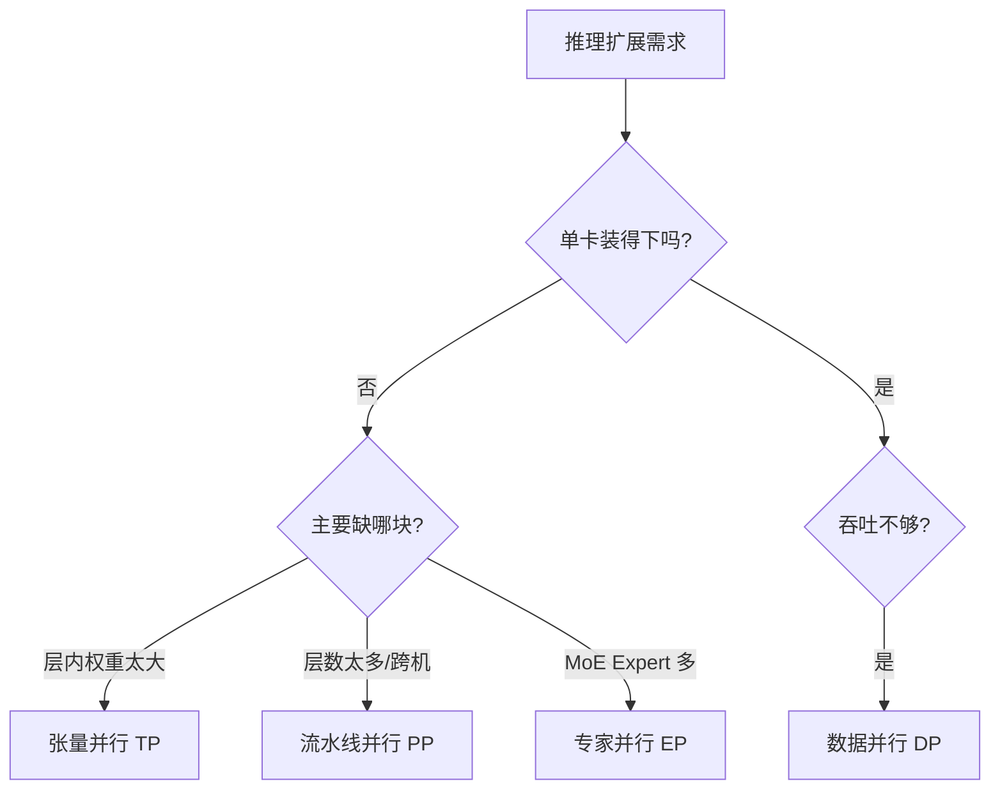

当模型权重装不进单卡、或单卡吞吐撑不住业务峰值时，就必须把推理拆到多卡甚至多机。训练里你已经见过 TP、PP、DP、EP，但**推理并行不是把训练并行原样搬过来**——目标、通信模式、瓶颈位置都变了。这一节先建立总览：推理并行要优化什么、四类策略各自解决什么问题、怎么组合。

<!-- more -->

## 📑 目录

- [1. 为什么推理需要并行](#1-为什么推理需要并行)
- [2. 训练并行 vs 推理并行](#2-训练并行-vs-推理并行)
- [3. 四类并行策略速览](#3-四类并行策略速览)
- [4. 适用场景对照表](#4-适用场景对照表)
- [5. 组合选型原则](#5-组合选型原则)
- [6. 与延迟指标的关系](#6-与延迟指标的关系)
- [7. 一个可落地的决策流程](#7-一个可落地的决策流程)
- [总结](#-总结)
- [自我检验清单](#-自我检验清单)
- [参考资料](#-参考资料)

---

## 1. 为什么推理需要并行

推理侧并行通常由两类压力触发：

- **装不下**：权重 + KV Cache + 激活超过单卡显存。70B 级 Dense 模型、数百 B 级 MoE，单卡很难完整放下。
- **跑不快**：单卡吞吐到顶，但业务要更高 QPS、更稳的 TTFT/TPOT，需要横向扩展。

这两类压力对应不同解法：前者偏**模型切分**（TP/PP/EP），后者偏**实例复制**（DP）。混为一谈就会选错刀。

📌 **关键点**：先问清楚你是在解决"**放得下**"还是"**撑得住**"。目标不同，并行策略完全不同。

---

## 2. 训练并行 vs 推理并行

| 📊 维度 | 训练并行 | 推理并行 |
|---|---|---|
| 优化目标 | 吞吐（samples/s）、收敛正确性 | 显存装载、TTFT、TPOT、有效吞吐 |
| 通信内容 | 前向激活 + 反向梯度 + 参数同步 | 主要是前向中的激活/部分结果聚合 |
| 关键路径 | 反向 AllReduce、Optimizer 状态 | Decode 步内通信、KV 管理、调度 |
| 批次形态 | 大批量、Micro-batch 流水线常见 | Continuous Batching，请求长短不一 |
| 容错关注 | Checkpoint、断点续训 | 请求级 SLO、实例热备、平滑扩缩 |

训练可以容忍更大的通信开销（反正一步本来就慢）；推理的 Decode 每步只算一个 Token，**任何步内同步都会直接打进 TPOT**。所以推理对高带宽低延迟互联（NVLink / NVSwitch）更敏感，跨节点 TP 通常不划算。

🔑 **核心概念**：**训练并行服务于"算得完、收敛对"；推理并行服务于"装得下、延迟稳、吞吐高"。** 同名策略，工程取舍不同。

---

## 3. 四类并行策略速览



### 3.1 张量并行（Tensor Parallel, TP）

把**同一层**的大矩阵按行/列切到多张 GPU，前向内部用 AllReduce / AllGather 拼回结果。优点是单请求延迟往往下降、单卡显存压力下降；代价是步内通信频繁，强依赖机内高速互联。

### 3.2 流水线并行（Pipeline Parallel, PP）

把模型按**层段**切到不同 GPU（或节点），激活沿流水线向下游传递。优点是跨节点扩展相对自然；代价是 Bubble（流水线气泡）和调度复杂度，推理里要用 Micro-batch 等手段填满。

### 3.3 数据并行（Data Parallel, DP）

复制多份完整（或同构）引擎实例，请求分流。优点是实现直观、线性扩吞吐；不解决单实例装不下模型的问题，且要处理好负载均衡与前缀缓存命中率。

### 3.4 专家并行（Expert Parallel, EP）

针对 MoE：不同 Expert 放在不同 GPU，Token 经路由后做 All-to-All。优点是把超大 MoE 的 Expert 显存摊开；代价是路由不均与 All-to-All 带宽压力。

💡 **提示**：vLLM 里常见旋钮是 `tensor_parallel_size`、`pipeline_parallel_size`、`data_parallel_size`，以及 MoE 场景的专家并行相关配置。先理解语义，再记参数名。

---

## 4. 适用场景对照表

| 策略 | 解决的核心问题 | 典型适用 | 不适合 |
|---|---|---|---|
| **TP** | 单层权重/激活显存、单请求延迟 | 同机多卡、NVLink 充足 | 跨节点大 TP 度 |
| **PP** | 模型太深/太大需跨机切层 | 多节点、机内 TP 已用满 | 极低延迟单请求、Bubble 难填满 |
| **DP** | 吞吐不够、实例可复制 | 模型已能单实例放下 | 模型本身装不下 |
| **EP** | MoE Expert 显存与算力分布 | 大 MoE（如 DeepSeek-V3 类） | 稠密模型、Expert 很少 |

⚠️ **注意**：**DP 不能替代 TP/PP。** 如果你的痛点是 70B 装不进一张 80GB 卡，再开多少 DP 也没用——每个副本仍然装不下。

---

## 5. 组合选型原则

生产里几乎总是组合，而不是单选。一个实用顺序：

1. **先让单实例放得下**：优先机内 TP；不够再加 PP 跨节点切层；MoE 再叠加 EP。
2. **再横向扩吞吐**：单实例延迟与显存达标后，用 DP 复制实例。
3. **控制通信域**：TP（以及多数 EP 热路径）尽量落在 NVLink 域内；跨节点留给 PP 的点对点激活传递，或 DP 的无状态请求分流。
4. **用测量说话**：同一组 GPU，`TP=8` 与 `TP=4 × PP=2` 的 TTFT/TPOT/吞吐可能差一截，必须以目标负载压测为准。

```text
选型口诀（推理）：
  装不下 → 先 TP（机内）→ 再 PP（跨机）→ MoE 加 EP
  撑不住 → 模型已能单实例运行后开 DP
  通信贵 → 缩小跨节点的步内集合通信
```

📌 **关键点**：**并行度不是越大越好。** TP 过大可能让通信占比超过计算收益；DP 过大可能让前缀缓存命中变差、调度与路由变复杂。

---

## 6. 与延迟指标的关系

把并行策略映射到用户可感指标，能避免"吞吐上去了、体验崩了"：

- **TTFT**：受 Prefill 算力与是否跨阶段/跨节点传输 KV 影响。TP 常能加速单次 Prefill；PP 若 Bubble 或段间等待大，TTFT 可能变差。
- **TPOT**：Decode 步内若有频繁 AllReduce（高 TP），互联抖动会直接变成出字抖动。
- **吞吐 / Goodput**：DP 擅长抬 Raw QPS；是否转化为满足 SLO 的 Goodput，取决于负载均衡与尾延迟控制。

后续 6.2–6.4 会分别展开 TP/PP/DP/EP 的通信与工程细节；6.5–6.6 落到 Ray 编排与 vLLM 参数实战。

---

## 7. 一个可落地的决策流程

把前面原则收成一条可执行路径，便于你在立项时直接套用：

```text
输入：模型大小、单卡显存、节点拓扑（有无 NVLink/IB）、目标 TTFT/TPOT/QPS
    │
    ├─ 1) 估单实例显存（权重 + 目标并发 KV）
    │     装不下 → 计算最小 TP（机内）→ 仍不够加 PP
    │     MoE Expert 爆显存 → 叠加 EP
    │
    ├─ 2) 单实例压测：TTFT/TPOT 是否达标？
    │     否 → 调 TP/PP、量化、批大小，而不是先加 DP
    │     是 → 进入下一步
    │
    └─ 3) 吞吐不够 → 加 DP（或多副本服务），再测 Goodput/前缀命中
```

用两个具体画像练习：

| 画像 | 合理起点 |
|---|---|
| 单机 8×80GB，Dense 70B，要低 TPOT | `TP=8`，先别跨机；不够再量化或扩机做 DP |
| 两机 8×80GB，Dense 更大模型，要先跑起来 | `TP=8 × PP=2`；跑稳后再评估是否 `DP` |

⚠️ **注意**：决策流程里每次分支都应以**一次真实压测**结束。并行度表可以写在设计文档里，但不能替代 Decode 负载下的 P95 数据。

---

## 📝 总结

- 推理并行由"**装不下**"和"**撑不住**"两类压力驱动，解法不同。
- 与训练相比，推理更关注 TTFT/TPOT/显存，Decode 步内通信代价极高。
- **TP** 切层内矩阵，适合同机；**PP** 切层段，适合跨机；**DP** 复制实例扩吞吐；**EP** 服务 MoE Expert 分布。
- 选型顺序通常是：先 TP/PP/EP 放得下，再 DP 撑得住；并严格控制跨节点步内集合通信。
- 最终以目标负载下的延迟与 Goodput 压测做决策，而不是只看理论算力。

## 🎯 自我检验清单

- 能用一句话说清训练并行与推理并行的目标差异
- 能区分"装不下"与"撑不住"分别该优先考虑哪些策略
- 能简述 TP/PP/DP/EP 各自切分的对象与主要通信模式
- 能解释为什么推理里大跨度跨节点 TP 通常不划算
- 能给出一个 `TP → PP → DP`（及 MoE 时 `EP`）的组合选型顺序
- 能把并行策略与 TTFT/TPOT/吞吐的影响 qualitatively 对应起来
- 能按"装载 → 单实例延迟 → DP 扩吞吐"的顺序走完一遍选型流程
- 能对"单机 70B"与"两机超大 Dense"给出合理的并行度起点

## 📚 参考资料

- [vLLM Distributed Inference and Serving](https://docs.vllm.ai/en/latest/serving/distributed_serving.html)
- [Megatron-LM: Training Multi-Billion Parameter Language Models Using Model Parallelism](https://arxiv.org/abs/1909.08053)
- [vLLM Engine Arguments（tensor/pipeline/data parallel）](https://docs.vllm.ai/en/latest/configuration/engine_args.html)
- [MoE 推理与 Expert Parallelism 综述（vLLM / SGLang 文档相关章节）](https://docs.vllm.ai/en/latest/)
