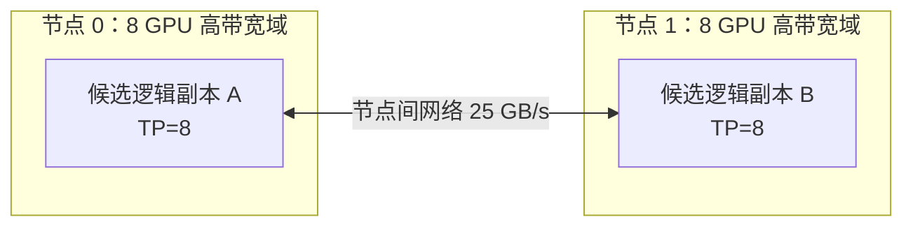

分布式推理的起点不是“有多少张 GPU”，而是“单卡或单副本为什么不够”。同样是增加 GPU，切开一个模型与复制多个模型解决的是两类问题。本节先建立选择坐标，不展开后续各节的算子和框架细节。

<!-- more -->

## 📑 目录
- [1. 问题：先证明哪里不够](#1-问题先证明哪里不够)
- [2. 贯穿本章的 70B 合同](#2-贯穿本章的-70b-合同)
- [3. 第一张账：容量](#3-第一张账容量)
- [4. 第二张账：计算](#4-第二张账计算)
- [5. 第三张账：通信](#5-第三张账通信)
- [6. 第四张账：拓扑](#6-第四张账拓扑)
- [7. 第五张账：SLO 与 Goodput](#7-第五张账slo-与-goodput)
- [8. 机制：scale-up 与 scale-out](#8-机制scale-up-与-scale-out)
- [9. 组合顺序：先画副本，再复制](#9-组合顺序先画副本再复制)
- [10. 代价、适用边界与反例](#10-代价适用边界与反例)
- [11. 交接：带着五张账进入 TP](#11-交接带着五张账进入-tp)
- [总结](#总结)
- [自我检验](#自我检验)
- [参考资料](#参考资料)

---

## 1. 问题：先证明哪里不够

“单卡不够”至少有三种不同含义。

- 权重、KV Cache、运行时缓冲和安全余量不能同时放入显存；
- 单请求的 Prefill 太慢，TTFT 越过目标；
- Decode 每轮太慢，TPOT 越过目标。

“单副本不够”又是另一组问题。

- 到达率超过一个逻辑副本的稳定服务率；
- 突发流量让等待队列超过尾延迟预算；
- 一次维护或一个 rank 故障会让全部服务消失。

本章把一组能够共同维护一次请求、持有其 KV Cache 并完成生成的进程称为一个**逻辑副本**。它可能只使用一张 GPU，也可能由 TP、PP 或 EP 的多个 rank 组成。

因此第一步应写出原因，而不是写出并行度：

```text
容量缺口：什么对象放不下？
计算缺口：Prefill 还是 Decode 太慢？
吞吐缺口：稳态还是突发承载不足？
可用性缺口：哪个故障会失去多少容量？
```

如果这四问没有答案，“把并行度调到 16”就只是资源描述，不是设计。

---

## 2. 贯穿本章的 70B 合同

后续计算沿用总览给出的同一教学算例：

```text
模型：70B 级稠密模型，80 层，hidden size 8192
注意力：8 个 KV heads，head dim 128
精度：权重和 KV Cache 都按 BF16 起算
硬件：2 个节点，每节点 8 张 80 GiB GPU
有效带宽：节点内 300 GB/s，节点间 25 GB/s
请求：Prompt 4,096 token，最多输出 256 token
负载：稳态 8 request/s
突发：每 60 s 有 5 s 达到 16 request/s
SLO：TTFT P99 ≤ 2 s，TPOT P99 ≤ 60 ms
正确性：结果语义与单副本基线一致
```

Goodput 只计算同时满足正确性、TTFT 和 TPOT 合同的输出 Token。它排除超时、失败、重试浪费以及虽生成但延迟不达标的结果。

BF16 权重本体约为：

$$
M_W=70\times10^9\times2\text{ Bytes} \approx140\text{ GB} \approx130.4\text{ GiB}
$$

每 Token 的全局 KV 本体约为：

$$
m_{\text{KV/token}} =80\times2\times8\times128\times2 =327{,}680\text{ Bytes} =320\text{ KiB}
$$

一个达到 $4096+256=4352$ Token 的请求需要：

$$
M_{\text{KV/request}} =4352\times320\text{ KiB} \approx1.33\text{ GiB}
$$

这些数值是统一量纲，不是对任何框架布局的保证。某个对象能否除以 TP、PP 或 EP，必须由它的张量布局证明。

---

## 3. 第一张账：容量

### 3.1 显存不是只有权重

一个 rank 的容量条件应写成：

$$
M_{\text{rank}} =M_W^{\text{shard}} +M_{\text{KV}}^{\text{shard}} +M_A^{\text{peak}} +M_{\text{comm}} +M_{\text{runtime}} +M_{\text{reserve}} <M_{\text{usable}}
$$

$M_A^{\text{peak}}$ 是 Prefill 或 Decode 的临时激活峰值。$M_{\text{comm}}$ 包含 collective 和点对点缓冲。$M_{\text{reserve}}$ 用来吸收碎片、波动和不可预见的峰值。

80 GiB 是物理容量，不应被全部当成可分配预算。只用 $130.4/2=65.2$ GiB 判断 TP=2 可行，会漏掉最大的动态项。

### 3.2 用 SLO 推回并发驻留

若每个请求都输出 256 Token，且 TPOT 恰好为合同上限 60 ms，仅 Decode 阶段的最长驻留时间约为：

$$
T_{\text{decode,max}}=256\times60\text{ ms}=15.36\text{ s}
$$

按 Little 定律，稳态 8 request/s 对应的保守在途请求量约为：

$$
N_{\text{active}}\approx\lambda W =8\times15.36 \approx123
$$

这不是预测值。它是假设请求都取最大输出、系统刚好压线达标时的容量压力测试。

约 123 个满长请求的 KV 本体为：

$$
123\times1.33\text{ GiB}\approx163.6\text{ GiB}
$$

若 KV 能在 TP=8 上按 8 个 KV heads 均匀分片，每 rank 约承担 20.5 GiB。权重理想分片约为 16.3 GiB/rank。两项相加约 36.8 GiB，才给运行时和波动留下合理空间。

TP=4 时，两项约为 73.5 GiB/rank。它在加入临时激活、通信缓冲和安全余量前就已经过紧。

### 3.3 容量账的结论

对这个合同，单卡一定不可行。仅按权重看 TP=2 似乎可行，加入目标并发的 KV 后却不可行。TP=8 是值得验证的节点内候选，而不是从 GPU 数量直接猜出的答案。

---

## 4. 第二张账：计算

容量可行只说明不会立即 OOM，不说明请求足够快。

Prefill 的主要工作随输入 Token 数增长。大矩阵乘法通常有较高并行度，增加 TP 可能缩短首轮计算。

Decode 每个序列每轮只增加一个 Token。即使连续批处理聚合了多个序列，本地矩阵也可能较瘦。此时每卡计算减少了，固定通信和同步却没有同比消失。

可用一个粗略分解理解单轮时间：

$$
T_{\text{step}} \approx T_{\text{compute}} +T_{\text{comm}} +T_{\text{queue}} -T_{\text{overlap}}
$$

增加模型切分度通常降低 $T_{\text{compute}}$，却可能提高 $T_{\text{comm}}$，并通过慢 rank 放大尾延迟。

计算账必须分别回答：

- 4096 Token Prefill 的关键路径在哪里；
- Decode 小批次能否让每个分片保持足够算术强度；
- 采样、Embedding 或 LM Head 是否成为未切分的串行部分；
- 高并发下是 GPU 计算饱和，还是队列先失控。

若目标只是总吞吐不足，复制副本通常比继续切小矩阵更直接。若一个请求本身不达 TTFT 或 TPOT，DP 不会让它跨副本共同计算。

---

## 5. 第三张账：通信

本章统一使用数量级模型：

$$
T_{\text{comm}} \approx\alpha\cdot\text{messages} +\frac{\text{bytes}}{BW_{\text{effective}}}
$$

$\alpha$ 表示每轮消息的启动、协议与链路时延。`messages` 是关键路径上的通信轮次，不是请求数。`bytes` 必须说明是每 rank、算法总量还是瓶颈链路载荷。

对同样大小的数据：

- TP 常在层内做高频 collective；
- PP 常在少数 stage 边界做点对点传输；
- EP 在专家层做 dispatch 和 combine All-to-All；
- 密集推理 DP 的正常前向通常只在入口分流请求。

两种常见误判需要先排除。

第一，只比较总字节而忽略消息频次。Decode 的消息可能不大，却会在 80 层中反复同步。

第二，用标称带宽替代有效带宽。300 GB/s 和 25 GB/s 是本算例的教学有效值，真实值仍会随消息大小、collective 算法和竞争变化。

通信账的目标不是精确预测微秒数，而是尽早识别哪一种并行维度会把慢链路放进高频关键路径。

---

## 6. 第四张账：拓扑

逻辑 rank 必须落到物理链路上。同样的 TP=8，可能位于一个 NVSwitch 域，也可能跨 CPU Socket 或跨节点。



高频通信应优先放在最短、最稳定的链路内。对当前两节点拓扑，一个自然候选是每节点一个 TP=8 副本。

另一候选是一个跨两节点的逻辑副本：

```text
节点 0：PP stage 0，内部 TP=8
节点 1：PP stage 1，内部 TP=8
```

这个布局把高频 TP 留在节点内，但整个请求依赖两个节点和一个跨节点 PP 边界。

最危险的候选通常是 TP=16 且 PP=1。它可能让每层 collective 都经过 25 GB/s 节点间链路。

拓扑账还要记录共同故障域。一个 TP rank 失败通常击穿整个 TP 组；一个 PP stage 失败通常击穿整条流水线；一个独立 DP 副本失败不应直接杀死另一个健康副本。

---

## 7. 第五张账：SLO 与 Goodput

### 7.1 吞吐不是最终目标

设时间窗内完成的输出 Token 数为 $Q$，其中满足全部合同的 Token 数为 $Q_{\text{good}}$：

$$
\text{Goodput}=\frac{Q_{\text{good}}}{T_{\text{window}}}
$$

如果增加并行度后原始吞吐提高，但 P99 TTFT 或 TPOT 超标，请求对应的输出不应计入 Goodput。

### 7.2 突发账不能用平均值掩盖

一分钟内的请求总数为：

$$
8\times55+16\times5=520
$$

平均到达率为：

$$
\bar\lambda=\frac{520}{60}\approx8.67\text{ request/s}
$$

服务率只达到 8 request/s 时，即使“稳态流量是 8”，一分钟尺度上的队列仍持续增长。

而只让服务率略高于 8.67 也未必满足 TTFT P99≤2 s。尾延迟要求系统为突发保留更大的余量，或在入口进行有界等待与明确拒绝。

### 7.3 五张账必须同时过门

候选方案只有同时满足以下条件才成立：

1. 峰值驻留状态能放入显存；
2. Prefill 与 Decode 计算路径满足延迟；
3. 通信没有吞掉计算收益；
4. rank 映射符合物理拓扑与故障隔离；
5. 真实到达过程下 Goodput 达标。

“所有 GPU 都很忙”不在这五个条件中。

---

## 8. 机制：scale-up 与 scale-out

### 8.1 Scale-up：切开一个逻辑副本

Scale-up 让同一个请求由多张 GPU 协作。TP 切层内张量，PP 切层或 stage，EP 切 MoE 专家。

它首先解决模型或状态无法放入更小设备域的问题。在计算足够大时，它也可能缩短单请求关键路径。

代价是请求必须等待协作 rank，通信进入前向路径，故障域也随逻辑副本扩大。

### 8.2 Scale-out：复制逻辑副本

Scale-out 复制完整的逻辑副本，把不同请求路由给不同副本。
若每个副本占用 $G_{\text{replica}}$ 张 GPU，共有 $R$ 个副本，则：

$$
G_{\text{total}}=R\times G_{\text{replica}}
$$

DP 首先提高聚合服务率与故障余量。它不会自动降低一个请求的 Prefill 或 Decode 计算时间。
每个副本重复保存权重，并独立维护请求队列、KV Cache 和通常局部的 Prefix Cache。

### 8.3 二者不是竞争关系
70B 模型先需要 TP=8 候选才能形成容量健康的单节点副本，然后才可能在第二个节点复制同样的副本。
这个组合可以写成：

```text
Replica 0：Node 0，TP=8
Replica 1：Node 1，TP=8
```

先 scale-up 形成可用副本，再 scale-out 承担总流量，是本算例最值得验证的第一候选。

---

## 9. 组合顺序：先画副本，再复制
推荐按因果顺序组合，而不是枚举整数乘积。

### 9.1 第一步：固定合同
固定模型精度、请求长度分布、到达过程、TTFT、TPOT 和正确性。合同变化时，上一轮的最佳并行方案可能失效。

### 9.2 第二步：找最小可行逻辑副本
先问权重和目标 KV 是否能在一张卡共存。不能时，优先把高频 TP 限制在节点内高带宽域。
若单节点仍装不下，或 TP 受到 Head、矩阵形状和效率边界限制，再考虑用 PP 跨节点切层。
MoE 模型才在专家权重与路由处引入 EP。EP 不能替代密集层和 Attention 的放置设计。

### 9.3 第三步：验收单副本延迟
单副本必须先证明 TTFT、TPOT 和正确性成立。如果单副本已经因 collective 负扩展，复制这个副本只会复制低效和故障风险。

### 9.4 第四步：按流量复制
单副本通过后，再按稳态、突发和维护余量确定 DP 副本数。入口路由要基于工作量与 KV 所有权，而不只是轮询请求数。

### 9.5 第五步：重新核算共享瓶颈
复制后，CPU 前处理、入口、模型存储、网络和控制面可能成为新瓶颈。多个副本还可能竞争同一 NIC、PCIe 根或电力预算。
组合顺序可以压缩成一句话：
> 用最小通信面造出满足单请求合同的副本，再复制它满足总流量合同。

---

## 10. 代价、适用边界与反例

### 10.1 TP 的边界
适合权重或 KV 需要层内分片，且 collective 能留在高带宽域的情况。
不适合已经能单卡运行、目标仅是增加独立请求吞吐且 Decode 小矩阵通信占比很高的情况。

### 10.2 PP 的边界
适合一个节点装不下模型，又不希望层内 collective 跨慢网络的情况。
不保证降低低并发单请求延迟。它引入顺序依赖、流水空泡、stage 不均和更大的共同故障域。

### 10.3 DP 的边界
适合单副本已满足延迟，目标是扩吞吐、吸收突发或保留故障容量的情况。
它复制权重且不共享活跃请求的 KV。错误路由会让一个副本排队、另一个副本空闲。

### 10.4 EP 的边界
只适用于 MoE 专家放置。它用专家权重分片换取 Token All-to-All、容量管理与热点风险。

### 10.5 本算例的三个候选
**候选 A：两个节点各一个 TP=8 副本。**它保留节点内 collective，提供两个故障隔离单元和更高聚合服务率。
**候选 B：TP=8、PP=2 的单个跨节点副本。**它进一步分片权重与按层 KV，却只保留一个逻辑副本。当单节点确实放不下时才体现必要性。
**候选 C：TP=16 的单个跨节点副本。**它把最高频通信放上慢链路，除非硬件互连和模型计算足以证明收益，否则风险最大。
算例数据表明 A 是第一验证对象，但它仍需用单副本服务率和 P99 延迟证明能承接分流后的负载。

---

## 11. 交接：带着五张账进入 TP
本节只确定了决策坐标。下一节将打开候选 A 的一个 TP=8 副本，回答更细的问题：

- 列并行和行并行为何与原矩阵数学等价；
- 为什么一个子层可以延迟到末端再归约；
- AllReduce 与 ReduceScatter+AllGather 搬运多少数据；
- 80 层 Decode 为何对 $\alpha$ 尤其敏感；
- 8 个 KV heads 怎样映射到 8 个 TP ranks；
- 一个 rank 失败为何会击穿整个逻辑副本。

如果这些问题无法回答，“节点内 TP=8”仍只是一个看似合理的拓扑草图。

---

## 总结

- 并行选型先区分单卡不够与单副本不够。
- 容量账要同时计算权重、KV、临时激活、通信缓冲和余量。
- 计算账必须分开看 Prefill、Decode、单请求延迟与聚合吞吐。
- 通信账用 $\alpha$、消息轮次、真实字节与有效带宽估算。
- 拓扑账决定高频逻辑边落在哪条物理链路，也决定共同故障域。
- SLO 账以 P99 和 Goodput 约束方案，不能只看平均吞吐。
- 组合时先 scale-up 形成最小可行副本，再 scale-out 承接总流量。

## 自我检验

- [ ] 能举例说明“单卡不够”和“单副本不够”的差异。
- [ ] 能复述 70B 算例的模型、硬件、请求、突发与 SLO。
- [ ] 能解释为何只把 130.4 GiB 权重除以 TP 会低估容量。
- [ ] 能用 Little 定律把请求驻留时间转成 KV 压力。
- [ ] 能说明 TP、PP、DP、EP 各自切或复制什么。
- [ ] 能解释为何平均到达率 8.67 request/s 仍不足以确定 P99。
- [ ] 能说明为什么应先画一个逻辑副本，再讨论复制数量。
- [ ] 能比较本算例三个候选的通信面与故障域。

## 参考资料

- Shoeybi et al., [Megatron-LM](https://arxiv.org/abs/1909.08053), 2019.
- Narayanan et al., [Efficient Large-Scale Language Model Training on GPU Clusters](https://arxiv.org/abs/2104.04473), 2021.
- [NVIDIA NCCL Collective Operations](https://docs.nvidia.com/deeplearning/nccl/user-guide/docs/usage/collectives.html)
- [vLLM Parallelism and Scaling](https://docs.vllm.ai/en/stable/serving/parallelism_scaling/)
- Dean and Barroso, [The Tail at Scale](https://research.google/pubs/the-tail-at-scale/), 2013.

> 本节数值用于建立量纲。最终结论必须回到目标模型、实际张量布局、物理拓扑、请求分布与 SLO。
