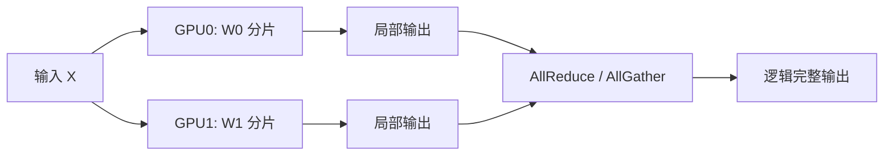

6.1 把「装不下 → 先机内 TP」钉成默认第一刀。张量并行（TP）不把层拆到不同机器，而是把**每一层的大矩阵**切开，让多张 GPU 协同完成同一次前向。这一节把切分方式、通信模式、一笔带字节单位的通信量粗算，以及「开到几卡」的取舍讲清楚——并解释为何跨节点大 TP 通常不划算。

<!-- more -->

## 📑 目录

- [1. TP 要解决什么](#1-tp-要解决什么)
- [2. 权重如何切分](#2-权重如何切分)
- [3. 步内通信：AllReduce / AllGather](#3-步内通信allreduce--allgather)
- [4. 通信量粗算（带单位）](#4-通信量粗算带单位)
- [5. 为什么强依赖 NVLink](#5-为什么强依赖-nvlink)
- [6. 为何通常不跨节点做大 TP](#6-为何通常不跨节点做大-tp)
- [7. 卡数取舍：TP=2/4/8](#7-卡数取舍tp248)
- [8. 对 TTFT / TPOT 与显存的影响](#8-对-ttft--tpot-与显存的影响)
- [9. 工程实践与权衡](#9-工程实践与权衡)
- [总结](#-总结)
- [自我检验清单](#-自我检验清单)
- [参考资料](#-参考资料)

---

## 1. TP 要解决什么

单卡装不下时，最直观的想法是「把模型切开」。TP 的切法是：

- **切的是层内张量**（如 Attention 的 QKV 投影、MLP 的两层线性），不是按层分段。
- 每张卡都参与**每一层**的计算，持有该层权重的一个分片。
- 一次前向在多卡上并行推进，中间用集合通信对齐结果。

对推理来说，TP 同时带来两件事：单卡显存下降（权重分摊），以及（在带宽够时）单请求计算墙钟时间下降。

🔑 **核心概念**：**TP = 层内模型并行。** 通信发生在层内/层间的同步点，而不是「算完一整段再交给下一台机器」（那是 PP，见 [6.3](./6.3-流水线并行推理.md)）。

---

## 2. 权重如何切分

以常见 Transformer 层为例（概念示意，具体实现因框架而异）：

| 模块 | 常见切分方式 | 直觉 |
|---|---|---|
| Attention QKV / Out | 按头（head）或列/行切分 | 不同卡算不同头，再聚合 |
| MLP `up/gate` | 列并行（Column Parallel） | 把输出特征维切开 |
| MLP `down` | 行并行（Row Parallel） | 把输入特征维切开，末尾 AllReduce |

Megatron 风格的经典组合是：**前一层列并行 + 后一层行并行**，使得两层之间可以少一次同步，只在行并行输出处做一次 AllReduce。推理引擎（含 vLLM）沿用同一思想，并针对 Attention 后端、量化权重等做了适配。



教学伪代码（**非逐字源码**）：

```python
# 行并行线性层末尾：各 rank 持有 partial，规约为完整激活
y_partial = x_shard @ W_row_shard.T
y = all_reduce_sum(y_partial)   # 每层（或每对并行线性）可能触发一次
```

📌 **关键点**：切分后每张卡的**本地矩阵更窄**，单卡 GEMM 更小；但必须在约定同步点合成逻辑正确的激活，否则下一层会对错维。

---

## 3. 步内通信：AllReduce / AllGather

推理前向里，TP 最常见的集合通信是：

- **AllReduce**：各卡持有部分和，规约成全局一致结果（行并行线性层末尾很常见）。
- **AllGather**：各卡持有分片，收集成完整张量（某些并行注意力/嵌入实现会用到）。

关键不在算子名字，而在**频率**：

- Prefill：一次前向要过完所有层，每一层（或每一对并行线性）都可能触发通信。
- Decode：每生成一个 Token 就完整跑一遍模型，**每一层的同步都打进这一步的耗时**。

因此 Decode 下的 TP 通信是「高频、相对小消息、步步都有」。NCCL 的延迟与带宽会直接变成 TPOT。

💡 **提示**：训练里一步还有反向和优化器，通信占比可被大批量摊薄；推理 Decode 批量按 Token 计，通信更容易成为瓶颈——这与 6.1「推理 vs 训练」的对照一致。

---

## 4. 通信量粗算（带单位）

只估「一次 AllReduce 要搬多少字节」，便于判断互联是否吃得消。教学示意（**非某模型实测**）：

前提：

- 隐藏维 $H=8192$，激活按 BF16（2 B/元素）；
- 某次行并行输出的 AllReduce 对象近似为形状 `[B, S, H]` 的激活（或等价体积）；
- Decode 单请求：$B=1$，$S=1$ → 体积 $V = 1\times 1\times 8192\times 2 = 16\,\mathrm{KiB}$ 量级；
- Prefill 同请求长 Prompt：$S=4096$ → $V \approx 4096\times 16\,\mathrm{KiB} = 64\,\mathrm{MiB}$ 量级。

| 场景 | 单次 AllReduce 载荷（量级） | 若每层 1 次、80 层 |
|---|---|---|
| Decode 1 Token | $\sim 16\,\mathrm{KiB}$ | $\sim 1.25\,\mathrm{MiB}$ / step（仅计此路径） |
| Prefill $S=4096$ | $\sim 64\,\mathrm{MiB}$ | $\sim 5\,\mathrm{GiB}$ / 次 Prefill（仅计此路径） |

解读：

- Decode 的痛点往往是**延迟**（小消息启动开销 × 层数），不是峰值带宽跑满；
- Prefill 更吃**带宽**，长 Prompt 时 TP 通信体积明显变大；
- 真实引擎还有 Attention/嵌入等其它集合通信，上表是**下界直觉**，不是完整 profile。

取舍句：在 NVLink（数百 GB/s 级）上，Decode 每步累计数 MiB 的 AllReduce 通常可接受；若同样模式落到跨节点（有效延迟高一个数量级），**层数 × 往返延迟**会直接抬高 TPOT，计算变短省下的时间不够赔通信。

⚠️ **注意**：数字带前提——换 $H$、精度（FP8/FP16）、是否融合通信，体积会变；用来做拓扑决策，不要写进精确容量合同。

---

## 5. 为什么强依赖 NVLink

同机多卡有两条典型路径：

| 互联 | 量级观感 | 对 TP 的含义 |
|---|---|---|
| **NVLink / NVSwitch** | 数百 GB/s 级、低延迟 | 适合高频 AllReduce |
| **PCIe** | 明显更窄、延迟更高 | TP 度一大就容易通信绑死 |

当 TP 通信走 NVLink 时，小消息 AllReduce 的开销通常可接受；若被迫走 PCIe 甚至跨 NUMA 绕行，Decode 的步延迟会明显变差。这也是为什么 8 卡 DGX/HGX 类拓扑上 `TP=8` 很常见，而在「多卡但只有 PCIe」的机器上要更保守。

⚠️ **注意**：同属「一台机器」也不等于拓扑友好。要确认 GPU 两两之间是否有直连 NVLink。`nvidia-smi topo -m` 是排查第一步。

---

## 6. 为何通常不跨节点做大 TP

跨节点通信一般走以太网 / InfiniBand。即便 IB 很强，和机内 NVLink 比，**延迟与有效带宽仍常差一个数量级以上**，更要命的是：

1. Decode **每步、每层**都可能 AllReduce，跨节点延迟被乘数放大。
2. 小消息场景下，延迟往往比峰值带宽更致命。
3. 多租户网络抖动会直接变成 TPOT 尖刺，SLO 更难守。

所以工程惯例是：

- **TP 放在节点内**（例如每节点 `TP=8`）。
- 需要继续放大模型规模时，用 **PP 跨节点切层**，或上 EP/DP，而不是把 `TP=16` 硬拉到两台机器。

```text
反例：2 机 × 8 卡，设 TP=16
  → 每个 Decode step 的层内 AllReduce 都可能跨机
  → TPOT 常显著差于「每机 TP=8 + PP=2」
```

📌 **关键点**：**不是 TP 不能跨节点，而是跨节点 TP 的性价比通常很差。** 推理里默认假设「TP ⊆ NVLink 域」。

---

## 7. 卡数取舍：TP=2/4/8

总卡数固定时，TP 度不是越大越好。启发式：

| TP 度 | 常见收益 | 常见代价 |
|---|---|---|
| 2 | 显存减半起步，通信域小 | 大模型可能仍装不下 |
| 4 | 折中：显存与通信较均衡 | 需头数/KV head 可整除 |
| 8 | 吃满一机，单请求延迟常最好 | 通信占比高；无 NVLink 易亏 |

选型时同时满足：

1. **整除约束**：注意力头数、KV head 数等可被 TP 整除（否则初始化失败或走别扭路径）；
2. **拓扑约束**：TP ≤ 单机 GPU，且落在 NVLink 域；
3. **压测约束**：用目标 Decode 并发比 `TP=4` vs `TP=8`，看 P95 TPOT 与 tokens/s，而不是只看能否加载。

示意取舍（同机 8×80 GB，Dense 70B 已能量化到单机放下）：若 `TP=8` 相对 `TP=4` 只再降 ~10% TPOT，却让每卡 KV 池更碎、抢占更频——**可能应停在 TP=4，把省下的卡做 DP=2 抬 QPS**（与 6.1「撑不住用 DP」衔接）。

---

## 8. 对 TTFT / TPOT 与显存的影响

- **TTFT（Prefill）**：算力被多卡分摊，长 Prompt 墙钟往往下降；拓扑差时通信吃掉收益。
- **TPOT（Decode）**：单步计算变短，但单步通信次数仍按层同步。带宽充足时改善；不足时恶化。
- **显存**：权重近似按 TP 度分摊；KV Cache 是否按头切取决于实现，**不要默认「一切都 ÷ TP」**。

| 📈 情况 | 提高 TP 的常见结果 |
|---|---|
| 同机 NVLink 充足、模型算力重 | TTFT/TPOT 改善，单卡权重显存下降 |
| 互联一般、Decode 为主 | 通信占比上升，TPOT 抖动加大 |
| 跨节点大 TP | 延迟风险高，优先改 PP/DP |

---

## 9. 工程实践与权衡

在 vLLM 中，最直接的旋钮是 `tensor_parallel_size`（CLI：`--tensor-parallel-size`）：

```bash
# 8 卡同机 TP（示意；参数以当前版本 --help 为准）
vllm serve meta-llama/Llama-3.1-70B-Instruct \
  --tensor-parallel-size 8
```

实操建议：

1. **TP 度优先取节点 GPU 数的公约数**（常用 2/4/8），并对齐头数约束。
2. **先看拓扑再定 TP**：无 NVLink 时慎重上高 TP。
3. **用 Decode 压测做决策**：只看 Prefill TFLOPS 很容易误判。
4. 需要更大模型时，优先 `TP(机内) × PP(跨机)`，而不是跨机超大 TP。

| 选择 | 收益 | 代价 / 不适用 |
|---|---|---|
| 拉满机内 TP | 单请求延迟、权重显存 | Decode 通信；KV 池形态变化 |
| 保守低 TP + 量化 | 通信少、部署简单 | 质量回归；可能仍装不下 |
| 跨机超大 TP | 理论上更多卡算一层 | 步内集合通信跨机，TPOT 风险高 |

适用：同机多卡、拓扑已知、目标是降单卡显存或压单请求延迟。  
若模型已能量化进单卡且延迟达标，只差 QPS——回到 DP（[6.4](./6.4-数据并行与专家并行.md)），不必为 TP 而 TP。

---

## 📝 总结

- TP 把层内大矩阵切到多卡，用 AllReduce/AllGather 在步内同步，降低单卡权重显存并（带宽够时）加速单请求。
- Decode 使 TP 通信变成**高频小消息**；粗算时 Decode 看延迟累积，Prefill 看带宽体积。
- 跨节点大 TP 通常不划算：层内集合通信延迟会被逐步放大到 TPOT。
- 卡数取舍要同时满足整除、拓扑与压测；工程默认 **TP 留在机内**，跨机交给 PP/DP/EP。

## 🎯 自我检验清单

- 能说明 TP 切的是「层内张量」而不是「层段」
- 能举例 Attention/MLP 上常见的列并行与行并行组合
- 能解释为何 Decode 让 AllReduce 比训练更伤延迟
- 能在给定 $H$、精度、序列长下口述一笔 AllReduce 字节量级粗算
- 能对比 NVLink 与 PCIe/跨节点对 TP 的影响
- 能说出「TP 通常不跨节点」的两条以上理由
- 能在 `TP=4` 与 `TP=8` 之间给出带压测门禁的取舍思路

## 📚 参考资料

- [Megatron-LM 论文（张量并行经典切分）](https://arxiv.org/abs/1909.08053)
- [vLLM Distributed Inference and Serving](https://docs.vllm.ai/en/latest/serving/distributed_serving.html)
- [NCCL User Guide（AllReduce 语义与性能）](https://docs.nvidia.com/deeplearning/nccl/user-guide/docs/index.html)
- [NVIDIA NVLink / NVSwitch 互联概述](https://www.nvidia.com/en-us/data-center/nvlink/)
- [本模块 6.1 推理并行策略总览](./6.1-推理并行策略总览.md)
- [本模块 6.3 流水线并行推理](./6.3-流水线并行推理.md)
