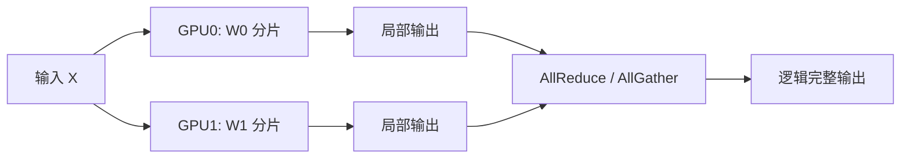

张量并行（TP）是推理里最常用的"把大模型塞进多卡"手段：不把层拆到不同机器，而是把**每一层的大矩阵**切开，让多张 GPU 协同完成同一次前向。这一节把切分方式、通信模式、带宽依赖和跨节点陷阱讲清楚。

<!-- more -->

## 📑 目录

- [1. TP 要解决什么](#1-tp-要解决什么)
- [2. 权重如何切分](#2-权重如何切分)
- [3. 步内通信：AllReduce / AllGather](#3-步内通信allreduce--allgather)
- [4. 为什么强依赖 NVLink](#4-为什么强依赖-nvlink)
- [5. 为何通常不跨节点做大 TP](#5-为何通常不跨节点做大-tp)
- [6. 对 TTFT / TPOT 的影响](#6-对-ttft--tpot-的影响)
- [7. 工程实践要点](#7-工程实践要点)
- [总结](#-总结)
- [自我检验清单](#-自我检验清单)
- [参考资料](#-参考资料)

---

## 1. TP 要解决什么

单卡装不下时，最直观的想法是"把模型切开"。TP 的切法是：

- **切的是层内张量**（如 Attention 的 QKV 投影、MLP 的两层线性），不是按层分段。
- 每张卡都参与**每一层**的计算，持有该层权重的一个分片。
- 一次前向在多卡上并行推进，中间用集合通信对齐结果。

对推理来说，TP 同时带来两件事：单卡显存下降（权重分摊），以及（在带宽够时）单请求计算墙钟时间下降。

🔑 **核心概念**：**TP = 层内模型并行。** 同一层的矩阵乘法被多卡分摊，通信发生在层内/层间的同步点，而不是"算完一整段再交给下一台机器"。

---

## 2. 权重如何切分

以常见 Transformer 层为例（概念示意，具体实现因框架而异）：

| 模块 | 常见切分方式 | 直觉 |
|---|---|---|
| Attention QKV / Out | 按头（head）或列/行切分 | 不同卡算不同头，再聚合 |
| MLP `up/gate` | 列并行（Column Parallel） | 把输出特征维切开 |
| MLP `down` | 行并行（Row Parallel） | 把输入特征维切开，末尾 AllReduce |

Megatron 风格的经典组合是：**前一层列并行 + 后一层行并行**，使得两层之间可以少一次同步，只在行并行输出处做一次 AllReduce。推理引擎（含 vLLM）沿用同一思想，并针对 Attention 后端、量化权重等做了适配。



📌 **关键点**：切分后每张卡的**本地矩阵更窄**，单卡 GEMM 更小；但要在约定同步点把分片结果合成逻辑上正确的激活，否则下一层会对错维、算错数。

---

## 3. 步内通信：AllReduce / AllGather

推理前向里，TP 最常见的集合通信是：

- **AllReduce**：各卡持有部分和，规约成全局一致结果（行并行线性层末尾很常见）。
- **AllGather**：各卡持有分片，收集成完整张量（某些并行注意力/嵌入实现会用到）。

关键不在算子名字，而在**频率**：

- Prefill：一次前向要过完所有层，每一层（或每一对并行线性）都可能触发通信。
- Decode：每生成一个 Token 就完整跑一遍模型，**每一层的同步都打进这一步的耗时**。

因此 Decode 下的 TP 通信是"高频、小消息、步步都有"。集合通信库（NCCL）的延迟与带宽，会直接变成 TPOT。

💡 **提示**：训练里一步还有反向和优化器，通信占比可以被大批量摊薄；推理 Decode 批量按 Token 计，通信更容易成为瓶颈。

---

## 4. 为什么强依赖 NVLink

同机多卡有两条典型路径：

| 互联 | 量级观感 | 对 TP 的含义 |
|---|---|---|
| **NVLink / NVSwitch** | 数百 GB/s 级、低延迟 | 适合高频 AllReduce |
| **PCIe** | 明显更窄、延迟更高 | TP 度一大就容易通信绑死 |

当 TP 通信走 NVLink 时，小消息 AllReduce 的开销通常可接受；若被迫走 PCIe 甚至跨 NUMA 绕行，Decode 的步延迟会明显变差。这也是为什么 8 卡 DGX/HGX 类拓扑上 `TP=8` 很常见，而在"多卡但只有 PCIe"的机器上要更保守。

⚠️ **注意**：同属"一台机器"也不等于拓扑友好。要确认 GPU 两两之间是否有直连 NVLink、是否被 CPU root complex 割裂。`nvidia-smi topo -m` 是排查第一步。

---

## 5. 为何通常不跨节点做大 TP

跨节点通信一般走以太网 / InfiniBand。即便 IB 很强，和机内 NVLink 比，**延迟与有效带宽仍常差一个数量级以上**，更要命的是：

1. Decode **每步、每层**都可能 AllReduce，跨节点延迟被乘数放大。
2. 小消息场景下，延迟往往比峰值带宽更致命。
3. 多租户网络抖动会直接变成 TPOT 尖刺，SLO 更难守。

所以工程惯例是：

- **TP 放在节点内**（例如每节点 `TP=8`）。
- 需要继续放大模型规模时，用 **PP 跨节点切层**，或上 EP/DP，而不是把 `TP=16` 硬拉到两台机器。

```text
反例：2 机 × 8 卡，设 TP=16
  → 每个 Decode step 的层内 AllReduce 都可能跨机
  → TPOT 常显著差于「每机 TP=8 + PP=2」
```

📌 **关键点**：**不是 TP 不能跨节点，而是跨节点 TP 的性价比通常很差。** 推理里默认假设"TP ⊆ NVLink 域"。

---

## 6. 对 TTFT / TPOT 的影响

- **TTFT（Prefill）**：算力被多卡分摊，长 Prompt 的 Prefill 墙钟时间往往下降；同时首 Token 前要完成多层通信，拓扑差时收益会被吃掉。
- **TPOT（Decode）**：单步计算变短，但单步通信次数不变（仍按层同步）。带宽充足时 TPOT 改善；带宽不足时 TPOT 反而恶化。
- **显存**：权重近似按 TP 度分摊；KV Cache 的分摊方式取决于实现（例如按 KV head 切），不要想当然认为"一切都除以 TP"。

| 📈 情况 | 提高 TP 的常见结果 |
|---|---|
| 同机 NVLink 充足、模型算力重 | TTFT/TPOT 改善，单卡显存下降 |
| 互联一般、Decode 为主 | 通信占比上升，TPOT 抖动加大 |
| 跨节点大 TP | 延迟风险高，优先改 PP/DP 方案 |

---

## 7. 工程实践要点

在 vLLM 中，最直接的旋钮是 `tensor_parallel_size`（CLI：`--tensor-parallel-size`）：

```bash
# 8 卡同机 TP
vllm serve meta-llama/Llama-3.1-70B-Instruct \
  --tensor-parallel-size 8
```

实操建议：

1. **TP 度优先取节点 GPU 数的公约数**（常用 2/4/8），并与模型头数、KV head 数可整除约束对齐。
2. **先看拓扑再定 TP**：无 NVLink 时慎重上高 TP。
3. **用 Decode 压测做决策**：只看 Prefill TFLOPS 很容易误判。
4. 需要更大模型时，优先 `TP(机内) × PP(跨机)`，而不是跨机超大 TP。

---

## 📝 总结

- TP 把层内大矩阵切到多卡，用 AllReduce/AllGather 在步内同步，同时降低单卡显存并（在带宽够时）加速单请求。
- 推理 Decode 使 TP 通信变成**高频小消息**，对 NVLink 极度敏感。
- 跨节点大 TP 通常不划算：层内集合通信的延迟会被逐步放大到 TPOT。
- 工程默认：**TP 留在机内**，跨机扩展交给 PP/DP/EP；用真实 Decode 负载验证，而不是只看能否启动。

## 🎯 自我检验清单

- 能说明 TP 切的是"层内张量"而不是"层段"
- 能举例 Attention/MLP 上常见的列并行与行并行组合
- 能解释为何 Decode 让 AllReduce 比训练更伤延迟
- 能对比 NVLink 与 PCIe/跨节点对 TP 的影响
- 能说出"TP 通常不跨节点"的两条以上理由
- 能设计一个 `TP=8` 与 `TP=4×PP=2` 的对比验证思路

## 📚 参考资料

- [Megatron-LM 论文（张量并行经典切分）](https://arxiv.org/abs/1909.08053)
- [vLLM Distributed Inference and Serving](https://docs.vllm.ai/en/latest/serving/distributed_serving.html)
- [NCCL User Guide（AllReduce 语义与性能）](https://docs.nvidia.com/deeplearning/nccl/user-guide/docs/index.html)
- [NVIDIA NVLink / NVSwitch 互联概述](https://www.nvidia.com/en-us/data-center/nvlink/)
