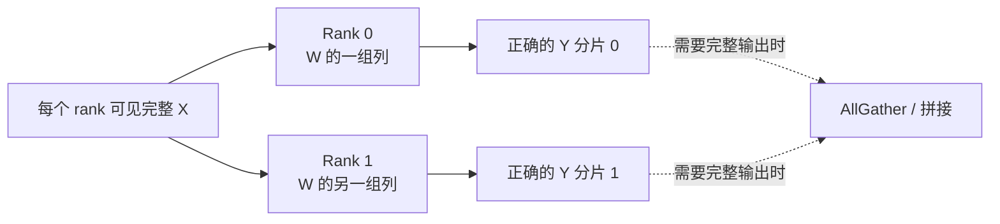
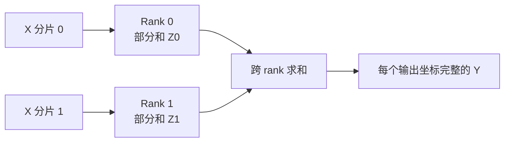
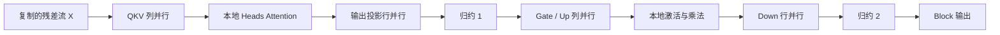

张量并行把一层内部的权重和计算切给多个 rank。它减少单 rank 的容量与计算，却让同一个请求在几乎每层都必须同步。理解 TP 的关键不是记住一个开关，而是证明分片后的代数仍等价。

<!-- more -->

## 📑 目录
- [1. 问题：为什么要切一层内部](#1-问题为什么要切一层内部)
- [2. 数学起点：线性层与分片契约](#2-数学起点线性层与分片契约)
- [3. 列并行：得到正确的输出分片](#3-列并行得到正确的输出分片)
- [4. 行并行：部分和必须归约](#4-行并行部分和必须归约)
- [5. Transformer Block 中怎样配对](#5-transformer-block-中怎样配对)
- [6. AllReduce 与 RS+AG](#6-allreduce-与-rsag)
- [7. 70B 算例：估算一次通信](#7-70b-算例估算一次通信)
- [8. 拓扑、KV heads 与分片边界](#8-拓扑kv-heads-与分片边界)
- [9. 代价：频次、慢 rank 与故障域](#9-代价频次慢-rank-与故障域)
- [10. 理论事实与实现选择](#10-理论事实与实现选择)
- [11. 适用边界与交接](#11-适用边界与交接)
- [总结](#总结)
- [自我检验](#自我检验)
- [参考资料](#参考资料)

---

## 1. 问题：为什么要切一层内部
6.1 的 70B 合同给出两个直接压力：
- BF16 权重本体约 130.4 GiB，单张 80 GiB GPU 放不下；
- 目标并发的 KV、临时激活和运行时余量不能被权重挤掉。
PP 可以按层切开模型，但如果一个节点内有高带宽互连，先在层内切分往往能更充分使用节点内总显存和算力。
TP 希望同时获得两个结果：
1. 每个 rank 只保存部分大矩阵；
2. 多个 rank 合作得到与未分片线性层相同的数学结果。
第二点是硬约束。如果为了省通信改变了函数本身，就违反了本章“结果语义与单副本基线一致”的合同。
浮点加法顺序变化可能造成末位数值差异，但它不同于漏加一个分片或错误切 Head 造成的算法错误。

---

## 2. 数学起点：线性层与分片契约
考虑一个无偏置线性层：
$$
Y=XW
$$
定义形状：

$$
X\in\mathbb{R}^{T\times H}, \quad W\in\mathbb{R}^{H\times O}, \quad Y\in\mathbb{R}^{T\times O}
$$

$T$ 是本轮参与前向的 Token 数。Prefill 时它可能很大；Decode 时通常等于本轮被调度的活跃序列数。
在 $p$ 个 TP ranks 上切分时，每个算子都应声明三件事：
- 输入在 ranks 上是复制的还是分片的；
- 权重沿输入维还是输出维切；
- 输出的消费者需要完整张量还是分片张量。
通信并不是“TP 自动附带”的抽象税。它发生在生产者的输出布局与消费者的输入布局不一致时。
因此 TP 设计的目标是把相邻算子排成一段：中间张量尽量保持本地分片，只在数学上必须得到部分和的位置同步。

---

## 3. 列并行：得到正确的输出分片
“列并行”是按输出维切分 $W$。将列块写成：

$$
W= \left[ W^{(0)},W^{(1)},\ldots,W^{(p-1)} \right]
$$

其中：

$$
W^{(r)}\in\mathbb{R}^{H\times O/p}
$$

每个 rank 都读取完整输入 $X$，并计算自己的输出坐标：

$$
Y^{(r)}=XW^{(r)} \in\mathbb{R}^{T\times O/p}
$$

把各分片在输出维拼接：

$$
Y= \operatorname{concat} \left( Y^{(0)},\ldots,Y^{(p-1)} \right)
$$

这与未切分的 $XW$ 完全同构。每个 $Y^{(r)}$ 不是“近似部分和”，而是最终输出中一组完整、正确的坐标。

若下一算子本来就按对应输入维分片，它可以直接消费 $Y^{(r)}$，此处无需先 AllGather。
逐元素非线性也可以本地执行：

$$
\phi(Y)^{(r)}=\phi(Y^{(r)})
$$

原因是每个分片包含完整输出坐标，而不是多个 rank 的待求和部分。

---

## 4. 行并行：部分和必须归约
“行并行”是按输入维切分 $W$。写成：

$$
W= \begin{bmatrix} W^{(0)}\\ W^{(1)}\\ \vdots\\ W^{(p-1)} \end{bmatrix}, \quad W^{(r)}\in\mathbb{R}^{H/p\times O}
$$

输入也沿对应的隐藏维切分：

$$
X= \left[ X^{(0)},X^{(1)},\ldots,X^{(p-1)} \right]
$$

每个 rank 计算：

$$
Z^{(r)}=X^{(r)}W^{(r)} \in\mathbb{R}^{T\times O}
$$

$Z^{(r)}$ 具有完整输出形状，但只包含输入维的一部分贡献。正确结果必须是：

$$
Y=\sum_{r=0}^{p-1}Z^{(r)}
$$

如果后续每个 rank 都需要完整 $Y$，就使用求和语义的 AllReduce。

不能在归约前对 $Z^{(r)}$ 各自应用一般非线性。通常有：

$$
\phi\left(\sum_r Z^{(r)}\right) \ne \sum_r\phi\left(Z^{(r)}\right)
$$

这就是列并行与行并行必须按数据依赖配对的原因。

---

## 5. Transformer Block 中怎样配对

### 5.1 Attention 路径
典型 Head 并行可写成：
1. Q、K、V 投影按输出维做列并行；
2. 每个 rank 获得一组完整 Query Heads；
3. 本地使用对应 KV Heads 完成 Attention；
4. 输出投影按输入维做行并行；
5. 对输出投影的部分和做一次主要归约。
Attention 中间结果保持按 Head 分片，无需为了本地 Attention 把所有 Heads 聚回一张卡。

### 5.2 MLP 路径
以门控 MLP 为例：

$$
\operatorname{MLP}(X) = \left[ \operatorname{SiLU}(XW_g)\odot(XW_u) \right]W_d
$$

$W_g$ 与 $W_u$ 沿中间输出维做列并行。每个 rank 得到正确的中间维分片，可本地完成 SiLU 和逐元素乘法。
$W_d$ 沿输入维做行并行。它产生完整隐藏维形状的部分和，随后需要一次主要归约。

经典 Megatron 风格前向常按每个 Transformer Block 两次主要归约做数量级估算：Attention 一次，MLP 一次。
这是一种稳定的数据流原理，不是对每个模型、融合算子或框架版本的固定调用次数承诺。

---

## 6. AllReduce 与 RS+AG

### 6.1 AllReduce 的结果
设每个 rank 输入相同形状的 $Z^{(r)}$。AllReduce-Sum 让每个 rank 都得到：

$$
Y^{(r)}=\sum_i Z^{(i)}
$$

结果在 TP ranks 上复制。这种布局便于每个 rank 继续执行 LayerNorm、残差或下一子层。

### 6.2 ReduceScatter 的结果
ReduceScatter 先求和，再让每个 rank 只保留结果的一段：

$$
Y^{(r)} =\operatorname{chunk}_r \left( \sum_iZ^{(i)} \right)
$$

它适合后续能消费序列或其他维度分片的布局。

### 6.3 AllGather 的结果
AllGather 把不同 rank 的分片拼回完整张量：

$$
Y= \operatorname{concat} \left( Y^{(0)},\ldots,Y^{(p-1)} \right)
$$

从 collective 代数看：

$$
\operatorname{AllReduce} = \operatorname{AllGather} \circ \operatorname{ReduceScatter}
$$

把 AllReduce 拆成 RS+AG 不会让必要信息凭空消失。收益可能来自分片驻留、通信与计算重叠，以及把 AllGather 推迟到真正需要完整布局的位置。

### 6.4 Ring 算法载荷
设完整张量大小为 $M$ Bytes，TP size 为 $p$。Ring ReduceScatter 每 rank 发送的算法载荷约为：

$$
V_{\text{RS,rank}} =\frac{p-1}{p}M
$$

Ring AllGather 同样约为：

$$
V_{\text{AG,rank}} =\frac{p-1}{p}M
$$

所以 Ring AllReduce 为：

$$
V_{\text{AR,rank}} =2\frac{p-1}{p}M
$$

其关键路径近似为：

$$
T_{\text{AR}} \approx 2(p-1)\alpha + 2\frac{p-1}{p}\frac{M}{BW_{\text{effective}}}
$$

Tree、分层或硬件特化算法会改变轮次和瓶颈链路。公式用于解释趋势，不用于替代实现测量。

---

## 7. 70B 算例：估算一次通信

### 7.1 定义一个 Decode 快照
沿用 70B 合同，假设某次 Decode 调度了 32 个活跃序列，每个序列本轮产生一个 Query Token。
归约张量按 BF16 隐藏状态估算：

$$
M=T\times H\times b
$$

代入 $T=32$、$H=8192$、$b=2$ Bytes：

$$
M=32\times8192\times2 =524{,}288\text{ Bytes} =0.5\text{ MiB}
$$

### 7.2 TP=8 的 Ring AllReduce
每 rank 的算法发送载荷约为：

$$
V_{\text{AR,rank}} =2\times\frac{7}{8}\times0.5 =0.875\text{ MiB}
$$

若整个 TP 组位于节点内 300 GB/s 有效带宽域，纯传输项约为：

$$
\frac{0.875\text{ MiB}}{300\text{ GB/s}} \approx3.1\ \mu s
$$

加入 Ring 的 14 个通信轮次后：

$$
T_{\text{AR,intra}} \approx14\alpha_{\text{intra}}+3.1\ \mu s
$$

若同一 TP 组跨越 25 GB/s 节点间瓶颈，仅传输项就约为：

$$
\frac{0.875\text{ MiB}}{25\text{ GB/s}} \approx36.7\ \mu s
$$
这是把每 rank 算法载荷统一按慢链路计价的保守比较；实际 Ring 或分层算法只有跨节点段受该瓶颈，但这些流还会争用节点 NIC。
此时还要使用更高且更易抖动的 $\alpha_{\text{inter}}$：

$$
T_{\text{AR,inter}} \approx14\alpha_{\text{inter}}+36.7\ \mu s
$$

### 7.3 从一次扩展到一轮 Decode
若按 80 层、每层两次主要归约估算：

$$
N_{\text{collective}}=80\times2=160
$$

每 rank 一轮 Decode 的算法载荷约为：

$$
160\times0.875=140\text{ MiB}
$$

固定时延项则被支付 160 次：

$$
T_{\text{latency term}} \approx160\times14\alpha
$$

这解释了为什么“小消息只有 0.5 MiB”不能推出通信不重要。在 TPOT P99≤60 ms 的合同里，高频同步会直接消耗每 Token 的延迟预算。

---

## 8. 拓扑、KV heads 与分片边界

### 8.1 TP 组应贴合高带宽域
本算例每节点 8 张 GPU，节点内有效带宽 300 GB/s，节点间只有 25 GB/s。
TP=8 完整落在一个节点，可以把 160 次 Decode collective 留在较近链路。TP=16 则不可避免地让层内同步跨节点。
拓扑不仅改变平均时间，还改变 P99：共享 NIC 争用、跨 Socket 绕行和慢 rank 都会在 collective 屏障处传播给整个请求。

### 8.2 Query Heads 与 KV Heads 不相同
GQA 中 Query Head 数通常多于 KV Head 数。本算例只固定了 8 个 KV Heads。
在 TP=8 且按 KV Head 切分时，每个 rank 可以保存一个完整 KV Head。一个满长请求的全局 KV 约 1.33 GiB，理想每 rank 约为：

$$
\frac{1.33}{8}\text{ GiB} \approx170\text{ MiB}
$$

若 TP 增至 16，KV Head 数已少于 TP rank 数。实现可能复制 KV Heads、限制该布局，或使用另一种分组方式。
因此 KV 权重和 KV Cache 不一定继续从 TP=8 到 TP=16 减半。“所有显存都除以 TP”在这里失效。

### 8.3 Head 边界是结构约束
一个 rank 最好持有完整 Head 的 $D=128$ 维，以便本地完成对应 Attention。若 Query Heads、KV Heads 或中间维不能与 $p$ 合理匹配，可能出现复制、Padding、更小 GEMM 或额外通信。
这些结构约束应先于性能结论检查。

---

## 9. 代价：频次、慢 rank 与故障域

### 9.1 计算缩小，通信频次不缩小
TP 从 4 增至 8，理想本地矩阵计算接近减半，但每层的同步点仍然存在。
参与 rank 增多后，每 rank 矩阵更小，collective 轮次和慢者概率却可能增加。这就是 TP 负扩展的基本来源。

### 9.2 Prefill 与 Decode 的压力不同
Prefill 的 $T=4096$，矩阵大且归约消息也大，更容易把带宽与算力都用起来。
Decode 快照中的 $T=32$，矩阵较瘦，固定 $\alpha$ 更难摊薄。
同一个 TP 方案可能改善 TTFT，却恶化低并发 TPOT。二者必须分别核算。

### 9.3 同步木桶
AllReduce 只有在所有成员完成对应步骤后才能给出正确结果。一个 GPU 降频、一个 rank 排队或一条链路抖动，都会让其他成员等待。
平均 rank 时间不能代表请求尾延迟。应关心：

$$
T_{\text{collective}} \approx \max_r T_r+\text{coordination overhead}
$$

### 9.4 共同故障域
一个 TP rank 失效后，其权重分片和中间部分和都不再可得。其余 ranks 不能仅靠已有分片继续得到同一模型结果。
因此整个 TP 组通常是一个恢复单元。TP=8 的逻辑副本至少共同依赖 8 张 GPU、进程组、节点内互连和协调进程。
TP 解决容量的同时，也扩大了故障域。

---

## 10. 理论事实与实现选择

### 10.1 相对稳定的理论事实
- 列并行产生最终输出坐标的正确分片；
- 行并行产生需要跨 rank 求和的部分结果；
- AllReduce 可由 ReduceScatter 与 AllGather 组合表达；
- 通信时间同时包含轮次时延与有效带宽项；
- 同步进度受最慢 rank 约束；
- KV 能否分片取决于 Head 和张量布局。

### 10.2 随框架和版本变化的实现选择
- 一个 Block 实际发起多少次 collective；
- 使用 Ring、Tree、分层算法还是硬件特化路径；
- AllReduce 是否被 RS+AG、融合通信或自定义算子替代；
- 残差流是复制、序列分片还是另一种布局；
- KV Heads 在不可整除时复制还是拒绝该 TP；
- 通信与矩阵计算能重叠多少。
框架日志、指标名和配置入口不能反推长期稳定的原理。本节公式给出核账方法，实现映射将在 6.6 以明确 vLLM 版本单独说明。

---

## 11. 适用边界与交接
TP 更适合以下条件：
- 单卡无法容纳权重与目标 KV；
- 单请求的大矩阵计算确实需要多卡；
- TP 组可以落在低时延高带宽域；
- Head 与中间维能形成高效分片；
- 通信后仍满足 TTFT、TPOT 与 Goodput。
TP 不应继续增大的信号包括：
- 容量已经有充分余量；
- Decode collective 占据主要关键路径；
- TP 将跨越明显更慢的节点间链路；
- KV Heads 开始复制，显存收益停滞；
- 每 rank GEMM 太小，计算效率显著下降。
当一个节点内的 TP=8 仍放不下模型，或继续扩大 TP 会把 160 次同步送上慢网络时，下一步不是盲目使用 TP=16。
6.3 将沿层边界切成 PP stages，比较“每层 collective 跨节点”与“少数 stage 边界传激活”的不同代价。

---

## 总结
- TP 在一层内部切权重与计算，同一请求由多个 ranks 协作。
- 列并行得到正确输出分片，行并行得到必须求和的部分结果。
- Attention 输出投影和 MLP Down 投影是经典的两个主要归约点。
- AllReduce 在代数上可拆为 ReduceScatter 与 AllGather。
- Ring AllReduce 每 rank 载荷约为 $2(p-1)M/p$。
- 70B Decode 快照的一次 0.5 MiB 归约，在 TP=8 上约搬运 0.875 MiB/rank。
- 80 层的高通信频次让 $\alpha$ 和拓扑直接进入 TPOT。
- 8 个 KV Heads 适配 TP=8；继续增大 TP 未必继续降低 KV 显存。
- 任一 rank 失效通常击穿整个 TP 逻辑副本。

## 自我检验
- [ ] 能从 $Y=XW$ 推导列并行为什么数学等价。
- [ ] 能解释行并行为何必须对部分和做归约。
- [ ] 能说明非线性为何适合放在列并行输出之后。
- [ ] 能区分 AllReduce、ReduceScatter 和 AllGather 的输出布局。
- [ ] 能复算 0.5 MiB 消息在 TP=8 Ring 中的每 rank 载荷。
- [ ] 能解释 160 次 collective 为何放大固定时延。
- [ ] 能说明 Prefill 与 Decode 对 TP 的压力为何不同。
- [ ] 能解释 TP=16 时 8 个 KV Heads 可能发生什么。
- [ ] 能描述一个 TP rank 故障后的正确性缺口。

## 参考资料
- Shoeybi et al., [Megatron-LM](https://arxiv.org/abs/1909.08053), 2019.
- Korthikanti et al., [Reducing Activation Recomputation in Large Transformer Models](https://arxiv.org/abs/2205.05198), 2022.
- [NVIDIA NCCL Collective Operations](https://docs.nvidia.com/deeplearning/nccl/user-guide/docs/usage/collectives.html)
- [NVIDIA NCCL Performance Model](https://github.com/NVIDIA/nccl-tests/blob/master/doc/PERFORMANCE.md)
- [vLLM Parallelism and Scaling](https://docs.vllm.ai/en/stable/serving/parallelism_scaling/)
> 通信数字只表示算法载荷数量级；实际时间由 collective 算法、拓扑、消息大小、并发争用与软件版本共同决定。
