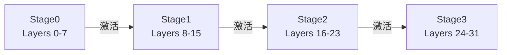

张量并行把「一层」切开，但仍希望卡与卡之间有 NVLink（[6.2](./6.2-张量并行推理.md)）。当模型继续长大、单机卡数不够，或必须跨节点扩展时，流水线并行（PP）登场：把模型按**层段**放到不同 GPU/节点，激活顺着管道向下游流。这一节建立 Bubble 与 Micro-batch 的直觉，并对照训练侧——推理没有反向，却有 Decode「步步穿管」的硬约束。

<!-- more -->

## 📑 目录

- [1. PP 的切分对象](#1-pp-的切分对象)
- [2. 为什么适合跨节点](#2-为什么适合跨节点)
- [3. Bubble：流水线气泡从哪来](#3-bubble流水线气泡从哪来)
- [4. Bubble 占比粗算](#4-bubble占比粗算)
- [5. Micro-batch：用多段工作填管道](#5-micro-batch用多段工作填管道)
- [6. 推理侧 vs 训练侧](#6-推理侧-vs-训练侧)
- [7. TP × PP 组合选择](#7-tp--pp-组合选择)
- [8. 实践建议与权衡](#8-实践建议与权衡)
- [总结](#-总结)
- [自我检验清单](#-自我检验清单)
- [参考资料](#-参考资料)

---

## 1. PP 的切分对象

PP 把 Transformer 的层序列切成若干 **Stage（段）**：

- Stage 0 持有前几层，Stage 1 持有中间几层，……，最后一段产出 logits。
- 前向时，激活从 Stage 0 → Stage 1 → … 依次传递。
- 每张卡只存自己那一段的权重，显存随段数近似下降。



🔑 **核心概念**：**PP = 层间模型并行。** 通信是**相邻 Stage 之间的点对点激活传递**，不是 TP 那种每层全体 AllReduce。

---

## 2. 为什么适合跨节点

对比通信模式：

| 模式 | 通信形态 | 频率（概念） | 跨节点友好度 |
|---|---|---|---|
| TP | 集合通信（AllReduce 等） | 每层/每步多次 | 差 |
| PP | 点对点（P2P）激活 | 每步每段边界一次量级 | 较好 |

跨节点链路上，PP 的消息往往更大、次数更少，比「小消息 + 高频 AllReduce」更耐延迟。于是常见拓扑是：

- **节点内 TP** 吃满 NVLink；
- **节点间 PP** 承担模型继续变大后的扩展。

📌 **关键点**：PP 不是因为「更快」才跨节点，而是因为**通信模式更适配高延迟链路**。它用流水线气泡和调度复杂度，换取可扩展的模型规模。

---

## 3. Bubble：流水线气泡从哪来

理想情况下，各 Stage 应始终有活干。现实是管道需要「灌满」和「排空」：

- 第一个 Micro-batch 到达末段之前，下游 Stage 在空等 → **气泡（Bubble）**。
- 最后一个 Micro-batch 离开首段之后，上游 Stage 也会空出来。

```text
时间 →
Stage0: [m0][m1][m2][m3]
Stage1:     [m0][m1][m2][m3]
Stage2:         [m0][m1][m2][m3]
              ^^ 前面的空档就是 Bubble
```

训练里用 Deep Pipeline、1F1B 等调度压气泡；推理同样要面对「段在等数据」，只是没有反向，目标改成 TTFT/TPOT/吞吐。

⚠️ **注意**：Bubble 浪费的是 **GPU 时间**，不是显存。PP 能让更大模型跑起来，但若气泡过大，有效算力利用率会难看。

---

## 4. Bubble 占比粗算

用经典流水线直觉（教学近似，**非某一调度器精确公式**）：

前提：

- Stage 数 $P=4$，各 Stage 算力近似均衡；
- 同一波次投入 $M$ 个等长 Micro-batch；
- 忽略段间传输时间与调度空隙（偏乐观）。

灌满管道大约需要 $P-1$ 个「空拍」量级；若总拍数近似 $M+P-1$，空闲占比粗估：

\[
\text{Bubble 占比} \approx \frac{P-1}{M+P-1}
\]

| $M$（微批数） | $P=4$ 时占比粗估 |
|---|---|
| 1 | $(4-1)/(1+3)=75\%$ |
| 4 | $3/7\approx 43\%$ |
| 16 | $3/19\approx 16\%$ |

解读：

- **只有 1 个微批穿管**：大部分时间下游在等——PP 几乎白开；
- 微批越多，气泡占比下降，但调度与段间传输次数上升；
- 推理里请求长短不一，真实气泡常比上表更差（短板 Stage 决定节拍）。

取舍句：为了把 Bubble 从「一眼 75%」压到「约 15%」量级，你需要足够的可流水工作（更多微批/并发请求）；**若线上长期只有极少并发，跨节点 PP 可能装得下模型，却买不起利用率**——这时更应评估量化降档、更大单机，或接受更低利用率换「能跑」。

---

## 5. Micro-batch：用多段工作填管道

**Micro-batch** 的思路：不要让整个全局 batch 作为一个整体走完流水线，而是切成多个小批次依次投入，让下游 Stage 在上游还在算下一块时就有事做。

对推理服务而言，「Micro-batch」常常落成：

- Continuous Batching（[2.2](../第2章-推理引擎核心技术/2.2-Continuous%20Batching.md)）里多个请求/Token 块在时间上错峰进入不同 Stage；
- 或引擎显式把一批 Prefill/Decode 工作切成可流水的单元。

填充得越好，气泡越小，吞吐越高。但切太碎会增加调度与传输次数；切太粗又填不满管道。需要结合 Stage 数、段间带宽、请求长度分布调。

💡 **提示**：把 PP 想象成多道安检：只放行一个人时后面窗口全空；把人流切成多小组连续放行，窗口利用率才高——Micro-batch 就是在制造「连续人流」。

---

## 6. 推理侧 vs 训练侧

| 维度 | 训练 PP | 推理 PP |
|---|---|---|
| 方向 | 前向 + 反向，可用 1F1B 等重叠 | 主要前向；无梯度回流填气泡 |
| 批次 | 大批量、形状相对齐 | 请求长短不一，Prefill/Decode 混部 |
| 延迟目标 | 吞吐优先，可容忍步时长 | TTFT/TPOT 直接进 SLO |
| Decode | 无「每 Token 穿管」产品约束 | **每生成 1 Token 都要走完所有 Stage** |
| 状态 | 激活/梯度生命周期短 | KV 按请求驻留，与 Stage 放置耦合 |

推理侧的特殊难点：

1. **长度差异大**：长 Prefill 与 1-Token Decode 同管道，Stage 耗时不均，气泡更难消。
2. **Decode 步步穿管**：段间等待进入 TPOT；Stage 越多，单步串行段数越多。
3. **与 Continuous Batching / Scheduler 耦合**：哪些请求本步进入管道、Token Budget 如何切（[3.4](../第3章-深入vLLM/3.4-调度器源码导读.md)），决定管道是否空转。
4. **负载不均衡**：层切分不均时，最慢 Stage 定节拍。

因此，推理 PP 的成功不只取决于「能不能切开」，更取决于**调度能否持续喂饱最慢 Stage**。

📌 **关键点**：训练 PP 的论文数字不能直接当推理 SLA；缺了反向重叠与大批量，**同样的 Stage 数在推理里往往更「空」**。

---

## 7. TP × PP 组合选择

设总 GPU 数为 $N$，一种常见分解：

\[
N = TP \times PP \times DP
\]

（暂忽略 EP。）选型启发式：

| 目标 | 更倾向 |
|---|---|
| 压单请求延迟、机内带宽极强 | 提高 TP，PP 尽量小 |
| 模型太大必须跨机 | 机内 TP 拉满，剩余用 PP |
| 主要扩吞吐且模型已能单实例放下 | 提高 DP，而不是盲目加 PP |
| 段间网络一般 / 并发很低 | 减少 PP Stage 数，避免过多气泡 |

示例（2 机 × 8 卡 = 16 GPU，装一个超大 Dense 模型）：

- ✅ `TP=8, PP=2`：每机一个 TP 组，跨机两段流水线。
- ⚠️ `TP=16, PP=1`：跨机 TP，Decode 通信风险高（见 6.2）。
- ⚠️ `TP=2, PP=8`：Stage 过多，气泡与段间跳数可能失控。

📌 **关键点**：**先定 NVLink 域内的 TP，再用 PP 吃掉跨节点扩展，最后用 DP 堆吞吐。** 与 [6.1](./6.1-推理并行策略总览.md) 总览一致。

---

## 8. 实践建议与权衡

在 vLLM 中对应参数是 `pipeline_parallel_size`（与 `tensor_parallel_size` 联用）：

```bash
# 示例：2 机，每机 8 卡 → TP=8, PP=2（示意）
vllm serve <model> \
  --tensor-parallel-size 8 \
  --pipeline-parallel-size 2
```

检查清单：

1. 确认层数可被 PP 整除，或框架允许的不均匀切分可接受。
2. 观察各 Stage 的 GPU 利用率是否接近；长期一高一低说明切分或喂料不均。
3. 对比 `PP=1` 基线（若显存允许）的 TTFT/TPOT，确认跨节点 PP 的净收益。
4. 与 Ray 多节点编排配合时，保证同一 TP 组落在同一节点（见 [6.5](./6.5-多节点部署Ray.md)）。

| 选择 | 收益 | 代价 / 不适用 |
|---|---|---|
| 增大 PP | 更大模型可跨机装载 | Bubble↑、Decode 穿管段数↑ |
| 增大微批/并发填管 | 利用率↑、吞吐↑ | 调度复杂；TTFT 可能排队 |
| 少 Stage + 更强单机/量化 | 气泡小、运维简单 | 可能装不下超大 Dense |

适用：机内 TP 已用满、模型仍装不下、跨节点有可用带宽、线上有足够并发可填管。  
若并发极低且延迟极敏感，优先量化/更大单机，而不是为「能加载」付高气泡税。

---

## 📝 总结

- PP 按层段切分，通信以相邻 Stage 的 P2P 为主，比跨节点 TP 更合适。
- **Bubble** 来自灌满/排空与 Stage 等待；粗估占比随 $P$ 升、随 $M$ 降。
- **Micro-batch**（及服务化错峰喂料）用来提高管道利用率。
- 推理无反向重叠、Decode 步步穿管、请求长短不一，使 PP 比训练更敏感。
- 组合上优先 **机内 TP × 跨机 PP**，并用利用率与延迟压测验证。

## 🎯 自我检验清单

- 能对比 TP 与 PP 的切分对象和通信形态
- 能解释为什么 PP 比大跨度 TP 更适合跨节点
- 能画出 4 Stage 上 Bubble 出现的位置
- 能用 $(P-1)/(M+P-1)$ 直觉口述气泡如何随微批数下降
- 能说明 Micro-batch 如何降低气泡
- 能举出推理相对训练让 PP 更难的两个原因
- 能在给定 2×8 卡拓扑上给出合理的 TP×PP 方案并说明理由

## 📚 参考资料

- [GPipe: Efficient Training of Giant Neural Networks using Pipeline Parallelism](https://arxiv.org/abs/1811.06965)
- [PipeDream / 流水线调度相关工作](https://arxiv.org/abs/1806.03377)
- [Megatron-LM Pipeline Parallelism](https://arxiv.org/abs/2104.04473)
- [vLLM Distributed Inference and Serving](https://docs.vllm.ai/en/latest/serving/distributed_serving.html)
- [本模块 2.2 Continuous Batching](../第2章-推理引擎核心技术/2.2-Continuous%20Batching.md)
- [本模块 6.2 张量并行推理](./6.2-张量并行推理.md)
