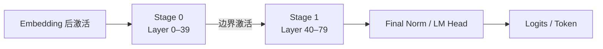

流水线并行不切一层内部的矩阵，而是把不同层交给不同 stage。一个请求必须依次经过所有 stage，所以 PP 用较低频的边界通信换来了严格的顺序依赖。

<!-- more -->

## 📑 目录
- [1. 问题：为什么不继续增大 TP](#1-问题为什么不继续增大-tp)
- [2. 机制：按层与 stage 切分](#2-机制按层与-stage-切分)
- [3. 边界上传递什么](#3-边界上传递什么)
- [4. 推理 microbatch 怎样形成流水](#4-推理-microbatch-怎样形成流水)
- [5. 公式：填充、排空与 bubble](#5-公式填充排空与-bubble)
- [6. Stage balance：最慢者决定周期](#6-stage-balance最慢者决定周期)
- [7. Decode 时序、TTFT 与 TPOT](#7-decode-时序ttft-与-tpot)
- [8. 70B 算例：TP=8 与 PP=2](#8-70b-算例tp8-与-pp2)
- [9. 代价与故障域](#9-代价与故障域)
- [10. 理论事实与实现选择](#10-理论事实与实现选择)
- [11. 适用边界与交接](#11-适用边界与交接)
- [总结](#总结)
- [自我检验](#自我检验)
- [参考资料](#参考资料)

---

## 1. 问题：为什么不继续增大 TP
6.2 的 TP=8 Decode 快照，在 80 层中约有 160 次主要 collective。如果单节点仍装不下模型，把 TP 从 8 扩到 16 会让这些高频同步跨节点。
本章算例的节点间有效带宽只有 25 GB/s，远低于节点内的 300 GB/s。PP 提供了另一种切法：
- 每个 stage 只保存一部分连续层；
- stage 内仍可使用节点内 TP；
- 节点间只在少数 stage 边界传递激活。
它首先回答的是容量与拓扑问题：怎样让一个逻辑副本跨节点，又不把每层 collective 都放上慢链路。
PP 并不天然让单请求更快。同一个 Token 仍要走完所有层，现在还多了 stage 边界和调度状态。

---

## 2. 机制：按层与 stage 切分
设模型有 $L$ 层，切成 $p$ 个按顺序排列的 stages。
对最简单的连续均分，第 $s$ 个 stage 负责：

$$
\mathcal{L}_s = \left[ \frac{sL}{p}, \frac{(s+1)L}{p} \right)
$$

当 $L=80$、$p=2$ 时：

```text
Stage 0：Layer 0–39
Stage 1：Layer 40–79
```

请求的隐藏状态按相同顺序流动：

每个 stage 只保存自己负责层的权重。每个 stage 也只保存自己负责层产生的 KV Cache。
如果 stage 内再用 TP=8，则每个 stage 本身是一个 8-rank TP 组。整个逻辑副本由两个顺序依赖的 TP 组组成。
PP 与 TP 的切分尺度不同：
- TP 在一层内部合作，通常每层都有 collective；
- PP 在层与层之间交接，只在 stage 边界传激活；
- TP 的成员同时参与同一层；
- PP 的 stages 依前后顺序推进。

---

## 3. 边界上传递什么

### 3.1 基本激活大小
若边界隐藏状态形状为 $[T,H]$，元素大小为 $b$ Bytes，一次边界载荷约为：

$$
M_{\text{boundary}}=T\times H\times b
$$

这里不传下一 stage 的权重，也不需要把上一 stage 已保存的 KV Cache 一起传走。
每个 stage 持有本地层的 KV，边界上传递的是继续前向所需的当前激活与必要元数据。

### 3.2 70B Prompt 的边界
对 $T=4096$、$H=8192$、BF16：

$$
M_{\text{prefill}} =4096\times8192\times2 =64\text{ MiB}
$$

若跨节点有效带宽为 25 GB/s，忽略启动时延的传输项约为：

$$
\frac{64\text{ MiB}}{25\text{ GB/s}} \approx2.68\text{ ms}
$$

这是一个边界、一个完整激活的算法载荷估算。协议、竞争、布局转换和额外元数据会继续增加时间。

### 3.3 Decode 快照的边界
沿用 6.2 的 32 个活跃序列快照：

$$
M_{\text{decode}} =32\times8192\times2 =0.5\text{ MiB}
$$

传输项约为：

$$
\frac{0.5\text{ MiB}}{25\text{ GB/s}} \approx21\ \mu s
$$

小消息下固定时延可能比这项更重要。

### 3.4 TP×PP 下的布局
若 stage 内 TP=8，边界激活可能按匹配 rank 分片发送。理想情况下每个 rank 发送：

$$
M_{\text{rank}}=\frac{T\times H\times b}{8}
$$

但 8 条流仍可能共享同一节点 NIC。瓶颈时间受 NIC 聚合带宽约束，不能把每 rank 字节除以单链路峰值后直接当成边界时间。
边界是复制布局、分片布局，还是需要额外 gather/broadcast，属于实现选择，不是 PP 定义本身。

---

## 4. 推理 microbatch 怎样形成流水

### 4.1 流水需要独立工作单元
只有一个工作单元时，Stage 1 必须等待 Stage 0，Stage 0 完成后又没有下一份工作。
多个独立工作单元可以错峰推进：
```text
时隙 0：Stage 0 处理 MB0
时隙 1：Stage 0 处理 MB1；Stage 1 处理 MB0
时隙 2：Stage 0 处理 MB2；Stage 1 处理 MB1
```
这里的 MB 表示推理中的前向工作单元。它可能来自：
- 同一调度轮中的不同请求子批；
- 一个长 Prompt 被切出的 Prefill chunks；
- 连续到达的独立请求；
- 不同序列当前可执行的 Decode Token。

### 4.2 它不是训练梯度累积
训练 microbatch 常用于固定 global batch、组织前向/反向和积累梯度。
推理没有反向传播，也没有等待若干 microbatches 后统一更新参数的边界。
推理 microbatch 的目的只是：提供可在 stages 之间重叠的前向工作，同时控制等待时间与激活峰值。
训练中的 1F1B、梯度累积和反向激活保存不是本节讨论对象。

### 4.3 自回归依赖限制
同一个序列的 Token $n+1$ 依赖 Token $n$ 经过最后 stage 后的采样结果。
因此未来 Token 不能提前作为独立 MB 进入 Stage 0。Decode 流水主要依赖不同请求或不同序列之间的独立性，而不是把一个序列的未来 Token 并行化。

---

## 5. 公式：填充、排空与 bubble

### 5.1 等速 stage 的理想模型
设有 $p$ 个 stages，每个 microbatch 在每个 stage 上都花费 $t$，共有 $m$ 个 microbatches。
第一个 microbatch 完成需要：

$$
T_{\text{first}}=pt
$$

流水填满后，每隔 $t$ 完成一个 microbatch。全部完成的理想时间为：

$$
T_{\text{pipe}}=(p+m-1)t
$$

若完全串行执行，总 stage 工作量为：

$$
T_{\text{serial work}}=pmt
$$

平均 stage 利用率为：

$$
U_{\text{ideal}} =\frac{m}{m+p-1}
$$

### 5.2 PP=2 的直觉
只有一个 microbatch：

$$
U=\frac{1}{1+2-1}=50\%
$$

有 8 个 microbatches：

$$
U=\frac{8}{8+2-1} =\frac{8}{9} \approx88.9\%
$$

增大 $m$ 能摊薄填充和排空，却可能为了凑更多工作而增加排队。

### 5.3 不等速 stage
设 stage $s$ 的计算与边界时间合计为 $t_s$。第一个 microbatch 的路径时间约为：

$$
T_{\text{first}} \approx\sum_{s=0}^{p-1}t_s
$$

稳态周期受最慢 stage 约束：

$$
T_{\text{cycle}} \approx\max_s t_s
$$

处理 $m$ 个 microbatches 的近似时间为：

$$
T_{\text{pipe}} \approx \sum_s t_s +(m-1)\max_s t_s
$$

增加 microbatch 数只能减少 fill/drain bubble 的相对占比。它不能消除最慢 stage 造成的 imbalance bubble。

---

## 6. Stage balance：最慢者决定周期

### 6.1 平均分层只是初稿
80 层平均切成 40/40，不代表两个 stage 的时间与显存相同。
Stage 0 可能额外持有 Embedding 或多模态前端。最后 stage 可能额外持有 Final Norm、LM Head 和采样路径。
模型还可能包含不同代价的层：
- Dense 与 MoE 层交错；
- 局部 Attention 与全局 Attention 交错；
- 不同层使用不同 KV 或稀疏结构；
- 首尾模块权重未共享。

### 6.2 两套 balance
容量 balance 要求每个 stage 都能放下：

$$
M_s = \sum_{l\in\mathcal{L}_s}M_{W,l} + N_{\text{tokens}} \sum_{l\in\mathcal{L}_s}m_{KV,l} + M_{\text{runtime},s} <M_{\text{usable},s}
$$

计算 balance 则希望：

$$
\max_s t_s-\min_s t_s
$$

尽可能小。
把一层从慢 stage 移到快 stage，可能改善周期，却让后者 OOM。因此应先满足容量，再在可行切分中减少最大 stage 时间。

### 6.3 Prefill 与 Decode 可能有不同最慢者
长 Prompt 下，Attention 和边界大消息可能主导 Prefill。
Decode 下，LM Head、采样、小消息时延或某类层可能更突出。
只按 Prefill 均衡 stages，不保证 TPOT 的最慢 stage 也均衡。最终目标应是混合真实流量下的 Goodput，而不是某个 stage 的平均利用率。

---

## 7. Decode 时序、TTFT 与 TPOT

### 7.1 单个序列的依赖路径
对 PP=2：
```text
Token n：
Stage 0 -> 边界 -> Stage 1 -> logits -> sample

Token n+1：
                                      Stage 0 -> 边界 -> Stage 1 -> ...
```
同一序列的下一 Token 必须等待上一 Token 完成整条路径。
因此低并发单序列的 Token 延迟下界接近：

$$
T_{\text{token,path}} \gtrsim t_0+t_{\text{link}}+t_1+t_{\text{sample}}
$$

$\max(t_0,t_1)$ 表示多份独立工作填满流水后的产出周期，不等于单个序列一个 Token 的端到端依赖时间。

### 7.2 TTFT
TTFT 可分解为：

$$
TTFT \approx T_{\text{queue}} +T_{\text{prefill across stages}} +T_{\text{first logits}} +T_{\text{return}}
$$

PP 增加了 stage 顺序路径和边界传输。Chunked Prefill 可以提供更多可流水单元，却也增加调度轮次，并可能让完整 Prompt 更晚结束。
为了填满流水而等待凑批，会直接提高 $T_{\text{queue}}$。所以高 stage 利用率不必然带来更好 TTFT。

### 7.3 TPOT
对单请求，TPOT 包含上一 Token 完成后到下一 Token 完成的整条依赖。
高并发时，不同请求的 Token 可以分布在不同 stages，提高整个流水的输出吞吐。但请求还会经历排队、交错和长 Prefill 干扰。
可用两个不同量区分：

$$
\text{aggregate output cadence} \approx\max_s t_s
$$

$$
\text{per-request token latency} \gtrsim\sum_s t_s
$$

前者更接近吞吐问题，后者才直接约束 TPOT。

### 7.4 Head-of-line blocking
一个 4096 Token Prefill 若作为大块进入 stage，可能让等待中的小 Decode 工作延后。
把 Prefill 切块可减少单次占用，却提高边界消息数和调度开销。
选择粒度时必须同时看：
- TTFT P99 是否在 2 s 内；
- TPOT P99 是否在 60 ms 内；
- 为降低尾延迟付出的空泡是否降低了 Goodput。

---

## 8. 70B 算例：TP=8 与 PP=2

### 8.1 容量变化
80 层切成两个 40 层 stages。130.4 GiB 权重理想按 PP=2 分成：

$$
M_{W,\text{stage}}\approx65.2\text{ GiB}
$$

每个 stage 内再用 TP=8：

$$
M_{W,\text{rank}} \approx\frac{130.4}{2\times8} \approx8.15\text{ GiB}
$$

一个满长请求全局 KV 约 1.33 GiB。先按层切半，再按 8 个 KV Heads 切分，理想每 rank 约为：

$$
M_{\text{KV,rank/request}} \approx\frac{1.33}{2\times8} \approx85\text{ MiB}
$$

这些仍是理想可分片项，未包含复制模块、临时激活和运行时缓冲。

### 8.2 通信变化
TP=8 仍在每个 stage 的 40 层内做高频 collective，但全部留在各自节点。
两个 stages 之间，Prefill 完整边界约 64 MiB，Decode 32-Token 快照约 0.5 MiB。
与 TP=16 跨节点的每层 collective 相比，PP=2 大幅降低跨节点通信频次。

### 8.3 SLO 与副本数变化
PP=2 使用全部 16 张 GPU 构成一个逻辑副本。任一节点失败，整个副本失去完整层链。
而两个独立 TP=8 副本同样使用 16 张 GPU，能让不同请求分流并保留一个副本的故障余量。
由于本算例的 TP=8 单节点容量看起来可行，PP=2 不是默认优胜者。只有单节点容量、模型结构或单请求计算证明它必要时，才值得用一个跨节点副本替代两个独立副本。

---

## 9. 代价与故障域

### 9.1 四类 bubble
**Fill/drain bubble**：有限 microbatches 进入和离开流水时产生。
**Arrival bubble**：在线请求到达不足，Stage 0 没有新工作可发。
**Imbalance bubble**：快 stage 每周期等待最慢 stage。
**Dependency bubble**：同一序列未来 Decode Token 尚未产生，不能提前执行。
增大 batch 只可能缓解其中一部分，并可能以更高排队时间为代价。

### 9.2 状态分散
一个请求的 KV 分散在所有 stages：Stage 0 保存前 40 层 KV，Stage 1 保存后 40 层 KV。
仅有某一个 stage 的状态，不能继续完成该请求。在途激活也只对当前前向位置有意义。

### 9.3 故障链
一个 stage 或其中一个 TP rank 失效时：
1. 当前边界发送或本地 collective 无法完成；
2. 其他 stages 等待依赖；
3. 在途 microbatches 不能提交结果；
4. 该副本上的活跃请求失去完整执行链；
5. 恢复需要重建 stage、进程组与请求状态。
PP stages 不是可互相替代的副本。Stage 1 空闲也不能接替 Stage 0 的层。

### 9.4 尾延迟放大
PP 的平均吞吐可能很好，但一个偶发慢 stage 会让其后所有工作单元排队。
同步流水的完成时间由最慢路径决定，所以应观察 stage 时间分布，而不是只看所有 GPU 的平均利用率。

---

## 10. 理论事实与实现选择

### 10.1 相对稳定的理论事实
- PP 沿层或 stage 边界切分模型；
- 前向激活必须按依赖顺序越过边界；
- 推理没有反向传播和梯度更新；
- 独立 microbatches 可以重叠，未来自回归 Token 不可以；
- fill/drain 由 $m/(m+p-1)$ 的理想模型解释；
- 稳态周期受最慢 stage 约束；
- 单请求 Token 路径仍包含所有 stages。

### 10.2 随框架和模型变化的实现选择
- stages 是否必须均分层数；
- Embedding、LM Head 与采样放在哪个 stage；
- 边界激活是复制发送还是按 TP rank 分片发送；
- Prefill 如何切 chunk，Decode 如何组成 microbatch；
- 能否交错虚拟 stages；
- 失败后是局部重启还是整个副本重建。
不能从“PP=2”推断所有这些细节。框架映射应在固定版本下逐项说明，而不是把当前接口写成 PP 原理。

---

## 11. 适用边界与交接
PP 更适合：
- 一个节点的总显存仍无法容纳逻辑副本；
- TP 再增大会跨越明显更慢的网络；
- 模型层能够形成容量和计算都较均衡的 stages；
- 有足够独立请求或 Prefill chunks 摊薄 bubble；
- SLO 能接受更长的顺序路径和恢复单元。
PP 未必适合：
- 单节点 TP 已能满足容量与单请求延迟；
- 低并发交互请求追求最短 TPOT；
- 层数少或层代价高度不均；
- 故障隔离比单副本容量更重要；
- 为填流水而凑批会突破 TTFT。
到这里，TP 和 PP 都是在构造一个逻辑副本。
下一节转向两个容易混淆的“分流”：DP 在副本之间路由完整请求，EP 在一个 MoE 前向内部路由 Token 到专家。一个复制服务，一个切分专家，它们的状态和通信完全不同。

---

## 总结
- PP 按层或 stage 切分，一个请求依次经过全部 stages。
- 边界激活基本载荷为 $T\times H\times b$。
- 70B 的 4096-Token Prefill 边界约 64 MiB，32-Token Decode 快照约 0.5 MiB。
- 推理 microbatch 用于重叠前向工作，不承担训练梯度累积语义。
- 理想利用率为 $m/(m+p-1)$，只解释等速流水的 fill/drain。
- 稳态产出周期看最慢 stage，单请求 Token 延迟仍看完整顺序路径。
- 平均分层不等于 stage balance，容量与 Prefill/Decode 时间都要核算。
- PP=2 会把两节点变成一个共同故障域，不等于两个服务副本。
- 当前 70B 算例若单节点 TP=8 已可行，两个 DP 副本通常比一个 PP=2 副本更值得先验证。

## 自我检验
- [ ] 能说明 PP 与 TP 分别在哪个尺度切分。
- [ ] 能复算 4096×8192 BF16 的边界激活大小。
- [ ] 能解释推理 microbatch 为什么不是梯度累积。
- [ ] 能推导 $(p+m-1)t$ 与理想利用率。
- [ ] 能区分 fill/drain、arrival、imbalance 和 dependency bubble。
- [ ] 能解释 $\max t_s$ 与 $\sum t_s$ 分别对应什么。
- [ ] 能说明 PP 如何分别影响 TTFT 与 TPOT。
- [ ] 能解释一个 stage 故障为何击穿整个逻辑副本。
- [ ] 能比较 TP=16 与 TP=8、PP=2 的跨节点通信频次。

## 参考资料
- Huang et al., [GPipe](https://arxiv.org/abs/1811.06965), 2019.
- Narayanan et al., [PipeDream](https://arxiv.org/abs/1806.03377), 2019.
- Narayanan et al., [Efficient Large-Scale Language Model Training on GPU Clusters](https://arxiv.org/abs/2104.04473), 2021.
- [NVIDIA NCCL Point-to-point Communication](https://docs.nvidia.com/deeplearning/nccl/user-guide/docs/usage/p2p.html)
- [vLLM Parallelism and Scaling](https://docs.vllm.ai/en/stable/serving/parallelism_scaling/)
> 训练流水线论文提供基本调度模型；本节只抽取前向依赖与 bubble 原理，不把训练反向调度套入在线推理。
