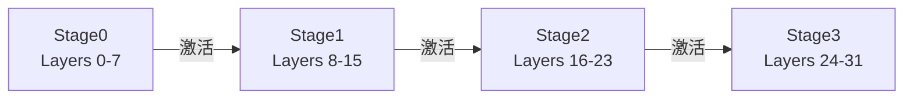

张量并行把"一层"切开，但仍希望卡与卡之间有 NVLink。当模型继续长大、单机卡数不够，或你必须跨节点扩展时，流水线并行（PP）就登场了：把模型按**层段**放到不同 GPU/节点上，激活顺着管道向下游流。这一节聚焦推理里的 Bubble、Micro-batch，以及和 TP 怎么组。

<!-- more -->

## 📑 目录

- [1. PP 的切分对象](#1-pp-的切分对象)
- [2. 为什么适合跨节点](#2-为什么适合跨节点)
- [3. Bubble：流水线气泡从哪来](#3-bubble流水线气泡从哪来)
- [4. Micro-batch：用多段请求填管道](#4-micro-batch用多段请求填管道)
- [5. 推理场景的特殊难点](#5-推理场景的特殊难点)
- [6. TP × PP 组合选择](#6-tp--pp-组合选择)
- [7. 实践建议](#7-实践建议)
- [总结](#-总结)
- [自我检验清单](#-自我检验清单)
- [参考资料](#-参考资料)

---

## 1. PP 的切分对象

PP 把 Transformer 的层序列切成若干 **Stage（段）**：

- Stage 0 持有前几层，Stage 1 持有中间几层，……，最后一段产出 logits。
- 前向时，激活从 Stage 0 → Stage 1 → … 依次传递。
- 每张卡只存自己那一段的权重，显存随段数近似下降。



🔑 **核心概念**：**PP = 层间模型并行。** 通信是**相邻 Stage 之间的点对点激活传递**，不是 TP 那种每层全体 AllReduce。

---

## 2. 为什么适合跨节点

对比通信模式：

| 模式 | 通信形态 | 频率（概念） | 跨节点友好度 |
|---|---|---|---|
| TP | 集合通信（AllReduce 等） | 每层/每步多次 | 差 |
| PP | 点对点（P2P）激活 | 每步每段边界一次量级 | 较好 |

跨节点链路上，PP 的消息往往更大、次数更少，比"小消息 + 高频 AllReduce"更耐延迟。于是常见拓扑是：

- **节点内 TP** 吃满 NVLink；
- **节点间 PP** 承担模型继续变大后的扩展。

📌 **关键点**：PP 不是因为"更快"才跨节点，而是因为**通信模式更适配高延迟链路**。它用流水线气泡和调度复杂度，换取可扩展的模型规模。

---

## 3. Bubble：流水线气泡从哪来

理想情况下，各 Stage 应始终有活干。现实是管道需要"灌满"和"排空"：

- 第一个 Micro-batch 到达 Stage 3 之前，Stage 3 在空等 → **气泡（Bubble）**。
- 最后一个 Micro-batch 离开 Stage 0 之后，Stage 0 也会空出来。

气泡比例粗略随 Stage 数增加而变差：段越多，灌满/排空占比越大。训练里用 Deep Pipeline、1F1B 等调度压气泡；推理同样要面对"段在等数据"的问题，只是没有反向，调度目标改成 TTFT/TPOT/吞吐。

```text
时间 →
Stage0: [m0][m1][m2][m3]
Stage1:     [m0][m1][m2][m3]
Stage2:         [m0][m1][m2][m3]
              ^^ 前面的空档就是 Bubble
```

⚠️ **注意**：Bubble 浪费的是 **GPU 时间**，不是显存。PP 能让更大模型跑起来，但若气泡过大，有效算力利用率会难看。

---

## 4. Micro-batch：用多段请求填管道

**Micro-batch** 的思路：不要让整个全局 batch 作为一个整体走完流水线，而是切成多个小批次依次投入，让下游 Stage 在上游还在算下一块时就有事做。

对推理服务而言，"Micro-batch"常常落成：

- Continuous Batching 里多个请求/Token 块在时间上错峰进入不同 Stage；
- 或引擎显式把一批 Prefill/Decode 工作切成可流水的单元。

填充得越好，气泡越小，吞吐越高。但切太碎会增加调度与传输次数；切太粗又填不满管道。需要结合 Stage 数、段间带宽、请求长度分布调。

💡 **提示**：把 PP 想象成多道安检：只放行一个人时后面窗口全空；把人流切成多小组连续放行，窗口利用率才高——Micro-batch 就是在制造"连续人流"。

---

## 5. 推理场景的特殊难点

推理不同于训练的稳定大 batch：

1. **请求长度差异大**：有的 Prefill 很长，有的 Decode 只有 1 Token，Stage 耗时不均，气泡更难消。
2. **Decode 步步都要跑完整个管道**：每生成一个 Token，激活都要从 Stage0 走到末端，段间等待进入 TPOT。
3. **与 Continuous Batching 耦合**：哪些请求在本步进入管道、KV 如何按 Stage 驻留，都会影响是否空转。
4. **负载不均衡**：若层切分不均匀（有的 Stage 含更重算子），最慢 Stage 决定节拍（木桶短板）。

因此，推理 PP 的成功不只取决于"能不能切开"，更取决于**调度能否持续喂饱最慢 Stage**。

---

## 6. TP × PP 组合选择

设总 GPU 数为 $N$，一种常见分解：

\[
N = TP \times PP \times DP
\]

（暂忽略 EP。）选型启发式：

| 目标 | 更倾向 |
|---|---|
| 压单请求延迟、机内带宽极强 | 提高 TP，PP 尽量小 |
| 模型太大必须跨机 | 机内 TP 拉满，剩余用 PP |
| 主要扩吞吐且模型已能单实例放下 | 提高 DP，而不是盲目加 PP |
| 段间网络一般 | 减少 PP Stage 数，避免过多气泡 |

示例（2 机 × 8 卡 = 16 GPU，装一个超大 Dense 模型）：

- ✅ `TP=8, PP=2`：每机一个 TP 组，跨机两段流水线。
- ⚠️ `TP=16, PP=1`：跨机 TP，Decode 通信风险高。
- ⚠️ `TP=2, PP=8`：Stage 过多，气泡与段间跳数可能失控。

📌 **关键点**：**先定 NVLink 域内的 TP，再用 PP 吃掉跨节点扩展，最后用 DP 堆吞吐。** 这与 6.1 的总览一致。

---

## 7. 实践建议

在 vLLM 中对应参数是 `pipeline_parallel_size`（与 `tensor_parallel_size` 联用）：

```bash
# 示例：2 机，每机 8 卡 → TP=8, PP=2
vllm serve <model> \
  --tensor-parallel-size 8 \
  --pipeline-parallel-size 2
```

检查清单：

1. 确认层数可被 PP 整除或框架允许的不均匀切分策略可接受。
2. 观察各 Stage 的 GPU 利用率是否接近；长期一高一低说明切分或喂料不均。
3. 对比 `PP=1` 基线（若显存允许）的 TTFT/TPOT，确认跨节点 PP 的净收益。
4. 与 Ray 多节点编排配合时，保证同一 TP 组落在同一节点（见 6.5）。

---

## 📝 总结

- PP 按层段切分模型，通信以相邻 Stage 的 P2P 激活传递为主，比跨节点 TP 更合适。
- **Bubble** 来自管道灌满/排空与 Stage 等待；Stage 越多通常越难填满。
- **Micro-batch**（及服务化调度中的错峰喂料）用来提高管道利用率。
- 推理请求长短不一、Decode 步步穿管，使 PP 调度比训练更敏感。
- 组合上优先 **机内 TP × 跨机 PP**，并用利用率与延迟压测验证，而不是只看模型能否加载。

## 🎯 自我检验清单

- 能对比 TP 与 PP 的切分对象和通信形态
- 能解释为什么 PP 比大跨度 TP 更适合跨节点
- 能画出 4 Stage 上 Bubble 出现的位置
- 能说明 Micro-batch 如何降低气泡
- 能举出推理场景让 PP 更难的两个原因
- 能在给定 2×8 卡拓扑上给出合理的 TP×PP 方案并说明理由

## 📚 参考资料

- [GPipe: Efficient Training of Giant Neural Networks using Pipeline Parallelism](https://arxiv.org/abs/1811.06965)
- [PipeDream / 流水线调度相关工作综述](https://arxiv.org/abs/1806.03377)
- [vLLM Distributed Inference and Serving](https://docs.vllm.ai/en/latest/serving/distributed_serving.html)
- [Megatron-LM Pipeline Parallelism](https://arxiv.org/abs/2104.04473)
