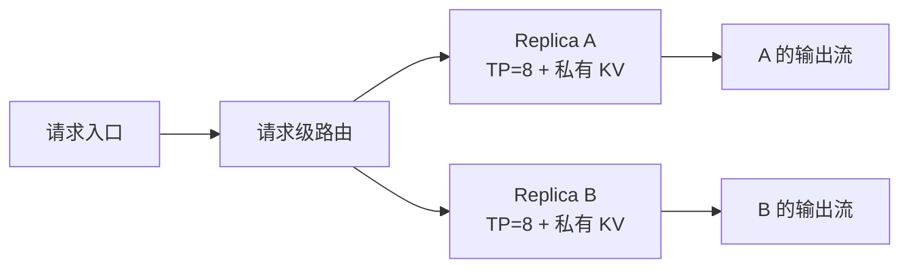

DP 与 EP 都会把工作分给不同设备，但 DP 分的是完整请求，EP 分的是进入 MoE 层的 Token—专家 assignment。如果不先说明“路由对象”，两种机制很容易被误称为同一种多卡分流。
<!-- more -->

## 📑 目录
- [1. 问题：两种分流为什么不能混同](#1-问题两种分流为什么不能混同)
- [2. DP 机制：复制逻辑副本](#2-dp-机制复制逻辑副本)
- [3. 独立 KV 与入口路由](#3-独立-kv-与入口路由)
- [4. 70B 稠密算例：两个 TP=8 副本](#4-70b-稠密算例两个-tp8-副本)
- [5. EP 机制：切专家而非切请求](#5-ep-机制切专家而非切请求)
- [6. Dispatch 与 combine All-to-All](#6-dispatch-与-combine-all-to-all)
- [7. 70B 级 MoE 变体：通信与容量](#7-70b-级-moe-变体通信与容量)
- [8. 负载不均、热点与尾延迟](#8-负载不均热点与尾延迟)
- [9. DP 与 EP 如何组合](#9-dp-与-ep-如何组合)
- [10. 代价、故障域与适用边界](#10-代价故障域与适用边界)
- [11. 理论事实与实现选择](#11-理论事实与实现选择)
- [12. 交接：从数据面到控制面](#12-交接从数据面到控制面)
- [总结](#总结)
- [自我检验](#自我检验)
- [参考资料](#参考资料)
---

## 1. 问题：两种分流为什么不能混同
先比较两个问题。
**问题 A：**一个 TP=8 的 70B 副本已经满足单请求延迟，但 8 request/s 稳态与周期突发让队列过长。
**问题 B：**一个 MoE 模型的专家总权重无法在每张 GPU 复制，而每个 Token 实际只激活少数专家。
问题 A 需要把不同请求交给不同逻辑副本，对应推理 DP 或服务复制。
问题 B 需要把不同专家放到不同 ranks，再把同一前向中的 Token 送到专家位置，对应 EP。
两者最核心的区别可以写成：
```text
DP 路由单位：request
DP 状态归属：一个副本拥有该请求的完整生命周期与 KV
EP 路由单位：token-expert assignment
EP 状态归属：Token 暂时去专家执行 MLP，随后返回原计算流
```
DP 的正常稠密前向不需要训练式梯度 AllReduce。EP 即使在纯推理中也需要数据面 collective，因为专家不在 Token 的原 rank 上。
---

## 2. DP 机制：复制逻辑副本

### 2.1 复制什么
一个 DP 副本复制的是完整的逻辑服务能力：
- 一份模型权重，或一整组 TP×PP 分片；
- 一套调度队列；
- 一份可用 KV Cache 池；
- 一组进程、通信组和运行时缓冲；
- 对该副本上活跃请求的所有权。
若单副本由 $G_{\text{replica}}$ 张 GPU 组成，复制 $R$ 份所需 GPU 数为：
$$
G_{\text{total}} =R\times G_{\text{replica}}
$$

### 2.2 不复制什么
请求不会同时在多个 DP 副本上共同完成同一步 Dense 前向。入口选择一个副本后，该请求通常在其上完成 Prefill 与全部 Decode。

这与训练 DP 不同。训练副本在反向后要同步梯度，以保证下一步参数继续一致。
静态权重的推理副本不做参数更新，所以不同请求的普通 Dense 前向可以独立推进。

### 2.3 聚合服务率
若第 $i$ 个副本的稳定服务率为 $\mu_i$，理想总服务率为：
$$
\mu_{\text{total}}=\sum_{i=1}^{R}\mu_i
$$
这只是上限。入口、前处理、路由失衡和共享资源竞争都会降低有效服务率。
---

## 3. 独立 KV 与入口路由

### 3.1 为什么请求需要粘在一个副本
Prefill 后，副本 A 已为请求建立 80 层 KV Cache。副本 B 即使保存相同权重，也没有这份请求状态。
若 Decode 中途把请求移到 B，系统必须满足至少一种条件：
- 把完整 KV 状态可靠迁移到 B；
- 从 Prompt 和已生成 Token 重新 Prefill；
- 从共享 KV 层恢复；
- 放弃请求并返回错误。
没有这些机制时，“把热请求随时移到空闲副本”并不可行。

### 3.2 路由不能只数请求
两个请求都计数为 1，但一个输出 16 Token，另一个输出 256 Token，占用 Decode 轮次相差 16 倍。
入口更应估算工作量：
$$
W_i \approx aN_{\text{prompt},i} +bN_{\text{remaining output},i} +cQ_i
$$
$Q_i$ 表示副本已有排队工作，$a,b,c$ 是服务根据历史观测确定的权重。
输出长度未知，所以任何预测都会有误差。实时队列、KV 余量和近期延迟必须用来纠偏。

### 3.3 Prefix Cache 亲和与负载冲突
副本 A 若缓存了一个长公共前缀，把相似请求继续发给 A 可以避免重复 Prefill。
但当 A 已严重排队时，缓存命中节省的计算可能小于等待损失。
可把路由分数抽象为：
$$
S_i =\lambda_q Q_i +\lambda_w W_i -\lambda_c C_i +\lambda_e E_i
$$
$C_i$ 是缓存命中价值，$E_i$ 是错误、拥塞或降级惩罚。选择较小的 $S_i$，但这些权重不是普遍常数。
---

## 4. 70B 稠密算例：两个 TP=8 副本

### 4.1 逻辑布局
沿用两节点各 8 张 GPU 的合同：
```text
Node 0：Replica A，TP=8
Node 1：Replica B，TP=8
```
每个副本全局保存约 130.4 GiB BF16 权重，理想每 rank 保存约 16.3 GiB 权重分片。
两个副本的集群权重总量约为：
$$
2\times130.4=260.8\text{ GiB}
$$
DP 没有减少集群权重，而是用重复权重换取请求并行与故障余量。

### 4.2 KV 容量彼此独立
一个满长请求约有 1.33 GiB 全局 KV。在 TP=8 理想分片后，每 rank 约为 170 MiB。
如果 A 接收 80 个活跃请求，B 只接收 20 个，它们的 KV 占用不会自动平均。
即使集群总显存还有空闲，A 也可能先耗尽本地 KV Blocks 或排队超时。

### 4.3 稳态与突发
一分钟内共有 520 个请求，平均到达率约为 8.67 request/s。
若两个副本完全均衡，平均每个副本承担：
$$
\frac{8.67}{2} \approx4.33\text{ request/s}
$$
5 秒突发期间，每个副本瞬时到达率约为：
$$
\frac{16}{2}=8\text{ request/s}
$$
所以“单副本稳定处理 4.5 request/s”可能在一分钟平均值上勉强稳定，却会在突发阶段快速积累队列并违反 TTFT P99。
副本数必须由突发曲线和排队预算决定，不能只用平均请求率向上取整。

### 4.4 故障后的容量
若 Node 0 失效，Replica A 的活跃 KV 随之失去，入口只能把新请求发给 B。
此时可用聚合服务率约减半。如果单个副本服务率低于稳态 8 request/s，恢复前队列将持续增长。
DP 提供的是故障隔离机会，不是自动状态恢复或自动 SLO 保证。

---

## 5. EP 机制：切专家而非切请求

### 5.1 MoE 层的函数
设一层有 $E$ 个专家。路由器为 Token $x_t$ 选择 Top-$k$ 专家：
$$
\mathcal{K}(t) =\{e_{t,1},\ldots,e_{t,k}\}
$$
并给出门控权重 $g_{t,j}$。MoE 输出可写为：
$$
y_t = \sum_{j=1}^{k} g_{t,j}f_{e_{t,j}}(x_t)
$$
EP 把专家函数 $f_e$ 分布到不同 ranks。每个 Token 的 Attention 和其他非专家层仍需按它们自己的 TP、DP 或复制布局执行。

### 5.2 一次 MoE 前向

同一个 Token 在 Top-2 下产生两个 assignments。两个专家可能位于不同 ranks。
专家输出计算完成后，结果必须返回 Token 的原计算流，再按门控权重组合并进入残差路径。

### 5.3 EP 的容量收益
若专家权重总量为 $M_E$，专家均匀分布到 $p$ 个 EP ranks，理想每 rank 专家权重为：
$$
M_{E,\text{rank}}\approx\frac{M_E}{p}
$$
Router、Attention、Norm、Embedding、共享专家和其他 Dense 权重不会因此自动除以 $p$。

---

## 6. Dispatch 与 combine All-to-All

### 6.1 Dispatch 发送什么
本地 rank 有 $T$ 个 Tokens，每个 Token 选择 $k$ 个专家，隐藏维为 $H$，元素大小为 $b$。
仅激活载荷为：
$$
M_{\text{assign}} =T\times k\times H\times b
$$
实际发送还可能包含：
- 目标专家 ID；
- 原 Token 位置；
- gate 权重或重建索引；
- 每个目标 rank 的计数；
- Padding 与对齐空间。

### 6.2 远端比例
若专家和路由近似均匀，EP size 为 $p$，约 $1/p$ assignment 留在本 rank。
远端 dispatch 载荷约为：
$$
M_{\text{remote}} \approx \frac{p-1}{p}TkHb
$$
Combine 将专家输出送回源 rank，激活返回载荷与 dispatch 同数量级。
往返载荷约为：
$$
M_{\text{roundtrip}} \approx 2\frac{p-1}{p}TkHb
$$

### 6.3 $\alpha$-$\beta$ 视角
若一个实现近似需要与其他 $p-1$ ranks 交换，单个 MoE 层的数据面时间可粗写为：
$$
T_{\text{EP}} \gtrsim 2\left[ (p-1)\alpha +\frac{M_{\text{remote}}}{BW_{\text{effective}}} \right] +T_{\text{pack}} +T_{\text{expert}} +T_{\text{imbalance}}
$$
前面的 2 表示 dispatch 与 combine。collective 算法可能合并消息或分层处理，所以 $(p-1)\alpha$ 是解释轮次的近似，不是固定实现契约。

---

## 7. 70B 级 MoE 变体：通信与容量

### 7.1 保持外部合同不变
这一小节把稠密 70B 替换为一个教学 MoE 变体：
```text
总参数仍约 70B，80 层，hidden size 8192
外部 Prompt、输出、到达率与 SLO 不变
专家：64 个，Top-2
EP group：8 ranks
激活与 KV：BF16 起算
```
它不是在声称稠密 70B 拥有专家。它只保持规模与服务合同可比，用来说明 EP 特有的数据流。

### 7.2 一个 Decode 路由快照
假设每个 EP rank 本轮有 $T=32$ 个 Tokens。Top-2 产生：
$$
T_{\text{assign}}=32\times2=64
$$
激活载荷为：
$$
M_{\text{assign}} =64\times8192\times2 =1\text{ MiB/rank}
$$
均匀路由下，远端 dispatch 约为：
$$
M_{\text{remote}} =\frac{7}{8}\times1 =0.875\text{ MiB/rank}
$$
dispatch 与 combine 往返约为：
$$
M_{\text{roundtrip}} \approx1.75\text{ MiB/rank/MoE layer}
$$
若瓶颈链路有效带宽为 25 GB/s，只计算往返载荷传输项：
$$
\frac{1.75\text{ MiB}}{25\text{ GB/s}} \approx73.4\ \mu s
$$
还没有加入两次 collective 的固定时延、pack/unpack、专家计算与热点等待。

### 7.3 专家容量
8 ranks 共处理：
$$
8\times32=256\text{ Tokens}
$$
Top-2 共生成：
$$
256\times2=512\text{ assignments}
$$
均匀分到 64 个专家，平均每专家只有：
$$
\frac{512}{64}=8
$$
个 assignments。
如果容量因子为 $c$，规则缓冲常用的教学上界为：
$$
C_e = \left\lceil c\frac{T_{\text{global}}k}{E} \right\rceil
$$
取 $c=1.25$ 时，每专家容量为 10。一个收到 30 个 assignments 的热点专家已经是容量的 3 倍。

---

## 8. 负载不均、热点与尾延迟

### 8.1 平均值为什么失真
路由均匀只是通信下界。真实 Prompt 领域、语言和 Token 模式会让部分专家更常被选择。
定义专家负载 $n_e$。最大值与平均值之比为：
$$
I_{\text{expert}} = \frac{\max_e n_e} {\frac{1}{E}\sum_e n_e}
$$
$I_{\text{expert}}=1$ 表示完全均匀。若为 3，最热专家承担平均值三倍的 assignment。

### 8.2 热点 rank
一个 rank 通常放置多个专家。若多个高频专家恰好位于同一 rank，该 rank 的接收、专家 GEMM 和发送都会同时变慢。
All-to-All 后的下一依赖点必须等待热点 rank。所以 EP 尾延迟由最大负载和最慢链路决定，而不是由平均每专家 8 个 assignment 决定。

### 8.3 容量不足的选择
理论上可以：
- Padding 到统一容量，浪费计算和网络；
- 排队或分块执行热点专家，提高延迟；
- 把 assignment 重路由到冗余专家；
- 复制热点专家，交换显存与尾延迟；
- 超过容量时丢弃 Token。
最后一种不能被当作普通性能优化。若模型或服务合同没有定义 Token drop，静默丢弃会改变模型函数，违反正确性要求。

### 8.4 增大 batch 的双向作用
更大的 Token 批次可以平滑统计波动，也能让 grouped GEMM 更饱满。
但它会：
- 为凑批增加 TTFT；
- 放大一次 All-to-All 字节；
- 增加 dispatch 缓冲；
- 让热点批次阻塞更多请求；
- 加剧 Prefill 对 Decode 的干扰。
目标仍是 SLO 下的 Goodput，不是让专家平均负载看起来更平滑。

---

## 9. DP 与 EP 如何组合

### 9.1 外层副本、内层专家
最容易理解的组合是：
```text
请求入口
  -> 选择 DP Replica
      -> Replica 内执行 Attention
      -> 到 MoE 层时在该 Replica 的 EP group 内 dispatch
      -> combine 后继续该请求
```
DP 决定请求生命周期属于哪个副本。EP 决定某一 MoE 层的 assignments 去哪些专家 ranks。
两层路由发生在不同时间尺度，维护不同状态，也承担不同故障域。

### 9.2 与 TP、PP 的组合
一个 MoE 逻辑副本还可能：
- 用 TP 切 Attention 与 Dense 投影；
- 用 PP 把不同层放到不同 stages；
- 在某些 stages 内用 EP 放置专家；
- 在副本外再用 DP 承接请求。
不能机械写出：
$$
G=DP\times TP\times PP\times EP
$$
因为 EP 组可能与 TP 或某类 DP ranks 重叠，非专家层与专家层使用的组也可能不同。
正确做法是先画进程组：
1. 哪些 ranks 合作执行一个 Dense 层；
2. 哪些 ranks 构成 PP 链；
3. 哪些 ranks 参加专家 All-to-All；
4. 哪些集合能独立拥有请求与 KV。

### 9.3 DP Attention 是另一种实现映射
部分 MoE 运行时会复制 Attention 权重，让不同 ranks 本地处理不同请求和 KV，到专家层再把 Tokens 汇入 EP group。
这种“DP Attention + EP”可以减少 Attention TP collective，却让所谓 DP ranks 在 MoE 层重新同步。
它不推翻 DP 与 EP 的理论区别。它说明同一组物理 ranks 可以在不同算子阶段承担不同并行角色。

---

## 10. 代价、故障域与适用边界

### 10.1 DP 的代价
- 每个副本重复保存权重和运行时；
- KV 与 Prefix Cache 通常不共享；
- 路由失衡会形成热副本；
- 活跃请求迁移昂贵；
- 入口和共享 CPU 路径可能成为瓶颈。
DP 适合单副本已满足单请求 SLO，但聚合吞吐、突发承载或可用性不足的情况。

### 10.2 EP 的代价
- 每个 MoE 层至少有 dispatch 与 combine；
- 小 Decode 批次难以摊薄固定时延；
- 热点专家放大 P99；
- 不规则消息需要 pack、计数和恢复顺序；
- 容量策略可能影响延迟甚至语义。
EP 只适合有专家结构、且专家权重或专家计算确实需要分布的模型。

### 10.3 故障域不同
一个独立 DP 副本失效时，其他副本理论上仍可接收新请求。失败副本的活跃 KV 是否可恢复是另一问题。
一个 EP rank 失效时，其专家权重和 collective 成员消失。依赖这些专家的整个逻辑副本通常无法继续正确前向。
外层有多个独立 DP 副本时，故障可被隔离在其中一个副本；若 EP 组跨越所谓 DP ranks，故障域就可能比命名上的一个 DP rank 更大。

---

## 11. 理论事实与实现选择

### 11.1 相对稳定的理论事实
- 推理 DP 复制逻辑副本并路由完整请求；
- 每个请求的 KV 有明确所有者；
- 静态 Dense 推理没有训练式逐步梯度同步；
- EP 切专家，并对 Token assignments 做 dispatch/combine；
- All-to-All 载荷随 $T$、$k$、$H$ 和元素字节增长；
- EP 同步时间受热点专家或热点 rank 约束。

### 11.2 随框架和版本变化的实现选择
- 入口如何估算副本负载；
- Prefix Cache 是否可跨副本共享；
- 请求或 KV 能否在线迁移；
- EP 使用原生 All-to-All 还是等价 collective 组合；
- 是否使用固定 capacity、Padding、dropless 或冗余专家；
- DP、TP 与 EP 的进程组如何重叠；
- 空闲 rank 是否仍需参加同步前向。
这些实现选择必须在固定版本下说明。6.6 会用版本化 vLLM 案例映射它们，但不会把该版本行为写成 DP/EP 的普遍定义。

---

## 12. 交接：从数据面到控制面
到目前为止，TP、PP 与 EP 都依赖一组进程在正确设备上同时存在。DP 又要求多个完整副本被发现、放置和管理。
这引出控制面问题：
- 谁知道两个节点各有 8 张 GPU；
- 谁把一个 TP 组放在同一高带宽域；
- 谁等待整组资源就绪后再启动；
- 谁发现进程或节点失联；
- 谁决定重启 Actor、重建进程组或替换副本；
- 谁保存集群元数据，谁保存请求 KV。
下一节用 Ray 作为多节点控制面案例。重点不是 Ray 命令，而是资源发现、placement、生命周期、心跳与状态重建，并明确它与 NCCL 数据面的边界。

---

## 总结
- DP 路由完整请求并复制逻辑副本，EP 路由 Token—专家 assignments。
- DP 副本拥有独立队列、KV 与通常局部的 Prefix Cache。
- 两个 TP=8 副本重复 70B 权重，却增加聚合服务率和故障隔离机会。
- EP 只切 MoE 专家，非专家层仍需其他放置策略。
- Dispatch 与 combine 的往返载荷约为 $2(p-1)TkHb/p$。
- 教学 MoE 快照每 rank 的往返激活约 1.75 MiB/MoE 层。
- 专家平均负载不能代表 P99，最热专家和热点 rank 决定等待。
- DP 与 EP 可以组合，但不能用一个“多卡分流”概念代替两层路由。
- 进程组可能重叠，因此总 GPU 数不能总写成四种并行度的机械乘积。

## 自我检验
- [ ] 能用一句话区分 DP 与 EP 的路由单位。
- [ ] 能解释请求为什么通常粘在一个 DP 副本。
- [ ] 能说明轮询请求数为何无法均衡 Token 工作量。
- [ ] 能复算两个 TP=8 副本的集群权重总量。
- [ ] 能描述 Router、dispatch、expert、combine 的完整顺序。
- [ ] 能推导 $TkHb$ 与远端比例。
- [ ] 能解释 capacity overflow 为何可能影响正确性。
- [ ] 能说明热点专家怎样放大集体同步的 P99。
- [ ] 能画出外层 DP、内层 EP 的两级路由。
- [ ] 能解释为什么 DP×TP×PP×EP 不总是合法资源公式。

## 参考资料
- Lepikhin et al., [GShard](https://arxiv.org/abs/2006.16668), 2020.
- Fedus et al., [Switch Transformers](https://www.jmlr.org/papers/v23/21-0998.html), 2022.
- Rajbhandari et al., [DeepSpeed-MoE](https://arxiv.org/abs/2201.05596), 2022.
- [NVIDIA NCCL Collective Operations](https://docs.nvidia.com/deeplearning/nccl/user-guide/docs/usage/collectives.html)
- [vLLM Data Parallel Deployment](https://docs.vllm.ai/en/stable/serving/data_parallel_deployment/)
- [vLLM Expert Parallel Deployment](https://docs.vllm.ai/en/stable/serving/expert_parallel_deployment/)
> MoE 数值使用教学变体；专家数、Top-k、容量策略和进程组都必须以目标模型与固定运行时版本为准。
