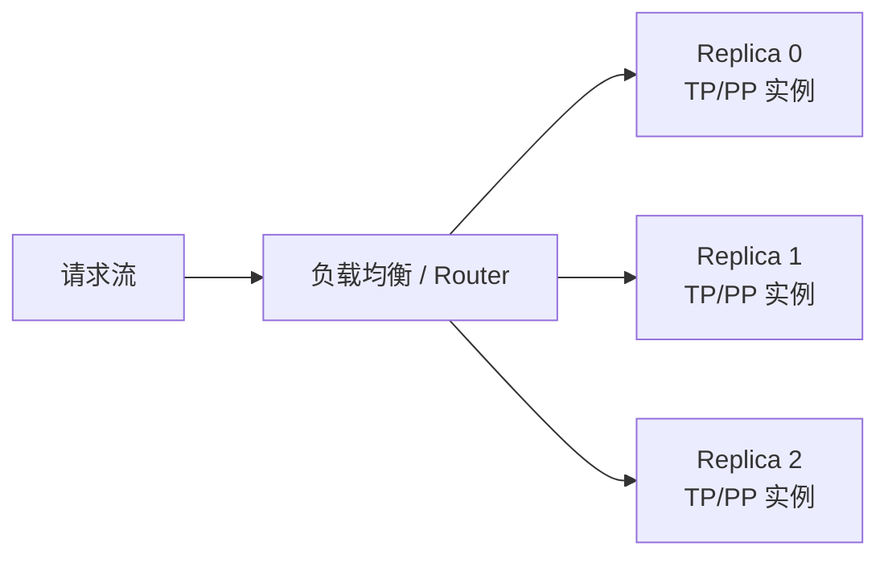
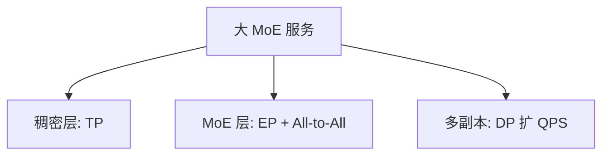

TP/PP 解决的是「模型怎么切开才能跑起来」（[6.1](./6.1-推理并行策略总览.md)–[6.3](./6.3-流水线并行推理.md)）。当单实例已经能稳定服务，瓶颈变成「实例不够用」时，就要上数据并行（DP）；若模型本身是巨型 MoE，还要把 Expert 摊到多卡——专家并行（EP）。这一节把两者的机制、与 MoE 的关系、All-to-All 代价和负载不均讲清楚。

<!-- more -->

## 📑 目录

- [1. 数据并行：复制实例扩吞吐](#1-数据并行复制实例扩吞吐)
- [2. DP 与训练中的 DP 有何不同](#2-dp-与训练中的-dp-有何不同)
- [3. DP 的工程代价与吞吐缩水](#3-dp-的工程代价与吞吐缩水)
- [4. 专家并行：MoE 的必备拼图](#4-专家并行moe-的必备拼图)
- [5. All-to-All：通信量与负载不均](#5-all-to-all通信量与负载不均)
- [6. DP / EP 如何和 TP/PP 共存](#6-dp--ep-如何和-tppp-共存)
- [7. 选型、观测与权衡](#7-选型观测与权衡)
- [总结](#-总结)
- [自我检验清单](#-自我检验清单)
- [参考资料](#-参考资料)

---

## 1. 数据并行：复制实例扩吞吐

推理里的 DP 非常直白：**把同一套引擎复制多份，请求分流到不同副本**。



它不降低单副本的模型显存占用，但近似线性提升系统吞吐（在负载可分、无严重倾斜时）。vLLM 中对应 `data_parallel_size`（以及多实例部署、K8s 副本等更广义的 DP）。

🔑 **核心概念**：**DP 扩的是「服务副本数」，不是「单模型的切分度」。** 先能单实例跑稳，再 DP；否则只是把 OOM 复制多份。

---

## 2. DP 与训练中的 DP 有何不同

| 维度 | 训练 DP | 推理 DP |
|---|---|---|
| 同步 | 每步梯度 AllReduce | 通常**无梯度同步** |
| 状态 | 优化器状态可分片（ZeRO） | 主要是 KV Cache、前缀缓存等运行时状态 |
| 目标 | 加大全局 batch、加快收敛吞吐 | 加大并发与 QPS，守住延迟 SLO |
| 一致性 | 参数必须一致更新 | 权重只读，副本间天然一致（同版本镜像） |

推理 DP 更像「无状态服务水平扩展」——真正有状态的是**每个请求的 KV** 以及可选的 **Prefix Cache**。请求一旦粘在某副本上，其 Decode 通常应继续留在该副本（或显式迁移 KV）。这与 Continuous Batching / 前缀缓存（第 2 章）直接相关：副本一多，缓存亲和就被打散。

---

## 3. DP 的工程代价与吞吐缩水

DP 看起来「加副本就行」，但有几处暗礁：

1. **前缀缓存命中率**：副本变多后，相同 System Prompt 的缓存被打散，命中下降，Prefill 变贵。
2. **负载倾斜**：长请求/高 Decode 长度请求扎堆某个副本，尾延迟恶化。
3. **粘性与故障转移**：副本挂了，未完成请求的 KV 如何恢复？需要重算或迁移策略。
4. **显存复制成本**：DP 不省权重显存，N 副本 ≈ N 倍权重占用（集群视角）。

教学示意（**非某集群实测**；单位 tok/s 与命中率）：

前提：单实例稳态输出吞吐 $T_1=4000\,\mathrm{tok/s}$；理想 DP=2 期望 $\approx 8000$。实际上线后前缀命中从 70% 降到 40%，Prefill 变重挤占 Decode 时间片，测得系统吞吐 $T_2=6200\,\mathrm{tok/s}$。

| 状态 | 系统吞吐 | 相对理想线性 |
|---|---|---|
| DP=1 | $4000\,\mathrm{tok/s}$ | — |
| DP=2 理想线性 | $8000\,\mathrm{tok/s}$ | 100% |
| DP=2 命中下降后 | $6200\,\mathrm{tok/s}$ | ~78% |

取舍句：副本数翻倍不等于 Goodput 翻倍；**若前缀高度共享，优先缓存亲和路由或做大单实例缓存，而不是盲目加 DP**——否则 Raw QPS 上升、满足 SLO 的有效吞吐缩水。

💡 **提示**：评估 DP 时盯 **P95/P99 TTFT/TPOT 与前缀命中率**，不要只看平均 QPS。抢占风暴（[3.4](../第3章-深入vLLM/3.4-调度器源码导读.md)）若已存在，先修单实例容量再复制。

---

## 4. 专家并行：MoE 的必备拼图

MoE（Mixture-of-Experts）层通常含大量 Expert，每个 Token 只激活其中少数（Top-K）。模型「稀疏计算、稠密参数」：

- 参数量可以到数百 B～T 级，但单 Token 只走少量 Expert。
- 若把所有 Expert 复制到每张卡，显存会爆；于是把不同 Expert 放到不同 GPU → **Expert Parallel（EP）**。

```text
Token 流 → Gate/Router 选 Expert → 把 Token 发给持有该 Expert 的 GPU → 本地算 → 再传回
```

与其它轴的关系：

| 轴 | 在 MoE 里通常管什么 |
|---|---|
| **TP** | 注意力等稠密层，或 Expert 内部再切 |
| **EP** | Expert 集合的分布与 Token 路由 |
| **PP** | 仍可按层段跨机（含稠密+MoE 层段） |
| **DP** | 整实例复制，扩 QPS（每个副本内部仍有 TP/EP） |

这与 TP「切同一个大矩阵」不同：EP 切的是**专家集合**，通信核心是 **All-to-All（全交换）**。

🔑 **核心概念**：**MoE 的「算力稀疏」不自动等于「分布式便宜」——EP 用 All-to-All 换 Expert 显存可扩展性。**

---

## 5. All-to-All：通信量与负载不均

All-to-All 的含义：每张卡都可能把一批 Token 发给任意其他卡，同时也接收来自任意卡的 Token。

### 5.1 通信量直觉

教学粗算（**示意**）：

前提：某步要路由的 Token 数 $N_t=8192$（Prefill 大 batch 量级），隐藏维 $H=4096$，BF16，Top-K=2，EP 度 $=8$。

- 每个 Token 向 K 个 Expert 各发一份激活片段，体积量级 $\propto N_t \times K \times H \times 2\,\mathrm{B}$；
- 仅「发出侧」粗估：$8192\times 2\times 4096\times 2 \approx 128\,\mathrm{MiB}$ 量级（未计返回路径与元数据）；
- Decode 时 $N_t$ 往往小得多，但**同步屏障仍在**，延迟可能压过带宽。

| 挑战 | 表现 | 影响 |
|---|---|---|
| **带宽压力** | 通信量随 Token 数与隐藏维上升 | Prefill 大 batch 时尤其重 |
| **路由倾斜** | 热门 Expert 被过多 Token 选中 | 热卡算很久，冷卡空转 |
| **小消息延迟** | Decode 时 Token 少、同步仍在 | 步延迟被通信尾部拖住 |
| **与 TP 叠加** | 同一节点内既有 TP 又有 EP | 通信域与进程组设计更复杂 |

### 5.2 负载不均

设 8 个 Expert 卡，理想情况每卡处理 $\approx 12.5\%$ Token。若路由塌缩到 2 个热 Expert 吃掉 $60\%$ Token：

- 热卡算力打满，步时长被它们定拍；
- 其余卡等 All-to-All 对齐 → **等效气泡**；
- 用户侧看到的是 TPOT/吞吐变差，而不是「平均 Expert 利用率还行」。

缓解思路包括：更均衡的路由/辅助损失（训练侧）、推理侧容量因子与丢弃策略、把 EP 通信限制在高带宽域、内核级 MoE 通信算子。观测上要看 **Expert 负载直方图**，不能只看平均 GPU util。

⚠️ **注意**：MoE 的「稀疏很省算力」不等于「分布式很好部署」。**EP 的 All-to-All 经常成为新瓶颈**，需要单独做带宽与倾斜观测。

---

## 6. DP / EP 如何和 TP/PP 共存

一个概念公式：

\[
\text{World Size} \approx TP \times PP \times DP \times EP
\]

（具体框架对 EP 是否计入 world size、是否与 DP 复用进程组会有差异，以引擎文档为准。）

实践直觉：

- **Dense 大模型**：`TP × PP` 放得下 → `DP` 扩吞吐。
- **大 MoE**：`TP`（稠密部分）+ `EP`（Expert）是主力；必要时再加 `PP`/`DP`。
- **通信域**：TP/EP 的热路径尽量留在 NVLink；DP 可以跨节点做请求级分流。



---

## 7. 选型、观测与权衡

**何时加 DP**

- 单实例 GPU 利用率已高、延迟仍达标，但 QPS 不够；
- 模型与 KV 配置在单实例内稳定。

**何时上 EP**

- Expert 参数成为显存主角；
- 单卡无法容纳全部 Expert，或不想把全部 Expert 复制到每个 TP rank。

**建议观测指标**

- DP：每副本 QPS、队列深度、前缀缓存命中率、P99 延迟。
- EP：All-to-All 耗时占比、Expert 负载直方图、热 Expert 利用率。

在 vLLM 中，DP 可通过 `--data-parallel-size` 等参数启用；EP 随 MoE 模型与版本支持变化，部署前对照当前版本文档确认。

```bash
# Dense：先 TP 放稳，再 DP 扩副本（示意骨架，非逐字）
vllm serve <dense-model> --tensor-parallel-size 4 --data-parallel-size 2

# MoE：确认当前版本 EP/相关参数后，再与 TP 组合压测 All-to-All 占比
vllm serve <moe-model> --tensor-parallel-size 2 ...  # EP 旗标以文档为准
```

| 选择 | 收益 | 代价 / 不适用 |
|---|---|---|
| 加 DP | QPS/吞吐↑ | 权重复制、缓存打散、故障粘性 |
| 上 EP | 超大 MoE 可装 | All-to-All + 路由倾斜 |
| 只加 DP 解决装不下 | — | **无效**，每副本仍 OOM |

适用：Dense 已单实例达标要扩容；或 MoE Expert 显存已成为主角。  
若还在「装不稳 / Decode 通信已炸」，先回到 TP/PP 与拓扑（6.2–6.3），再叠 DP/EP。

---

## 📝 总结

- **DP** 通过复制推理实例横向扩吞吐，无梯度同步，但要处理缓存命中、倾斜与故障粘性；线性加速常因命中率缩水。
- **EP** 把 MoE 的 Expert 分布到多卡，依赖 **All-to-All** 完成 Token 路由，带宽与负载均衡是核心风险。
- DP 不解决「装不下」；EP 不自动解决「QPS 不够」。二者和 TP/PP 正交组合。
- 评估时同时看吞吐与尾延迟；MoE 还要单独看 Expert 倾斜与通信占比。

## 🎯 自我检验清单

- 能说明推理 DP 与训练 DP 在同步需求上的本质区别
- 能列出至少两个盲目加 DP 可能带来的副作用，并能口述一笔吞吐缩水账
- 能描述 MoE 中 Router → All-to-All → Expert 计算的数据路径
- 能解释 Expert 负载不均为何导致尾延迟恶化
- 能给出 Dense 与 MoE 场景下 TP/PP/DP/EP 的组合直觉
- 能提出 DP 与 EP 各自应观测的关键指标
- 能说明 Dense 与 MoE 在启用 DP/EP 前各自的前置条件

## 📚 参考资料

- [vLLM Data Parallel / Distributed Serving](https://docs.vllm.ai/en/latest/serving/distributed_serving.html)
- [GShard / Switch Transformer（MoE 经典工作）](https://arxiv.org/abs/2006.16668)
- [DeepSeek-V3 技术报告（大规模 MoE 相关讨论）](https://arxiv.org/abs/2412.19437)
- [NCCL AlltoAll 语义](https://docs.nvidia.com/deeplearning/nccl/user-guide/docs/usage/collectives.html)
- [本模块 6.1 推理并行策略总览](./6.1-推理并行策略总览.md)
- [本模块 2.1 PagedAttention（KV / 前缀缓存语境）](../第2章-推理引擎核心技术/2.1-PagedAttention.md)
