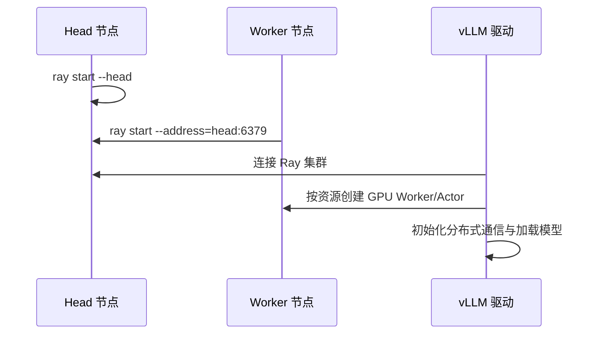

6.1–6.4 选好了 TP/PP/DP/EP；一旦跨机器，就需要有人负责「在哪台机器起哪个 rank、GPU 怎么钉住、失败怎么暴露」。vLLM 的多节点路径常借助 **Ray** 做编排。这一节不只写「怎么 start」，还要摊开 **Placement、故障面与运维代价**——编排通了不等于通信通了，更不等于 SLA 达标。

<!-- more -->

## 📑 目录

- [1. 为什么需要 Ray](#1-为什么需要-ray)
- [2. 集群拉起的基本形态](#2-集群拉起的基本形态)
- [3. Placement Group：把 TP 钉在同一节点](#3-placement-group把-tp-钉在同一节点)
- [4. 并行度到节点的映射](#4-并行度到节点的映射)
- [5. 故障面：比单机多了什么](#5-故障面比单机多了什么)
- [6. 运维代价：你在为扩展性付什么](#6-运维代价你在为扩展性付什么)
- [7. 环境与网络前提](#7-环境与网络前提)
- [8. 常见故障与排错顺序](#8-常见故障与排错顺序)
- [9. 实操检查清单与权衡](#9-实操检查清单与权衡)
- [总结](#-总结)
- [自我检验清单](#-自我检验清单)
- [参考资料](#-参考资料)

---

## 1. 为什么需要 Ray

跨节点推理至少要完成四件事：

1. 在多台机器上启动一组协作进程（workers）；
2. 为每个 worker 分配正确的 GPU 可见性；
3. 建立 NCCL/Gloo 等通信所需要的地址与 rank 世界；
4. 在调度上尊重拓扑：例如同一 TP 组不要跨机。

Ray 提供的是**分布式演员/任务运行时**与资源申报能力。vLLM 可以在其上创建 actor、申请 GPU 资源，并用 Placement Group 做放置约束。你也可以用其他编排（裸 `torchrun`、K8s Operator 等），但理解 Ray 路径有助于读懂 vLLM 多节点文档与日志。

🔑 **核心概念**：**Ray 负责「进程放哪、资源怎么申明」；NCCL 仍负责「GPU 之间怎么通信」。** 二者分工不同，排错时不要混为一谈。

---

## 2. 集群拉起的基本形态

典型步骤（概念流程）：



要点：

- **Head** 负责任务调度与元数据；推理 worker 应主要吃 GPU 节点资源。
- 所有节点的 **Ray 版本、CUDA/驱动、vLLM 版本**应一致，避免神秘序列化/插件错误。
- 防火墙需放行 Ray 端口与后续 NCCL 使用的网卡通路。

💡 **提示**：先让 `ray status` 看到所有节点 GPU 资源，再启动 vLLM。很多「分布式起不来」其实是 Ray 根本没把 GPU 注册进来。

---

## 3. Placement Group：把 TP 钉在同一节点

**Placement Group（放置组）** 用来声明一捆资源必须满足某种放置策略，例如：

- `PACK`：尽量挤到同一节点；
- `SPREAD`：打散到不同节点。

对推理并行，关键约束是：

- 一个 **TP 组**的 GPU 应 `PACK` 在同一节点（吃 NVLink，见 [6.2](./6.2-张量并行推理.md)）；
- 不同 **PP Stage** 可以落在不同节点（[6.3](./6.3-流水线并行推理.md)）；
- **DP 副本**通常彼此独立放置（[6.4](./6.4-数据并行与专家并行.md)）。

若没有放置约束，调度器可能把 `TP=8` 的 8 个 rank 拆到两台 4 卡机器上——模型或许仍能通信，但性能会按「跨节点 TP」的糟糕路径退化。

📌 **关键点**：多节点部署的第一性能原则不是「找齐 GPU 数量」，而是「**通信友好的放置**」。Placement Group 就是把这条原则写成调度约束。

---

## 4. 并行度到节点的映射

举例：2 节点 × 8 GPU，目标 `TP=8, PP=2`：

| 逻辑组 | 物理放置 |
|---|---|
| TP group / PP stage 0 | 节点 A 的 8 张 GPU |
| TP group / PP stage 1 | 节点 B 的 8 张 GPU |

若再乘 `DP=2`，需要 4 个节点（两套 PP=2 的副本），或在资源足够时按副本复制上述布局。

映射时自问三个问题：

1. 每个集合通信域是否落在预期互联上？
2. 每个节点的 GPU 是否被单一逻辑组占满，避免碎片？
3. Head 节点是否误占了宝贵的 GPU（可把 Head 放 CPU 节点）？

---

## 5. 故障面：比单机多了什么

单机 TP 的故障面大致是：进程、驱动、单机 PCIe/NVLink、本机磁盘。多节点 Ray 路径额外叠加：

| 故障层 | 典型症状 | 影响范围 |
|---|---|---|
| Ray 控制面 | Head 不可达、节点 DEAD | 全体无法调度/扩缩 |
| 放置错误 | 能跑但极慢 | 隐性跨机 TP，TPOT 崩 |
| 节点异构 | 某 worker 版本/驱动不一致 | 随机序列化错误、初始化 hang |
| 网络分区 | 部分 rank 超时 | 整组推理实例不可用 |
| 单 Stage OOM | 仅某节点爆显存 | 整条 PP 管道停摆 |
| 模型存储 | 某节点拉权重失败 | 启动失败或长尾重试 |

教学对照（**示意**）：单机 `TP=8` 故障域 = 1 台机器；`TP=8×PP=2` 跨两机后，**任一节点网卡抖动或 Ray worker 掉线，整条流水线停服**——可用性不是「两机更稳」，而是「任一环失效即全体失效」，除非你再叠 DP 热备。

取舍句：多节点换来的是模型规模与吞吐，**不是免费高可用**；若业务要抗单机故障，需要显式多副本（DP/服务层）与探活，而不是假设「上了 Ray 就冗余了」。

⚠️ **注意**：Ray 集群 `healthy` 只说明编排层通了；**NCCL warmup 失败、某 Stage OOM、网卡走错**仍会发生。两端都要验。

---

## 6. 运维代价：你在为扩展性付什么

把「能启动」之外的持续成本写进选型：

1. **版本矩阵**：Ray / CUDA / 驱动 / vLLM / 容器镜像必须跨节点对齐；升级变成「舰队升级」。
2. **可观测性**：至少要有 rank→node→GPU 映射、NCCL 超时日志、每 Stage 利用率；否则慢请求无法归因。
3. **变更窗口**：改 `TP/PP`、换网卡环境变量、滚动镜像，影响面是整组 GPU，回滚也更重。
4. **容量碎片**：Placement 约束导致「空着 4 卡却凑不齐同机 TP=8」——集群利用率账要单独算。
5. **人效**：排障路径比单机长一截（见第 8 节）；oncall 需要同时懂编排与 NCCL。

示意账（**非财务合同**）：若多节点 PP 只让你从「装不下」变成「能装」，但 oncall 每周多耗数小时在「初始化 hang / 走错网卡」，而量化后单机 `TP=8` 已能装下——**应用运维小时数去换一档量化/更大单机，而不是默认多机**。

💡 **提示**：6.1 的「单卡先算账」在运维上同样成立——分布式是最后一刀，不是第一反应。

---

## 7. 环境与网络前提

跨节点 NCCL 常见依赖：

| 项目 | 建议 |
|---|---|
| 网卡 | 明确 `NCCL_SOCKET_IFNAME` / IB 设备，避免走错网卡 |
| 互联 | 有 IB/RoCE 就让 NCCL 用上；确认 GID/TC 等配置 |
| 可见 GPU | `CUDA_VISIBLE_DEVICES` 与 Ray 资源申报一致 |
| 时钟与 DNS | 节点时间同步、主机名可解析，减少神秘超时 |
| 共享模型 | 各节点都能访问同一模型路径或对象存储缓存 |

---

## 8. 常见故障与排错顺序

建议按层排查，避免一上来改并行度：

1. **资源层**：`ray status` 是否看到预期 `GPU: N`？节点是否 `DEAD`？
2. **放置层**：worker 是否按节点聚合？有无跨机 TP 的迹象（日志中的 IP/rank 映射）？
3. **进程层**：各 rank 是否都起来、是否卡在 `init_process_group`？
4. **通信层**：NCCL 超时？试 `NCCL_DEBUG=INFO`，检查是否误用 docker0/错误网卡。
5. **模型层**：是否只有某 Stage OOM？切分是否不均？
6. **性能层**：能跑但不快 → 回到拓扑与 Placement，怀疑跨节点 TP 或网卡选错。

典型症状速查：

| 症状 | 优先怀疑 |
|---|---|
| 部分节点 GPU 为 0 | Ray 未识别 GPU / 驱动 / 容器未挂设备 |
| hang 在初始化 | 网卡、防火墙、rank 地址、IB |
| 能跑但 TPOT 极差 | 放置跨机、走了慢网卡 |
| 随机 worker 挂掉 | OOM、版本不一致、磁盘/模型加载失败 |
| 整组周期性不可用 | Head 不稳、网络抖动、无 DP 热备 |

---

## 9. 实操检查清单与权衡

```text
[ ] 所有节点 ray / vLLM / CUDA 版本一致
[ ] ray status 显示 GPU 数正确
[ ] 模型路径各节点可读（或启动前已缓存）
[ ] TP 度不超过单节点 GPU 数
[ ] Placement 保证 TP 组同机
[ ] NCCL 网卡环境变量指向高速网
[ ] 用小型假模型先打通多节点 init，再换大模型
[ ] 记录 rank → node → GPU 映射，便于复盘
[ ] 明确故障域：是否需要 DP/多副本抗单机失效
[ ] 压测 TTFT/TPOT：编排成功 ≠ 性能达标
```

| 选择 | 收益 | 代价 / 不适用 |
|---|---|---|
| Ray 多节点 PP | 超大模型可装 | 故障面扩大、运维矩阵变重 |
| 强 Placement | 避免隐性跨机 TP | 可能产生容量碎片 |
| 多 DP 热备 | 可用性↑ | 权重复制成本（6.4） |

适用：机内 TP 已用尽、必须跨机、团队能维护版本矩阵与 NCCL 观测。  
若量化/更大单机仍能满足装载与 SLO，优先单机路径，把多节点留给真正装不下的模型。

---

## 📝 总结

- Ray 为 vLLM 多节点提供资源申报与 actor 编排；NCCL 仍是 GPU 通信主角。
- **Placement Group** 强制 TP 同机、PP/DP 按拓扑展开，是性能正确性的关键。
- 多节点扩大故障面：控制面、网络分区、单 Stage OOM 都可能停整组；**扩展性 ≠ 高可用**。
- 运维代价包括版本矩阵、可观测性、容量碎片与更长排障路径；排错按 **资源 → 放置 → 进程 → 通信 → 模型 → 性能** 推进。

## 🎯 自我检验清单

- 能说清 Ray 与 NCCL 在多节点推理中的分工
- 能描述 head/worker 拉起与 vLLM 接入的基本序列
- 能解释为何 TP 组需要 PACK 到同一节点
- 能把 `TP=8, PP=2` 映射到 2×8 卡集群
- 能列举至少三类多节点相对单机新增的故障面
- 能说明为何「上了多机」不等于自动高可用
- 能按分层顺序排查「初始化 hang」和「能跑很慢」

## 📚 参考资料

- [Ray Placement Groups 文档](https://docs.ray.io/en/latest/ray-core/scheduling/placement-group.html)
- [Ray Cluster Setup](https://docs.ray.io/en/latest/cluster/getting-started.html)
- [vLLM Distributed Inference and Serving](https://docs.vllm.ai/en/latest/serving/distributed_serving.html)
- [NCCL Environment Variables](https://docs.nvidia.com/deeplearning/nccl/user-guide/docs/env.html)
- [本模块 6.2 张量并行推理](./6.2-张量并行推理.md)
- [本模块 6.6 vLLM 分布式部署实战](./6.6-vLLM分布式部署实战.md)
