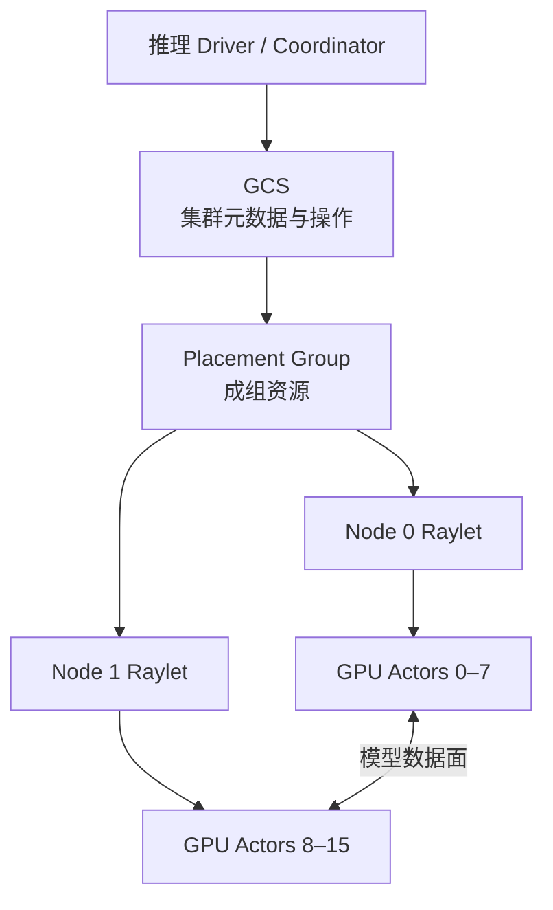
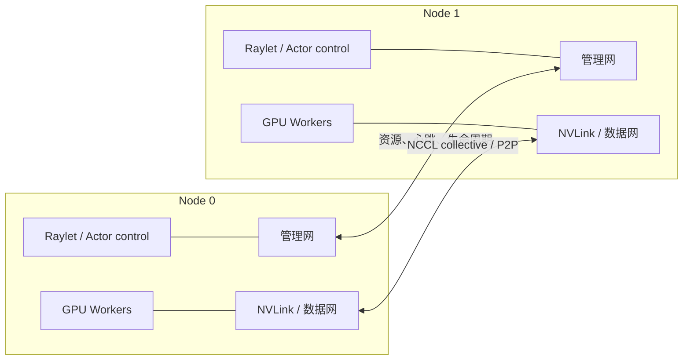

多节点推理不只有 GPU 间数据传输，还需要一个系统回答“资源在哪里、进程应放哪里、谁还活着、失败后重建什么”。Ray 可以作为这个控制面问题的具体案例，但它不是 collective 或高速网络本身。
<!-- more -->

## 📑 目录
- [1. 问题：有 16 张 GPU 为什么仍不能执行](#1-问题有-16-张-gpu-为什么仍不能执行)
- [2. 稳定理论：控制面管理什么](#2-稳定理论控制面管理什么)
- [3. Ray 映射：资源发现与 placement](#3-ray-映射资源发现与-placement)
- [4. 生命周期：从期望状态到可执行组](#4-生命周期从期望状态到可执行组)
- [5. 心跳、失联与故障判定](#5-心跳失联与故障判定)
- [6. 控制面与 NCCL 数据面](#6-控制面与-nccl-数据面)
- [7. 70B 算例：两种放置与故障域](#7-70b-算例两种放置与故障域)
- [8. 重启不等于状态恢复](#8-重启不等于状态恢复)
- [9. 共同故障域与相关失败](#9-共同故障域与相关失败)
- [10. SLO、恢复时间与 Goodput](#10-slo恢复时间与-goodput)
- [11. 代价与适用边界](#11-代价与适用边界)
- [12. 理论事实与 Ray 版本边界](#12-理论事实与-ray-版本边界)
- [13. 交接：控制面怎样承载运行时](#13-交接控制面怎样承载运行时)
- [总结](#总结)
- [自我检验](#自我检验)
- [参考资料](#参考资料)
---

## 1. 问题：有 16 张 GPU 为什么仍不能执行
两节点各有 8 张健康 GPU，并不等于一个 16-rank 逻辑副本已经存在。
执行前至少要确定：
- 哪些 GPU 属于同一个 TP 组；
- 哪些进程分别承担 PP stages；
- 哪些资源必须成组同时获得；
- rank、节点、GPU 与网络接口如何对应；
- 某个进程没有启动时，其他成员是否应继续等待；
- 节点失联后，旧资源何时撤销、新资源何时可用。
资源总量也不足以表达拓扑形状。“空闲 16 张 GPU”可能是：
```text
Node 0：8 张
Node 1：8 张
```
也可能散布在 16 个不同节点。两者对 TP=8、PP=2 的意义完全不同。
分布式控制面要把一个**期望执行图**变成一个**当前可执行图**，并持续判断二者是否仍然一致。
---

## 2. 稳定理论：控制面管理什么

### 2.1 资源目录
控制面维护节点、CPU、GPU 和自定义资源的逻辑视图。这份视图回答“调度器认为有什么”，不直接证明 GPU 无 Xid、链路达到带宽或模型文件可读。
可以把节点资源表示为：
$$
\mathcal{R}_n = (C_n,G_n,M_n,L_n)
$$
$C_n$ 是 CPU，$G_n$ 是 GPU，$M_n$ 是内存等容量，$L_n$ 是位置或拓扑标签。

### 2.2 Placement 约束
并行组通常需要 gang placement：要么整组资源同时可用，要么不要先启动一部分成员长期占位。
一个放置请求可抽象为多个 bundles：
$$
\mathcal{P} = \{B_0,B_1,\ldots,B_{k-1}\}
$$
每个 $B_i$ 描述一个 worker 所需资源。额外约束说明 bundles 应尽量同节点、分散到不同故障域，或落在指定拓扑范围。

### 2.3 生命周期
控制面记录进程或 Actor 的期望状态：
```text
待放置 -> 已预留 -> 创建中 -> 就绪 -> 运行
                       |
                       -> 失败 -> 重启 / 替换 / 终止
```

### 2.4 存活性
节点和进程需要定期报告状态。控制面在超过判定窗口后把失联成员视为死亡，撤销资源并触发恢复策略。

### 2.5 元数据与数据分离
控制面保存的通常是：
- 谁拥有什么资源；
- Actor 或任务的身份；
- placement 与生命周期元数据；
- 依赖与对象位置等目录信息。
模型权重、GPU 上的 KV Cache、collective 中间张量并不会因控制面有元数据就自动持久化。
---

## 3. Ray 映射：资源发现与 placement

### 3.1 Ray 的角色映射
在 Ray Core 的概念中：
- GCS 管理集群级元数据和节点、Actor、placement group 等操作；
- 每个节点的 raylet 参与本地资源管理与 worker 生命周期；
- Driver 或 Actor owner 发起工作并持有相应控制关系；
- Worker/Actor 执行应用逻辑，GPU Actor 可承载模型 worker。

Ray Head 是控制面角色，不等于 PP Stage 0，也不等于拥有 rank 0 的 GPU。它们可能恰好在同一节点，但概念上没有必然关系。

### 3.2 逻辑 GPU 不是硬件验收
Ray 可以发现一个节点声明了 8 个 GPU 资源。这不保证：
- 8 张 GPU 型号和显存一致；
- GPU 间存在预期 NVLink/NVSwitch；
- 容器内 CUDA 与驱动兼容；
- Actor 能读取同一模型；
- NCCL 会选择正确数据接口；
- 共享 NIC 没有拥塞。
控制面的“资源可调度”与数据面的“执行正确且足够快”是两道不同的门。

### 3.3 Placement group 的价值
如果一个 TP=8 副本先启动 7 个 workers，第 8 张 GPU 长期不可用，前 7 个 workers 不能产生正确输出，却持续占资源。
成组预留避免这种部分启动死锁。只有所有 bundles 都可满足时，应用才进入构建完整并行组的阶段。

### 3.4 Placement 只表达已声明约束
调度器不会从“TP=8”三个字符自动理解 GPU 间的带宽矩阵。
若应用只声明 8 个普通 GPU bundles，它们可能满足数量要求，却落在不理想的 NUMA 或节点边界。
拓扑意图必须被显式编码为资源标签、bundle 形状或上层运行时的放置策略，并由实际 rank 映射验证。
---

## 4. 生命周期：从期望状态到可执行组

### 4.1 创建不是就绪
一个 GPU Actor 被控制面创建后，还要经历应用层初始化：
1. 获取自己的 rank 与组信息；
2. 建立 CUDA 上下文；
3. 加载对应权重分片；
4. 申请运行时与 KV 内存；
5. 初始化 TP、PP 或 EP 通信组；
6. 与协调者完成就绪屏障；
7. 才能接收请求工作。
Ray 管理 Actor 进程生命周期，但步骤 2～6 是推理运行时的责任。

### 4.2 一组 workers 的就绪条件
设逻辑副本需要的 worker 集合为 $\mathcal{W}$。副本可接收请求的必要条件是：
$$
\operatorname{Ready}(\text{replica}) = \bigwedge_{w\in\mathcal{W}} \operatorname{Ready}(w)
$$
其中任何一个 worker 仍在加载或初始化，整个 TP/PP/EP 组都不应被入口视为健康容量。

### 4.3 所有权影响生命周期
Ray Actor 有 owner 语义。普通 Actor 的 owner 失效时，Actor 可能与 owner 共同结束，即使它所在节点本身仍健康。
这说明故障域不只由物理机器决定。谁创建 workers、谁持有句柄、协调进程是否可恢复，都会影响整个推理副本的寿命。

### 4.4 重启策略不是无限可用性
Ray 可以按应用配置重启崩溃 Actor。重启通常会重新执行构造逻辑。
如果根因是坏 GPU、错误模型文件、进程组中其他成员状态不一致或持续 OOM，重复拉起只会延长不可用窗口并制造日志噪声。
恢复策略需要由上层判断：局部 Actor 重启是否安全，还是应撤销整组并重建逻辑副本。
---

## 5. 心跳、失联与故障判定

### 5.1 检测一定有窗口
节点不会在物理故障发生的同一瞬间被所有控制面成员一致判死。
从故障到资源可重新调度，至少包含：
$$
T_{\text{detect}} =T_{\text{missed heartbeat}} +T_{\text{decision}} +T_{\text{propagation}}
$$
窗口太短，控制面或管理网的短抖动可能造成误判。
窗口太长，其他 collective 成员会更久地等待已经消失的 rank。

### 5.2 网络分区比进程退出更难
若 Worker 进程明确退出，控制面通常能较快获得失败信号。
若节点仍运行但管理网分区，GCS 可能看不到 raylet，而部分 GPU 数据连接仍暂时存在；反过来也可能是 Ray 心跳正常，NCCL 数据网已经断开。
不同观察者会在一段时间内得到不同结论。因此应用需要超时、幂等和 fencing，防止旧 worker 恢复连接后与新 worker 同时声称同一 rank。

### 5.3 节点身份不是物理主机名
Ray 文档强调，raylet 失败后即使在同一物理机器重启，也会作为新的节点身份加入。
旧对象位置、旧 bundles 和旧进程句柄不能仅因主机名相同就被当作继续有效。

### 5.4 心跳只证明控制连通
节点持续上报存活，不代表某个 CUDA kernel 没有挂起，也不代表 collective 正在前进。
推理运行时还要有应用层进度信号：
- 最近一次调度轮是否提交；
- 每个 rank 是否到达相同 collective 序号；
- KV 分配与释放是否推进；
- 输出 Token 是否持续产生。
控制面 liveness 与数据面 progress 必须分别观测。
---

## 6. 控制面与 NCCL 数据面

### 6.1 两条逻辑路径

Ray 控制路径负责：
- 节点注册与资源目录；
- placement group 预留；
- Actor 创建、销毁和重启；
- 状态、所有权与失败通知。
NCCL 等数据路径负责：
- TP 的 AllReduce、ReduceScatter、AllGather；
- PP 的点对点激活传输；
- EP 的 All-to-All；
- 节点内 P2P、共享内存或高速互连选择。

### 6.2 一个平面成功不能证明另一个
Ray 能创建所有 Actors，说明控制面与资源放置基本成立。它不能证明 6.2 的 AllReduce 达到 300 GB/s，也不能证明 6.3 的边界走 25 GB/s 数据网。
NCCL collective 正常，也不能证明 GCS 故障后能重建 Actor 所有权和 placement。
### 6.3 Ray 不在通信公式里替代带宽
本章通信模型仍是：
$$
T_{\text{comm}} \approx \alpha\cdot\text{messages} +\frac{\text{bytes}}{BW_{\text{effective}}}
$$
Ray 决定哪些 workers 在哪里运行，但 $BW_{\text{effective}}$ 由 GPU、PCIe、NVLink、NIC、交换网络、NCCL 和争用共同决定。
把 Ray 换成另一个控制面，不会自动把 25 GB/s 节点间链路变成 300 GB/s。
---

## 7. 70B 算例：两种放置与故障域
### 7.1 布局 A：两个独立 TP=8 副本
```text
Node 0：Replica A，TP ranks A0–A7
Node 1：Replica B，TP ranks B0–B7
```
控制面需要为每个副本成组获得 8 张同节点 GPU，分别启动和验收两个并行组。
Node 0 的一个 rank 失败，Replica A 无法继续正确前向。Replica B 理论上仍可接收新请求。
但如果 Ray Head/GCS 与 A 同处 Node 0，且控制面本身没有相应容错，物理节点故障可能同时失去 A 和集群级协调。
这会把本应隔离的两个数据面副本重新关联到一个控制面故障域。
### 7.2 布局 B：一个 TP=8、PP=2 副本
```text
Node 0：Stage 0，内部 TP=8
Node 1：Stage 1，内部 TP=8
```
placement 需要同时获得全部 16 张 GPU。两个 TP 组应各自保持节点内，PP 边界跨节点。
任一节点失败，80 层执行链都不完整。另一个 stage 即使所有 Actors 存活，也不是可独立服务的剩余容量。
### 7.3 初始原子放置与运行期部分失败
Ray placement group 的初始创建强调成组满足。但运行后若承载部分 bundles 的节点失败，剩余 bundles 可能继续存在，丢失 bundles 等待被重新调度。
对普通独立任务，这种部分存活可能有用。
对 TP/PP collective 组，“7 个 rank 还活着”不等于“副本还有 7/8 容量”。应用通常需要把整个通信组视为一致的恢复单元。
---

## 8. 重启不等于状态恢复
### 8.1 把状态分层
70B 推理服务至少有四类状态。
**可重建静态状态：**
- 固定版本的模型权重；
- Tokenizer 与模型配置；
- 并行拓扑和 worker 构造描述。
**控制面状态：**
- 节点与 Actor 身份；
- placement group 与 bundles；
- owner、引用和资源元数据。
**运行时派生状态：**
- CUDA 上下文与图；
- NCCL communicator；
- 内存池和空闲 KV Blocks；
- 已捕获的执行形状。
**请求状态：**
- Prompt 与已生成 Token；
- 80 层 KV Cache；
- 调度位置、采样状态与流式提交进度。
### 8.2 Actor 重启能恢复到哪里
重新执行构造函数可以重新加载权重、重新创建 CUDA 状态和 communicator。
Ray 不会仅凭 Actor 重启自动恢复应用内 123 个活跃请求的 GPU KV。
如果 KV 没有外部副本或检查点，恢复请求只能：
- 从 Prompt 和已确认输出重新计算；
- 迁移到仍持有完整 KV 的健康副本；
- 或按服务合同失败。
### 8.3 正确的重建链
概念上的恢复顺序是：
```text
判定旧成员失效
-> 隔离旧 rank 身份
-> 获得完整替代资源
-> 创建整组 workers
-> 加载相同模型版本
-> 重建通信组与 KV 池
-> 决定每个请求重算、重试或失败
-> 完成就绪屏障
-> 重新加入入口容量
```
这是一条状态依赖链，不是多节点操作步骤。
若在通信组尚未一致时就接收新请求，会把恢复期故障暴露为新的超时和错误。
### 8.4 流式结果的幂等问题
客户端可能已看到前 100 个 Token，故障发生后服务从 Prompt 重算。
恢复层需要知道：
- 哪些 Token 已被确认提交；
- 重算结果与原随机状态是否一致；
- 是否可能重复发送；
- 重试由客户端还是服务发起。
Actor 能重新运行不等于请求具有 exactly-once 语义。
---

## 9. 共同故障域与相关失败
### 9.1 数据面共同故障域
- 一个 TP 组共享 collective 进度；
- 一个 PP 副本共享完整层链；
- 一个 EP 组共享专家集合；
- 同一节点的 8 张 GPU 共享电源、PCIe、CPU 与机箱。
### 9.2 控制面共同故障域
- GCS 或 Head 角色；
- Driver/Coordinator 的所有权；
- 管理网与 DNS；
- placement 和状态存储。
Ray 官方文档指出，默认 GCS 以内存保存集群级数据时，其失败会影响整个集群。使用持久后端可以帮助 GCS 重载元数据，但仍不等于恢复 GPU 内应用状态。
### 9.3 外部共同故障域
两个副本放在不同节点，仍可能共同依赖：
- 同一入口路由器；
- 同一模型存储或凭证系统；
- 同一 Top-of-Rack 交换机；
- 同一控制面节点；
- 同一软件镜像缺陷；
- 同一错误配置发布。
“两个副本”只消除被真正分开的故障。
### 9.4 相关故障影响 Goodput
如果模型存储不可用，现有 workers 可能继续服务已有状态，但任何重建都无法加载权重。
如果管理网抖动导致节点误判，健康 GPU 也可能被移出可用容量。
故障域设计要问的不是“会不会失败”，而是“一次原因会同时拿走多少可用 Goodput”。
---

## 10. SLO、恢复时间与 Goodput
### 10.1 恢复时间分解
一个逻辑副本的恢复时间目标可写为：
$$
T_{\text{recover}} = T_{\text{detect}} +T_{\text{place}} +T_{\text{start}} +T_{\text{load}} +T_{\text{group}} +T_{\text{request state}}
$$
控制面主要影响检测、放置与进程生命周期。模型加载、通信组和请求状态恢复属于应用运行时。
### 10.2 故障期间的队列
若两个副本失去一个，服务率从 $\mu_A+\mu_B$ 降为 $\mu_B$。
故障窗口内队列增长近似：
$$
\Delta Q \approx \max(0,\lambda-\mu_B) \times T_{\text{recover}}
$$
即使最终恢复成功，恢复后还要消化 $\Delta Q$。这些请求可能已经越过 TTFT P99≤2 s，因此不会贡献 Goodput。
### 10.3 突发与恢复叠加
70B 合同在 5 秒内达到 16 request/s。若故障与突发重合，单健康副本同时承受新流量和重试流量。
控制面重启更快能减少损失，但不能弥补一个副本本身低于到达率的容量缺口。
容量规划应同时留出：
- 正常突发余量；
- 单故障后的最低服务能力；
- 重建模型期间的排队或拒绝策略；
- 活跃请求重算带来的额外工作。
---

## 11. 代价与适用边界
### 11.1 Ray 作为控制面的收益
- 统一发现多节点逻辑资源；
- 用成组 placement 表达 workers 的共同资源需求；
- 管理远端 Actor 生命周期与失败通知；
- 为替代节点和重新调度提供通用机制；
- 让上层运行时不必自行实现全部集群目录。
### 11.2 引入的代价
- 增加 GCS、raylet、owner 与 Actor 的状态机；
- 管理网和端口形成新的故障面；
- 逻辑资源视图可能掩盖物理拓扑和硬件健康；
- Actor 重启与应用状态恢复之间需要额外协议；
- 控制面与外部编排器叠加时，所有权可能变得模糊。
### 11.3 适用边界
Ray 适合需要跨节点资源发现、成组 GPU 放置和统一 Actor 生命周期的运行时。
单节点多卡若已有更简单的本地进程管理，额外控制面未必带来收益。
如果团队已有能表达同样 placement、健康检查和恢复语义的平台，Ray 只是可选实现，不是分布式推理的理论前提。
选择标准应是：它是否减少了目标系统的控制面复杂度，而不是它是否出现在某个部署示例中。
---

## 12. 理论事实与 Ray 版本边界
### 12.1 相对稳定的理论事实
- 多节点执行需要资源目录、placement、生命周期和存活检测；
- gang reservation 防止不完整并行组长期占位；
- 控制面 liveness 不等于数据面 progress；
- 进程重启不等于应用状态恢复；
- KV、通信组和流式提交状态需要运行时重建；
- 物理、控制面和外部依赖会形成相关故障。
### 12.2 本节的 Ray 映射
本节依据 Ray Core 官方架构与故障容错文档，用 GCS、raylet、Actor 和 placement group 承载上述稳定概念。
Ray 的默认容错策略、持久后端、placement 行为和 Actor 生命周期选项会随版本演进。
尤其需要记住：
- GCS 元数据恢复不恢复 Actor 内 KV；
- Actor 自动重启会重跑构造逻辑，但不自动恢复应用状态；
- placement group 初始成组放置，不保证运行期始终完整；
- owner 与 detached 等生命周期语义会改变故障传播。
因此框架术语是案例，控制面与状态重建问题才是知识主线。
---

## 13. 交接：控制面怎样承载运行时
Ray 可以把 16 个 GPU workers 放到两个节点，并报告它们的生命周期。
它仍不知道：
- 哪个请求应在本轮被 Scheduler 选择；
- 哪些 KV Blocks 属于该请求；
- TP、PP、DP、EP groups 如何对应模型前向；
- KV 不足时应等待、抢占还是重算；
- 一个 worker 重启后哪些请求还能继续；
- 剩余副本怎样背压和降级。
这些属于推理运行时。
下一节固定到 vLLM v0.28.0，把 Scheduler、Engine Core、GPU Worker、并行组和 KV 生命周期放进同一状态机。Ray 只作为可能的多节点执行承载，不会被误写成 vLLM 的数据面或调度算法。
---

## 总结
- 控制面把期望执行图映射为当前可执行图，并持续处理变化。
- Ray 用 GCS、raylet、Actor 与 placement group 承载资源和生命周期概念。
- 逻辑 GPU 可调度不等于硬件、模型文件或 NCCL 数据面健康。
- Ray 控制面与 NCCL 数据面使用不同职责，也可能使用不同网络。
- 初始 gang placement 防止部分启动，但运行期节点故障仍可能留下部分 bundles。
- TP、PP 或 EP 通信组通常需要作为完整恢复单元。
- Actor 重启能重建进程，不会自动恢复 GPU KV 和流式提交状态。
- Head/GCS、Driver、共享网络和模型存储都可能扩大共同故障域。
- 恢复期队列和重算会直接降低满足 P99 合同的 Goodput。

## 自我检验
- [ ] 能区分逻辑资源发现与物理硬件验收。
- [ ] 能解释 gang placement 为什么适合并行组。
- [ ] 能说明 Ray Head 与 PP Stage 0 为什么不是同一概念。
- [ ] 能分别列出 Ray 控制路径与 NCCL 数据路径的职责。
- [ ] 能解释心跳正常为何仍可能发生 collective hang。
- [ ] 能说明 Actor 重启后哪些状态需要应用重建。
- [ ] 能比较两个 TP=8 副本与一个 PP=2 副本的故障域。
- [ ] 能用恢复时间公式指出控制面和运行时各自负责的项。
- [ ] 能解释为什么两个物理副本仍可能共享控制面故障。

## 参考资料
- [Ray Core Architecture Whitepaper](https://docs.ray.io/en/latest/ray-contribute/whitepaper.html)
- [Ray Placement Groups](https://docs.ray.io/en/latest/ray-core/scheduling/placement-group.html)
- [Ray Node Fault Tolerance](https://docs.ray.io/en/latest/ray-core/fault_tolerance/nodes.html)
- [Ray Actor Fault Tolerance](https://docs.ray.io/en/latest/ray-core/fault_tolerance/actors.html)
- [Ray GCS Fault Tolerance](https://docs.ray.io/en/latest/ray-core/fault_tolerance/gcs.html)
- [NVIDIA NCCL User Guide](https://docs.nvidia.com/deeplearning/nccl/user-guide/docs/)
> 控制面可以重建“谁应该运行”，但只有推理运行时知道“请求已经运行到哪里”。
