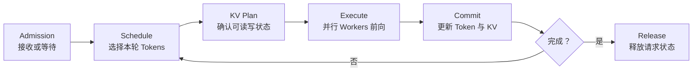
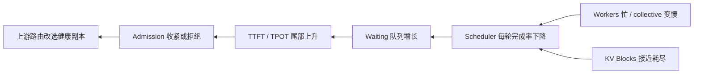

本节标题保留“实战”，但实践对象不是命令，而是把前五节的理论账本映射到一个真实运行时状态机。只有能解释请求、KV 和并行组怎样共同演进，部署参数才有意义。
<!-- more -->
## 📑 目录
- [1. 问题：并行组为什么还不等于服务](#1-问题并行组为什么还不等于服务)
- [2. 版本边界：固定到 vLLM v0.28.0](#2-版本边界固定到-vllm-v0280)
- [3. 稳定理论：推理运行时的闭环](#3-稳定理论推理运行时的闭环)
- [4. v0.28.0 进程与职责映射](#4-v0280-进程与职责映射)
- [5. Scheduler：选择工作而不是创造容量](#5-scheduler选择工作而不是创造容量)
- [6. Worker 与 parallel groups](#6-worker-与-parallel-groups)
- [7. KV 生命周期：分配、使用、复用与释放](#7-kv-生命周期分配使用复用与释放)
- [8. 70B 算例：状态如何落到两个副本](#8-70b-算例状态如何落到两个副本)
- [9. 背压：从 KV 池传播到入口](#9-背压从-kv-池传播到入口)
- [10. 故障、重建与请求语义](#10-故障重建与请求语义)
- [11. 降级：少一半容量时怎样守住合同](#11-降级少一半容量时怎样守住合同)
- [12. 代价与适用边界](#12-代价与适用边界)
- [13. 理论事实与框架映射分离](#13-理论事实与框架映射分离)
- [14. 交接：从统一运行时到阶段解耦](#14-交接从统一运行时到阶段解耦)
- [总结](#总结)
- [自我检验](#自我检验)
- [参考资料](#参考资料)
---
## 1. 问题：并行组为什么还不等于服务
前五节已经能画出：
- TP=8 的层内 collective；
- 可选 PP stages 的层链；
- 两个 DP 副本的请求分流；
- MoE 场景下的 EP All-to-All；
- Ray 对 workers 的多节点放置。
这些图仍缺少一个时间维度。在线生成不是执行一次静态前向：
1. 请求到达并等待；
2. Prompt 进入 Prefill；
3. 运行时为每层 KV 分配空间；
4. 请求反复参加 Decode；
5. 每轮更新 KV 与输出状态；
6. 完成、取消、抢占或失败后释放状态。
运行时必须保证所有并行 ranks 对“本轮算哪些 Tokens、读写哪些 KV、何时提交结果”拥有一致理解。因此分布式服务还要回答：
- Scheduler 的决定怎样传播给 workers；
- 一个请求的 KV 由谁记账；
- KV 不足时谁等待、谁让出；
- DP 副本之间怎样形成背压；
- 一个 rank 失败后哪些状态可重建；
- 降级时怎样不悄悄改变结果语义。
---
## 2. 版本边界：固定到 vLLM v0.28.0
本节框架映射固定到 **vLLM v0.28.0**。该版本于 2026 年 8 月 26 日发布。固定版本有三个目的：
- 避免把滚动 stable 文档当成永久接口；
- 让进程角色和职责陈述有可核对的快照；
- 明确哪些结论来自理论，哪些只是该版本实现。
本节只使用 v0.28.0 架构文档公开的稳定角色：
- 入口进程负责输入处理与结果返回；
- 每个 DP rank 有一个 Engine Core；
- Engine Core 运行 Scheduler、管理 KV 并协调模型执行；
- 每张 GPU 由一个 Worker 进程管理；
- 每个 Engine Core 下的 GPU Workers 数量为 $TP\times PP$；
- 使用 DP 时存在协调多个 DP ranks 的控制角色。
v0.28.0 还包含大量模型、硬件与高级并行特性。它们不属于本节主线，也不能反推未来版本仍采用完全相同的进程拓扑。版本化案例不等于版本推荐。生产选择还要匹配目标模型、驱动、硬件和团队验证结果。
---
## 3. 稳定理论：推理运行时的闭环
任何在线自回归运行时都需要形成以下闭环：

这个闭环有三个一致性要求。
### 3.1 调度一致性
参加同一 TP、PP 或 EP 前向的 workers 必须处理兼容的批次描述。若一个 rank 认为本轮有 32 Tokens，另一个 rank 认为有 31，collective 形状或顺序就可能不一致。
### 3.2 KV 一致性
Scheduler 认为已分配的逻辑 Token 位置，必须映射到 workers 可读写的物理 KV Blocks。不能先提交新 Token，再发现某个 stage 没有对应 KV 空间。
### 3.3 提交一致性
只有模型前向、采样和必要状态更新都成功后，该轮结果才能对外成为已确认进度。否则故障重试可能重复 Token、遗漏 Token 或从错误 KV 前缀继续。这些要求不属于 vLLM 专利。vLLM v0.28.0 只是它们的一种具体承载。
---
## 4. v0.28.0 进程与职责映射
### 4.1 Engine Core
在 v0.28.0 的 V1 架构中，每个 DP rank 对应一个 Engine Core 进程。Engine Core 负责：
- 维护该 rank 的请求调度状态；
- 运行 Scheduler 的持续循环；
- 管理逻辑 KV Cache 分配；
- 把模型执行工作分发给 GPU Workers；
- 接收执行结果并推进请求。
它不执行所有 GPU kernel，而是拥有“下一步做什么”的运行时决策。
### 4.2 GPU Worker
每张 GPU 由一个 Worker 进程管理。Worker 持有：
- 对应模型权重分片；
- CUDA 上下文与设备内存；
- 本 rank 的 KV Cache 物理存储；
- 模型执行器和本地 kernel 状态；
- 所属 parallel groups 的通信句柄。
Worker 接收已协调的执行计划，准备本 rank 输入并参加前向。
### 4.3 Model Runner
每个 Worker 内的模型执行角色负责把调度元数据转成设备张量，运行模型并处理执行形状等本地细节。Scheduler 决定“哪些逻辑 Tokens 运行”，Model Runner 决定“这些 Tokens 怎样在本设备执行”。
### 4.4 DP 协调
当 $DP>1$ 时，每个 DP rank 有自己的 Engine Core 与请求状态。v0.28.0 架构还包含 DP 协调角色，用于跨 DP ranks 的负载协调，并在 MoE 等场景协调需要同步的前向。这再次说明：Dense 请求副本可以独立，不等于所有使用 DP 名称的执行图都完全没有跨 rank 协调。
---
## 5. Scheduler：选择工作而不是创造容量
### 5.1 Scheduler 的输入
Scheduler 面对两类请求：
- 尚未获得本轮执行机会的等待请求；
- 已经拥有 KV、需要继续 Decode 的运行请求。
它还受若干资源约束：
- 本轮可处理的 Token 预算；
- 可用 KV Blocks；
- Worker 当前执行进度；
- 请求优先级、年龄和完成状态；
- Prefix 复用、Prefill chunk 等版本化能力。
### 5.2 一轮决策
抽象地说，Scheduler 选择请求集合 $\mathcal{B}$，使本轮 Token 数不超过预算：
$$
\sum_{i\in\mathcal{B}}n_i \le N_{\text{token budget}}
$$
同时所需新增 KV 必须可分配：
$$
\sum_{i\in\mathcal{B}} \Delta K_i \le K_{\text{free}}
$$
这两个不等式都成立，不代表 SLO 一定成立。老请求可能等待过久，或大 Prefill chunk 可能阻塞 Decode。
### 5.3 Prefill 与 Decode 的竞争
Prefill 一次处理许多 Prompt Tokens，更容易形成高效大矩阵。
Decode 请求每轮通常只需要一个新 Token，却直接影响用户看到的输出节奏。
若 Scheduler 总优先大 Prefill，吞吐可能很好，但 TPOT P99 恶化。
若总优先 Decode，新请求的 TTFT 可能持续增长。
调度目标应写成：
$$
\max\ \text{Goodput} \quad \text{s.t.}\quad TTFT_{P99}\le2s,\ TPOT_{P99}\le60ms
$$
而不是最大化每轮 Token 数。
### 5.4 Scheduler 不能消除过载
当长期到达率 $\lambda$ 大于有效服务率 $\mu$：
$$
\frac{dQ}{dt}\approx\lambda-\mu>0
$$
任何排序策略都只能决定谁先超时，不能让队列停止增长。
真正的背压必须继续传播到入口，通过有界等待、拒绝或增加健康副本处理过载。
---
## 6. Worker 与 parallel groups
### 6.1 Dense 70B 的 TP 组
一个 TP=8 副本有 8 个 GPU Workers。它们共同执行同一请求批次的每一层。
每个 Worker 持有一部分权重与 KV Heads，在 Attention 输出和 MLP Down 等位置参加 collective。
组内一个 Worker 未到达对应通信序号，其他 7 个 Workers 也不能提交这一层结果。
### 6.2 PP 组
若使用 $PP=2$，每个 Engine Core 下有：
$$
N_{\text{workers}}=TP\times PP=16
$$
它们被分成两个 TP=8 stages，stage 间传递激活。
Scheduler 的逻辑批次必须沿两个 stages 一致推进，但每个 stage 只持有自己的层与 KV。
### 6.3 DP 组
在本章首选候选中：
$$
DP=2,\quad TP=8,\quad PP=1
$$
总 GPU Workers 为：
$$
2\times8\times1=16
$$
v0.28.0 映射为两个 Engine Cores，每个 Engine Core 协调自己的 8 个 TP Workers。
Dense 模型的请求和 KV 分属两个 DP ranks。它们不在每个 Decode step 同步梯度或隐藏状态。
### 6.4 EP 组
MoE 场景中，专家 parallel group 可能与 DP、TP 设备维度重叠。
进入专家层时，Workers 要按 Router 结果进行 dispatch/combine。离开专家层后，Token 返回原请求的计算流。
因此 vLLM 的具体 parallel group 构造必须与模型类型和版本一起解释。不能只用四个整数的乘积推断所有通信关系。
---
## 7. KV 生命周期：分配、使用、复用与释放
### 7.1 逻辑 KV 与物理 Blocks
模型结构决定每 Token 的逻辑 KV 字节。vLLM 的分页管理再把逻辑 Token 位置映射到物理 KV Blocks。
抽象映射可写为：
$$
(request,\ layer,\ token) \longrightarrow (worker,\ block,\ offset)
$$
Scheduler 与 KV 管理角色维护逻辑所有权，Worker 在设备内存中持有真实 K/V 数据。
### 7.2 请求进入
新请求先处于等待状态。当 Scheduler 选择其 Prefill 时，运行时要确认首批 Tokens 的 KV 空间。
如果命中可复用前缀，部分 Blocks 可以被多个逻辑请求引用。复用需要正确的内容身份、模型上下文和引用管理，不能只凭文本相似就共享。
### 7.3 Prefill
Prompt Tokens 逐层产生 K 和 V。成功执行后，对应 Blocks 成为后续 Decode 的历史状态。
Chunked Prefill 会分多轮扩展同一请求的 KV。请求尚未完成全部 Prompt 时，不能被误当成已可从完整上下文 Decode。
### 7.4 Decode
每生成一个新 Token，请求在每个相关层追加一个 KV 位置。
逻辑增长近似为：
$$
\Delta M_{\text{KV}} =m_{\text{KV/token}}
$$
直到请求完成、达到长度边界、被取消、抢占或失败。
### 7.5 空间不足
若没有足够物理 Blocks，Scheduler 不能假装容量存在。
可选动作包括：
- 让新请求继续等待；
- 选择请求让出 KV，并在以后重算；
- 把部分 KV 移到其他存储层；
- 限制新 admission；
- 终止超出服务合同的请求。
v0.28.0 对抢占、重算、KV offload 和不同模型缓存组有具体实现能力。这些策略会演进，稳定原则是：释放、移动或重建状态的代价必须进入 SLO。
### 7.6 完成与释放
请求正常完成或取消后，不再需要的 KV Blocks 应归还空闲池。
可缓存前缀是否继续保留，取决于引用、缓存策略与内存压力。
若引用计数、请求完成状态和 Worker 物理块不同步，可能产生泄漏、过早复用或读到错误上下文。
---

## 8. 70B 算例：状态如何落到两个副本
### 8.1 单 Token KV
70B 合同给出全局每 Token KV：
$$
m_{\text{KV/token}}=320\text{ KiB}
$$
8 个 KV Heads 恰好按 TP=8 分片时，每 Worker 约为：
$$
\frac{320}{8}=40\text{ KiB/token}
$$
### 8.2 单个满长请求
一个 $4096+256=4352$ Token 请求，每 Worker 理想 KV 为：
$$
4352\times40\text{ KiB} =170\text{ MiB}
$$
123 个满长活跃请求约需：
$$
123\times170\text{ MiB} \approx20.4\text{ GiB/Worker}
$$
权重理想分片约为 16.3 GiB/Worker。两项约 36.7 GiB，其余空间留给物理 Block 碎片、临时激活、通信缓冲、图与安全余量。
### 8.3 两个 DP ranks
两个节点各承载一个 TP=8 副本：
```text
Engine Core A -> Workers A0–A7 -> KV Pool A
Engine Core B -> Workers B0–B7 -> KV Pool B
```
请求进入 A 后，其 Blocks 只在 A 的 Workers 上存在。
B 的 Scheduler 即使看到自己有空闲 Blocks，也不能直接继续 A 上该请求的 Decode。
### 8.4 突发工作量
一分钟到达 520 个请求，平均为 8.67 request/s。
如果系统总服务率为 12 request/s，5 秒突发期间的队列增量约为：
$$
\Delta Q =(16-12)\times5 =20\text{ requests}
$$
突发结束后，相对 8 request/s 稳态有 4 request/s 清空能力，理论上约需：
$$
\frac{20}{12-8}=5\text{ s}
$$
5 秒是整个积压队列的排空时间，不是每个请求都等待 5 秒。突发末端的 20 个请求仅按 12 request/s 服务率估算，队列等待已约为 $20/12\approx1.67$ s；再加 Prefill 就很容易越过 2 秒 TTFT 合同。
所以长期稳定并不足够，Scheduler、路由与容量必须为尾延迟保留更大余量。
---

## 9. 背压：从 KV 池传播到入口
### 9.1 背压链

背压若只停留在 Engine Core 内，上游仍持续发送请求，最终只是把过载隐藏为更长队列。
### 9.2 三种瓶颈信号
**计算背压：** Workers 的执行轮次变慢，Scheduler 无法更快提交下一轮。
**KV 背压：**可用 Blocks 不足，新 Prefill 或 Decode 扩展无法安全分配。
**输出背压：**下游消费或结果处理变慢，已完成结果占用队列和请求状态。
三者都可能表现为 Waiting 增长，但解决方式不同。
### 9.3 DP 路由需要运行时信号
两个 Engine Cores 的空闲 KV、排队 Tokens 和近期完成率可能不同。
入口若只轮询，会把请求继续发给 KV 紧张或慢 rank 频发的副本。
更合理的副本成本至少包含：
$$
C_i = \lambda_qQ_i +\lambda_k\frac{1}{K_{\text{free},i}} +\lambda_tT_{\text{recent},i} +\lambda_fF_i
$$
$F_i$ 表示失败或降级惩罚。具体指标名属于版本实现，成本函数思想属于控制理论。
### 9.4 有界队列
无限排队不会提高 Goodput。它只让更多请求在等待后越过 2 秒 TTFT 合同。
入口应有明确的等待预算：
$$
T_{\text{predicted queue}} +T_{\text{prefill}} \le T_{\text{TTFT budget}}
$$
预测已不可能达标时，早期拒绝通常比消耗 GPU 后再超时更诚实，也为仍可达标的请求保留容量。
---

## 10. 故障、重建与请求语义
### 10.1 Worker 故障
在 TP=8 副本中，一个 Worker 失效会丢失：
- 该 rank 的权重分片运行实例；
- 对应 KV Head 的物理 Blocks；
- communicator 成员；
- 当前前向的部分结果。
其余 7 个 Workers 无法得到完整模型输出。因此副本应先从入口容量中移除。
### 10.2 Ray 重启与 vLLM 重建
Ray 可以重新创建 Worker Actor，但 vLLM 运行时仍需：
1. 加载完全相同的模型分片；
2. 重建 TP/PP/EP communicators；
3. 重新建立本地 KV 池；
4. 与 Engine Core 恢复一致 epoch；
5. 决定旧请求如何处理；
6. 完成整组就绪后再接流量。
仅替换一个进程，不能恢复它之前 GPU 上的 K/V。
### 10.3 Engine Core 故障
即使 GPU Workers 暂时仍持有 KV，Scheduler 的请求队列、逻辑 Block 映射和提交进度若不可恢复，这些物理字节也无法被安全解释。
状态恢复需要同时匹配：
$$
\text{request identity} +\text{logical KV map} +\text{worker physical KV} +\text{commit position}
$$
缺少任一项，从 Prompt 与已确认输出重新计算通常更安全。
### 10.4 活跃请求的选择
故障请求可以：
- 在健康副本从已确认文本前缀重新 Prefill；
- 若有外部 KV 传输或持久机制，则恢复对应 Blocks；
- 在等待预算内重试；
- 明确失败并交由上游决定。
重新 Prefill 会增加健康副本负载，并可能让原本可达标的新请求也超时。
### 10.5 流式提交
设客户端已确认 Token 序列前缀为 $y_{1:k}$。恢复时至少应以该提交点为边界：
$$
\text{resume input} =(x,\ y_{1:k})
$$
随机采样状态、浮点归约顺序和版本必须一致，否则后续 Token 未必与故障前未提交结果相同。
服务不能同时从旧 Worker 和新副本发送后续 Token。需要 epoch 或 fencing 阻止僵尸执行流继续提交。
---

## 11. 降级：少一半容量时怎样守住合同
### 11.1 第一层：隔离失败副本
Replica A 不完整时，先把它标为不可接收新请求。继续向 7/8 TP 组发流量只会制造超时。
### 11.2 第二层：保护健康副本
Replica B 需要同时承受：
- 原本属于 B 的新请求；
- 从 A 重试的请求；
- 可能的 KV 重算；
- 恢复过程的控制开销。
应限制 admission，优先保留仍可能满足 TTFT/TPOT 的工作。
### 11.3 第三层：语义保持的重算
在正确模型、Tokenizer 和已确认前缀一致时，从文本重建 KV 可以保持服务语义，代价是更高 TTFT 和额外 Prefill。
如果无法在 2 秒预算内完成，该请求不应被计入 Goodput，即使最终返回了结果。
### 11.4 第四层：显式服务降级
可以考虑：
- 暂停接收新长 Prompt；
- 对低优先级流量提前拒绝；
- 限制单租户并发；
- 只承诺较低的可用吞吐；
- 切换到已独立定义合同的备用模型。
最后一项会改变模型语义，不能在“结果与单副本基线一致”的合同下静默发生。它必须是调用方可见的独立服务等级。
### 11.5 错误的降级
- 让不完整 TP 组近似计算；
- 丢弃 MoE overflow Tokens 而不声明；
- 复用模型版本不匹配的 KV；
- 无限排队直到所有请求都超时；
- Actor 刚启动就加入流量，尚未完成组就绪。
这些行为可能维持表面成功率，却破坏正确性或 Goodput。
---

## 12. 代价与适用边界
### 12.1 运行时整合的价值
vLLM 把调度、分页 KV 和分布式 Worker 执行放在一个可协调闭环中。
这样 Scheduler 可以根据逻辑请求规划本轮 Tokens 和 KV，Workers 只执行与自身 rank 对应的物理分片。
### 12.2 分布式代价
- 每轮计划要传播给更多 Workers；
- parallel groups 增加同步与共同故障域；
- 每个 DP rank 有独立调度与 KV 状态；
- 控制面恢复和请求恢复是两套状态机；
- 缓存复用、抢占和 offload 增加一致性边界；
- 尾延迟由最慢 Worker、最热副本和恢复期队列共同决定。
### 12.3 适用边界
若 70B 模型需要 TP=8 才形成容量健康的副本，vLLM 的分布式 Worker 模型可以承载这种切分。
若需要两个副本吸收 8→16 request/s 突发，DP ranks 可形成独立 Engine Cores 和 KV 池。
但框架不会自动证明：
- TP=8 在目标拓扑上满足 60 ms TPOT；
- 两副本服务率足以把 TTFT P99 控制在 2 秒；
- Worker 故障后活跃 KV 可恢复；
- 默认路由和调度恰好最大化目标 Goodput。
这些仍要由五张账和运行时状态推理验证。
---

## 13. 理论事实与框架映射分离
### 13.1 相对稳定的理论事实
- Scheduler 在容量约束下选择本轮工作；
- Workers 持有物理权重、KV 和设备执行状态；
- 同一并行组必须使用一致批次与通信序列；
- 请求从 admission 到 release 有完整 KV 生命周期；
- $\lambda>\mu$ 时队列必然增长；
- 进程重启不自动恢复请求状态；
- 降级必须同时守住正确性和 SLO 合同。
### 13.2 vLLM v0.28.0 的案例映射
- Engine Core 承载每个 DP rank 的 Scheduler 与 KV 管理；
- GPU Worker 一进程对应一张 GPU；
- 每个 Engine Core 下有 $TP\times PP$ 个 GPU Workers；
- DP 使用多个 Engine Cores，并有相应协调角色；
- Model Runner 承载 Worker 内的模型执行；
- V1 多进程架构把入口与 Engine Core 分离。
### 13.3 不应固化的版本细节
- 进程数量的默认值；
- 入口与 Engine Core 的具体传输机制；
- Scheduler 优先级与抢占策略；
- KV Cache groups、offload 与层级缓存能力；
- Ray 或本地多进程执行器的默认选择；
- EP、DP Attention 和新并行维度的组构造；
- 指标名、配置名与内部类名。
引用 v0.28.0 是为了可证伪，不是为了让文档在未来继续声称旧实现仍是当前事实。
---

## 14. 交接：从统一运行时到阶段解耦
本章从五张账出发，依次说明了 TP、PP、DP、EP、多节点控制面和 vLLM 运行时。
统一运行时中的 Prefill 与 Decode 共享 Scheduler、Workers 和 KV 生命周期，因此长 Prefill 可能干扰 Decode，突发也会同时争抢计算与缓存。
下一章的 PD 解耦会进一步追问：
- Prefill 与 Decode 是否应由不同资源池承担；
- KV 怎样从 Prefill 所有者转交给 Decode 所有者；
- 跨池传输能否小于阶段隔离带来的收益；
- 两侧背压和故障如何保持请求状态一致；
- TTFT 与 TPOT 能否被分别扩缩容。
无论架构怎样变化，本章建立的容量、通信、拓扑、SLO 与状态所有权账本仍然适用。
---

## 总结
- 并行组只有进入请求—KV—调度闭环后才构成在线推理服务。
- 本节固定 vLLM v0.28.0，将版本事实与稳定理论分开。
- Engine Core 运行 Scheduler、管理 KV，并协调对应 GPU Workers。
- Worker 持有权重分片、物理 KV、设备状态和 parallel group 通信。
- Scheduler 在 Token 与 KV 预算内选择工作，但不能消除长期过载。
- 70B TP=8 下每 Worker 每 Token KV 约 40 KiB，满长请求约 170 MiB。
- 两个 DP ranks 拥有独立 Engine Cores 与 KV 池，活跃请求不能无状态迁移。
- 背压必须从 Worker、KV 池和 Scheduler 传播到入口。
- Worker 或 Engine Core 重启后，模型可重载，活跃请求状态未必可恢复。
- 降级应先隔离、限流和语义保持重算，不能静默改变模型函数。

## 自我检验
- [ ] 能解释为什么 Workers 就绪不等于请求运行时就绪。
- [ ] 能复述 v0.28.0 中 Engine Core、Scheduler 与 Worker 的职责。
- [ ] 能说明同一 parallel group 为什么需要一致批次描述。
- [ ] 能描述请求从 KV 分配到释放的完整生命周期。
- [ ] 能复算 TP=8 下满长请求每 Worker 的 KV 大小。
- [ ] 能解释长期稳定为何仍可能违反突发 TTFT P99。
- [ ] 能区分计算背压、KV 背压与输出背压。
- [ ] 能说明 Ray 重启 Worker 后 vLLM 还要重建什么。
- [ ] 能给出不改变结果语义的降级顺序。
- [ ] 能指出哪些结论属于理论，哪些只属于 v0.28.0。

## 参考资料
- [vLLM v0.28.0 Release](https://github.com/vllm-project/vllm/releases/tag/v0.28.0)
- [vLLM v0.28.0 Architecture Overview](https://docs.vllm.ai/en/v0.28.0/design/arch_overview.html)
- [vLLM v0.28.0 Documentation](https://docs.vllm.ai/en/v0.28.0/)
- [vLLM Parallelism and Scaling](https://docs.vllm.ai/en/stable/serving/parallelism_scaling/)
- Kwon et al., [Efficient Memory Management for Large Language Model Serving with PagedAttention](https://arxiv.org/abs/2309.06180), 2023.
- [Ray Core Architecture](https://docs.ray.io/en/latest/ray-contribute/whitepaper.html)
> 框架版本会变；请求、KV、通信组和提交点之间的一致性约束不会消失。
