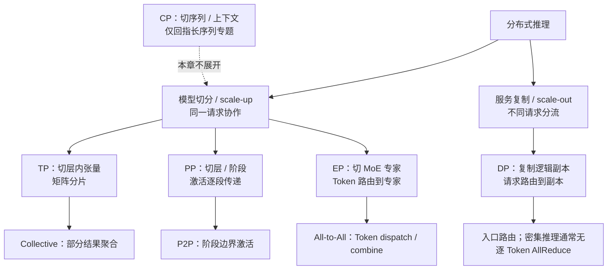

## 📑 本章导航
- [1. 为什么单卡与单副本都可能不够](#1-为什么单卡与单副本都可能不够)
- [2. 分清模型切分与服务复制](#2-分清模型切分与服务复制)
- [3. 一张图看清并行维度](#3-一张图看清并行维度)
- [4. 统一通信模型](#4-统一通信模型)
- [5. 贯穿六节的 70B 算例](#5-贯穿六节的-70b-算例)
- [6. 六节标题与知识边界](#6-六节标题与知识边界)
- [7. 阅读时始终追问的七件事](#7-阅读时始终追问的七件事)
- [8. 理论、版本与实现边界](#8-理论版本与实现边界)
- [9. 学完应具备的能力](#9-学完应具备的能力)
- [总结](#总结)
- [自我检验](#自我检验)
- [参考资料](#参考资料)
---

## 1. 为什么单卡与单副本都可能不够
第 3 章把一次模型调用提升为管理请求、KV Cache 与调度状态的推理运行时；第 4、5 章分别重定价数值表示和 Decode 串行轮次。本章继续追问：当一台设备或一份运行时越过容量、延迟、吞吐或故障边界时，怎样把它扩展成分布式服务？

**单卡不够**至少有三种含义：
- 权重、目标并发下的 KV Cache、通信缓冲和运行时余量无法同时放入显存；
- 单请求的 Prefill 或 Decode 计算不能满足 TTFT、TPOT；
- 一张卡虽能运行模型，但在目标请求分布下排队过长，Goodput 不达标。

**单副本不够**则是另一层问题：一份模型副本即使跨多卡放得下，也可能无法承接总到达率，维护或故障时还会整体失去服务能力。增加 GPU 只有在新增计算或容量大于通信、空闲和控制成本时才有价值；“能启动”不等于“满足 SLO”，更不等于“扩展有效”。

## 2. 分清模型切分与服务复制
本章把能独立接收请求、维护 KV Cache 并生成结果的一组进程称为一个**逻辑副本**。一个逻辑副本可以占一张 GPU，也可以由 TP、PP 或 EP 组成。

- **模型切分（model sharding，scale-up）**：把一个逻辑副本的权重、计算或状态分给多张 GPU，同一个请求需要这些设备协作；它首先解决单设备容量或单请求关键路径，代价是通信与共同故障域。
- **服务复制（replication，scale-out）**：复制完整逻辑副本，把不同请求路由到不同副本；它首先扩大聚合吞吐与容错余地，通常不降低单请求计算时间，代价是重复权重、独立 KV Cache 和负载均衡。

若每个副本占用 $G_{\text{replica}}$ 张 GPU、共有 $R$ 个副本，则：
$$
G_{\text{total}}=R\times G_{\text{replica}}
$$
$G_{\text{replica}}$ 不能总被机械写成 $TP\times PP\times EP$：EP、TP 与 DP 的进程组可能重叠，含义取决于模型结构和运行时。混合方案应先画出一个副本，再复制它；任一分片 rank 失效通常会击穿整个副本，而其他健康副本能否接管取决于路由、状态和控制面。

## 3. 一张图看清并行维度


- TP 切的是一层内部的权重张量与计算，通常仍需在层内同步部分结果。
- PP 切的是连续或按代价划分的层与 stage，边界上传递激活。
- DP 复制的是整个逻辑副本；权重重复，每个副本拥有自己的请求与 KV 状态。
- EP 只切 MoE 专家；非专家层怎样切或复制要另行说明，Token 路由可能造成热点。
- CP 针对单条超长序列的上下文维度，本章只回指[长序列训练与上下文并行](/AIInfraGuide/distributed/模块三-分布式训练/第9章-长序列训练与上下文并行)，不把它混入 TP/PP/DP/EP 主线。

## 4. 统一通信模型
所有并行策略先用同一条数量级模型核账：
$$
T_{\text{comm}}\approx \alpha\cdot \text{messages}+\frac{\text{bytes}}{BW_{\text{effective}}}
$$
- $\alpha$ 是一次消息或通信轮次需要支付的启动与链路时延，`messages` 是关键路径上的消息数，不是请求数。
- `bytes` 是关键路径真正搬运的数据量；算法总流量、每个 rank 流量与瓶颈链路流量不能混为一谈。
- $BW_{\text{effective}}$ 是给定拓扑、消息大小、并发争用和实现下的有效带宽，不是设备宣传页上的峰值。

TP 的 AllReduce、ReduceScatter 或 AllGather，PP 的点到点传输，EP 的 All-to-All 即使搬运相同字节，也会因 collective 算法、参与 rank 数和链路路径而得到不同时间。DP 的数据面通常按请求分流，不做训练式逐步梯度同步，但入口、队列、健康状态和副本伸缩仍需控制面协调。

拓扑决定消息经过 NVLink/NVSwitch、PCIe、NUMA 还是节点间网络；collective 决定数据被切成几轮、复制几次以及最慢链路承受多少流量；负载不均则让所有参与者等待最慢 stage、最慢 rank 或热点专家。因此端到端时间还要计入计算、排队、空泡、控制开销及可重叠部分，不能把通信公式直接当作完整延迟公式。

## 5. 贯穿六节的 70B 算例
后续 6.1～6.6 使用同一份教学合同，数值只用于建立量纲：
```text
模型：70B 级、80 层、hidden size 8192、8 个 KV heads、head dim 128
精度：权重与 KV Cache 均按 BF16 起算；主线先按稠密模型讨论
硬件：2 个节点 × 8 张 GPU，每张 80 GiB HBM
带宽：节点内 BW_effective=300 GB/s，节点间 BW_effective=25 GB/s
请求：每个 Prompt 4,096 token，最多输出 256 token
负载：稳态 8 request/s；每 60 s 包含一次持续 5 s 的 16 request/s 突发
SLO：TTFT P99 ≤ 2 s，TPOT P99 ≤ 60 ms，结果语义与单副本基线一致
Goodput：只统计同时满足正确性、TTFT 与 TPOT 合同的输出 token/s
```

BF16 权重本体约为：
$$
M_W=70\times10^9\times2\text{ Bytes}\approx140\text{ GB}
$$
它已经放不进单张 80 GiB GPU，且尚未包含 KV、工作区、通信缓冲、碎片与安全余量。按该教学结构，BF16 KV Cache 每 token 约为：
$$
m_{\text{KV/token}}=80\times2\times8\times128\times2\text{ Bytes}\approx320\text{ KiB}
$$
一个达到 $4096+256$ token 的请求仅 KV 本体就约 1.33 GiB；KV 是否随某个并行维度切分必须由具体布局证明，不能默认再除一次 GPU 数。

6.1 用它判断先 scale-up 还是 scale-out；6.2 估算层内 collective；6.3 比较 stage 边界与空泡；6.4 保持请求合同不变讨论副本，并在 EP 部分引入同规模教学 MoE 变体；6.5 检查跨节点放置、所有权与故障域；6.6 把同一账本映射到 vLLM 的调度、Worker 与 KV 状态。

## 6. 六节标题与知识边界
### [6.1 推理并行策略总览](/AIInfraGuide/inference/模块四-推理优化/第6章-分布式推理/61-推理并行策略总览)
承诺：从单卡/单副本为何不够出发，以容量、计算、通信、拓扑、SLO 五张账解释策略选择的 why、机制与代价。边界：建立决策坐标，不重复后续算子细节，不给部署步骤。

### [6.2 张量并行推理](/AIInfraGuide/inference/模块四-推理优化/第6章-分布式推理/62-张量并行推理)
承诺：解释为何切层内张量、列并行与行并行怎样保持数学等价、谁参与 collective，以及高频同步怎样受消息大小和拓扑限制。边界：聚焦 TP 数据流与成本，不把某个框架开关当作原理。

### [6.3 流水线并行推理](/AIInfraGuide/inference/模块四-推理优化/第6章-分布式推理/63-流水线并行推理)
承诺：解释为何按层/stage 切分、激活怎样越过边界、调度怎样形成流水，以及空泡、stage 不均和故障链怎样影响 TTFT/TPOT。边界：只讲推理流水线，不展开训练反向调度百科。

### [6.4 数据并行与专家并行](/AIInfraGuide/inference/模块四-推理优化/第6章-分布式推理/64-数据并行与专家并行)
承诺：分别解释 DP 为何复制副本并路由请求，EP 为何切专家并路由 Token；比较重复权重、独立 KV、All-to-All、热点专家和尾延迟。边界：不把 DP 与 EP 都简化成“多卡分流”，也不默认二者需要同一种同步。

### [6.5 多节点部署 Ray](/AIInfraGuide/inference/模块四-推理优化/第6章-分布式推理/65-多节点部署ray)
承诺：把 Ray 作为多节点控制面案例，解释为何需要资源发现与生命周期管理、进程如何放置和恢复，以及心跳、等待、重建与共同故障域的代价；同时区分控制面协调与 NCCL 等数据面通信。边界：不把 Ray 当作带宽或 collective 本身，不写集群操作手册。

### [6.6 vLLM 分布式部署实战](/AIInfraGuide/inference/模块四-推理优化/第6章-分布式推理/66-vllm分布式部署实战)
承诺：解释为何逻辑并行必须与请求及 KV 生命周期整合、vLLM 的 Scheduler 与 Worker 如何承载并行组，以及背压、额外缓冲、重建和降级的代价。边界：vLLM 只作运行时映射案例，本节不是命令、安装或压测指南。

## 7. 阅读时始终追问的七件事
1. **切什么**：层内张量、层/stage、专家，还是上下文？
2. **复制什么**：完整副本、非专家层、权重、KV 状态还是仅元数据？
3. **通信什么**：部分和、完整激活、Token、路由元数据还是控制消息？
4. **谁同步**：哪些 rank 属于同一组，谁发起、谁等待、何时提交结果？
5. **故障域多大**：一张卡、一个 stage、一个副本或控制面失效会影响哪些请求？
6. **SLO 改善什么**：容量、TTFT、TPOT、尾延迟、可用性中哪一项真正越过门槛？
7. **Goodput 是否增加**：扣除排队、重试、空泡和不达标请求后，有效产出是否真的上升？

## 8. 理论、版本与实现边界
张量/层/副本/专家四种切分、通信延迟模型、拓扑约束、排队和慢者决定同步进度，属于相对稳定的理论。框架支持矩阵、进程角色、默认 collective、Ray 集成方式、配置字段和指标名会持续变化。

因此，后续若固定某个 vLLM、Ray 或通信库版本，只用它展示“实现怎样承载理论”，不能反推接口长期稳定。本章及 6.1～6.6 的知识主线是 why、机制与代价，不提供启动命令、集群编排清单或压测步骤。

## 9. 学完应具备的能力
- 能区分 model sharding 的 scale-up 与 replication 的 scale-out，并解释混合方案；
- 能画出 TP、PP、DP、EP 的切分对象、通信对象、同步者与故障域；
- 能用显存账判断权重、KV、缓冲和余量是否可共存；
- 能用 $T_{\text{comm}}$ 模型比较 collective、消息粒度与节点内外拓扑；
- 能解释负载不均为何把平均带宽问题放大为 P99 问题；
- 能区分多节点控制面、通信数据面与推理运行时的责任；
- 能以固定 Workload、SLO 和 Goodput 评价策略，而不是只看 GPU 利用率或原始吞吐。

## 总结
分布式推理不是“把并行度调大”，而是同时设计一个逻辑副本怎样切、多个副本怎样复制、数据怎样通信、状态由谁同步，以及失败和排队怎样进入 SLO。六节将沿统一 70B 合同，从策略、TP、PP、DP/EP、多节点控制面走到 vLLM 运行时整合，每一节都必须回答 why、机制与代价。

## 自我检验
- [ ] 能用一个例子说明单卡不够与单副本不够为何不是同一问题。
- [ ] 能不看图说出 TP、PP、DP、EP 分别切或复制什么、主要通信什么。
- [ ] 能解释 $\alpha$、`messages`、`bytes` 与 $BW_{\text{effective}}$ 的物理含义。
- [ ] 能复述 70B 算例的硬件、Prompt、输出、SLO 与 Goodput 定义。
- [ ] 能说明为什么最慢 stage、rank 或专家会决定尾延迟。
- [ ] 能指出 Ray 控制面与 collective 数据面的责任边界。
- [ ] 能复述 6.1～6.6 各自负责和明确不负责的内容。

## 参考资料
- Shoeybi et al., [Megatron-LM](https://arxiv.org/abs/1909.08053), 2019.
- Narayanan et al., [Efficient Large-Scale Language Model Training on GPU Clusters Using Megatron-LM](https://arxiv.org/abs/2104.04473), SC 2021.
- Fedus et al., [Switch Transformers](https://www.jmlr.org/papers/v23/21-0998.html), JMLR 2022.
- [NVIDIA NCCL Collective Operations](https://docs.nvidia.com/deeplearning/nccl/user-guide/docs/usage/collectives.html)
- [Ray Core Architecture](https://docs.ray.io/en/latest/ray-contribute/whitepaper.html)
- [vLLM Parallelism and Scaling](https://docs.vllm.ai/en/stable/serving/parallelism_scaling/)

> 所有容量和性能数值只用于建立量纲；结论必须回到目标模型、硬件拓扑、运行时版本、真实请求分布与 SLO 验证。
