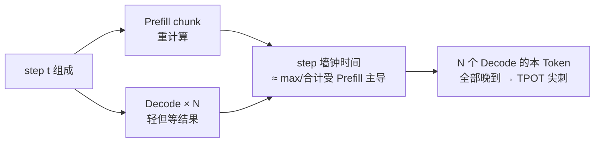

第 2 章讲过：Prefill 偏 Compute Bound，Decode 偏 Memory Bound；Chunked Prefill 能在同一引擎内缓解长 Prompt 堵死出字。但当负载更极端、SLO 更紧时，"同引擎混合调度"仍可能不够。这一节先把问题钉死——用定量直觉说明：**Prefill 为什么能把 Decode 的 TPOT 拖慢数倍**。

<!-- more -->

## 📑 目录

- [1. 混合 Batching 指什么](#1-混合-batching-指什么)
- [2. 两种阶段的资源肖像](#2-两种阶段的资源肖像)
- [3. 干扰机制：同一步里的木桶](#3-干扰机制同一步里的木桶)
- [4. 对 TTFT / TPOT 的定量直觉](#4-对-ttft--tpot-的定量直觉)
- [5. 哪些负载最容易爆](#5-哪些负载最容易爆)
- [6. 现有缓解手段的边界](#6-现有缓解手段的边界)
- [7. 如何用一次压测把问题"钉死"](#7-如何用一次压测把问题钉死)
- [总结](#-总结)
- [自我检验清单](#-自我检验清单)
- [参考资料](#-参考资料)

---

## 1. 混合 Batching 指什么

在 Continuous Batching 引擎里，一个调度 step 常常同时包含：

- 新请求或长 Prompt 的 **Prefill（或 chunk）**；
- 已在生成中的若干请求的 **Decode**。

它们共享同一组 GPU、同一条执行流水线、同一套调度预算。这种"**P 与 D 在同一批/同一步混跑**"就是混合 Batching。它提高了利用率，也埋下了互扰。

🔑 **核心概念**：**混合 Batching 的收益是利用率；代价是阶段特性不同的工作互相抢同一条关键路径。**

---

## 2. 两种阶段的资源肖像

| 维度 | Prefill | Decode |
|---|---|---|
| 并行度 | 序列内 Token 可大规模并行 | 每步每序列通常 1 Token |
| 瓶颈 | 算力（Compute Bound） | 显存带宽（Memory Bound） |
| 用户指标 | 主要影响 **TTFT** | 主要影响 **TPOT** |
| 单步耗时 | 随 Prompt/chunk 长度上升 | 相对平稳，但对干扰敏感 |
| 批处理收益 | 提高算力占用 | 靠拼 batch 摊薄权重搬运 |

把这两类工作绑在同一步：步耗时往往被更重的那一类（常常是 Prefill）拉开，Decode 再轻也得陪着等。

---

## 3. 干扰机制：同一步里的木桶

机制可以压成三句话：

1. 调度器把 P 与 D 放进同一步；
2. GPU 执行完这一步的全部（或主要）工作后才提交结果；
3. Decode 用户感知的是"这个 Token 迟到了"，即使 Decode 本身只需要很少算力。

这不是公平性口号问题，而是**同步批执行的物理结果**。

📌 **关键点**：Decode 被拖慢，常常不是因为它变重了，而是因为它**被迫与更重的 Prefill 共享步边界**。

---

## 4. 对 TTFT / TPOT 的定量直觉

用一个数量级例子建立直觉（非某固定硬件的实验室数据，重在比例）：

假设纯 Decode step 耗时 $t_d = 10\text{ms}$（TPOT 基线 ≈ 10ms）。若同一步混入一段需要 $t_p = 40\text{ms}$ 的 Prefill 工作，且步耗时近似由二者叠加或由重段主导到 $\sim 40\text{–}50\text{ms}$，则：

- 该步所有 Decode 的瞬时 TPOT 从 10ms 跳到 40ms+；
- 若这类混合步频繁出现，P95/P99 TPOT 可到基线的 **3–5 倍** 量级；
- 交互式流式输出会表现为"字忽快忽慢"。

对 TTFT 也有反向故事：

- 若调度过度保护 Decode（严格限 Prefill），新请求的首 Token 会排队更久，**TTFT 变差**；
- 若优先大块 Prefill，TTFT 好看，但在途 Decode 遭殃。

| 📊 现象 | 混合 Batching 下的典型方向 |
|---|---|
| Decode P95 TPOT | 升高（尖刺） |
| 平均 tokens/s | 可能仍高（利用率好） |
| TTFT | 与 Decode 保护策略此消彼长 |
| 用户体验 | "吞吐还行，但打字卡顿" |

⚠️ **注意**：**Raw QPS / tokens/s 可以很好看，同时 P95 TPOT 已经违约。** 这正是后文 Goodput 要纠正的评价方式。

---

## 5. 哪些负载最容易爆

互扰在下列负载下尤其明显：

1. **长短混合**：同时存在超长 Prompt（RAG、长文档）与大量短 Decode 聊天；
2. **高并发 Decode + 突发 Prefill**：白天稳态出字时突然涌入一批新会话；
3. **严格 TPOT SLO**：例如流式 UI 要求稳定 20–30 tokens/s 体验；
4. **KV 已接近打满**：抢占/重算与 Prefill 叠加，抖动进一步放大。

相对不容易爆的场景：离线批处理、TTFT 优先且可接受出字抖动、或请求几乎同质（全是短 Prompt 短生成）。

💡 **提示**：做压测时不要只用"纯 Decode"或"纯 Prefill"轨迹。用**生产混合比例**回放，才能看到真实尖刺。

---

## 6. 现有缓解手段的边界

同引擎内已有补丁：

| 手段 | 作用 | 边界 |
|---|---|---|
| Chunked Prefill | 削平单步 Prefill 高峰 | 仍共享 GPU，重负载下仍争抢 |
| Token Budget 统一调度 | 控制每步算量 | 无法消除阶段特性差异 |
| 优先级/抢占 | 保护重要请求 | 策略复杂，易伤另一指标 |

当出现这些信号时，就该认真评估 **P/D 解耦**（后续小节）：

- 开启 Chunked Prefill 后，Decode P99 仍频繁数倍于基线；
- Prefill 与 Decode 的最优并行度/批次大小明显冲突；
- 业务能接受 KV 跨池传输成本，以换取更稳的双 SLO。

---

## 7. 如何用一次压测把问题"钉死"

不要靠体感争论要不要解耦。用下面的最小实验即可得到决策数据：

1. **阶段 A（纯 Decode）**：只打稳态 Decode 流量，测 TPOT P50/P95。
2. **阶段 B（混合）**：保持 Decode 不变，叠加长 Prompt Prefill 突发，再测 TPOT/TTFT。
3. **计算干扰因子**：$\text{IF} = \text{TPOT P95}_B / \text{TPOT P95}_A$。
4. **对照同引擎优化**：打开 Chunked Prefill / 收紧 token budget 后再测一轮 IF。

判读建议：

| IF（优化后） | 解读 |
|---|---|
| ≈ 1.0–1.5 | 互扰可控，优先继续聚合调参 |
| ≈ 2–3 | 边界区，看双 SLO 是否仍破线 |
| ≥ 3–5 | 强烈提示需要阶段隔离（解耦） |

💡 **提示**：记录突发 Prefill 的并发与长度，否则后续无法复现。互扰是负载形状的函数，不是模型名的函数。

---

## 📝 总结

- 混合 Batching 让 Prefill 与 Decode 共享步执行，利用率高但阶段互扰强。
- Prefill 的重计算会拉长步耗时，使同批 Decode 的 TPOT 出现尖刺，P95 可达基线数倍。
- TTFT 与 TPOT 在同引擎内常呈此消彼长，平均吞吐掩盖尾延迟问题。
- Chunked Prefill 等手段能缓解但不能消灭互扰；极端混合负载与双紧 SLO 是解耦架构的动机。

## 🎯 自我检验清单

- 能用 Compute Bound / Memory Bound 解释 P/D 为何冲突
- 能描述"同一步混跑 → Decode Token 迟到"的因果链
- 能给出 TPOT 被拖慢数倍的数量级直觉，并说明假设在哪里
- 能说明为何 tokens/s 好看仍可能体验很差
- 能列举最容易爆互扰的负载特征
- 能说明 Chunked Prefill 的边界，以及何时该考虑解耦
- 能设计纯 Decode / 混合两阶段压测并计算干扰因子
- 能根据干扰因子量级判断继续聚合还是评估解耦

## 📚 参考资料

- [DistServe: Disaggregating Prefill and Decoding for Goodput-optimized Large Language Model Serving（OSDI'24）](https://arxiv.org/abs/2401.09670)
- [vLLM Chunked Prefill 相关设计](https://docs.vllm.ai/en/latest/)
- [Orca: Iteration-level Scheduling](https://www.usenix.org/conference/osdi22/presentation/yu)
- [本模块 2.4 Chunked Prefill 与统一调度](../第2章-推理引擎核心技术/2.4-Chunked%20Prefill%20与统一调度.md)
