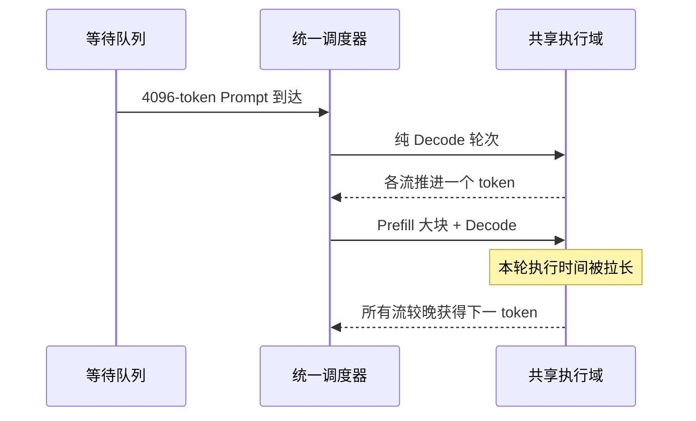

## 本节目标
P/D 解耦不应从“怎样拆”开始，而应先证明统一实例确实存在不可接受的互扰。
本节只建立统一实例基线，不提前设计资源池、Connector 或路由器。
学完后，你应能：
- 说明统一实例的局部性优势；
- 解释 Prefill 大块与 Decode 节拍为何冲突；
- 区分平均吞吐、平均 TPOT 与 P99 停顿；
- 说清 Chunked Prefill 能缓解和不能消除的问题；
- 给出“值得继续评估解耦”的证据链。
## 目录
- [1. 固定算例与两把时间尺](#1-固定算例与两把时间尺)
- [2. 统一实例为什么仍是强基线](#2-统一实例为什么仍是强基线)
- [3. Prefill 与 Decode 的目标冲突](#3-prefill-与-decode-的目标冲突)
- [4. 混合 batch 怎样传播干扰](#4-混合-batch-怎样传播干扰)
- [5. Mean 为什么掩盖 P99](#5-mean-为什么掩盖-p99)
- [6. 固定算例中的一次停顿](#6-固定算例中的一次停顿)
- [7. 排队视角](#7-排队视角)
- [8. Chunked Prefill 能做什么](#8-chunked-prefill-能做什么)
- [9. Chunked Prefill 不能保证什么](#9-chunked-prefill-不能保证什么)
- [10. 怎样证明值得拆](#10-怎样证明值得拆)
- [11. 何时不应拆](#11-何时不应拆)
- [总结](#总结)
- [自我检验](#自我检验)
- [资料](#资料)
## 1. 固定算例与两把时间尺
本章始终使用同一组条件：
- Prompt 长度：`4096 token`；
- 输出长度：`256 token`；
- Prefill 服务需求：$s_P=80$ GPU-ms/request；
- Prefill 墙钟教学值：$T_{prefill,wall}=80$ ms/request，由目标 batch 下的独立测量给出；
- Decode 服务需求：$s_D=320$ GPU-ms/request；
- 用户侧平均 TPOT 基线：$20$ ms；
- 完整 Decode 墙钟时间：约 $5.12$ s；
- Prompt KV：$512$ MiB/request；
- 数据阶段有效带宽：$BW_{transfer}=25$ GiB/s，计时边界为 `post→complete`；
- Poisson 到达率：$\lambda=6$ requests/s；
- SLO：TTFT $\le250$ ms；
- SLO：P99 TPOT $\le35$ ms；
- SLO：E2E $\le6.5$ s。
### 1.1 服务需求尺
$s_P$ 与 $s_D$ 是目标 batch 下折算的 GPU 工作量。
它们用于容量守恒：
$$
a_k=\lambda s_k
$$
它们不是某个用户独占 GPU 的持续时间。
### 1.2 用户墙钟尺
固定输出的用户 Decode 时间为：
$$
256\times20\text{ ms}=5.12\text{ s}
$$
因此：
$$
s_D=320\text{ GPU-ms}\neq5.12\text{ wall-s}
$$
Continuous Batching 让多个请求共享同一轮模型执行。
同理，$s_P=80$ GPU-ms 是容量核算用的服务需求；本章另设的 $T_{prefill,wall}=80$ ms 是 TTFT 算例用的独立墙钟测量。两者数值相同只是教学假设，不能互相换算。
混淆两把尺，会错误估计互扰和后续资源数量。
## 2. 统一实例为什么仍是强基线
统一实例由同一运行时连续处理 Prefill 与 Decode。
它并不是落后方案，而是拥有明确的系统优势。
### 2.1 KV 保持本地
Prefill 写出的 KV 已在本地 HBM。
Decode 可以沿用原 block table。
固定算例中的 $512$ MiB 无需跨池复制。
也不需要额外的打包、注册、可见性屏障与确认。
### 2.2 请求只有一个本地所有者
同一调度器同时知道：
- 请求当前 token 位置；
- 已分配 KV block；
- 是否在运行或等待；
- 是否取消或完成；
- 何时可以释放内存。
请求状态不需要跨故障域交接。
### 2.3 P 与 D 可共享空闲资源
没有新 Prompt 时，更多执行机会可以留给 Decode。
活跃 Decode 较少时，新 Prompt 又可以立刻 Prefill。
低负载、小集群和形态稳定的流量尤其受益于这种统计复用。
### 2.4 故障路径更短
统一实例失败时，请求通常整体失败或整体重试。
不会出现“P 已成功、KV 传了一半、D 尚未接管”的半完成状态。
### 2.5 比较必须计入失去的优势
解耦是否成立，不能只看 P99 是否下降。
还要核算：
- 额外模型权重副本；
- KV 交接；
- 双队列；
- 跨池状态；
- 故障恢复复杂度。
所以本节先尽可能强化统一实例基线。
## 3. Prefill 与 Decode 的目标冲突
### 3.1 Prefill 希望把一次工作做大
Prefill 一次处理整个 Prompt 或其中一个大块。
较大的 token 块通常更容易形成高效矩阵计算。
它倾向于追求：
- 足够大的矩阵形状；
- 较高计算单元利用率；
- 较少调度边界；
- 尽快完成整段 Prompt。
这是“批量效率”目标。
### 3.2 Decode 希望每一步准时
Decode 每轮只推进少量新 token。
它反复读取权重和不断增长的 KV。
它倾向于追求：
- 稳定 iteration 时间；
- 可预测的调度间隔；
- 足够的 HBM 容量与带宽；
- 避免跳过轮次和长时间等待。
这是“节拍稳定”目标。
### 3.3 阶段标签不是硬件定律
Prefill 常有 compute-bound 倾向，Decode 常有 memory-bound 倾向。
但模型结构、batch、量化、硬件和 kernel 都可能改变瓶颈。
真正可靠的判断是：
> 两个阶段常常需要不同的工作粒度和延迟目标。
“特征不同”只是拆分动机，还不是拆分证据。
### 3.4 一个队列承受两种优先级
优先新 Prefill，有利于新请求 TTFT。
优先已有 Decode，有利于流式 TPOT。
高负载下，同一 token budget 很难同时把两者尾部压低。
## 4. 混合 batch 怎样传播干扰
Continuous Batching 允许请求在迭代边界进入和退出。
它提高资源利用率，却不会让两个目标自动兼容。

### 4.1 共享执行时隙
即使 P 与 D 使用不同 kernel，它们仍共享本轮完成边界。
大块 Prefill 延后本轮结束，也就延后同批 Decode 的 token。
### 4.2 共享 token budget
给 Prefill 更多 token，通常提升 Prompt 批量效率。
但本轮更长，已有流的下一 token 更晚。
把 budget 全给 Decode，又会让新请求 TTFT 增长。
### 4.3 共享 HBM
每个新 Prompt 快速写入 $512$ MiB KV。
Decode 同时读取旧 KV，并追加新 token KV。
容量紧张时还可能触发抢占、回收或重算。
### 4.4 共享 batch 形状
Prefill 是多 token 序列块。
Decode 是多个序列各推进少量 token。
混合后形状变化可能影响 kernel 选择、图复用与 collective 节奏。
### 4.5 共享并行布局
统一实例必须共用模型并行方式。
即使 P 更适合一种 TP、D 更适合另一种，两者也不能独立选择。
这是长期配置耦合，不只是一次 iteration 的瞬时停顿。
### 4.6 完整传播链
```text
新 Prompt 到达
  -> 分配 Prefill token budget
  -> batch 形状和工作量改变
  -> iteration 拉长
  -> 同批 Decode 请求一起等待
  -> ITL 尖峰
  -> TPOT P99 与 E2E 风险上升
```
## 5. Mean 为什么掩盖 P99
设请求到达、首 token、末 token 时间为 $t_0,t_1,t_n$。
$$
TTFT=t_1-t_0
$$
相邻 token 间隔为：
$$
ITL_j=t_j-t_{j-1}
$$
请求级平均 TPOT 近似为：
$$
TPOT=\frac{t_n-t_1}{N_{out}-1}
$$
### 5.1 平均值会稀释一次停顿
假设：
- 98% 请求的 TPOT 为 $20$ ms；
- 2% 请求在 Prefill burst 中反复受扰，TPOT 为 $100$ ms。
全体请求的平均 TPOT 为：
$$
0.98\times20+0.02\times100=21.6\text{ ms}
$$
均值只增加 $8\%$。
但慢请求占 $2\%$，请求级 P99 TPOT 会落到慢请求：
$$
P99(TPOT)\approx100\text{ ms}
$$
它远高于 $35$ ms 的 P99 TPOT SLO。
### 5.2 Throughput 也可能看不见停顿
长轮次前后，GPU 仍然完成相近总工作量。
较长窗口中的 token/s 可能只小幅变化。
同一轮中的多条流却同时经历可见 stall。
即使一次孤立 stall 尚未把请求平均 TPOT 推过 35 ms，ITL 或 max stall 仍会把它暴露出来。
### 5.3 至少同时观察六类证据
- 完成请求吞吐；
- 平均 TPOT；
- 请求级 TPOT P99；
- token 或 stream chunk 的 ITL P99；
- 单请求最大 stall；
- 慢轮次与 Prefill token 的时间相关性。
若一次流式 chunk 含多个 token，应把间隔称为 chunk gap，而不是逐 token ITL。
## 6. 固定算例中的一次停顿
先把纯 Decode 的用户节拍近似为每 $20$ ms 一次：
```text
20, 40, 60, 80, 100, ... ms
```
现在第三与第四个 token 之间混入 Prefill 大块。
为便于理解，假设它使该轮额外占用约 $80$ ms；这里引用的是 $T_{prefill,wall}$ 教学值，不是由 $s_P$ 推出的阻塞时间：
```text
20, 40, 60, 160, 180, ... ms
```
对应 ITL：
```text
20, 20, 100, 20, ... ms
```
$80$ ms 取自固定算例的 $s_P$，这里只是服务需求到轮次延迟的教学映射。
真实 mixed kernel 时间不能机械地做标量加法。
### 6.1 平均 TPOT 仍显得健康
一次额外 $80$ ms 让完整 Decode 近似从：
$$
5.12\text{ s}
$$
变为：
$$
5.12+0.08=5.20\text{ s}
$$
256 token 上的平均节拍约为：
$$
\frac{5.20\text{ s}}{256}\approx20.31\text{ ms}
$$
平均值仍远低于 $35$ ms。
但用户已经经历一次约 $100$ ms 的停顿。
### 6.2 Prefill 不是偶发后台任务
在 $\lambda=6$ 下，P 平均服务需求为：
$$
a_P=6\times0.08=0.48
$$
新 Prompt 会持续到达。
因此 mixed iteration 会反复出现，而不是只影响一个实验请求。
### 6.3 Mean 与 P99 回答不同问题
平均值回答“整个输出总体多慢”。
P99 回答“最慢一小部分请求或间隔有多慢”。
交互服务必须同时保护两者。
## 7. 排队视角
统一调度器不严格等价于 M/G/1，但其方向性结论有用：
$$
E[W_q]=\frac{\lambda E[S^2]}{2(1-\rho)}
$$
其中：
$$
\rho=\lambda E[S]
$$
### 7.1 利用率接近 1
$1-\rho$ 变小时，等待非线性增加。
系统不必到 100% 才出现严重尾延迟。
### 7.2 长轮次增大二阶矩
少量大 Prefill 会明显增加 $E[S^2]$。
因此尾部长服务对等待的破坏，大于它对均值的表面影响。
### 7.3 随机到达更容易撞上长轮次
平均残余服务时间为：
$$
E[R]=\frac{E[S^2]}{2E[S]}
$$
长区间更容易被随机到达观察到。
这解释了为何 Decode 请求常常“撞上”大 Prefill。
### 7.4 近似不能替代测量
真实系统还包含多序列并行、KV 抢占、cache hit 和 batch 变化。
排队公式用于解释趋势，不用于替代同负载对照。
## 8. Chunked Prefill 能做什么
Chunked Prefill 把 4096-token Prompt 切成多个小块。
它把一次大阻塞改成多次较小阻塞。
```text
未切块：
P4096 ----------------> D
切成四块：
P1024 -> D -> P1024 -> D -> P1024 -> D -> P1024 -> D
```
### 8.1 限制单轮最长占用
小 chunk 通常缩短 mixed iteration。
Decode 更早获得下一次执行机会。
ITL 最大值和尾部因此可能下降。
### 8.2 提供细粒度调度点
调度器可在 chunk 边界重新评估 Decode 紧迫度。
它也可以重新分配本轮 token budget。
### 8.3 保留统一实例局部性
KV 仍在同一运行时与 HBM 中。
$512$ MiB 不需要跨池传输。
请求也不新增跨实例所有权状态。
### 8.4 它是解耦前的必要基线
如果合理 chunk 已满足全部 SLO，物理解耦可能只增加复杂度。
因此不能拿未优化的统一实例与解耦方案比较。
## 9. Chunked Prefill 不能保证什么
### 9.1 不能消除共享资源
P 与 D 仍共享：
- GPU 执行时隙；
- HBM 容量与带宽；
- token budget；
- 本地调度器；
- 模型并行布局。
### 9.2 不能同时保证 TTFT 与 TPOT
chunk 变小通常保护 Decode 节拍。
但 4096-token Prompt 需要更多轮完成。
重复调度和小矩阵效率可能推高 TTFT。
chunk 变大恢复 Prefill 效率，却重新制造 ITL 尖峰。
### 9.3 不能修复长期超载
若 Prefill 工作量超过可消化能力，队列仍会持续增长。
切块改变阻塞粒度，不会让服务需求消失。
### 9.4 不能解除独立扩缩容绑定
D 压力变大时，统一实例不能只增加 D 资源形态。
P/D 仍是同一扩缩容单元。
### 9.5 不能提供故障隔离
Chunked Prefill 是调度技术，不是故障域拆分。
一个统一实例失败时，两阶段仍一起受影响。
## 10. 怎样证明值得拆
“P 与 D 特征不同”只是动机。
以下证据链同时成立，才值得进入解耦成本核算。
### 10.1 保持比较条件一致
固定：
- 同一模型、精度和硬件预算；
- 同一 4096/256 请求；
- 同一 $\lambda=6$ Poisson 到达；
- 同一缓存初态；
- 同一三项 SLO；
- 同一观测窗口。
### 10.2 建立三组统一实例基线
1. 纯 Decode 稳态；
2. 未切块或大 chunk 的混合流量；
3. 多个 chunk 粒度的混合流量。
### 10.3 建立因果关联
慢 ITL 应与同轮 Prefill token 同时出现。
如果没有 Prefill 的轮次也慢，应先排查 KV 抢占、慢 rank 或流式缓冲。
### 10.4 验证无法同时满足两类目标
若大 chunk 违反 P99 TPOT，
而小 chunk 又让 TTFT 超过 $250$ ms，
说明共享调度域存在难以调和的目标冲突。
### 10.5 检查端到端余量
固定算例基线近似：
$$
0.25+5.12=5.37\text{ s}
$$
距离 $6.5$ s 尚有 $1.13$ s。
但 P99 TPOT 可能先于 E2E 违约。
必须逐请求检查 TTFT、TPOT 与 E2E 的联合结果。
### 10.6 正确结论
证据成立后的结论只是：
> 值得核算解耦的 transfer、双队列与状态成本。
它还不是“解耦一定更好”。
## 11. 何时不应拆
以下情形优先保留统一实例：
- 已稳定满足三项 SLO；
- Chunked Prefill 已把尾部节拍控制在预算内；
- 到达率低，P/D 有大量可共享空闲；
- GPU 少，复制权重会挤压 KV；
- KV 交接成本大于隔离收益；
- 跨池取消、超时与回收语义尚不可靠。
正确顺序是：
```text
统一实例基线
  -> 定位 mixed batch 干扰
  -> 扫描 Chunked Prefill
  -> 验证联合 SLO 冲突
  -> 再核算解耦
```
下一节才讨论资源池、调度域与所有权。
## 总结
1. 统一实例具有 KV 本地性、资源共享和简单故障语义，是必须认真优化的基线。
2. Prefill 追求大块效率，Decode 追求稳定节拍，两者在共享调度域中存在目标冲突。
3. 混合 batch 会把一个 Prefill 的延迟传播给同轮多条 Decode 流。
4. 平均吞吐和平均 TPOT 可以正常，而 P99 ITL 或 TPOT 已经违约。
5. Chunked Prefill 能缩小单次阻塞，却不能消除共享资源、超载、配置绑定和故障耦合。
6. 只有合理 chunk 仍无法同时满足同一 SLO，才获得继续评估解耦的证据。
## 自我检验
- [ ] 我能说明统一实例至少三项优势。
- [ ] 我能区分 320 GPU-ms 与 5.12 wall-s。
- [ ] 我能画出 Prefill 拉长 Decode ITL 的时间线。
- [ ] 我能解释 mean 小幅变化而 P99 明显恶化。
- [ ] 我能列出 Chunked Prefill 能做和不能做的事情。
- [ ] 我不会只凭 compute-bound / memory-bound 标签主张解耦。
- [ ] 我能给出“值得拆”的完整证据链。
## 资料
- [DistServe: Disaggregating Prefill and Decoding for Goodput-optimized LLM Serving](https://www.usenix.org/conference/osdi24/presentation/zhong-yinmin)
- [Splitwise: Efficient Generative LLM Inference Using Phase Splitting](https://arxiv.org/abs/2311.18677)
- [Sarathi-Serve: Taming Throughput-Latency Tradeoff in LLM Inference](https://arxiv.org/abs/2403.02310)
- [Orca: A Distributed Serving System for Transformer-Based Generative Models](https://www.usenix.org/conference/osdi22/presentation/yu)
