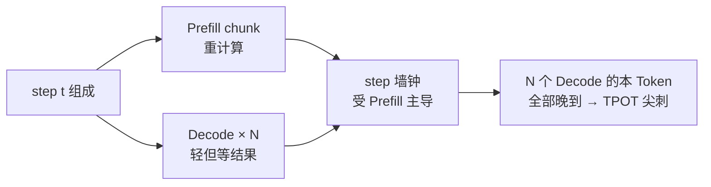

第 2 章讲过：Prefill 偏 Compute Bound，Decode 偏 Memory Bound；Continuous Batching（[2.2](../第2章-推理引擎核心技术/2.2-Continuous%20Batching.md)）与 Chunked Prefill（[2.4](../第2章-推理引擎核心技术/2.4-Chunked%20Prefill%20与统一调度.md)）已在同引擎内抬利用率、削长 Prompt 高峰。第 6 章又用分布式解决「装不下 / 撑不住」。但当负载长短混杂、TTFT 与 TPOT **双 SLO 同时紧**时，同引擎混合调度仍可能不够——不是利用率差，而是两阶段抢同一条步边界。这一节先把问题钉死：用带单位的示意账说明 **Prefill 与 Decode 如何互相挤压 TTFT/TPOT**，再划清同引擎缓解的边界；是否解耦留给 [7.2](./7.2-解耦架构设计.md) 之后。

<!-- more -->

## 📑 目录

- [1. 混合 Batching 指什么](#1-混合-batching-指什么)
- [2. 两种阶段的资源肖像](#2-两种阶段的资源肖像)
- [3. 干扰机制：同一步里的木桶](#3-干扰机制同一步里的木桶)
- [4. 手算：TTFT / TPOT 如何互挤](#4-手算ttft--tpot-如何互挤)
- [5. 哪些负载最容易爆](#5-哪些负载最容易爆)
- [6. 现有缓解手段的边界](#6-现有缓解手段的边界)
- [7. 如何用一次压测把问题钉死](#7-如何用一次压测把问题钉死)
- [8. 代价与权衡](#8-代价与权衡)
- [总结](#-总结)
- [自我检验清单](#-自我检验清单)
- [参考资料](#-参考资料)

---

## 1. 混合 Batching 指什么

在 Continuous Batching 引擎里，一个调度 step 常常同时包含：

- 新请求或长 Prompt 的 **Prefill（或 chunk）**；
- 已在生成中的若干请求的 **Decode**。

它们共享同一组 GPU、同一条执行流水线、同一套 Token Budget（调度细节见 [3.4](../第3章-深入vLLM/3.4-调度器源码导读.md)）。这种「**P 与 D 在同一批/同一步混跑**」就是混合 Batching。它提高了利用率，也埋下了互扰。

🔑 **核心概念**：**混合 Batching 的收益是利用率；代价是阶段特性不同的工作互相抢同一条关键路径。**

---

## 2. 两种阶段的资源肖像

| 维度 | Prefill | Decode |
|---|---|---|
| 并行度 | 序列内 Token 可大规模并行 | 每步每序列通常 1 Token |
| 瓶颈 | 算力（Compute Bound） | 显存带宽（Memory Bound） |
| 用户指标 | 主要影响 **TTFT** | 主要影响 **TPOT** |
| 单步耗时 | 随 Prompt/chunk 长度上升 | 相对平稳，但对步边界干扰敏感 |
| 批处理收益 | 提高算力占用 | 靠拼 batch 摊薄权重搬运 |

把这两类工作绑在同一步：步耗时往往被更重的那一类（常常是 Prefill chunk）拉开，Decode 再轻也得陪着等——用户感知的是「这个 Token 迟到了」。

---

## 3. 干扰机制：同一步里的木桶

机制可以压成三句话：

1. 调度器把 P 与 D 放进同一步；
2. GPU 执行完这一步的全部（或主要）工作后才提交结果；
3. Decode 用户感知的是「这个 Token 迟到了」，即使 Decode 本身只需要很少算力。

这不是公平性口号问题，而是**同步批执行的物理结果**。反向亦然：若调度过度限 Prefill 以护 TPOT，新请求的首 Token 会在 Waiting 里堆更久，**TTFT 变差**。

📌 **关键点**：Decode 被拖慢，常常不是因为它变重了，而是因为它**被迫与更重的 Prefill 共享步边界**；护 Decode 过猛，则 TTFT 排队反噬。

---

## 4. 手算：TTFT / TPOT 如何互挤

教学示意（**非某集群实测**；单位 ms）。前提：

- 纯 Decode 稳态：每步墙钟 $t_d = 10\,\mathrm{ms}$（TPOT 基线 ≈ 10 ms，约 100 tok/s 体感）；
- 同一步混入一段 Prefill chunk，额外算力使该步墙钟升到 $t_{\mathrm{mix}} = 45\,\mathrm{ms}$（chunk 大小与实现决定，这里只取数量级）；
- 在途 Decode 并发 $N=32$；新请求到达时若优先大块 Prefill，Waiting 队列再积压约 $q = 3$ 个同类长 chunk，每个约 $40\,\mathrm{ms}$ 量级的调度占用（粗估排队）。

| 场景 | Decode 瞬时/尾部 TPOT | 新请求 TTFT 粗感 | 说明 |
|---|---|---|---|
| A. 纯 Decode | $\approx 10\,\mathrm{ms}$ | — | 基线 |
| B. 频繁混合步 | 混合步上 $\approx 45\,\mathrm{ms}$；若占比高，P95 可到基线数倍 | Prefill 优先时 TTFT 仍可好看 | TPOT 尖刺 |
| C. 严护 Decode（限 Prefill） | 接近 $10\text{–}15\,\mathrm{ms}$ | 排队 $\sim 3\times 40 \approx 120\,\mathrm{ms}$ 量级只算 chunk 调度，尚不含真·Prefill 算完 | TTFT 变差 |

对 B：若混合步在观测窗内频繁出现，P95/P99 TPOT 出现「基线的数倍」并不罕见——**具体倍数是负载形状与 chunk 策略的函数**，不要把「3–5×」写成与硬件无关的常数。对 C：护住了出字，首 Token 却在队列里变慢。

取舍句：**同引擎内，TTFT 与 TPOT 常呈此消彼长**——偏袒 Prefill 则 tokens/s 与 TTFT 好看、Decode 尾延迟尖刺；偏袒 Decode 则打字跟手、新会话开答变慢。平均吞吐可以同时掩盖这两种违约（评价纠偏见 [7.4](./7.4-Goodput与SLO感知调度.md)）。

再补一笔「并发放大」直觉（同一前提族）：若观测窗内 20% 的 step 是混合步（$45\,\mathrm{ms}$）、其余为纯 Decode（$10\,\mathrm{ms}$），则平均步时长 $\approx 0.2\times 45 + 0.8\times 10 = 17\,\mathrm{ms}$——**平均值只涨七成，但落在混合步上的 Token 已经历 4.5× 瞬时恶化**。P95 是否被拉高，取决于混合步是否聚集成突发；这也是为什么必须看分位而非只看均值。

| 📊 现象 | 混合 Batching 下的典型方向 |
|---|---|
| Decode P95 TPOT | 升高（尖刺），幅度随混合步频率与突发形状变 |
| 平均 tokens/s / 平均 TPOT | 可能仍好看（尖刺被平均稀释） |
| TTFT | 与 Decode 保护策略此消彼长 |
| 用户体验 | 「吞吐还行，但打字卡顿」或「出字稳但半天不开答」 |

⚠️ **注意**：**Raw QPS / tokens/s 可以很好看，同时 P95 TPOT 或 TTFT 已经违约。** 互扰要用分位延迟与 [7.4](./7.4-Goodput与SLO感知调度.md) 的 Goodput 看，不能只看利用率。

---

## 5. 哪些负载最容易爆

互扰在下列负载下尤其明显：

1. **长短混合**：超长 Prompt（RAG、长文档）与大量短 Decode 聊天同池；
2. **高并发 Decode + 突发 Prefill**：稳态出字时突然涌入一批新会话；
3. **双紧 SLO**：例如 TTFT P95 与 TPOT P95 同时写进合同；
4. **KV 已接近打满**：抢占/重算与 Prefill 叠加，抖动进一步放大（容量与调度见 [3.4](../第3章-深入vLLM/3.4-调度器源码导读.md)）。

相对不容易爆的场景：离线批处理、单边 SLO 很松、或请求几乎同质（全是短 Prompt 短生成）。若业务主路径已是「短问短答 + 宽松首 Token」，互扰可能长期不可见——这时不必为架构完整度上解耦。

💡 **提示**：做压测时不要只用「纯 Decode」或「纯 Prefill」轨迹。用**生产混合比例**回放，才能看到真实尖刺；至少保留一股长 Prompt 突发，比例按日志分位（如 P90 输入长）抽样。

---

## 6. 现有缓解手段的边界

同引擎内已有补丁：

| 手段 | 作用 | 边界 |
|---|---|---|
| Chunked Prefill（[2.4](../第2章-推理引擎核心技术/2.4-Chunked%20Prefill%20与统一调度.md)） | 削平单步 Prefill 高峰 | 仍共享 GPU，重负载下仍争抢步边界 |
| Token Budget 统一调度 | 控制每步算量 | 无法消除阶段特性差异 |
| 优先级 / 抢占 | 保护重要请求 | 策略复杂，易伤另一指标 |

当出现这些信号时，才值得认真评估 **P/D 解耦**（[7.2](./7.2-解耦架构设计.md) 起）：

- 开启 Chunked Prefill 并收紧 budget 后，Decode P95/P99 相对纯 Decode 基线仍系统性恶化，且双 SLO 破线；
- Prefill 与 Decode 的最优批次/并行度明显冲突（同池调参顾此失彼）；
- 业务能接受 KV 跨池传输成本（[7.3](./7.3-KV-Cache传输与Connector.md)），以换取更稳的双 SLO 可行域。

解耦不是默认下一刀：传输税、双池运维与配比错误都可能让 Goodput 不升反降（[7.5](./7.5-解耦挑战与配比.md)）。

一句话边界：**同引擎补丁解决的是「单步高峰与预算」；解耦解决的是「阶段特性不得不同步」**——两者叠代，不要跳步。

---

## 7. 如何用一次压测把问题钉死

不要靠体感争论要不要解耦。用下面的最小实验即可得到决策数据：

1. **阶段 A（纯 Decode）**：只打稳态 Decode 流量，测 TPOT P50/P95。
2. **阶段 B（混合）**：保持 Decode 不变，叠加长 Prompt Prefill 突发，再测 TPOT/TTFT。
3. **计算干扰因子**：$\mathrm{IF} = \mathrm{TPOT\,P95}_B / \mathrm{TPOT\,P95}_A$。
4. **对照同引擎优化**：打开 Chunked Prefill / 收紧 token budget 后再测一轮 IF，并同时看 TTFT P95 有没有被「护 Decode」打坏。

判读建议（**启发式，需按业务改**）：

| IF（优化后）+ 双 SLO | 解读 |
|---|---|
| IF ≈ 1.0–1.5 且双 SLO 达标 | 互扰可控，优先继续聚合调参 |
| IF ≈ 2–3 或单边 SLO 擦线 | 边界区，用 Goodput 对比再决定（[7.4](./7.4-Goodput与SLO感知调度.md)） |
| IF 仍高且双 SLO 破线，传输预算可接受 | 评估阶段隔离（解耦），不是自动上生产 |

同时盯 TTFT P95：若阶段 B 里 IF 好看只是因为 Prefill 被掐死，TTFT 已破线，则「TPOT 赢了、Goodput 仍可能输」。两指标要一起进表。

💡 **提示**：记录突发 Prefill 的并发与长度，否则后续无法复现。互扰是负载形状的函数，不是模型名的函数。

---

## 8. 代价与权衡

| 选择 | 收益 | 代价 / 不适用 |
|---|---|---|
| 继续聚合 + Chunked Prefill | 控制面简单、无 KV 传输税 | 双紧 SLO + 强混合负载下尾延迟难同时稳住 |
| 严护 Decode（限 Prefill） | TPOT 更稳 | TTFT 排队；Goodput 可能因首 Token 违约下降 |
| 优先大块 Prefill | TTFT / 利用率好看 | Decode 尖刺；流式体验差 |
| 直接上 P/D 解耦 | 阶段隔离、可异构配池 | 传输税、双池运维、配比与故障面（[7.2](./7.2-解耦架构设计.md)–[7.5](./7.5-解耦挑战与配比.md)） |

决策顺序建议：

1. 先用本节 IF + 双 SLO 证明「互扰真的在打门禁」；
2. 再挖同引擎手段（chunk / budget / 优先级），看 IF 能否回到可接受带；
3. 仍不够且 [7.3](./7.3-KV-Cache传输与Connector.md) 传输预算过得去，才进入解耦设计与实战（[7.2](./7.2-解耦架构设计.md)、[7.6](./7.6-vLLM-Disaggregated-Prefill实战.md)）。

适用：已有纯 Decode 基线与混合回放、能算 IF、双 SLO 写成了分位门禁。  
若还在「空载 demo 很顺、生产长短一混就卡」，先完成本节压测，再谈解耦旗标。

---

## 📝 总结

- 混合 Batching 让 Prefill 与 Decode 共享步执行，利用率高但阶段互扰强。
- 示意账上，混合步可把瞬时 TPOT 从 ~10 ms 抬到数十 ms；护 Decode 则 TTFT 排队反噬——二者此消彼长。
- 平均步时长/吞吐常掩盖尾延迟（例如均值只涨七成，瞬时仍可数倍）；要用 P95/P99 与干扰因子 IF 说话。
- Chunked Prefill 等手段能缓解但不能消灭互扰；双紧 SLO + 强混合 + 同引擎挖尽后，才评估解耦。
- 下一节起进入解耦骨架、KV 传输税与 Goodput 门禁——先有本节的问题钉死，再谈结构改造。

## 🎯 自我检验清单

- 能用 Compute Bound / Memory Bound 解释 P/D 为何冲突
- 能描述「同一步混跑 → Decode Token 迟到」与「限 Prefill → TTFT 变差」两条因果链
- 能口述一笔带单位的 TTFT/TPOT 互挤示意账，并说明前提在哪里
- 能说明为何 tokens/s 好看仍可能体验很差
- 能列举最容易爆互扰的负载特征
- 能说明 Chunked Prefill 的边界，以及何时才考虑解耦
- 能设计纯 Decode / 混合两阶段压测并计算干扰因子
- 能根据 IF 与双 SLO 判断继续聚合还是评估解耦
- 能解释为何「平均 TPOT 还行」仍可能与流式卡顿并存

## 📚 参考资料

- [DistServe: Disaggregating Prefill and Decoding for Goodput-optimized Large Language Model Serving（OSDI'24）](https://arxiv.org/abs/2401.09670)
- [Orca: Iteration-level Scheduling](https://www.usenix.org/conference/osdi22/presentation/yu)
- [vLLM 文档（Chunked Prefill / Scheduling）](https://docs.vllm.ai/en/latest/)
- [本模块 2.2 Continuous Batching](../第2章-推理引擎核心技术/2.2-Continuous%20Batching.md)
- [本模块 2.4 Chunked Prefill 与统一调度](../第2章-推理引擎核心技术/2.4-Chunked%20Prefill%20与统一调度.md)
- [本模块 3.4 调度器源码导读](../第3章-深入vLLM/3.4-调度器源码导读.md)
- [本模块 7.4 Goodput 与 SLO 感知调度](./7.4-Goodput与SLO感知调度.md)
