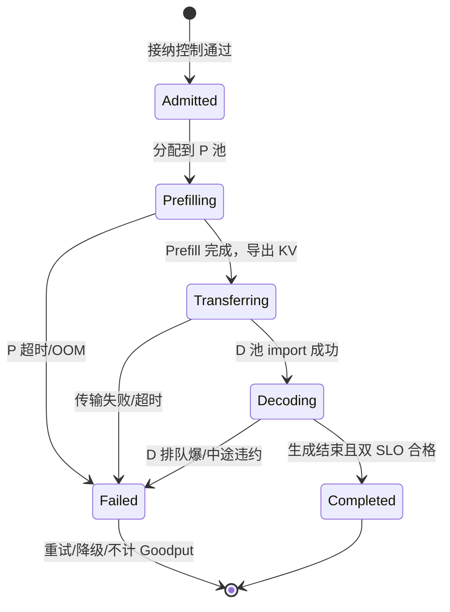

[7.1](./7.1-混合Batching的问题.md) 把同引擎互扰钉死了：TTFT 与 TPOT 在共享步边界上此消彼长。一个自然想法是**把 Prefill 与 Decode 拆到不同资源池**，用 KV 交接换阶段隔离。近几年 DistServe、Splitwise、TaiChi、Microserving 等沿着这条路推进。这一节先画 **P/D 角色与状态转移**，再串读各路线的共通骨架与差异，并明确：**解耦换来什么、运维多了什么**——不记名词表，也不默认「拆了就更快」。

<!-- more -->

## 📑 目录

- [1. 解耦换来什么、运维多了什么](#1-解耦换来什么运维多了什么)
- [2. P/D 角色与状态转移](#2-pd-角色与状态转移)
- [3. DistServe：为 Goodput 论证解耦](#3-distserve为-goodput-论证解耦)
- [4. Splitwise：池化与阶段放置](#4-splitwise池化与阶段放置)
- [5. TaiChi：聚合与解耦的统一](#5-taichi聚合与解耦的统一)
- [6. Microserving：跨引擎编排](#6-microserving跨引擎编排)
- [7. 对照与选型启示](#7-对照与选型启示)
- [8. 从论文到工程的最小落地地图](#8-从论文到工程的最小落地地图)
- [9. 代价与权衡](#9-代价与权衡)
- [总结](#-总结)
- [自我检验清单](#-自我检验清单)
- [参考资料](#-参考资料)

---

## 1. 解耦换来什么、运维多了什么

| 维度 | 解耦通常换来 | 运维 / 系统多出来 |
|---|---|---|
| 延迟结构 | 阶段互扰下降，双 SLO 可行域可能扩大 | TTFT 必须计入 KV 传输与双池排队（[7.3](./7.3-KV-Cache传输与Connector.md)） |
| 资源匹配 | P/D 可不同并发、并行度甚至机型 | $N_p:N_d$ 配比与再平衡（[7.5](./7.5-解耦挑战与配比.md)） |
| 调度目标 | 更易按阶段优化 Goodput（[7.4](./7.4-Goodput与SLO感知调度.md)） | 接纳控制、背压、失败重试协议 |
| 扩展 | 可按瓶颈独立扩 P 或 D | 故障域：P 正常 D 挂 / 传输挂都要降级 |
| 观测 | 可分段看排队 / 算 / 传 | 链路追踪与版本一致性（两池同模型同量化） |

🔑 **核心概念**：**解耦的本质不是「多开几个服务」，而是「用 KV 传输税 + 控制面熵增，购买阶段隔离与资源异构优化」。** 税率与熵增盖过隔离收益时，应回到聚合（见第 9 节）。

---

## 2. P/D 角色与状态转移

把各系统的差异剥掉，请求生命周期通常长这样：



**角色**

| 角色 | 职责 | 典型优化点 |
|---|---|---|
| **Prefill Worker / P 池** | Prompt 前向，写出 KV | 算力利用率、chunk 策略、TTFT 排队 |
| **Decode Worker / D 池** | 导入 KV，自回归出字 | 带宽/KV 容量、稳定 TPOT、并发槽位 |
| **KV Connector** | export → 传输 → import | 后端、重叠、失败重试（[7.3](./7.3-KV-Cache传输与Connector.md)） |
| **入口 / 调度器** | 接纳、P/D 路由、背压 | Goodput 导向，而非只填满 GPU |

共通组件再压成四条：

1. **阶段分离**：P 与 D 不再争夺同一步；
2. **KV 交接**：Prefill 产物必须送到 Decode 侧；
3. **独立扩缩**：两池可按各自瓶颈配不同 GPU 数甚至不同型号；
4. **SLO 导向调度**：按 TTFT/TPOT 约束决定接不接、去哪一池、传不传。

📌 **关键点**：状态机里任何一跳失败（尤其 Transferring），请求都可能从「算完了」变成「用户没答案」——解耦把传输做成了**正确性路径**，而不只是性能彩蛋。

---

## 3. DistServe：为 Goodput 论证解耦

**DistServe（OSDI'24）** 是理解解耦动机的关键论文之一。它系统化论证：

- 混合服务下，满足双 SLO（TTFT + TPOT）的**有效吞吐（Goodput）**会被互扰严重伤害；
- 将 Prefill/Decode 拆开后，可以为两阶段选择不同并行策略与批次，**在部分负载下**扩大双 SLO 可达区；
- 调度与放置需要显式面向 SLO，而不是只盯 GPU 利用率。

对工程读者，DistServe 留下的不是某一固定开源二进制，而是三句可迁移结论：

1. 优化目标应切到 Goodput；
2. P/D 需要不同资源与并行度；
3. 解耦后调度复杂度上升，换来的是**条件收益**——传输与配比做对才谈提升。

---

## 4. Splitwise：池化与阶段放置

**Splitwise（ISCA'24）** 强调在集群层面把机器组织成不同阶段池：

- Prefill 池偏向高算力；
- Decode 池偏向能撑住大量 KV 与稳定带宽的配置；
- 请求在 Prefill 完成后迁移到 Decode 池继续生成。

它把「异构硬件 / 异构配置」推到前台：既然两阶段瓶颈不同，就不必用同一型号 GPU、同一 TP 度去伺候两者。这对云上混部、老新 GPU 混用很有启发；也与第 6 章「按瓶颈选并行轴」同构——只不过这里的轴是**阶段池**，不是 TP/PP。

💡 **提示**：即便两池都用同型号卡，**池大小比例、并发上限、并行度**仍应按阶段分开调——异构是可选项，分池是骨架。

---

## 5. TaiChi：聚合与解耦的统一

完全解耦不是免费的：KV 传输、调度状态机、池配比都会带来成本。**TaiChi** 一类工作探索的是：

- 何时应聚合（同实例混合，省传输）；
- 何时应解耦（隔离互扰，保 SLO）；
- 能否在统一框架下随负载切换或并存。

这对生产很重要：流量日夜变化，白天交互式 Decode 多、夜间长文档 Prefill 多，**静态二选一**往往不是最优。统一框架的价值在于提供策略空间，而不是宣称「永远解耦」。

⚠️ **注意**：统一框架通常更复杂。若团队还没有稳定的观测与 SLO 体系，先把「固定解耦 / 固定聚合」之一做对，再考虑自适应。

---

## 6. Microserving：跨引擎编排

**MLC Microserving** 等路线从「服务组合」角度看问题：Prefill、Decode 乃至其它组件可以是不同引擎实例，通过标准化接口编排。

启示：

- 解耦不必绑定单一代码树内部调度；
- 可以用网关/控制器把请求阶段化；
- 更适合多团队、多后端（不同推理引擎）共存的平台层。

代价是控制面更重：超时、重试、KV 传输失败、部分阶段降级都要有协议——运维面接近「微服务 + 大块状态迁移」。

---

## 7. 对照与选型启示

| 系统/路线 | 强调重点 | 你可带走的实践 |
|---|---|---|
| **DistServe** | Goodput、双 SLO、阶段并行差异 | 改指标；分阶段调并行 |
| **Splitwise** | 池化放置、资源异构 | P 池/D 池分容量与机型 |
| **TaiChi** | 聚合↔解耦统一/自适应 | 按负载选择是否解耦 |
| **Microserving** | 跨引擎编排 | 平台层阶段化接口 |

落到当前开源生态（如 vLLM Disaggregated Prefill，[7.6](./7.6-vLLM-Disaggregated-Prefill实战.md)）：你通常会看到 DistServe/Splitwise 的骨架——P 实例、D 实例、KV Connector——再叠加工程化的传输后端与调度。

```text
选型问句：
1) 双 SLO 是否同时很紧？ → 是则倾向评估解耦
2) KV 传输带宽是否够？（见 7.3） → 不够则先优化同引擎调度
3) 负载是否长期稳定可分池？ → 稳定则固定解耦，波动大则考虑统一/自适应
4) 团队是否吃得消双池运维与分段观测？ → 否则先聚合挖尽
```

---

## 8. 从论文到工程的最小落地地图

读完四条路线，落地时不要同时开四条线。推荐一条收敛路径：

1. **对齐目标**：先把 Goodput 与双 SLO 写成可测门禁（DistServe 的遗产，展开见 [7.4](./7.4-Goodput与SLO感知调度.md)）。
2. **固定拓扑**：P 池 + D 池 + KV 通道（Splitwise 的骨架），先同型号 GPU 也没关系。
3. **打通传输**：选一个 Connector 后端，用真实 Prompt 长度测传输 P95（[7.3](./7.3-KV-Cache传输与Connector.md)）。
4. **再谈自适应**：聚合/解耦切换或跨引擎编排，等前三步稳定后再做（TaiChi / Microserving）。

| 你真正缺的能力 | 优先借鉴 |
|---|---|
| 指标与调度目标错了 | DistServe |
| 不会分池、不会按阶段配资源 | Splitwise |
| 日夜负载结构差很大 | TaiChi 类统一/自适应 |
| 多引擎/多团队平台化 | Microserving |

下一节钻工程硬骨头：KV 怎么传、带宽账怎么算；再往后才是 Goodput 调度、配比与 vLLM 实战。

---

## 9. 代价与权衡

| 选择 | 收益 | 代价 / 不适用 |
|---|---|---|
| 固定 P/D 解耦 | 互扰隔离、可按阶段扩缩 | 传输税、配比、双故障域、版本一致性 |
| 继续聚合 | 简单、无交接 | 双紧 SLO 下尾延迟难两全（[7.1](./7.1-混合Batching的问题.md)） |
| 异构机型分池 | 成本/性能匹配 | 库存与调度更复杂；调试面更大 |
| 自适应聚合↔解耦 | 跟负载走 | 控制面最重；观测与策略未成熟时易抖 |

适用：同引擎手段已挖过、IF 与双 SLO 表明隔离有价值、高速互联与分段观测就绪。  
若集群只有少数几张卡、或长 Prompt KV 跨交换机传输已吃掉 TTFT 预算，优先聚合或同节点交接，而不是「为解耦而解耦」。

---

## 📝 总结

- 解耦用 KV 传输与控制面复杂度，换取阶段隔离和资源匹配；收益是条件的。
- 请求状态机核心是 **Admitted → Prefilling → Transferring → Decoding → Completed**，传输失败即用户失败。
- DistServe 把目标推到 Goodput；Splitwise 强调池化与异构放置；TaiChi 关注聚合/解耦统一；Microserving 走向跨引擎编排。
- 工程上先判断双 SLO、带宽、负载稳定性与运维能力，再决定固定解耦还是保留聚合路径。

## 🎯 自我检验清单

- 能用一张表说出解耦换来什么、运维多了什么
- 能画出 P/D 角色与请求状态转移，并指出传输失败的后果
- 能用一句话概括 DistServe 相对混合服务的核心主张
- 能说明 Splitwise 为什么关心异构池
- 能解释「并非永远解耦」——TaiChi 类工作要解决什么
- 能对比引擎内解耦与跨引擎 Microserving 的利弊
- 能提出决定是否上解耦的选型问句
- 能按「目标 → 拓扑 → 传输 → 自适应」的顺序规划落地

## 📚 参考资料

- [DistServe（OSDI'24）](https://arxiv.org/abs/2401.09670)
- [Splitwise（ISCA'24）](https://arxiv.org/abs/2311.18677)
- [TaiChi: 聚合与解耦统一服务框架相关工作](https://arxiv.org/abs/2407.00067)
- [MLC Microserving / 相关项目文档](https://llm.mlc.ai/)
- [vLLM Disaggregated Prefill 文档](https://docs.vllm.ai/en/latest/)
- [本模块 7.1 混合 Batching 的问题](./7.1-混合Batching的问题.md)
- [本模块 7.3 KV Cache 传输与 Connector](./7.3-KV-Cache传输与Connector.md)
