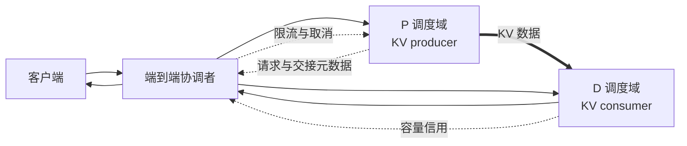

## 本节目标
7.1 已经建立“为什么值得拆”的证据标准。
本节继续回答：拆分的究竟是 GPU，还是请求的调度与状态责任？
答案是两者都拆，但端到端请求仍必须保持一致。
学完后，你应能：
- 区分资源池拆分与调度域拆分；
- 画出 request 与 KV 的联合状态机；
- 说明 producer、consumer 在每个时刻拥有什么；
- 区分 metadata ready 与 data ready；
- 设计跨池 backpressure、取消和失败收敛；
- 公平比较统一架构与解耦架构。
## 目录
- [1. 固定算例与本节边界](#1-固定算例与本节边界)
- [2. 解耦同时拆开两个维度](#2-解耦同时拆开两个维度)
- [3. 最小逻辑拓扑](#3-最小逻辑拓扑)
- [4. 控制路径与数据路径](#4-控制路径与数据路径)
- [5. 请求状态机](#5-请求状态机)
- [6. KV 所有权转移](#6-kv-所有权转移)
- [7. 元数据就绪不等于数据就绪](#7-元数据就绪不等于数据就绪)
- [8. 双队列与背压](#8-双队列与背压)
- [9. 取消传播](#9-取消传播)
- [10. 失败收敛](#10-失败收敛)
- [11. 统一与解耦的权衡](#11-统一与解耦的权衡)
- [12. 最小设计合同](#12-最小设计合同)
- [总结](#总结)
- [自我检验](#自我检验)
- [资料](#资料)
## 1. 固定算例与本节边界
仍使用本章固定工作负载：
- 输入 $4096$ token；
- 输出 $256$ token；
- $s_P=80$ GPU-ms/request；
- $T_{prefill,wall}=80$ ms/request，由目标 batch 下独立测得，不由 $s_P$ 换算；
- $s_D=320$ GPU-ms/request；
- Prompt KV 为 $512$ MiB/request；
- $BW_{transfer}=25$ GiB/s，计时边界为数据阶段 `post→complete`；
- Poisson 到达率 $\lambda=6$ requests/s；
- TTFT $\le250$ ms；
- P99 TPOT $\le35$ ms；
- E2E $\le6.5$ s。
按上述计时边界，数据阶段教学值为：
$$
T_{transfer,data}=\frac{0.5\text{ GiB}}{25\text{ GiB/s}}=20\text{ ms}
$$
本节只定义架构责任和状态。
具体 byte、page、layout 与传输链留到 7.3。
机器数量留到 7.5，vLLM 映射留到 7.6。
## 2. 解耦同时拆开两个维度
只把进程放到不同机器，不足以构成完整 P/D 解耦。
### 2.1 资源池拆分
P 池承载 Prompt 阶段，D 池承载逐 token 生成阶段。
两池可以独立选择：
- 实例数量；
- GPU 能力；
- 模型并行布局；
- 容量余量；
- 故障域放置；
- 扩缩容节奏。
资源池化解除“同一组硬件必须同时服务两个阶段”的绑定。
### 2.2 调度域拆分
P 与 D 分别拥有：
- 等待队列；
- 准入规则；
- batch 目标；
- 本地优先级；
- 过载信号；
- 阶段指标。
调度域拆分解除“一种阶段直接占用另一阶段执行时隙”的绑定。
### 2.3 为什么必须两种都拆
只有资源池、没有独立调度域，两个阶段的 SLO 仍可能混在一个控制目标中。
只有独立队列、仍共享同一执行资源，物理互扰仍然存在。
完整解耦希望同时得到：
1. 执行隔离；
2. 独立容量控制；
3. 独立 SLO 反馈。
代价是原本本地隐含的状态必须显式交接。
## 3. 最小逻辑拓扑

“协调者”是逻辑角色，不限定为某个产品。
它可以由入口、控制器和状态存储共同承担。
架构上必须有人负责：
- 给请求分配稳定身份；
- 选择兼容的 P 与 D；
- 追踪 deadline；
- 传播取消和失败；
- 确认最终状态；
- 回收孤儿资源。
若责任没有归属，两个健康资源池也可能组成不可靠系统。
## 4. 控制路径与数据路径
### 4.1 控制路径
控制路径携带体积小但语义关键的信息：
- request ID 与 generation；
- 模型和 tokenizer revision；
- token、layer 与 shard 范围；
- 源和目标 block 映射；
- KV dtype 与 layout；
- producer / consumer 身份；
- deadline、完成、失败与取消。
它回答“这是谁的数据、现在处于什么状态”。
### 4.2 数据路径
数据路径搬运大块 KV。
固定算例中，每请求主体为 $512$ MiB。
平均数据生成率为：
$$
6\times0.5=3\text{ GiB/s}
$$
它回答“字节是否完整到达正确目标”。
### 4.3 两条路径缺一不可
控制消息到达，不代表 $512$ MiB 已经可见。
数据复制完成，也不代表 request、token 和 layout 一定匹配。
可靠交接要求：
$$
ControlCorrect\land DataComplete\land VisibilityCommitted
$$
任一项为假，D 都不能继续 Decode。
## 5. 请求状态机
请求不再由单个运行时从头持有到尾，因此必须显式化生命周期。
### 5.1 正常路径
```text
ARRIVED
  -> ADMITTED
  -> P_QUEUED
  -> PREFILLING
  -> KV_PRODUCED
  -> HANDOFF_PENDING
  -> DATA_IN_FLIGHT
  -> DATA_VISIBLE
  -> D_QUEUED
  -> DECODING
  -> DONE
```
每个状态都决定：
- 哪一方可以修改请求；
- 哪一方必须保留 KV；
- 哪个 deadline 正在消耗；
- 取消应通知谁；
- 可以安全释放什么。
### 5.2 异常终态
```text
CANCELLED
FAILED_P
FAILED_HANDOFF
FAILED_D
EXPIRED
```
异常终态必须可判定且幂等。
重复取消不应重复释放。
迟到失败回调不应影响已复用 block。
### 5.3 request ID 还不够
最小身份应包含：
$$
Identity=(request\_id,generation)
$$
worker 重启后还应绑定 health epoch。
这让旧进程留下的迟到完成消息可以被拒绝。
## 6. KV 所有权转移
所有权表示谁有责任保证数据不被覆盖、决定可见性并最终释放。
### 6.1 Prefill 之前
端到端协调者拥有请求记录。
P 只获得执行租约。
D 若有预留，也只是未来容量承诺。
### 6.2 Prefill 完成
P 成为源 KV owner。
状态可写为：
```text
request = KV_PRODUCED
source_owner = P
consumer_ready = false
```
P 请求腿结束不等于可以释放源 block。
### 6.3 传输进行中
P 仍保持源数据不可变。
D 可以拥有目标 buffer 的分配权，但目标 KV 不可消费。
```text
source = immutable
target = allocated, NOT_READY
consumer = blocked
```
此时可能短暂存在两份 $512$ MiB KV。
峰值容量必须计入双份占用。
### 6.4 数据可见
D 验证所有 shard 完成，并原子发布 READY。
D 此时获得消费权。
P 仍等待所有权确认。
### 6.5 Ack 之后
```text
source_owner = releasable
target_owner = D
request_owner = D + coordinator
```
D 负责后续 KV 增长，协调者继续负责客户端终态。
### 6.6 为什么需要 lease
若 ack 丢失，P 不能无限保留源 KV。
所有权应带有 lease 或超时。
但 lease 过期前必须终止迟到读，并校验 generation。
否则回收后的 block 仍可能被旧操作访问。
## 7. 元数据就绪不等于数据就绪
一次交接至少有四个不同的 ready。
### 7.1 路由就绪
P/D 已选定，模型与布局兼容。
### 7.2 元数据就绪
D 已知道：
- request identity；
- token/layer 范围；
- 源描述；
- 目标映射；
- 预期 byte/shard；
- 完成标识。
此时只能开始准备传输。
### 7.3 数据完成
底层操作报告预期字节已到达。
这可能只代表某个设备队列完成。
其他执行 stream 未必已经可读。
### 7.4 消费可见
同步与内存可见性条件完成。
所有 shard 对同一 generation 达成一致。
D 才能把请求放入 Decode 可运行队列。
### 7.5 两类错误
保守错误：数据已到但请求一直等待，造成超时和泄漏。
危险错误：数据未完整可见就 Decode，造成静默错误。
后者比显式失败更难发现。
## 8. 双队列与背压
解耦后至少有两个队列：
$$
queue_P\quad\text{与}\quad queue_D
$$
端到端时间为：
$$
T_{PD}=queue_P+T_{prefill,wall}+T_{handoff\to READY}+queue_D+T_{decode,wall}
$$
$queue_D$ 还可能包含：
- 等目标 KV 空间；
- 等数据可见；
- 等 D 本地准入；
- 等首个 Decode iteration。
`post→complete` 数据阶段为 $20$ ms，但 D 没有可用 block 时仍不能接管；pack、register、metadata、visibility 与 commit 也不在这 $20$ ms 内。
### 8.1 为什么需要 backpressure
P 是 producer，D 是 consumer。
若 D 变慢而 P 继续工作，中间 KV 会不断堆积。
固定算例每秒产生：
$$
\lambda K=6\times0.5=3\text{ GiB/s}
$$
仅十秒就可能形成：
$$
3\times10=30\text{ GiB}
$$
已完成但无人消费的源 KV。
### 8.2 D 应暴露容量信用
- 可接纳请求数；
- 可分配 KV 字节；
- 交接并发上限；
- 预计 D 队列等待；
- 最早可用时间；
- 当前 worker epoch。
### 8.3 信用怎样反向传播
```text
D capacity
  -> handoff credit
  -> P admission
  -> entrance admission
  -> client outcome
```
信用不足时，P 应限制 Prefill，入口应有界等待或拒绝。
只让 D 本地队列增长，不算完整背压。
### 8.4 中间缓冲必须有界
应限制：
- P 侧 retained KV；
- in-flight byte/request；
- D 侧 NOT_READY block；
- 等待 D 信用的请求；
- 每租户占用。
“显存暂时够大”不能替代稳定性协议。
## 9. 取消传播
取消可能发生在任何状态。
### 9.1 P_QUEUED
从 P 队列移除请求，撤销 D 软预留。
此时没有 KV 数据需要回收。
### 9.2 PREFILLING
若不能安全中断当前 kernel，至少标记结果不可交接。
Prefill 完成后直接释放源 KV。
### 9.3 HANDOFF_PENDING
撤销未开始的传输。
释放 D 目标预留与 P 源 KV。
### 9.4 DATA_IN_FLIGHT
先停止或隔离迟到写入。
D 目标 block 在操作安全终止前不能复用。
仅删除 request 记录是不够的。
### 9.5 DATA_VISIBLE 或 D_QUEUED
D 释放目标 KV。
向 P 发送“无需继续保留”的幂等确认。
### 9.6 DECODING
D 停止后续 token 并释放 KV。
协调者终止流式返回。
P 通常已释放，但仍可安全接收重复取消。
### 9.7 取消完成条件
客户端收到取消确认，不代表内部已经收敛。
还应满足：
$$
NoRunnableRequest\land NoInflightWrite\land NoOrphanKV
$$
## 10. 失败收敛
### 10.1 P 在产生 KV 前失败
请求可重新排入 P 队列。
D 预留应撤销。
重试继续消耗原 deadline。
### 10.2 P 在产生 KV 后失败
若源 KV 丢失，只能重新 Prefill或明确失败。
不能仅凭元数据让 D 假装数据存在。
### 10.3 传输部分完成
D 必须把目标视为不可消费。
部分 shard 成功不构成请求成功。
目标 block 应隔离到操作终止后再回收。
### 10.4 D 在确认前失败
P 仍持有源 KV时，可选择新 D。
旧 D 的迟到确认应因 epoch 不匹配而被拒绝。
### 10.5 D 在确认后失败
若 P 已释放源 KV，最保守路径是重新 Prefill或请求失败。
额外副本属于更高成本的容错设计，不是默认能力。
### 10.6 协调者失败
只存在协调者内存中的 pairing 可能丢失。
P/D worker 需要 lease 与孤儿回收。
重复取消和恢复操作必须幂等。
### 10.7 软失败
组件未崩溃也可能失效：
- 心跳陈旧，把请求送入已满 D；
- 元数据先到，数据长期未到；
- 完成通知丢失，P 源 KV 滞留；
- lease 太短，正常读被回收；
- lease 太长，显存长期不释放。
软失败常表现为尾延迟或容量下降，而非立即报错。
## 11. 统一与解耦的权衡
### 11.1 统一架构的优势
- KV 本地；
- 一个请求 owner；
- 一个主要队列和故障域；
- P/D 共享空闲资源；
- 模型权重副本较少；
- 取消与回收路径短。
### 11.2 解耦架构的优势
- P/D 不直接争用执行时隙；
- 队列和 batch 目标独立；
- 资源数量独立扩展；
- 并行布局可分别选择；
- 阶段故障可局部隔离；
- 可用不同 SLO 信号调度。
### 11.3 解耦新增成本
- 每请求 $512$ MiB KV 交接；
- 按 `post→complete` 口径为 $20$ ms 的数据阶段教学值；
- $queue_P$ 与 $queue_D$；
- 源和目标短时双份 KV；
- lease、visibility 与 ack；
- 跨池取消和失败；
- 更多权重副本。
### 11.4 公平比较
统一实例：
$$
T_U=queue_U+T_{prefill,wall}+interference_U+T_{decode,wall}
$$
解耦实例：
$$
T_{PD}=queue_P+T_{prefill,wall}+T_{handoff\to READY}+queue_D+T_{decode,wall}
$$
READY 后的 ownership ack 属于资源回收路径，不重复计入 TTFT handoff。
只有减少的互扰和独立控制收益大于新增成本，解耦才成立。
最终仍以联合 Goodput 判断，而不是比较局部利用率。
## 12. 最小设计合同
任何方案都应明确回答：
1. request ID、generation 与 worker epoch 如何组成身份？
2. P 完成后谁拥有源 KV？
3. D 何时获得消费权？
4. metadata ready 与 data ready 是否分开？
5. 多 shard 如何原子提交？
6. ack 丢失后谁最终回收？
7. D 的容量信用是什么？
8. 信用不足时 P 是否停止生产？
9. DATA_IN_FLIGHT 取消时如何隔离迟到写？
10. 哪些失败允许重算，哪些必须显式失败？
11. 重试是否继续使用原 deadline？
12. 是否保留统一实例与 Chunked Prefill 基线？
13. 是否使用同一 4096/256、$\lambda=6$ 工作负载？
14. 是否按 TTFT、P99 TPOT 与 E2E 联合比较？
这些问题没有答案时，两组 GPU 还不能称为可靠解耦系统。
## 总结
1. P/D 解耦同时拆分资源池与调度域，端到端请求仍是一条有状态流水线。
2. 控制路径维护身份与状态，数据路径搬运 KV；两者都正确，D 才能继续。
3. producer 在 ack 前保持源 KV，consumer 只有在数据可见后才获得消费权。
4. metadata ready、transfer complete 与 consumer visible 是不同事件。
5. D 必须把容量信用反向传播给入口和 P，否则中间 KV 会成为无界缓冲。
6. 取消、超时和失败必须在每个状态上定义幂等清理。
7. 解耦用传输、双队列和状态成本换取隔离与独立控制。
## 自我检验
- [ ] 我能区分资源池拆分与调度域拆分。
- [ ] 我能画出 ARRIVED 到 DONE 的状态机。
- [ ] 我知道 producer 何时可以释放源 KV。
- [ ] 我能解释 metadata ready 为什么不等于 data ready。
- [ ] 我能说明 D 信用怎样传到 P 和入口。
- [ ] 我能处理 DATA_IN_FLIGHT 状态下的取消。
- [ ] 我能说明 P、D、协调者失败后的最保守路径。
- [ ] 我能公平列出统一与解耦的优势和成本。
## 资料
- [DistServe: Disaggregating Prefill and Decoding for Goodput-optimized LLM Serving](https://arxiv.org/abs/2401.09670)
- [Splitwise: Efficient Generative LLM Inference Using Phase Splitting](https://arxiv.org/abs/2311.18677)
- [TetriInfer: Inference without Interference](https://arxiv.org/abs/2401.11181)
- [vLLM v0.27.1: Disaggregated Prefilling](https://docs.vllm.ai/en/v0.27.1/features/disagg_prefill.html)
