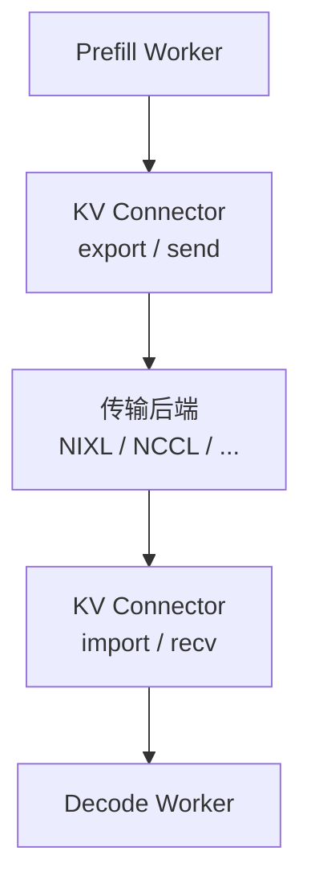

[7.2](./7.2-解耦架构设计.md) 把解耦骨架画清了：阶段隔离靠 **KV 从 P 搬到 D**。搬得慢，TTFT 会被传输吃掉；搬失败，请求直接断。聚合服务里这项成本 ≈ 0（本机显存复用）；解耦后它变成正确性与延迟的共同关键路径。这一节做三件事：**字节粗算**、**带宽门槛**、以及 vLLM 一类系统里的 **KV Connector 抽象**——先会算税率，再谈后端名词。

<!-- more -->

## 📑 目录

- [1. 为什么传输是解耦的核心](#1-为什么传输是解耦的核心)
- [2. KV Connector 抽象](#2-kv-connector-抽象)
- [3. 传输后端：NCCL / NIXL 等](#3-传输后端nccl--nixl-等)
- [4. 手算：KV 字节与带宽门槛](#4-手算kv-字节与带宽门槛)
- [5. 与 PagedAttention 的衔接](#5-与-pagedattention-的衔接)
- [6. 工程风险与优化方向](#6-工程风险与优化方向)
- [7. 快速验收：传输有没有拖后腿](#7-快速验收传输有没有拖后腿)
- [8. 代价与权衡](#8-代价与权衡)
- [总结](#-总结)
- [自我检验清单](#-自我检验清单)
- [参考资料](#-参考资料)

---

## 1. 为什么传输是解耦的核心

聚合服务里，Prefill 写出的 KV 直接躺在本机显存，Decode 立刻复用。解耦后：

1. P 节点算完 Prompt，得到该请求的 KV；
2. 通过网络/跨进程通道发给 D 节点；
3. D 节点写入本地 KV 管理结构（分页块，见 [2.1](../第2章-推理引擎核心技术/2.1-PagedAttention.md)），再开始自回归生成。

于是 TTFT 近似变成：

\[
\text{TTFT} \approx T_{\text{queue,P}} + T_{\text{prefill}} + T_{\text{KV transfer}} + T_{\text{queue,D}} + T_{\text{first decode}}
\]

若 $T_{\text{KV transfer}}$ 与 Prefill 同量级甚至更大，[7.1](./7.1-混合Batching的问题.md) 里买到的隔离收益会被传输税抵消——甚至 Goodput 更差（[7.4](./7.4-Goodput与SLO感知调度.md)）。

🔑 **核心概念**：**解耦用「KV 传输税」购买「阶段隔离」。** 税率由 KV 体积、有效带宽、软件栈决定，不是由「已启用 Disaggregated」旗标决定。

---

## 2. KV Connector 抽象

工程上不会把 NCCL send/recv 散落在业务逻辑里，而是抽出 **KV Connector**：



Connector 通常负责：

- 识别哪些层、哪些 block 需要发送；
- 与分页 KV（block table）对齐，避免无意义拷贝；
- 选择后端、管理连接与失败重试；
- 在 D 侧完成注册，使 Attention 能读到导入的 KV。

📌 **关键点**：调优解耦时，真正该看的往往是 **Connector 后端类型、是否异步重叠、是否按 block 增量传**，而不只是「P 和 D 各起了几个副本」。

---

## 3. 传输后端：NCCL / NIXL 等

不同后端适合不同拓扑（名称与可用性随 vLLM 版本演进，部署前查当前文档；实战接线见 [7.6](./7.6-vLLM-Disaggregated-Prefill实战.md)）：

| 后端类型 | 特点 | 较适合 |
|---|---|---|
| **NCCL** | GPU 集合/点对点通信成熟 | 同集群、NCCL 通路已打通 |
| **NIXL 等专用传输库** | 面向异构/高速传输栈，强调低开销搬运 | 跨节点 KV 搬运优化路径 |
| **共享内存 / 同节点通道** | 避开网卡，延迟更低 | P/D 同机解耦或同节点多进程 |
| **存储中转（次优）** | 实现简单，延迟与寿命管理差 | 调试/兜底，不宜作热路径 |

选择原则：

1. 能同节点交接就不要跨节点；
2. 跨节点优先走 RDMA/IB 类高速路径；
3. 控制面（请求元数据）与数据面（KV 张量）分离，避免用慢 RPC 搬大块字节。

💡 **提示**：后端「能通」与「够快」是两件事。用真实 Prompt 长度测端到端 TTFT，才能暴露 Connector 是否成为新瓶颈。

---

## 4. 手算：KV 字节与带宽门槛

### 4.1 体积粗估

KV 体积数量级（单请求、含 K 与 V）：

\[
\text{KV bytes} \approx 2 \times L \times S \times H_{kv} \times D \times b
\]

其中 $L$ 层数，$S$ 为 Prompt Token 数（Prefill 后序列长），$H_{kv}$ 为 KV 头数，$D$ 为头维，$b$ 为每元素字节（FP16/BF16 $=2$，FP8 $=1$ 等）。GQA/MQA 已体现在较小的 $H_{kv}$；还有 batch、分页对齐、布局填充等修正——**公式给门槛判断，不是账单小数点**。

教学示意（**非某模型实测**；单位 GiB / ms）：

前提：取 $L=32$，$H_{kv}=8$，$D=128$，$b=2$（BF16），$S=4096$。

\[
\begin{aligned}
\text{KV} &\approx 2 \times 32 \times 4096 \times 8 \times 128 \times 2 \\
&= 2 \times 32 \times 4096 \times 2048 \\
&= 536{,}870{,}912\,\mathrm{B} \approx 0.50\,\mathrm{GiB}
\end{aligned}
\]

若 $S=16384$（长 RAG），同配置约 $2.0\,\mathrm{GiB}$ 量级。

### 4.2 传输时延下限与门槛

纯传输下限（忽略软件拷贝与协议开销）：

\[
T_{\text{xfer,min}} \approx \frac{\text{KV bytes}}{\text{有效带宽}}
\]

| 有效带宽（示意） | $0.5\,\mathrm{GiB}$ KV | $2.0\,\mathrm{GiB}$ KV |
|---|---|---|
| $50\,\mathrm{GB/s}$（同机/高速域乐观） | $\sim 10\,\mathrm{ms}$ | $\sim 40\,\mathrm{ms}$ |
| $25\,\mathrm{GB/s}$ | $\sim 20\,\mathrm{ms}$ | $\sim 80\,\mathrm{ms}$ |
| $5\,\mathrm{GB/s}$（跨交换机/软件栈打折后常见量级） | $\sim 100\,\mathrm{ms}$ | $\sim 400\,\mathrm{ms}$ |

设交互式 TTFT SLO 为 P95 $\le 2\,\mathrm{s}$，经验上希望：

\[
T_{\text{KV transfer,P95}} \lesssim 0.2 \times \text{TTFT SLO}
\]

即预算约 $400\,\mathrm{ms}$。上表里「$2\,\mathrm{GiB}$ @ $5\,\mathrm{GB/s}$」已贴边或穿预算——**长 Prompt + 低有效带宽是解耦的硬门槛**，与是否读过 DistServe 无关。

取舍句：**标称网卡带宽不是有效载荷吞吐**；若代表 Prompt 的 $T_{\text{xfer,min}}$ 已吃掉 TTFT 预算的一截，应先改拓扑（同节点/同轨）、KV 量化或放弃跨节点解耦，而不是先扩 P 池（配比见 [7.5](./7.5-解耦挑战与配比.md)）。

| 场景 | 传输税观感 |
|---|---|
| 短 Prompt、同节点 | 通常可忽略或可与计算重叠 |
| 长 Prompt、跨节点、无 RDMA | 容易吞噬解耦收益 |
| 量化 KV / 压缩传输 | 降体积，换编解码开销与精度风险 |

⚠️ **注意**：应用层看到的「网卡标称带宽」打不到。要按 **有效载荷吞吐** 估，并计入软件拷贝、碎片 block、协议开销。

---

## 5. 与 PagedAttention 的衔接

P 侧 KV 往往已是**分页块**；D 侧也要用块表管理（[2.1](../第2章-推理引擎核心技术/2.1-PagedAttention.md)）。Connector 需要决定：

- 按物理块 DMA/发送，还是先整理成连续缓冲；
- D 侧是预分配块再填入，还是接收时动态分配；
- 前缀缓存命中时，是否只传增量段。

设计得好，传输粒度与 block 对齐，能减少打包开销并支持增量；设计得差，每请求都额外 `memcpy` 整段连续缓冲，CPU/GPU 同步成本会刺痛 TTFT。

---

## 6. 工程风险与优化方向

**风险**

- 传输超时导致请求失败或回退重算；
- P 池完成但 D 池无槽位，KV 滞留造成显存泄漏式压力；
- 安全隔离：跨租户时 KV 通道需与请求鉴权绑定。

**优化方向**

1. **计算与传输重叠**：第一个 chunk 算完就预取发送，不必等全部 Prefill 结束（视实现）；
2. **KV 量化/压缩**：降低字节数（与第 4 章量化叠加时需回归质量）；
3. **拓扑局部性**：调度器尽量让 P→D 落在高带宽域（放置直觉同 [6.5](../第6章-分布式推理/6.5-多节点部署Ray.md)）；
4. **缓存复用**：D 侧前缀命中则少传或不传；
5. **背压**：D 池忙时别盲目 Prefill 制造更多待传 KV。

---

## 7. 快速验收：传输有没有拖后腿

上线解耦后，用三次测量判断传输是否合格：

1. **本地聚合 TTFT**：同模型同 Prompt，P/D 同实例；
2. **解耦 TTFT**：含传输；
3. **差分**：$\Delta = \text{TTFT}_{\text{解耦}} - \text{TTFT}_{\text{聚合}}$，应主要解释为传输 + 双池排队。

若 $\Delta$ 接近或超过你的 TTFT SLO 预算的一半，优先优化 Connector/拓扑，而不是继续扩 P 池。

```text
合格经验（需按业务改）：
  transfer P95 < 0.2 × TTFT SLO
  且 decode 侧 import 失败率 ≈ 0
```

---

## 8. 代价与权衡

| 选择 | 收益 | 代价 / 不适用 |
|---|---|---|
| 同节点 P/D + 共享内存通道 | 传输税低 | 扩展受单机卡数限制；故障域仍挤在一起 |
| 跨节点 + RDMA/高速域 | 可分池扩规模 | 依赖拓扑；有效带宽不够时 TTFT 直接爆 |
| KV 量化/压缩传输 | 降体积、松带宽门槛 | 编解码开销；数值/命中行为需回归 |
| 存储中转 KV | 实现简单 | 热路径延迟与生命周期管理差，仅调试 |

适用：已用代表 Prompt 算过 $T_{\text{xfer,min}}$，且预算落在 TTFT SLO 内。  
若长上下文主力流量只能走慢路径，解耦结构再漂亮也换不成 Goodput。

---

## 📝 总结

- 解耦的关键路径是 KV 从 P 到 D；TTFT 必须计入传输时间。
- **KV Connector** 隔离业务与传输后端，并与分页块管理对齐。
- 用 $2LHS_{kv}Db$ 粗估体积，再用有效带宽算 $T_{\text{xfer,min}}$；长 Prompt + 低有效带宽是硬门槛。
- NCCL、NIXL、同节点共享内存等后端各有拓扑适配；重叠、量化、局部调度与背压是主要优化杠杆。

## 🎯 自我检验清单

- 能写出解耦后 TTFT 的组成项并指出传输项
- 能说明 KV Connector 的职责边界
- 能比较至少两种传输后端的适用场景
- 能用手算给出 KV 体积与传输时延下限，并陈述前提
- 能给出与 TTFT SLO 挂钩的传输预算经验（如 0.2×）
- 能解释分页 KV 为何影响传输实现
- 能列举三条降低传输税的工程手段
- 能用聚合/解耦 TTFT 差分判断传输是否拖后腿

## 📚 参考资料

- [vLLM KV Connector / Disaggregated Prefill 文档](https://docs.vllm.ai/en/latest/)
- [NCCL 点对点通信](https://docs.nvidia.com/deeplearning/nccl/user-guide/docs/usage/p2p.html)
- [NVIDIA Dynamo / NIXL 相关传输组件文档](https://github.com/ai-dynamo/nixl)
- [DistServe 论文中的通信与调度讨论](https://arxiv.org/abs/2401.09670)
- [本模块 2.1 PagedAttention](../第2章-推理引擎核心技术/2.1-PagedAttention.md)
- [本模块 7.2 解耦架构设计](./7.2-解耦架构设计.md)
