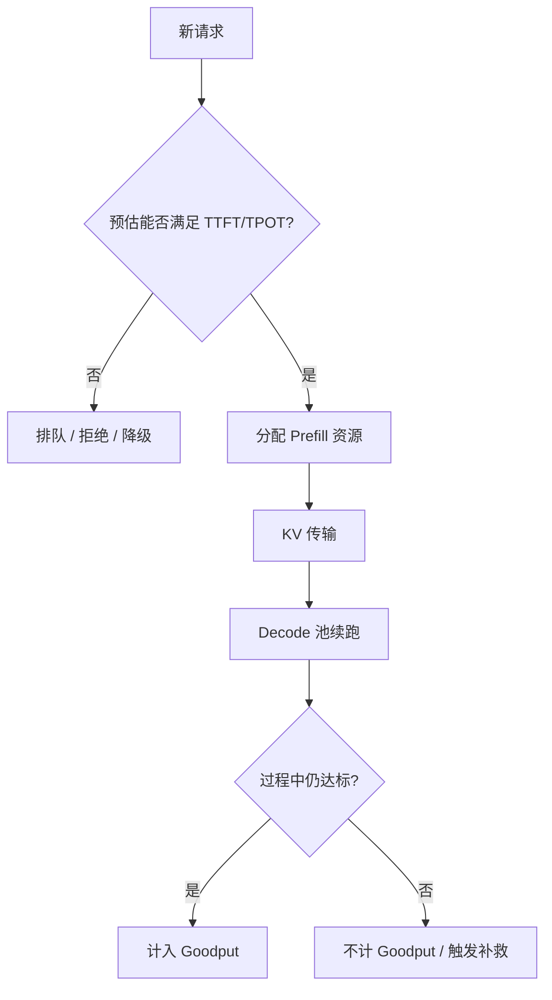

分布式和解耦把系统变复杂之后，最容易犯的错是：**用错误的指标证明自己变快了**。GPU 利用率 95%、QPS 翻倍，但一半请求违约，用户仍然不满意。这一节把 Goodput 讲透，并说明 SLO 感知调度如何改变接不接纳、去哪一池、传不传 KV 的决策。

<!-- more -->

## 📑 目录

- [1. Raw QPS 为什么会骗人](#1-raw-qps-为什么会骗人)
- [2. Goodput 的定义](#2-goodput-的定义)
- [3. 双 SLO：TTFT 与 TPOT](#3-双-slottft-与-tpot)
- [4. SLO 感知调度做什么](#4-slo-感知调度做什么)
- [5. 与解耦架构如何咬合](#5-与解耦架构如何咬合)
- [6. 测量与发布门禁](#6-测量与发布门禁)
- [总结](#-总结)
- [自我检验清单](#-自我检验清单)
- [参考资料](#-参考资料)

---

## 1. Raw QPS 为什么会骗人

Raw QPS / tokens/s 统计的是"系统吐出了多少"，不统计"有多少输出是用户能接受的"。

典型反例：

- 调度拼命塞 Prefill，tokens/s 很高，但 Decode 卡顿，对话体验崩；
- 超时后客户端重试，服务端 QPS 更高，真实成功体验更差；
- 平均延迟合格，P99 爆表，付费客户正好落在尾部。

📌 **关键点**：在 LLM 服务里，**平均吞吐是必要仪表，但不是优化目标本身**。目标是在 SLA 约束下的有效产出。

---

## 2. Goodput 的定义

**Goodput（有效吞吐）**可理解为：

> 单位时间内，**满足 SLO 约束**的请求数（或以 Token 计的有效产出）。

形式化一点（请求级）：

\[
\text{Goodput} = \frac{\#\{\text{请求} \mid \text{满足全部 SLO}\}}{\text{时间}}
\]

一个请求如果 TTFT 超时、或生成过程中 TPOT 长期违约、或中途失败，则**不计入 Goodput**（具体计则可按产品定义微调，例如允许少量 Token 抖动）。

| 📊 指标 | 回答的问题 | 盲区 |
|---|---|---|
| GPU 利用率 | 卡忙不忙 | 忙着干坏事/重试 |
| Raw QPS | 接了多少、吐了多少 | 是否违约 |
| 平均延迟 | 总体中心趋势 | 尾部与双约束 |
| **Goodput** | 多少产出真正合格 | 需要清晰 SLO 定义 |

🔑 **核心概念**：**Goodput = 带合格证的吞吐。** DistServe 等解耦工作把这一指标推到系统评价的中心，就是为了避免"越优化越偏"。

---

## 3. 双 SLO：TTFT 与 TPOT

交互式 LLM 服务常见双约束：

| SLO | 含义 | 用户感知 |
|---|---|---|
| **TTFT ≤ X** | 首 Token 等待上限 | "多久开始回答" |
| **TPOT ≤ Y**（或 tokens/s ≥ 阈值） | 后续出字间隔 | "打字是否跟手" |

二者经常冲突：

- 偏袒 Prefill → TTFT 好，TPOT 差；
- 偏袒 Decode → TPOT 稳，TTFT 排队。

因此调度必须**显式知道两类约束**，而不能只优化一个标量延迟。

💡 **提示**：SLO 要写成可测量的分位数，例如"TTFT P95 ≤ 2s 且 TPOT P95 ≤ 50ms"，并在混合负载下验证，而不是只在空载 demo。

---

## 4. SLO 感知调度做什么

相对"有空位就进 running"的朴素策略，SLO 感知调度会多问几句：

1. **接纳控制**：现在接这个长 Prefill，是否导致大量在途 Decode 违约？若会，则排队或拒绝/降级。
2. **阶段路由**：解耦下，请求去哪个 P 副本、完成后去哪个 D 副本，取决于队列与剩余 KV 预算。
3. **预算分配**：每步 Token Budget 优先保证濒临 TPOT 违约的请求。
4. **提前放弃**：已明显不可能满足 TTFT 的请求，早点失败/走降级模型，避免继续浪费集群。



⚠️ **注意**：预估不必完美。即便用粗模型（按 Prompt 长度、队列长度估），也比完全无视 SLO 强。关键是**闭环**：预估错了要用在线指标校正。

---

## 5. 与解耦架构如何咬合

解耦为 Goodput 提供了更大的可行域：

- P 池专攻 TTFT 相关的算力与并发；
- D 池专攻稳定 TPOT 与 KV 容量；
- 互扰下降后，双 SLO 同时满足的区域变大。

但解耦不会自动提高 Goodput：

- 传输过慢 → TTFT 违约增多；
- D 池配少 → Decode 排队，TPOT/可用性变差；
- 没有接纳控制 → P 池盲目生产 KV，压垮 D 池。

所以：**解耦是结构，SLO 感知是大脑。** 缺一不可。

---

## 6. 测量与发布门禁

建议把下面一套做成上线门禁：

1. 定义 TTFT/TPOT 的分位与阈值窗口；
2. 压测负载使用生产混合比例（含长 Prompt 突发）；
3. 主看 Goodput，辅看 Raw QPS、利用率、错误率；
4. 对比实验必须同 SLO 定义，禁止只报峰值 tokens/s；
5. 解耦变更要同时报传输耗时占比与双池队列长度。

```text
发布对比模板：
  基线 Goodput = ?
  新方案 Goodput = ?
  TTFT P95 / TPOT P95 = ?
  KV transfer P95 = ?
  成本（GPU 数）= ?
```

若 Goodput 不升、只 Raw QPS 升，默认视为**未获胜**。

### 反例复盘模板

当有人展示"优化成功"时，用三问拆穿指标游戏：

1. SLO 定义是否与线上一致（分位、窗口、是否双约束）？
2. 负载是否含长 Prefill 突发，而非纯短请求？
3. Goodput 是升了，还是只升了 tokens/s / 利用率？

答不全，就还不能宣布解耦或调度改造成功。

---

## 📝 总结

- Raw QPS 与利用率不能代表用户体验；**Goodput** 统计满足 SLO 的有效吞吐。
- 交互式服务通常是 **TTFT + TPOT** 双约束，二者存在张力。
- SLO 感知调度通过接纳控制、阶段路由、预算与降级，直接优化 Goodput。
- 解耦扩大了双 SLO 可行域，但仍需调度大脑与正确的测量门禁。

## 🎯 自我检验清单

- 能举一个 Raw QPS 上升但体验下降的例子
- 能给出 Goodput 的操作化定义
- 能说明 TTFT 与 TPOT SLO 为何冲突
- 能列出至少三种 SLO 感知调度动作
- 能解释解耦为何不自动等于 Goodput 提升
- 能设计一个以 Goodput 为主指标的发布对比表
- 能用三问复盘模板识别"假优化"
- 能解释为何混合负载与分位 SLO 必须写进压测协议

## 📚 参考资料

- [DistServe: Goodput-optimized LLM Serving](https://arxiv.org/abs/2401.09670)
- [The Tail at Scale（尾延迟经典讨论）](https://research.google/pubs/pub40801/)
- [SRE 书籍中的 SLI/SLO/SLA 概念](https://sre.google/sre-book/service-level-objectives/)
- [vLLM 可观测性与 metrics 文档](https://docs.vllm.ai/en/latest/)
