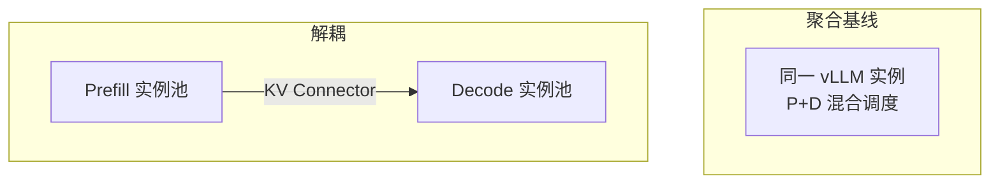

理论够了，这一节把它落成可重复的实验：用 vLLM 的解耦 Prefill 能力拉起 P/D 两池，对比聚合基线，量化互扰，并据此估计 GPU 配比。具体旗标与 Connector 名称随版本变化，**以你安装版本的官方 Disaggregated Prefill 文档为准**；这里给的是稳定的实验方法论与命令骨架。

<!-- more -->

## 📑 目录

- [1. 实战目标与成功标准](#1-实战目标与成功标准)
- [2. 拓扑：聚合基线 vs 解耦](#2-拓扑聚合基线-vs-解耦)
- [3. 部署骨架](#3-部署骨架)
- [4. 构造混合负载](#4-构造混合负载)
- [5. 互扰量化怎么做](#5-互扰量化怎么做)
- [6. 从数据反推 P/D 配比](#6-从数据反推-pd-配比)
- [7. 常见坑](#7-常见坑)
- [总结](#-总结)
- [自我检验清单](#-自我检验清单)
- [参考资料](#-参考资料)

---

## 1. 实战目标与成功标准

本次实战要回答三个问题：

1. 在目标混合负载下，聚合服务的 Decode P95 TPOT 被 Prefill 拖慢多少？
2. 解耦后，TTFT（含 KV 传输）与 TPOT 如何变化？
3. 给定总 GPU 预算，哪一个 $N_p:N_d$ 的 Goodput 最高？

成功标准示例（按业务改数字）：

- Decode P95 TPOT 降回 SLO 内；
- TTFT P95 不出现不可接受回退（或回退被产品接受）；
- Goodput 相对聚合基线提升，而非只 Raw QPS 提升。

🔑 **核心概念**：实战的交付物不是"解耦跑通"，而是**一张有 Goodput 的对比表**。

---

## 2. 拓扑：聚合基线 vs 解耦



建议控制变量：

- 同一模型、同一量化、同一总 GPU 数；
- 同一客户端负载发生器与相同随机种子；
- 先在同集群、尽量同机架/同交换机下做，避免网络随机性淹没结论。

---

## 3. 部署骨架

概念上需要三类角色（名称以文档为准）：

1. **Prefill server(s)**：只或主要负责 prompt 前向，导出 KV；
2. **Decode server(s)**：导入 KV 并完成流式生成；
3. **入口/代理**（若需要）：把新请求打到 P，完成后续会话粘到 D。

伪命令骨架：

```bash
# Prefill 侧（示意）
vllm serve <model> \
  --port 8100 \
  ...  # 启用 disaggregated prefill / kv connector 的 P 角色参数

# Decode 侧（示意）
vllm serve <model> \
  --port 8200 \
  ...  # 启用 D 角色与 connector 对接 P
```

部署后先做**烟测**：

1. 短 Prompt 请求能否返回完整答案；
2. 日志是否出现 KV send/recv 成功记录；
3. 人为断开 Connector，是否有清晰失败而非挂死。

💡 **提示**：第一次请用小模型（如 1B–8B）打通角色与 Connector，再换生产模型，避免排错成本被权重加载时间放大。

---

## 4. 构造混合负载

互扰必须在混合负载下才看得见。建议至少两股流量：

| 流量股 | 特征 | 目的 |
|---|---|---|
| **Decode 稳态** | 中短 Prompt，较长输出，高并发 | 制造稳定出字压力 |
| **Prefill 突发** | 长 Prompt（2k–8k+），短输出 | 制造干扰源 |

可用现成压测工具（vLLM benchmark、自定义 asyncio 客户端等）并行打：

```text
阶段 0: 仅 Decode 稳态  → 记录 TPOT 基线
阶段 1: 叠加 Prefill 突发 → 记录 TPOT/TTFT 恶化
阶段 2: 切换解耦拓扑复测 → 记录恢复与传输开销
```

📌 **关键点**：没有阶段 0 基线，你就无法说清"互扰有多严重"——只能说"感觉卡"。

---

## 5. 互扰量化怎么做

### 5.1 关键指标

| 指标 | 聚合阶段 0 | 聚合阶段 1 | 解耦阶段 2 |
|---|---|---|---|
| TTFT P50/P95 | | | |
| TPOT P50/P95 | | | |
| Goodput | | | |
| KV transfer P95 | N/A | N/A | |
| 错误率/超时率 | | | |

### 5.2 互扰倍数

定义简单比值：

\[
\text{Interference Factor} = \frac{\text{TPOT P95}_{\text{混合}}}{\text{TPOT P95}_{\text{纯 Decode}}}
\]

若聚合下该因子到 3–5，而解耦降到 ~1.x，同时 TTFT 仍可接受，则解耦动机成立。

### 5.3 分段 TTFT

解耦下把 TTFT 拆开看：

- P 排队 + Prefill 计算；
- KV 传输；
- D 排队 + 首 Token Decode。

哪一段最大，优化就指向哪一段（扩 P / 换传输 / 扩 D）。

⚠️ **注意**：只看平均 TPOT 会低估伤害。必须看 **P95/P99**，互扰主要长在尾部。

---

## 6. 从数据反推 P/D 配比

固定总 GPU=$N$，扫描若干拆分：

```text
例如 N=8：
  (Np,Nd) = (2,6), (3,5), (4,4), (5,3)
```

对每一档跑同一混合负载，记录 Goodput 与双 SLO 是否达标。选择：

1. 先过滤不达标档；
2. 在达标档中取 Goodput 最大；
3. 若接近，取运维更简单或突发余量更大的档。

同时观察：

- P 队列长期很长 → Np 不足；
- D 侧 KV 占用打满/TPOT 变差 → Nd 不足；
- 传输 P95 接近 TTFT 预算 → 先优化 Connector/拓扑，而不是继续拧配比。

---

## 7. 常见坑

| 坑 | 表现 | 处理 |
|---|---|---|
| 角色参数没配对 | 能连但无 KV / 结果错 | 对照文档核对接线 |
| 模型配置不一致 | 隐性错误或性能怪异 | P/D 同版本同量化 |
| 用纯短请求压测 | 看不出解耦价值 | 加长 Prefill 突发 |
| 总卡数太少强行拆池 | 两池都变慢 | 小集群先聚合 |
| 只报 tokens/s | 结论偏差 | 强制 Goodput 表 |
| 跨交换机传大 KV | TTFT 回退过大 | 调整放置或放弃解耦 |

---

## 📝 总结

- vLLM Disaggregated Prefill 实战的目标是量化互扰并找到 Goodput 最优配比，而不只是把服务拉起。
- 用**纯 Decode 基线 → 混合聚合 → 解耦**三段对比，计算 TPOT Interference Factor，并分段看 TTFT。
- 在固定 GPU 预算下扫描 $N_p:N_d$，以 SLO 达标为前提最大化 Goodput。
- 小模型先通链路、混合负载才见互扰、传输分段指标决定下一步优化，是三条关键纪律。

## 🎯 自我检验清单

- 能说明实战成功标准为何必须包含 Goodput
- 能搭建（或描述）P 实例、D 实例与 Connector 的最小拓扑
- 能设计纯 Decode / 混合 / 解耦三段实验
- 能计算并解释 Interference Factor
- 能根据队列与传输分段指标判断该扩 P、扩 D 还是优化传输
- 能在固定 N 下选出配比并辩护其合理性

## 📚 参考资料

- [vLLM Disaggregated Prefill / KV Connector 文档](https://docs.vllm.ai/en/latest/)
- [DistServe 论文](https://arxiv.org/abs/2401.09670)
- [vLLM Benchmark 工具文档](https://docs.vllm.ai/en/latest/)
- [本模块 7.1–7.5 各节](./7.1-混合Batching的问题.md)
