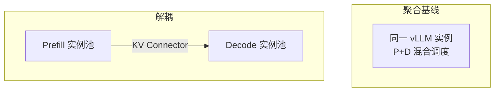

前面五节把互扰、骨架、传输税、Goodput 与配比讲清了（[7.1](./7.1-混合Batching的问题.md)–[7.5](./7.5-解耦挑战与配比.md)）。这一节落到 vLLM：走出一条**最小可跑路径**（小模型打通角色与 Connector → 混合负载对比 → 配比扫描），并用**验收指标**判断是否值得留下解耦。具体旗标与 Connector 名称随版本变化，**以你安装版本的官方 Disaggregated Prefill / KV Connector 文档为准**；这里给稳定的实验方法论与命令骨架，不承诺某一 commit 的逐字 CLI。

<!-- more -->

## 📑 目录

- [1. 实战目标与成功标准](#1-实战目标与成功标准)
- [2. 拓扑：聚合基线 vs 解耦](#2-拓扑聚合基线-vs-解耦)
- [3. 最小可跑路径](#3-最小可跑路径)
- [4. 构造混合负载](#4-构造混合负载)
- [5. 验收指标与互扰量化](#5-验收指标与互扰量化)
- [6. 从数据反推 P/D 配比](#6-从数据反推-pd-配比)
- [7. 常见坑](#7-常见坑)
- [8. 代价与权衡](#8-代价与权衡)
- [总结](#-总结)
- [自我检验清单](#-自我检验清单)
- [参考资料](#-参考资料)

---

## 1. 实战目标与成功标准

本次实战要回答三个问题：

1. 在目标混合负载下，聚合服务的 Decode P95 TPOT 被 Prefill 拖慢多少？（IF，见 [7.1](./7.1-混合Batching的问题.md)）
2. 解耦后，TTFT（含 KV 传输）与 TPOT 如何变化？传输是否吃掉预算？（[7.3](./7.3-KV-Cache传输与Connector.md)）
3. 给定总 GPU 预算，哪一个 $N_p:N_d$ 的 Goodput 最高？（[7.4](./7.4-Goodput与SLO感知调度.md)、[7.5](./7.5-解耦挑战与配比.md)）

成功标准示例（**按业务改数字**；以下为门禁形状而非承诺值）：

- Decode P95 TPOT 回到 SLO 内，或 IF 相对聚合混合显著下降且可解释；
- TTFT P95 回退可接受：$\text{transfer P95} \lesssim 0.2\times\text{TTFT SLO}$，import 失败率 ≈ 0；
- Goodput 相对聚合基线提升（同总 GPU、同负载、同 SLO 定义），而非只 Raw QPS 提升。

🔑 **核心概念**：实战的交付物不是「解耦跑通」，而是**一张有 Goodput 与分段延迟的对比表**。

---

## 2. 拓扑：聚合基线 vs 解耦



建议控制变量：

- 同一模型、同一量化、同一总 GPU 数；
- 同一客户端负载发生器与相同随机种子；
- 先在同集群、尽量同机架/同交换机下做，避免网络随机性淹没结论（与 [6.6](../第6章-分布式推理/6.6-vLLM分布式部署实战.md)「先验收拓扑」同构）。

---

## 3. 最小可跑路径

按顺序做；前一步红灯不要跳到生产模型。

### 步骤 0：读当前版本文档

确认你的 vLLM 版本支持的 Disaggregated Prefill / KV Connector 后端名称、P/D 角色参数与拓扑限制。文中 `...` 处替换为文档中的实际旗标。

### 步骤 1：小模型烟测（1–2 张卡即可）

概念上需要三类角色：

1. **Prefill server**：主要负责 prompt 前向，导出 KV；
2. **Decode server**：导入 KV 并完成流式生成；
3. **入口/代理**（若需要）：新请求打到 P，后续会话粘到 D。

```bash
# Prefill 侧（示意骨架，非逐字拷贝）
vllm serve <small-model> \
  --port 8100 \
  ...  # 启用 disaggregated prefill / kv connector 的 P 角色参数

# Decode 侧（示意骨架）
vllm serve <small-model> \
  --port 8200 \
  ...  # 启用 D 角色与 connector 对接 P
```

烟测验收（全绿再往下）：

| 检查项 | 期望 |
|---|---|
| 短 Prompt 端到端 | 返回完整答案 |
| Connector 日志 | 出现 KV send/recv 成功记录 |
| 人为断开 Connector | 清晰失败/超时，而非进程挂死 |
| P/D 配置 | 同模型名、同量化、同 tokenizer |

💡 **提示**：第一次请用小模型（如 1B–8B）打通角色与 Connector，再换生产模型，避免排错成本被权重加载时间放大。

### 步骤 2：换生产模型，固定总 GPU

在总预算 $N$ 下先选一个保守拆分（如 $N=8$ 时 $(2,6)$），只要求稳定跑通混合流量，不要求最优配比。

### 步骤 3：三段对比实验（下一节负载 + 第 5 节指标）

```text
阶段 0: 仅 Decode 稳态（聚合）→ TPOT 基线
阶段 1: 叠加 Prefill 突发（聚合）→ IF / Goodput
阶段 2: 解耦拓扑复测 → IF、分段 TTFT、Goodput、transfer P95
```

---

## 4. 构造混合负载

互扰必须在混合负载下才看得见。建议至少两股流量：

| 流量股 | 特征 | 目的 |
|---|---|---|
| **Decode 稳态** | 中短 Prompt，较长输出，高并发 | 制造稳定出字压力 |
| **Prefill 突发** | 长 Prompt（2k–8k+），短输出 | 制造干扰源 |

可用现成压测工具（vLLM benchmark、自定义 asyncio 客户端等）并行打。记录突发 Prefill 的并发与长度，否则无法复现（同 [7.1](./7.1-混合Batching的问题.md)）。

📌 **关键点**：没有阶段 0 基线，你就无法说清「互扰有多严重」——只能说「感觉卡」。

---

## 5. 验收指标与互扰量化

### 5.1 必填对比表

| 指标 | 聚合阶段 0 | 聚合阶段 1 | 解耦阶段 2 |
|---|---|---|---|
| TTFT P50/P95 | | | |
| TPOT P50/P95 | | | |
| Goodput | | | |
| Raw QPS / tokens/s | | | |
| KV transfer P95 | N/A | N/A | |
| 错误率/超时率 | | | |
| GPU 数（$N_p$+$N_d$） | | | |

### 5.2 互扰倍数

\[
\text{Interference Factor} = \frac{\text{TPOT P95}_{\text{混合}}}{\text{TPOT P95}_{\text{纯 Decode}}}
\]

判读保持条件句：若聚合下 IF 高且双 SLO 破线，解耦降到更接近 1 的量级，同时 TTFT/transfer 仍在预算内、Goodput 上升——则解耦动机成立。**任一环不满足，都不要写「解耦胜利」**。

### 5.3 分段 TTFT

解耦下把 TTFT 拆开看：

- P 排队 + Prefill 计算；
- KV 传输；
- D 排队 + 首 Token Decode。

哪一段最大，优化就指向哪一段（扩 P / 换传输 / 扩 D）。教学示意（**非实测**）：若 TTFT P95 $=900\,\mathrm{ms}$，其中 transfer $=450\,\mathrm{ms}$，则优先拓扑/Connector，而不是把 $N_p$ 从 2 加到 4。

⚠️ **注意**：只看平均 TPOT 会低估伤害。必须看 **P95/P99**，互扰主要长在尾部。

---

## 6. 从数据反推 P/D 配比

固定总 GPU=$N$，扫描若干拆分（手算起点见 [7.5](./7.5-解耦挑战与配比.md)）：

```text
例如 N=8：
  (Np,Nd) = (2,6), (3,5), (4,4), (5,3)
```

对每一档跑同一混合负载，记录 Goodput 与双 SLO 是否达标。选择：

1. 先过滤不达标档（含 transfer 预算穿线）；
2. 在达标档中取 Goodput 最大；
3. 若接近，取运维更简单或突发余量更大的档。

同时观察：

- P 队列长期很长 → $N_p$ 不足；
- D 侧 KV 占用打满/TPOT 变差 → $N_d$ 不足；
- 传输 P95 接近 TTFT 预算 → 先优化 Connector/拓扑，而不是继续拧配比。

取舍句：**配比扫描的胜利条件是 Goodput + 双 SLO，不是「两池利用率最平均」。**

---

## 7. 常见坑

| 坑 | 表现 | 处理 |
|---|---|---|
| 角色参数没配对 | 能连但无 KV / 结果错 | 对照当前版本文档核对接线 |
| 模型配置不一致 | 隐性错误或性能怪异 | P/D 同版本同量化 |
| 用纯短请求压测 | 看不出解耦价值 | 加长 Prefill 突发 |
| 总卡数太少强行拆池 | 两池都变慢 | 小集群先聚合 |
| 只报 tokens/s | 结论偏差 | 强制 Goodput 表 |
| 跨交换机传大 KV | TTFT 回退过大 | 调整放置或放弃解耦 |
| 烟测用小模型通过、生产长 Prompt 翻车 | transfer 穿预算 | 用代表 $S$ 重算 [7.3](./7.3-KV-Cache传输与Connector.md) 门槛 |

---

## 8. 代价与权衡

| 选择 | 收益 | 代价 / 不适用 |
|---|---|---|
| 最小路径：小模型烟测 → 三段对比 → 配比扫描 | 结论可辩护 | 耗时；需要稳定负载发生器 |
| 跳过烟测直接上生产模型 | 「快」 | 排错被加载与 OOM 淹没 |
| 只跑通解耦、不填 Goodput 表 | demo 好看 | 无法支撑容量与是否保留解耦的决策 |
| 网络差仍坚持跨节点解耦 | 架构叙事完整 | TTFT/Goodput 可能双输 |

适用：已完成 [7.5](./7.5-解耦挑战与配比.md) 决策清单中的观测与 SLO 定义。  
若 Connector 在目标拓扑上烟测都红，先修传输/放置，不要进入配比扫描。

---

## 📝 总结

- vLLM Disaggregated Prefill 实战的目标是量化互扰并找到 Goodput 较优配比，而不只是把服务拉起。
- **最小可跑路径**：读文档 → 小模型烟测 → 生产模型固定 $N$ → 聚合基线/混合/解耦三段对比 → 配比扫描。
- 验收看 IF、分段 TTFT、transfer P95、Goodput 与错误率；任一环穿线都不要宣称胜利。
- 小模型先通链路、混合负载才见互扰、传输分段指标决定下一步优化，是三条关键纪律。

## 🎯 自我检验清单

- 能说明实战成功标准为何必须包含 Goodput 与 transfer 预算
- 能描述 P 实例、D 实例与 Connector 的最小拓扑与烟测项
- 能设计纯 Decode / 混合 / 解耦三段实验
- 能计算并解释 Interference Factor
- 能根据队列与传输分段指标判断该扩 P、扩 D 还是优化传输
- 能在固定 $N$ 下选出配比并辩护其合理性（含前提）

## 📚 参考资料

- [vLLM Disaggregated Prefill / KV Connector 文档](https://docs.vllm.ai/en/latest/)
- [DistServe 论文](https://arxiv.org/abs/2401.09670)
- [vLLM Benchmark / 性能测试相关文档](https://docs.vllm.ai/en/latest/)
- [本模块 7.1 混合 Batching 的问题](./7.1-混合Batching的问题.md)
- [本模块 7.3 KV Cache 传输与 Connector](./7.3-KV-Cache传输与Connector.md)
- [本模块 7.5 解耦挑战与配比](./7.5-解耦挑战与配比.md)
- [本模块 6.6 vLLM 分布式部署实战](../第6章-分布式推理/6.6-vLLM分布式部署实战.md)
