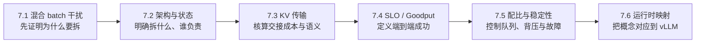

## 本章定位
第 1 章已经说明：Prefill 一次处理整段 Prompt，Decode 则逐 token 推进；第 6 章已经说明：分布式方案必须同时核算显存、通信、调度与拓扑。
本章把两条主线接起来，讨论一个更具体的问题：**既然 P 与 D 共用模型权重，为什么还要把它们放进不同资源池？**
这里的目标不是教你搭建一套 Disaggregated 部署，而是建立一份理论设计合同：
- 先证明混部确实产生了无法接受的阶段互扰；
- 再计算拆分新增的 KV 交接、排队与故障成本；
- 最后以端到端 Goodput，而不是局部利用率，判断方案是否成立。

## 1. 为什么同一张 GPU 上会发生目标冲突
Prefill 通常有较大的矩阵乘法，算术强度较高，倾向于使用较大的 token batch、较长的计算块和计算能力强的 GPU。
Decode 每一步只为活跃序列生成少量 token，需要反复读取权重与 KV Cache，通常更受显存带宽、KV 容量和调度间隔约束。
因此两阶段追求的局部最优并不相同：
- Prefill 希望“把一次工作做大”，提高计算单元利用率并缩短 TTFT；
- Decode 希望“让每次工作准时”，稳定 ITL/TPOT，避免流式输出出现长停顿；
- 长 Prompt、短输出会放大 P 压力，短 Prompt、长输出则会放大 D 压力。

统一实例并非落后方案，它首先拥有重要的**局部性优势**：
- Prefill 产生的 KV 留在本地 HBM，Decode 可直接继续，无需跨池复制；
- 权重、KV 内存管理和请求生命周期由同一运行时维护；
- P 与 D 可以共享空闲算力，流量较低或请求形态稳定时资源利用更灵活；
- 少一层交接协议、远端依赖和中间状态，失败语义也更简单。

代价是两类任务共享执行队列、batch token 预算、显存空间和调度时隙。
一个长 Prefill 插入混合 batch，可能延长已经在 Decode 的请求下一步等待时间；Decode 序列过多，也可能挤压新请求的 Prefill 与 TTFT。
平均吞吐没有下降，并不代表 P99 ITL 没有恶化；这正是统一实例的**互扰代价**。
Chunked Prefill 可以缩短单次占用，却只是改变干扰粒度，不能自动消除共享调度域中的目标冲突。

## 2. P/D 解耦到底拆了什么
P/D 解耦不是“拆成两个服务”这么简单，而是同时完成两种拆分：
1. **资源池化**：P 池与 D 池可选择不同实例数、并行策略、GPU 能力和容量余量。
2. **调度域拆分**：两边拥有独立队列、batch 策略、准入与扩缩容信号，避免一种阶段直接占用另一阶段的执行时隙。

请求仍是一条有状态的端到端流水线。
P 完成后，系统必须把请求身份、token 状态、block 映射和 KV Cache 的所有权一致地交给 D；只有元数据到达而 KV 未就绪，D 仍然不能工作。
于是解耦新增了两个必须显式设计的边界：
- **KV 交接边界**：传多少、何时可见、谁确认、失败后谁回收；
- **故障域边界**：P 成功而传输失败、D 接收后客户端取消、池间超时等半完成状态。
如果没有跨池 backpressure、取消传播、超时预算和幂等清理，两个健康的资源池也可能组成一个不稳定的系统。

## 3. 六节知识图

这条链不能倒着学：没有统一实例基线就无法证明解耦收益，没有 KV 成本就无法做 SLO 和容量判断。

## 4. 一把统一的时间尺
对一个完成 P→D 的请求，本章统一墙钟成本式是 `T_PD = queue_P + T_prefill_wall + T_handoff_to_READY + queue_D + T_decode_wall`：
$$
T_{PD} = queue_P + T_{prefill,wall} + T_{handoff\to READY} + queue_D + T_{decode,wall}
$$
其中 $T_{handoff\to READY}$ 不只含数据移动，还包含打包、注册、元数据、传输排队、可见性与 commit；ownership ack 发生在 READY 之后，控制源 KV 何时释放，不属于首 Token 临界路径。$T_{decode,wall}$ 表示整个输出阶段的墙钟时间。
作为对照，统一实例可写成：
$$
T_U=queue_U+T_{prefill,wall}+interference_U+T_{decode,wall}
$$
`interference_U` 表示混合 batch 中 P/D 争用调度时隙造成的额外等待，它常体现在尾部 ITL，而不是平均计算时间。
解耦没有免费午餐：它用 `transfer`、双队列和更多状态换取更小的 `interference_U` 与更独立的资源控制。
必须在相同模型、请求分布、到达过程、硬件预算和 SLO 下比较两式；只比较 P 或 D 的局部耗时没有意义。

本章最终优化的是 Goodput：
$$
Goodput=\frac{\text{同时满足 TTFT、TPOT 与 E2E SLO 的请求数}}{\text{观测时间}}
$$
若解耦提高 token/s，却让更多请求在 `queue_D` 超时，它仍是失败的设计。

## 5. 贯穿 7.1—7.6 的固定算例
除非某节明确做敏感性分析，后续都复用以下工作负载，避免每节换一组数字得出互不相容的结论：
- 模型输入：每个请求固定 `4096` 个 Prompt token；
- 模型输出：每个请求固定生成 `256` 个 token；
- P 阶段服务需求：目标 batch 下折算为 `s_P = 80 GPU-ms/request`；
- P 阶段墙钟教学值：同一目标 batch 下独立测得 `T_prefill_wall = 80 ms/request`；它只是数值恰好等于 `s_P`，不能由 GPU-ms 直接推出；
- D 阶段服务需求：目标 batch 下折算为 `s_D = 320 GPU-ms/request`；
- 用户侧基线：平均 TPOT 为 `20 ms`，完整 Decode 约 `5.12 s`；
- KV 交接量：每个请求固定 `512 MiB`；
- 数据阶段有效带宽：`BW_transfer = 25 GiB/s`，计时边界为异步传输 `post→complete`，不含 pack、register、metadata、visibility、commit 或 ack；
- 到达过程：Poisson 到达，稳定平均 `λ = 6 requests/s`，另以突发流量做敏感性分析；
- SLO：`TTFT ≤ 250 ms`、`P99 TPOT ≤ 35 ms`、`E2E ≤ 6.5 s`。

按上述 `post→complete` 口径，数据阶段教学值为：
$$
T_{transfer,data}=\frac{0.5\ GiB}{25\ GiB/s}=20\ ms
$$
平均网络载荷为 `6 × 0.5 = 3 GiB/s`，但 12% 的平均链路占用不能证明突发时没有排队。
按服务需求做第一版配比，`s_P:s_D=1:4`；这只是等目标利用率的起点，不是固定的 `1P4D` 部署结论。
例如一个 P 实例的平均负载为 `6×0.08=0.48 GPU`，D 总需求为 `6×0.32=1.92 GPU`；实际实例数仍须按目标利用率与尾延迟向上取整。
还要区分服务需求与用户墙钟延迟：连续 batching 会让多个请求共享 GPU，所以 `s_D=320 GPU-ms` 不等于 `256×20 ms`。
7.1 用该算例观察混部干扰，7.3 核算 20 ms 是否可信，7.4 判定哪些请求算“好请求”，7.5 再校正 P:D 容量。

## 6. 每一节都必须追问的六个问题
1. 工作负载是否真的存在稳定、可利用的阶段异构，还是只在某次压测中偶然出现？
2. `transfer` 是否小于隔离互扰、独立调优和资源池化带来的收益？
3. 当前输入/输出长度与到达率下，P:D 应怎样配比，哪一池先饱和？
4. D 池变慢时，backpressure 在哪里生效，P 是否还会继续制造无法消费的 KV？
5. 客户端取消或任一阶段超时后，请求、KV 和配额如何跨池一致释放？
6. 把排队、传输、失败和额外资源都计入后，端到端 Goodput 是否真的提高？

## 7. 六节边界与承诺
- [**7.1 混合 Batching 的问题：当备菜挡住出餐**](/AIInfraGuide/inference/模块四-推理优化/第7章-pd解耦架构/71-混合batching的问题)：只建立统一实例基线，解释局部性、混合 batch 干扰与尾延迟证据；不提前设计解耦组件。
- [**7.2 解耦架构设计：把一间厨房拆成两条产线**](/AIInfraGuide/inference/模块四-推理优化/第7章-pd解耦架构/72-解耦架构设计)：定义资源池、调度域、请求状态机、KV 所有权和故障边界；不展开传输技术清单。
- [**7.3 KV Cache 传输与 Connector：搬走一座临时仓库**](/AIInfraGuide/inference/模块四-推理优化/第7章-pd解耦架构/73-kv-cache传输与connector)：推导 KV 字节、有效带宽、交接时延与完成语义；不把工具名称当作架构答案。
- [**7.4 Goodput 与 SLO 感知调度：按时送达才算完成**](/AIInfraGuide/inference/模块四-推理优化/第7章-pd解耦架构/74-goodput与slo感知调度)：统一 TTFT、TPOT、E2E 和 Goodput，讨论准入与队列预算；不在本节决定机器数量。
- [**7.5 解耦挑战与配比：两条产线各要几台机器**](/AIInfraGuide/inference/模块四-推理优化/第7章-pd解耦架构/75-解耦挑战与配比)：从服务需求推导 P:D 起始比例，再用利用率、突发、KV 容量、backpressure 和故障恢复校正；不绑定某个运行时配置。
- [**7.6 vLLM v0.27.1 Disaggregated Prefill 实战：从 1P1D 到生产边界**](/AIInfraGuide/inference/模块四-推理优化/第7章-pd解耦架构/76-vllm-disaggregated-prefill实战)：把前五节概念映射到 vLLM 的 producer、consumer、Connector 与观测边界；本章总览不提供部署步骤或压测脚本。

## 8. 学完本章你应该具备的能力
- 从资源特征和尾延迟证据判断是否存在值得隔离的 P/D 互扰；
- 同时说清统一实例的局部性优势与解耦后的控制收益；
- 画出请求状态、KV 所有权和取消/超时传播路径；
- 用统一成本式估算 transfer 与双队列是否吃掉解耦收益；
- 根据服务需求、目标利用率和流量画像给出 P:D 初始配比；
- 用端到端 Goodput 比较统一与解耦方案，并识别不该解耦的场景。

## 9. 自检
- 如果统一实例已经满足 SLO，为什么“阶段特征不同”仍不足以支持解耦？
- 长 Prefill 为什么可能抬高 Decode 的 P99 ITL，却不明显降低平均吞吐？
- 512 MiB KV 在 25 GiB/s 下为什么不能只写“传输 20 ms”就结束？
- 当 `queue_D` 持续增长时，P 池、入口和客户端分别应看到什么信号？
- 为什么 `s_P:s_D=1:4` 不能直接等价为任意负载下的 `1P4D`？
- 请求在 KV 交接后取消，哪个状态决定两池都可以安全回收内存？
- 哪组 TTFT、TPOT、E2E 结果会出现 Throughput 上升而 Goodput 下降？

## 10. 论文参考
- [DistServe: Disaggregating Prefill and Decoding for Goodput-optimized Large Language Model Serving](https://arxiv.org/abs/2401.09670)
- [Splitwise: Efficient Generative LLM Inference Using Phase Splitting](https://arxiv.org/abs/2311.18677)
- [Sarathi-Serve: Taming Throughput-Latency Tradeoff in LLM Inference with Sarathi-Serve](https://arxiv.org/abs/2403.02310)
- [Orca: A Distributed Serving System for Transformer-Based Generative Models](https://www.usenix.org/conference/osdi22/presentation/yu)
