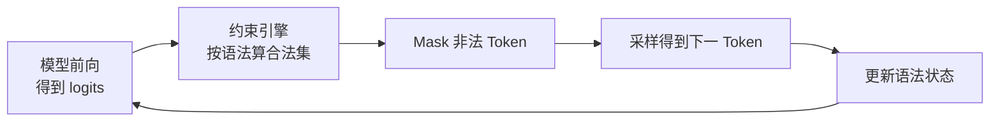

业务系统最怕的不是模型"答得慢"，而是答出来的 JSON 少一个逗号、字段名写错、枚举值越界——下游解析直接炸掉。结构化输出（Structured Outputs）就是用语法约束把"自由生成"收成"只走合法路径"。这一节讲清 Constrained Decoding 原理、xgrammar / guidance 后端，以及 cFSM 如何把约束开销压下去。

<!-- more -->

## 📑 目录

- [1. 为什么需要结构化输出](#1-为什么需要结构化输出)
- [2. Constrained Decoding 原理](#2-constrained-decoding-原理)
- [3. 约束表达：Schema、正则与语法](#3-约束表达schema正则与语法)
- [4. xgrammar 与 guidance 后端](#4-xgrammar-与-guidance-后端)
- [5. cFSM：把约束做成可复用状态机](#5-cfsm把约束做成可复用状态机)
- [6. 在 vLLM 中开启结构化输出](#6-在-vllm-中开启结构化输出)
- [7. 代价、陷阱与选型建议](#7-代价陷阱与选型建议)
- [总结](#-总结)
- [自我检验清单](#-自我检验清单)
- [参考资料](#-参考资料)

---

## 1. 为什么需要结构化输出

Prompt 工程可以"劝"模型输出 JSON，但劝不等于强制。模型仍可能：

- 漏写引号、多写尾逗号，导致 `json.loads` 失败
- 字段名漂移（`user_id` 写成 `userId`）
- 枚举越界（只允许 `high|low`，却吐出 `medium`）
- 在 JSON 前后夹带解释性废话

重试 + 后处理能兜一部分，但会放大延迟与成本，且在高并发下不可靠。**结构化输出把合法性从"事后校验"前移到"生成时约束"**：每一步采样只允许合法 Token，从根上消灭非法路径。

📌 **关键点**：结构化输出解决的是**可控性与可解析性**，不是"让模型更聪明"。质量仍取决于底座模型与 Prompt；约束只保证形式合法。

---

## 2. Constrained Decoding 原理

自回归解码每一步都会得到整表词表上的 logits。受约束解码（Constrained Decoding）在 Softmax / 采样之前，对非法 Token 做 **mask（置为 −∞）**：

1. 根据当前已生成前缀与目标语法，算出"下一步允许的 Token 集合"
2. 对其余 Token 的 logits 置 −∞
3. 再做 Temperature / Top-p 等采样



🔑 **核心概念**：Constrained Decoding = **语法状态机驱动的 Token Mask**。模型仍负责"在合法集合里选得好不好"；引擎负责"绝不走出合法集合"。

⚠️ **注意**：约束过严时，模型可能被逼进低概率区域，出现重复、空洞字段或语义怪异但仍合法的输出。Schema 设计要留合理自由度。

---

## 3. 约束表达：Schema、正则与语法

vLLM / OpenAI 兼容接口常见三类约束：

| 📊 方式 | 适用场景 | 表达力 | 典型用法 |
|---|---|---|---|
| JSON Schema | 结构化 API 响应、表单抽取 | 强（类型、枚举、required） | `response_format: json_schema` |
| 正则（Regex） | 固定格式字符串、ID、日期 | 中 | 匹配某一字段形态 |
| 形式语法（GBNF / EBNF） | 领域 DSL、自定义语法 | 最强 | 复杂嵌套或非 JSON |

实践建议：

- **优先 JSON Schema**：与业务 DTO 一一对应，校验工具链成熟
- Schema 尽量**扁平、枚举明确、避免过深 oneOf**，降低状态机爆炸
- 需要"整段输出就是某个正则"时用 Regex；需要非 JSON DSL 时再上语法

💡 **提示**：OpenAI 风格的 `json_object` 只保证"看起来像 JSON 对象"，并不保证字段齐全。要字段级保证，必须用带 Schema 的 Structured Outputs。

---

## 4. xgrammar 与 guidance 后端

vLLM 把约束编译与运行时 mask 交给后端完成。当前主流是：

- **xgrammar**：面向 LLM 服务优化的结构化生成引擎，强调编译快、每步 mask 开销低，适合高并发在线服务
- **guidance**：更早的约束生成框架，语法表达灵活，适合复杂引导与研究/原型

选型直觉：

| 维度 | xgrammar | guidance |
|---|---|---|
| 服务吞吐友好度 | 高 | 中 |
| Schema → 状态机编译 | 强 | 强 |
| 复杂引导脚本 | 够用 | 更灵活 |
| vLLM 默认倾向 | 生产常用 | 兼容/特定场景 |

工程上不必死记版本细节，抓住分工即可：**vLLM 负责调度与采样，约束后端负责"每步合法集"**。

---

## 5. cFSM：把约束做成可复用状态机

朴素做法是每步用解析器重扫已生成字符串再算合法集——正确但慢。生产实现会把 Schema / 语法**编译成字符级或 Token 级有限状态机（FSM）**，再针对具体 Tokenizer 做适配。

**cFSM（compiled Finite State Machine）** 的要点：

1. **离线/首次编译**：JSON Schema → 语法 → FSM
2. **按 Tokenizer 适配**：把"字符转移"提升为"Token 转移"，避免每步拆 Token
3. **运行时只做转移 + bitset mask**：当前状态 + 下一 Token ∈ 合法边？合法则转移，非法则 mask 掉

```text
Schema ──编译──► FSM ──适配 Tokenizer──► Token-level cFSM
                                          │
每步解码 ◄── O(1)~O(|vocab|) mask 更新 ◄──┘
```

📌 **关键点**：结构化输出的性能关键不在"能不能约束"，而在**状态机是否可编译、可缓存、每步 mask 是否够便宜**。同一 Schema 被大量请求复用时，编译成本可摊薄到接近零。

---

## 6. 在 vLLM 中开启结构化输出

典型路径（OpenAI 兼容服务）：

```python
from openai import OpenAI

client = OpenAI(base_url="http://localhost:8000/v1", api_key="EMPTY")

schema = {
    "type": "object",
    "properties": {
        "intent": {"type": "string", "enum": ["refund", "query", "other"]},
        "confidence": {"type": "number"},
        "need_human": {"type": "boolean"},
    },
    "required": ["intent", "confidence", "need_human"],
}

resp = client.chat.completions.create(
    model="your-model",
    messages=[{"role": "user", "content": "用户要退货，情绪激动"}],
    response_format={
        "type": "json_schema",
        "json_schema": {"name": "ticket", "schema": schema},
    },
)
```

离线 `LLM.generate` 路径则通过 sampling params / guided decoding 参数传入同样的 Schema 或正则。注意：

- 服务端需启用对应 guided decoding 后端
- Schema 变更等于新的编译键；频繁"一人一 Schema"会推高编译开销
- 与 Tool Calling 可组合，但不要把"工具参数 Schema"和"最终回答 Schema"搅在同一段输出里

---

## 7. 代价、陷阱与选型建议

| ✅ 适合 | ❌ 慎用 |
|---|---|
| 下游强依赖 JSON / DSL | 开放域长文创作 |
| 字段少、枚举清晰的抽取 | 极深嵌套、巨型 oneOf |
| Agent 工具参数生成 | 需要模型自由发挥格式时 |

常见陷阱：

- **假安全**：合法 JSON ≠ 事实正确；仍要做业务校验
- **Token 边界**：约束在 Token 空间生效，极端 Tokenizer 行为可能让人困惑——用测试集回归
- **与采样参数互动**：极低 Temperature 更稳；过高 Temperature 仍可能在合法集内抖动
- **延迟预算**：首次编译、复杂 Schema 会抬 TTFT；用 Schema 缓存与简化定义缓解

💡 **提示**：上线前准备 50～200 条真实样例，断言"可解析 + required 字段齐全 + 枚举合法"。这比只看 demos 可靠得多。

---

## 📝 总结

- 结构化输出用生成时约束保证可解析，而不是靠重试碰运气。
- Constrained Decoding 的本质是按语法状态对 logits 做 Token Mask。
- JSON Schema 是业务落地首选；正则与形式语法覆盖更特殊的格式。
- xgrammar / guidance 是约束后端；vLLM 负责把它嵌进在线服务。
- cFSM 把 Schema 编译为可复用状态机，是高并发下可接受延迟的关键。
- Schema 要简单、可缓存，并配套业务校验与样例回归。

## 🎯 自我检验清单

- 能说清 Prompt 约束与 Constrained Decoding 的本质区别
- 能画出"logits → mask → 采样 → 状态更新"的闭环
- 能比较 JSON Schema / Regex / 形式语法的适用场景
- 能解释 xgrammar 与 guidance 在服务场景中的分工直觉
- 能说明 cFSM 如何降低每步约束开销
- 能在 vLLM OpenAI 接口里写出带 `json_schema` 的请求示例
- 能列出结构化输出的主要陷阱与缓解手段

## 📚 参考资料

- [vLLM — Structured Outputs](https://docs.vllm.ai/en/latest/features/structured_outputs.html)
- [OpenAI — Structured Outputs](https://platform.openai.com/docs/guides/structured-outputs)
- [xgrammar](https://github.com/mlc-ai/xgrammar)
- [guidance](https://github.com/guidance-ai/guidance)
- [JSON Schema 规范](https://json-schema.org/)
