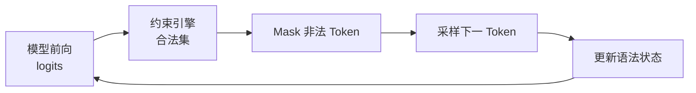

前七章把吞吐、显存与双 SLO 主线讲清了；接进业务时，下一类故障往往不是「慢」，而是**下游 `json.loads` 炸了**。Prompt 劝模型「请输出 JSON」能降一部分错误，却消不掉漏逗号、字段漂移、枚举越界。结构化输出把合法性前移到每步采样的合法集——有收益，也有编译与 mask 税。这一节按问题→机制→落地→代价推进，核心取舍是：**可解析率 / 字段正确率 vs 吞吐与 TTFT**。文中 CLI/字段为配置骨架示意，以你安装版本的文档为准。

<!-- more -->

## 📑 目录

- [1. 问题：事后校验为什么不够](#1-问题事后校验为什么不够)
- [2. 机制：Constrained Decoding](#2-机制constrained-decoding)
- [3. 约束怎么表达](#3-约束怎么表达)
- [4. 后端与 cFSM：税从哪来](#4-后端与-cfsm税从哪来)
- [5. 落地：vLLM 请求骨架](#5-落地vllm-请求骨架)
- [6. 手算：约束税与正确率](#6-手算约束税与正确率)
- [7. 代价与权衡](#7-代价与权衡)
- [总结](#-总结)
- [自我检验清单](#-自我检验清单)
- [参考资料](#-参考资料)

---

## 1. 问题：事后校验为什么不够

自由生成 + 校验重试的常见路径：

1. 模型吐一段「像 JSON」的文本；
2. 解析失败 → 追加「请严格按 Schema」再生成；
3. 仍失败 → 超时或人工兜底。

教学示意（**非某集群实测**）：单次生成 P50 延迟 $200\,\mathrm{ms}$，非法率 $15\%$，平均重试 $1.2$ 次。则有效完成一次合格 JSON 的期望延迟约：

\[
200 \times (1 + 0.15\times 1.2) \approx 236\,\mathrm{ms}
\]

更糟的是高并发下重试会放大队列（与 [7.4](../第7章-PD解耦架构/7.4-Goodput与SLO感知调度.md) 的「假吞吐」同构）：Raw QPS 看起来高，合格 JSON 的 Goodput 反而掉。

| 失败类型 | 典型表现 | 事后校验能否兜 |
|---|---|---|
| 语法坏掉 | 尾逗号、漏引号 | 能发现，靠重试 |
| 字段漂移 | `user_id` → `userId` | 能发现，重试未必收敛 |
| 枚举越界 | 只许 `high\|low` 却出 `medium` | 能发现，模型可能反复越界 |
| 夹带废话 | JSON 前后解释段 | 脆弱截取 |

📌 **关键点**：事后校验回答「这次坏没坏」；结构化输出回答「下一步根本不许走非法边」。二者不互斥——约束之后仍要业务校验事实正确性。

---

## 2. 机制：Constrained Decoding

自回归每步得到词表维 logits。受约束解码在 Softmax / 采样前对非法 Token **mask（置 −∞）**：

1. 据已生成前缀 + 目标语法，算「下一步合法 Token 集」；
2. 非法 logits → −∞；
3. 再走 Temperature / Top-p（见 [8.5](./8.5-采样与解码算法.md)）；
4. 采样后更新语法状态。



🔑 **核心概念**：Constrained Decoding = **语法状态机驱动的 Token Mask**。模型仍在合法集内选语义；引擎保证不走出合法集。

⚠️ **注意**：约束过严会把概率质量挤进狭窄合法区，出现「合法但空洞/重复」的字段。Schema 要留合理自由度；正确率不只等于可解析率。

---

## 3. 约束怎么表达

| 方式 | 适用 | 表达力 | 编译/运行税直觉 |
|---|---|---|---|
| JSON Schema | API 响应、表单抽取 | 类型/枚举/required | 中；扁平 Schema 友好 |
| Regex | ID、日期、固定串 | 中 | 通常较低 |
| GBNF / EBNF | 领域 DSL | 最强 | 易状态爆炸 |

实践顺序：

- **优先 JSON Schema**，与业务 DTO 对齐；
- Schema **扁平、枚举明确、少深 oneOf**；
- 整段输出即某形态时用 Regex；非 JSON DSL 再上形式语法。

💡 **提示**：`json_object` 只保证「像对象」，不保证字段齐全。字段级保证必须带 Schema 的 Structured Outputs。

与 Tool Calling（[8.2](./8.2-Tool-Calling与Reasoning-Parser.md)）分工：工具边界靠 parser；**参数 JSON 合法**可再叠 Schema——别把「工具参数 Schema」和「最终回答 Schema」搅进同一段自由输出。

---

## 4. 后端与 cFSM：税从哪来

vLLM 把编译与每步 mask 交给约束后端（常见 xgrammar / guidance）。分工直觉：

| 维度 | 服务吞吐友好 | 复杂引导 | 角色 |
|---|---|---|---|
| xgrammar | 高 | 够用 | 在线常见默认倾向 |
| guidance | 中 | 更灵活 | 原型/特定语法 |

不必死记版本表；抓住：**引擎调度采样，后端维护合法集**。

朴素每步重扫字符串算合法集——正确但慢。生产路径把 Schema **编译成 cFSM（compiled FSM）**，再适配 Tokenizer：

```text
Schema ──编译──► FSM ──适配 Tokenizer──► Token-level cFSM
                                          │
每步解码 ◄── mask / 状态转移 ◄────────────┘
```

税分两段：

| 税项 | 何时付 | 摊薄方式 |
|---|---|---|
| 编译 | Schema 首次出现 / 变更 | 缓存编译结果；避免一人一 Schema |
| 每步 mask | 每个输出 Token | 简化 Schema；后端 bitset 路径 |

📌 **关键点**：高并发下可接受延迟的关键是 **cFSM 可缓存、每步 mask 够便宜**，不是「能不能约束」。

---

## 5. 落地：vLLM 请求骨架

OpenAI 兼容路径示意：

```python
from openai import OpenAI

client = OpenAI(base_url="http://localhost:8000/v1", api_key="EMPTY")

schema = {
    "type": "object",
    "properties": {
        "intent": {"type": "string", "enum": ["refund", "query", "other"]},
        "confidence": {"type": "number"},
        "need_human": {"type": "boolean"},
    },
    "required": ["intent", "confidence", "need_human"],
}

resp = client.chat.completions.create(
    model="your-model",
    messages=[{"role": "user", "content": "用户要退货，情绪激动"}],
    response_format={
        "type": "json_schema",
        "json_schema": {"name": "ticket", "schema": schema},
    },
)
```

上线前核对：

1. 服务端已启用对应 guided decoding 后端；
2. Schema 变更 = 新编译键；热点 Schema 预热；
3. 准备 50～200 条真实样例，断言可解析 + required + 枚举；
4. 对比实验固定采样种子或低 $T$（[8.5](./8.5-采样与解码算法.md)），只改「有无约束」。

---

## 6. 手算：约束税与正确率

教学示意（**非某模型实测**）。假设：

- 无约束：输出吞吐 $R_0 = 80\,\mathrm{tok/s}$（单流观感），字段级合格率（可解析且业务字段对）$P_0 = 0.82$；
- 开结构化：每步额外 mask 使吞吐降到 $R_1 = 68\,\mathrm{tok/s}$（约 −15%），合格率 $P_1 = 0.97$；
- 另计首次编译摊到该 Schema 稳态后可忽略；冷 Schema 另加一次 TTFT 尖刺（下表单独看）。

定义「有效合格 Token 速率」近似：

\[
G \approx R \times P
\]

| 方案 | $R$ | $P$ | $G$ | 叙事陷阱 |
|---|---|---|---|---|
| 无约束 | 80 | 0.82 | 65.6 | 「更快」 |
| 有约束 | 68 | 0.97 | 66.0 | 「慢了 15%」 |

取舍句：**裸吞吐掉 15%，有效合格产出几乎持平甚至略升**；若再计入无约束侧 15% 非法触发的重试，无约束的端到端 Goodput 往往更差。

冷编译尖刺（示意）：复杂 Schema 首次编译 $80\,\mathrm{ms}$，输出仅 $40$ Token、无约束单步 $12\,\mathrm{ms}$ 时，TTFT/首段延迟相对涨幅可到「多出一个中等 Prefill 零头」——故要用 Schema 缓存，而不是每请求动态拼巨型 oneOf。

发布对比应同时报：

```text
可解析率 / 字段合格率
端到端 P95（含重试）
稳态 tokens/s（同并发）
Schema 编译命中率 / 冷编译 P95
```

只报「开了 Structured Outputs」或只报 tokens/s，都算指标游戏。

---

## 7. 代价与权衡

| 选择 | 收益 | 代价 / 不适用 |
|---|---|---|
| 生成时 Schema 约束 | 可解析率↑，少重试 | 每步 mask；过严伤语义多样性 |
| 扁平枚举 Schema | 编译稳、mask 便宜 | 表达力受限，复杂业务要拆步 |
| 巨型 oneOf / 深嵌套 | 一次表达完 | 编译慢、状态大、TTFT 尖刺 |
| 仅 Prompt + 重试 | 零引擎税 | 高并发下 Goodput 不稳 |
| 约束后不做业务校验 | 省一层代码 | 合法 JSON ≠ 事实正确 |

适用：下游强依赖可解析结构、能固定少数热点 Schema、愿意用样例回归门禁。  
若开放域长文创作、或 Schema 每人每次不同且极深，先问能否改成「抽取两步」或后处理，而不是强行一刀约束。

---

## 📝 总结

- 结构化输出把合法性前移到 Token Mask；解决可控性，不自动提高事实正确性。
- 税在 **Schema 编译** 与 **每步合法集**；cFSM 缓存决定高并发是否可接受。
- 示意账上，吞吐下降可与合格率上升对冲；应用**含重试的端到端**与字段合格率做门禁。
- JSON Schema 优先且宜扁平；与 Tool Calling、采样参数联合回归。

## 🎯 自我检验清单

- 能说明 Prompt 约束与 Constrained Decoding 的本质区别
- 能画出 logits → mask → 采样 → 状态更新闭环
- 能比较 Schema / Regex / 形式语法的税与适用面
- 能口述「吞吐降、有效合格产出不降」的示意账前提
- 能列出冷编译尖刺的缓解手段
- 能设计含可解析率与 P95（含重试）的发布对比表

## 📚 参考资料

- [vLLM — Structured Outputs](https://docs.vllm.ai/en/latest/features/structured_outputs.html)
- [OpenAI — Structured Outputs](https://platform.openai.com/docs/guides/structured-outputs)
- [xgrammar](https://github.com/mlc-ai/xgrammar)
- [guidance](https://github.com/guidance-ai/guidance)
- [JSON Schema](https://json-schema.org/)
- [本模块 7.4 Goodput 与 SLO 感知调度](../第7章-PD解耦架构/7.4-Goodput与SLO感知调度.md)
- [本模块 8.5 采样与解码算法](./8.5-采样与解码算法.md)
