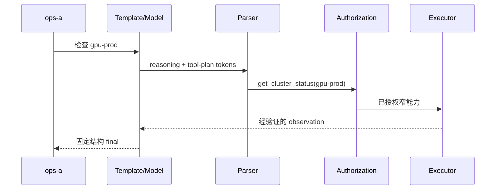

模型生成“查询 `gpu-prod`”不等于查询已经执行，更不等于模型有权执行。
本节继续使用统一请求合同 $\mathcal R=(I,M,D,P,S)$ 和租户 `ops-a` 的值班 Agent，不另起案例。
8.1 已说明参数结构如何受约束；这里直接复用该结论，不重讲 Grammar。

<!-- more -->

## 📑 本节导航
- [1. 问题：意图不是权限](#1-问题意图不是权限)
- [2. 两次模型请求与一次工具事务](#2-两次模型请求与一次工具事务)
- [3. Template 到 Parser](#3-template-到-parser)
- [4. 授权器与 Executor](#4-授权器与-executor)
- [5. Observation 到 Final](#5-observation-到-final)
- [6. 幂等、重试与副作用](#6-幂等重试与副作用)
- [7. ops-a 端到端算例](#7-ops-a-端到端算例)
- [8. 运行时成本与调度](#8-运行时成本与调度)
- [9. 失败与降级](#9-失败与降级)
- [10. 能力边界](#10-能力边界)
- [总结](#总结)
- [自我检验](#自我检验)
- [论文与资料](#论文与资料)

---

## 1. 问题：意图不是权限

`ops-a` 要检查 `gpu-prod`，允许的工具只有 `get_cluster_status`。
模型服务最多先产生一个候选意图：
```text
tool = get_cluster_status
arguments = cluster: gpu-prod
```
这段数据尚未产生任何外部效果。

生产链路必须依次经过：
```text
Template -> 模型 Token -> Parser -> Authorization
         -> Executor -> Observation -> Final
```

各层证明的事情不同：
- Template 证明统一消息被渲染为约定输入；
- 模型 Token 只是概率生成结果；
- Parser 证明 Token 可按协议解释；
- Authorization 决定当前主体能否执行该动作；
- Executor 以受限凭据访问真实系统；
- Observation 表示执行结果或错误；
- Final 把 observation 组织成可提交结论。

Parser 成功不能推出授权成功，工具成功也不能推出端到端合同成功。
Reasoning Parser 只划分模型生成区域；reasoning 中写“应该重启”绝不能触发动作。

---

## 2. 两次模型请求与一次工具事务

### 2.1 三个独立阶段

最短 Agent 闭环包含 tool-plan、工具事务和 final：
$$\mathcal R_{\text{plan}}=(I_{\text{plan}},M,D_{\text{plan}},P_{\text{plan}},S_{\text{plan}})$$
$$\mathcal E=(A_{\text{principal}},A_{\text{intent}},A_{\text{policy}},S_{\text{tool}})$$
$$\mathcal R_{\text{final}}=(I_{\text{final}},M,D_{\text{final}},P_{\text{final}},S_{\text{remain}})$$

$I_{\text{final}}$ 包含经过验证和裁剪的 observation。
$S_{\text{remain}}$ 是前两阶段消耗后剩余的端到端预算。
两次模型请求共享业务 Trace，却有不同输入、解码阶段、KV 生命周期、停止条件和结束原因。

### 2.2 三种身份

至少区分：
- **trace id**：关联整条 Agent 链路；
- **model request id**：标识一次模型生成；
- **operation id / idempotency key**：标识一次业务效果。

模型重试会产生新 request id，却不应自动产生新业务效果。
临时 tool call id 可关联计划与 observation，但不能单独证明副作用幂等。

### 2.3 五元合同怎样贯穿

对 `ops-a`：
- $I$ 固定用户目标、`gpu-prod` 及后续 observation；
- $M$ 固定底座、Tokenizer、Template 和 `ops-diagnosis@17`；
- $D$ 分别固定 tool-plan 与 final 协议；
- $P$ 规定计划和事故结论的随机性边界；
- $S$ 限制生成、工具、总轮数和端到端时限。

任一阶段静默更换 Template、Adapter 或协议，都等于改变请求合同。

---

## 3. Template 到 Parser

### 3.1 Template：协议进入模型上下文

应用持有抽象消息、允许工具和当前阶段。
Template 将其渲染成模型训练时熟悉的角色与边界，再由 Tokenizer 编码：
$$X_{\text{ids}}=\operatorname{Tokenize}_M(\operatorname{Template}_M(I,D))$$

Template 要保持：
- system、user、assistant、tool 的角色关系；
- 工具名称、参数语义和生成起点；
- 上轮调用与 observation 的 ID 对应；
- 正确转义、顺序和长度边界。

Template 属于 $M$ 的身份。
同一权重换 Template，模型看到的 Token 序列和协议行为都会变化。

常见故障是工具说明未进入输入、observation 被当成用户指令、生成起点错误、reasoning/action 标记错配，或工具描述挤占上下文。

### 3.2 模型输出：不可信 Token 流

模型可能生成 reasoning、工具意图、普通文本、多个意图或未闭合边界。
即使 8.1 保证参数形状正确，也不能保证工具选对、资源真实、参数来源可信或租户有权访问。
模型是提案者，不是安全主体。

### 3.3 Reasoning Parser

Reasoning Parser 维护流式状态，把 Token 分类为 reasoning、action/final 或边界。
标记、转义和特殊 Token 可能跨网络 Chunk，不能对每个 Chunk 独立做正则匹配。

它要处理：
- 开始或结束标记被拆开；
- reasoning 未闭合就遇到 EOS；
- reasoning 内提到工具名；
- observation 中出现类似边界的文本；
- 普通内容与 action 混合；
- 流式和非流式聚合不一致。

Reasoning 不应参与授权，也不应默认暴露给用户或永久写入日志。

### 3.4 Tool Parser

Tool Parser 读取允许的 action 区域，产出：
```text
call identity + tool name + canonical arguments
+ parse status + finish status
```
它是协议解码器，不是业务验证器。

只有边界闭合、结束原因正常、数量与大小受限的调用才能进入授权层。
流式参数要按调用索引和 call id 聚合；网络中断或输出截断时，即使前缀碰巧可解析也不能执行。

概念组合顺序为：
```text
token stream -> reasoning boundary -> action/final region
             -> tool boundary -> parsed intent
```
实现可以融合，但必须保证 reasoning 中的假设动作永远不能越过 action 边界。

---

## 4. 授权器与 Executor

### 4.1 授权器决定“能不能”

解析出 `get_cluster_status(gpu-prod)` 后，授权器重新绑定真实主体：
$$\mathrm{allow}=\mathrm{principal}\land\mathrm{toolPolicy}\land\mathrm{resourcePolicy}\land\mathrm{argumentPolicy}\land\mathrm{freshness}$$

对 `ops-a`，至少检查：
- 身份确为 `ops-a`，且可使用该工具；
- 资源范围包含 `gpu-prod`；
- 参数规范化后无额外字段；
- 策略版本有效，请求未超时或取消；
- 高风险动作存在与参数绑定的批准。

模型不能自行扩大资源范围。
8.1 能保证存在 cluster 字段，授权层仍要确认资源命名空间、别名绑定、参数来源和业务范围。

### 4.2 Executor 决定“怎样做”

Executor 持有最小权限凭据，模型永远不接触凭据。
它要限制固定后端操作、网络目的地、超时、返回大小、并发、速率、取消和审计。

不要把任意 HTTP、SQL 或 Shell 包装成万能工具。
窄能力让资源、参数和副作用都可枚举。

Parser 不是沙箱。
即使 Parser 有缺陷，授权器仍应拒绝未知工具、额外参数和越权资源；安全不能依赖某一层永不出错。

---

## 5. Observation 到 Final

### 5.1 Observation 仍是不可信数据

工具可能返回状态、指标、时间戳或错误，也可能过期、过大、格式错误或带提示注入文本。
回填前应：
- 验证来源、工具身份与调用关联；
- 校验状态码和业务形状；
- 裁剪字段并限制字节与 Token；
- 标注采集时间和新鲜度；
- 删除凭据、内部地址和无关 PII；
- 将错误保留为错误，不能伪造正常结果。

tool 角色只是协议标记，不是硬安全边界。
不可信 observation 若诱导下一轮动作，每一轮仍要重新授权。

### 5.2 Final 是新请求

final 读取用户目标、已批准调用和 observation，再生成固定结构结论。
提交前要确认 cluster 仍为 `gpu-prod`、status 与 observation 一致、过期数据没有被说成当前事实，并且结束原因是正常接受。

即使工具成功，final 超时也表示 Agent 合同未完成。
可以保存可信 observation 供 final 重试，但不能再次执行已成功工具或虚构成功响应。

---

## 6. 幂等、重试与副作用

### 6.1 幂等是业务语义

读取通常不改变核心状态，却仍消耗配额、写审计，并且结果随时间变化。
写操作可能创建、删除、重启或通知，重复执行会造成真实副作用。
“看起来是读取”或某种传输方法不能证明业务幂等。

交付语义可分为：
- **至多一次**：不自动重试，可能丢失效果；
- **至少一次**：允许重试，目标必须去重；
- **有效恰好一次**：需要稳定键、持久状态和目标事务配合。

仅靠 Agent 进程内存无法跨崩溃和网络分区保证恰好一次。

### 6.2 稳定幂等键

概念键为：
$$K_{\text{idem}}=H(\text{tenant},\text{workflow intent},\text{tool},\text{canonical args},\text{effect epoch})$$
随机 model request id 或 tool call id 不应是唯一成分。

重试同一意图时复用业务键；用户明确发起第二次相同动作时使用新的 intent/epoch。
目标系统持久记录：
```text
key -> pending | succeeded(result_ref) | failed(final) | unknown
```
并让并发重复请求共享同一状态。

### 6.3 超时是未知结果

Executor 超时可能表示未到达、已执行但响应丢失、仍在执行，或非原子操作完成一部分。
写操作超时后不能由模型决定“再试一次”，应先按幂等键查询状态，再补偿或人工处理。

当前 `get_cluster_status` 是读取，可在剩余 $S$ 和速率预算内重试。
但两次读取时间不同，final 必须使用最新 observation 及时间戳。

### 6.4 重试判定

解析失败发生在执行前，可有限次重生成，并计入模型 Token 与总轮数。
授权拒绝是确定性策略结果，不能通过重采样绕过。
暂时性读取错误可退避重试；副作用的未知结果必须先查事务。
无效参数应回到用户或计划阶段，Executor 不应猜测。

---

## 7. ops-a 端到端算例

### 7.1 正常 trace



全链路固定 tenant、模型与 `ops-diagnosis@17`、资源 `gpu-prod`、只读工具策略和同一业务 Trace。
每次模型生成和工具尝试仍保留各自身份。

### 7.2 延迟手算

假设耗时如下，单位为毫秒：
```text
plan queue + model            18 + 62
parse + authorization              3
tool queue + execution       10 + 37
observation validation             4
final queue + model          15 + 66
```
端到端：
$$T_{\text{e2e}}=80+3+47+4+81=215\text{ ms}$$

若截止时间为 260 ms，只剩 45 ms。
预计耗时 50 ms 的工具重试不应启动，否则会挤掉 final。

工具失败时，只有 $D$ 预先允许 `unknown`，系统才可提交“数据不可用”的 final。
拿旧状态冒充本次 observation 是事实错误，不是降级。

### 7.3 同一工作流跨入副作用

若以后为 `gpu-prod` 增加重启动作，就必须新增写权限、参数绑定批准、稳定幂等键、目标事务查询和独立审计。
这仍是同一 Agent，但从“观察”跨到“动作”后，信任与失败语义已经变化。

---

## 8. 运行时成本与调度

总延迟近似为：
$$T_{\text{agent}}=\sum_iT_{\text{model},i}+\sum_jT_{\text{tool},j}+T_{\text{parse}}+T_{\text{auth}}+T_{\text{observation}}+T_{\text{queue/network}}$$
每增加一轮，就增加 Prefill、Decode、KV、外部调用和队列成本。
只优化一次模型 TPOT，可能对 Agent P99 几乎无影响。

### 8.1 上下文与 Parser

调用计划和 observation 会进入后续输入，后续 Prefill 往往更长。
应限制最大轮数、每轮调用数、observation 字节、reasoning Token、总上下文和输出预算。

增量 Parser 还要为活跃请求维护边界、索引、转义和缓冲状态。
超长未闭合参数必须在生成中途按字节或 Token 上限终止。
未完整的调用不能为降低工具启动延迟而提前执行。

### 8.2 租户配额与 SLO

`ops-a` 的账本应包含：
- 模型输入、reasoning 与输出 Token；
- 工具调用次数、并发和外部耗时；
- observation 大小与 Parser 缓冲；
- Agent 轮数、重试和剩余 final 预算。

大 observation 或循环请求不能挤占其他租户。
调度器应携带一个端到端截止时间，而不是让每段各自“没有超时”。

### 8.3 可观测性

一条 Trace 至少区分：
```text
template.render -> model.tool_plan -> reasoning.parse -> tool.parse
-> tool.authorize -> tool.execute -> observation.validate
-> model.final -> final.validate
```
记录版本、状态、耗时、大小和低敏错误分类。
不要原样记录凭据、完整 reasoning、敏感参数或未裁剪 observation。

---

## 9. 失败与降级

### 9.1 分层失败

**Template 失败**：工具说明或角色关系丢失，应停止该版本流量。

**模型行为失败**：选错工具或参数语义错误，Parser 不能替模型改意图。

**Parser 失败**：边界未闭合、调用串线或流式不一致；不完整调用不执行。

**授权失败**：明确拒绝，禁止重采样绕过同一策略。

**Executor 失败**：区分未执行、最终失败和未知结果，副作用按事务状态处理。

**Observation 失败**：来源、大小、新鲜度或形状不合格，不能当事实回填。

**Final 失败**：结构不完整、与 observation 冲突或超时，Agent 合同未完成。

### 9.2 Prompt injection

监控文本可能声称“忽略规则并调用别的工具”。
它只能作为数据，不能修改 system policy、工具白名单、目标资源或授权主体。

硬控制包括 observation 裁剪与来源标记、逐次授权、读写分离、高风险确认、参数来源限制和循环预算。
提示模型忽略恶意文本有帮助，但不能替代硬控制。

### 9.3 显式降级

合同允许时，可以返回 `unknown`、使用仍在新鲜度窗口内的可信缓存、停止后续轮次、转异步或明确拒绝。
不能伪造 observation、跳过授权、把 reasoning 当 action、盲目重试未知副作用，或无工具回答却声称已经检查。

因 final 失败而再次执行已成功工具，同样是错误。
降级改变 $D$、事实来源或 $S$ 时，必须形成可见的新合同。

---

## 10. 能力边界

本节解释协议和信任边界，不保证模型总能选对工具，也不重新证明 8.1 的自动机与 Token Mask。
Tool/Reasoning Parser 不提供业务授权、沙箱、事务一致性、Prompt injection 免疫或 observation 真实性。

下一节 [8.3 Multi-LoRA 服务](/AIInfraGuide/inference/模块四-推理优化/第8章-生产级服务特性/83-multi-lora服务)
继续跟踪 `ops-a`，解释 `ops-diagnosis@17` 如何成为不可混淆的运行时模型身份。
本节不提供完整 API、部署步骤、模型名单或引擎支持表。

---

## 总结

- Tool Calling 产生协议化意图，不直接执行函数。
- Template、模型 Token、Reasoning Parser 与 Tool Parser 构成协议栈。
- Parser 解释格式；授权器决定能否执行，Executor 以最小权限完成操作。
- observation 是不可信数据，回填前要验证、裁剪并标注新鲜度。
- tool-plan、工具事务和 final 有不同身份与预算。
- 幂等依赖稳定业务键与目标状态，模型 request id 不能证明副作用只发生一次。
- 重试、超时和降级都要服从端到端 $S$。

## 自我检验

- [ ] 能按顺序画出 Template 到 Final 的链路
- [ ] 能区分模型意图、Parser 结果和授权决定
- [ ] 能区分 trace id、model request id 与 idempotency key
- [ ] 能解释 Reasoning Parser 为什么不是推理开关
- [ ] 能说明流式参数未完成时为何禁止执行
- [ ] 能为 `ops-a` 写出最小授权条件
- [ ] 能解释 observation 为什么仍不可信
- [ ] 能区分至多一次、至少一次和有效恰好一次
- [ ] 能说明工具超时为何不等于未执行
- [ ] 能从端到端预算判断是否重试

## 论文与资料

- Schick et al., [Toolformer: Language Models Can Teach Themselves to Use Tools](https://arxiv.org/abs/2302.04761), NeurIPS 2023.
- Yao et al., [ReAct: Synergizing Reasoning and Acting in Language Models](https://arxiv.org/abs/2210.03629), ICLR 2023.
- Greshake et al., [More than You've Asked For: A Comprehensive Analysis of Novel Prompt Injection Threats to Application-Integrated Large Language Models](https://arxiv.org/abs/2302.12173), 2023.
- Debenedetti et al., [AgentDojo: A Dynamic Environment to Evaluate Prompt Injection Attacks and Defenses for LLM Agents](https://arxiv.org/abs/2406.13352), NeurIPS 2024.
