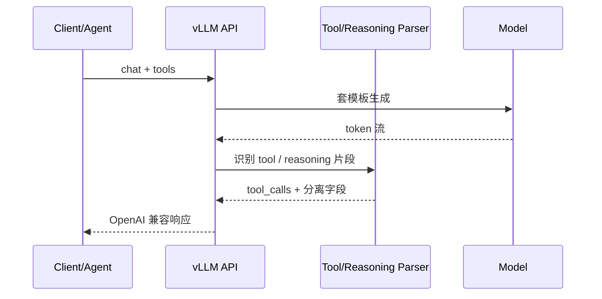

上一节把「输出必须合法」钉在生成时约束上（[8.1](./8.1-结构化输出.md)）。Agent 还多两件事：模型要能表达**结构化动作**（调哪个工具、参数是什么），以及带思维链的模型要把**草稿与最终回答拆开**。协议看起来简单，线上却常死在 parser 不匹配、流式半包、工具名幻觉。这一节少做功能罗列，多谈**失败模式与观测点**——能定位，才谈得上稳定 Agent。

<!-- more -->

## 📑 目录

- [1. 问题：Chat 缺的那一块](#1-问题chat-缺的那一块)
- [2. 机制：协议 + 两类 Parser](#2-机制协议--两类-parser)
- [3. 落地：最小 Agent 闭环](#3-落地最小-agent-闭环)
- [4. 失败模式图谱](#4-失败模式图谱)
- [5. 观测点与告警](#5-观测点与告警)
- [6. 代价与权衡](#6-代价与权衡)
- [总结](#-总结)
- [自我检验清单](#-自我检验清单)
- [参考资料](#-参考资料)

---

## 1. 问题：Chat 缺的那一块

纯 Chat 返回一段文本就结束。Agent 需要文本之外的动作通道：

- 调哪个函数（`name`）；
- 参数是什么（JSON `arguments`）；
- 是否并行多个 `tool_calls`。

若业务侧用正则从自然语言抠动作，脆弱且难版本化。Tool Calling 约定：模型按模板生成 → 服务端解析为 `tool_calls` → 客户端只消费结构。

另一类故障：推理模型先吐长思维链再给答案。若不剥离：

- 内部推理/工具细节泄露；
- 可见延迟观感变差；
- 下游只想要短 `content` 的管道被污染。

📌 **关键点**：Tool Calling / Reasoning 都是 **协议 + 与模型匹配的 Parser + 模板** 三件套。换模型常常要换 parser；「API 字段长得像 OpenAI」≠ 解析一定成功。

---

## 2. 机制：协议 + 两类 Parser

### 2.1 OpenAI tools 要点

| 字段 | 含义 |
|---|---|
| `tools` | `name` / `description` / `parameters`(JSON Schema) |
| `tool_choice` | `none` / `auto` / `required` / 指定工具 |
| `messages` | 可含 `role=tool` 回传 |

响应侧常见形态：

```json
{
  "role": "assistant",
  "content": null,
  "tool_calls": [
    {
      "id": "call_1",
      "type": "function",
      "function": {
        "name": "get_weather",
        "arguments": "{\"city\":\"上海\"}"
      }
    }
  ]
}
```

客户端执行后追加 `role=tool`，再 chat，直到不再返回 `tool_calls`。

🔑 **核心概念**：`tool_choice=auto` 是默认路由；关键路径用 `required` 或指定工具，压低「该调不调」。

### 2.2 Tool Parser 与 Reasoning Parser

不同模型家族用不同特殊 Token / XML / JSON 模板。vLLM 侧：

1. 启动时指定（或探测）与模型匹配的 **Tool Parser**；
2. 解码中/结束后识别工具片段 → 填 `message.tool_calls`；
3. 流式场景做增量解析，避免客户端自己拼半包。



**Reasoning Parser**：识别思维链起止标记 → 思考进 `reasoning*`，用户可见留在 `content`；计费与延迟仍可能包含思考 Token（剥离 ≠ 内部不算）。

| 通道 | 用途 |
|---|---|
| `reasoning*` | 调试/审计；默认不对 C 端展示 |
| `content` | 用户可见最终答案 |
| `tool_calls` | Agent 动作 |

与 [8.1](./8.1-结构化输出.md)：**Parser 管边界与字段抽取；Schema 管参数 JSON 合法**。可叠加，职责别混。

---

## 3. 落地：最小 Agent 闭环

```python
messages = [{"role": "user", "content": user_query}]
for _ in range(max_rounds):  # 硬上限，防死循环
    resp = client.chat.completions.create(
        model=model,
        messages=messages,
        tools=tools,
        tool_choice="auto",
    )
    msg = resp.choices[0].message
    messages.append(msg)
    if not msg.tool_calls:
        return msg.content
    for call in msg.tool_calls:
        result = dispatch(call.function.name, call.function.arguments)
        messages.append({
            "role": "tool",
            "tool_call_id": call.id,
            "content": result,  # 失败也返回可解析错误 JSON
        })
raise RuntimeError("tool round limit exceeded")
```

生产必备（缺一就会在失败模式里轮回）：

- 工具白名单与参数再校验（**不信模型**）；
- 工具超时、幂等与可解析错误回传；
- 轮次上限与总墙钟超时；
- 与结构化输出叠用时，参数 Schema 单独测。

💡 **提示**：选已对齐工具模板的指令模型，比通用基座硬挤协议更稳。模型卡片与启动 `--tool-call-parser` / reasoning 相关参数必须一致。

---

## 4. 失败模式图谱

| 模式 | 症状 | 优先根因 | 第一动作 |
|---|---|---|---|
| A. Parser 不匹配 | `tool_calls` 空，`content` 塞半结构化文本 | 启动 parser ≠ 模型家族 | 核对模型卡与启动参数 |
| B. 该调不调 | 应用路径无工具调用 | `tool_choice` 过松 / 描述差 / 模型弱 | 关键路径改 `required`；改工具描述 |
| C. 乱调/幻觉名 | 不存在的 `name` 或越权参数 | 模型编造；缺服务端校验 | 网关白名单拒绝并回传错误 |
| D. 参数坏 JSON | `arguments` 无法 `json.loads` | 未叠 Schema；截断 | 结构化约束 + 提高 `max_tokens` |
| E. 流式半包 | 前端自拼 XML/JSON 截断 | 消费原始 token 而非解析字段 | 只信服务端已解析增量 |
| F. Reasoning 泄漏 | 用户看到思考草稿 | parser 关/错；产品未隐藏 | 开对 reasoning parser；UI 默认折叠 |
| G. 思考拖垮 TPOT | 首包晚、出字卡 | 思考段极长 | `max_tokens`、超时、产品降级 |
| H. 工具死循环 | 轮次飙升 | 无上限；错误不可解析 | 硬上限；错误结构化回传 |
| I. 多 parser 顺序乱 | 有思考又调工具时字段缺失 | 组合顺序未回归 | 固定「先 reasoning 再 tool」样例集 |

取舍句：**协议兼容只保证形状；安全与正确性永远在业务运行时。** 把 vLLM 当可靠传输与解析层，策略留在 Agent 框架。

⚠️ **注意**：`arguments` 常常是 **JSON 字符串**，客户端需再 `json.loads`。这不是 bug，漏处理会表现为「D」类失败。

---

## 5. 观测点与告警

没有观测，失败模式只会变成用户投诉。建议最小仪表（与 [7.4](../第7章-PD解耦架构/7.4-Goodput与SLO感知调度.md) 同一套「合格才计数」思维）：

| 观测点 | 定义直觉 | 告警方向 |
|---|---|---|
| Tool 调用率 | 含 `tool_calls` 的完成占比 | 相对基线骤降 → 模式 B/A |
| Parser 失败率 | 模板命中失败 / 回落纯文本 | >0 持续 → 模式 A |
| 参数 JSON 失败率 | `arguments` 反序列化失败 | 升 → 模式 D |
| 未知工具名率 | `name` ∉ 白名单 | >0 → 模式 C |
| 工具执行错误率 | dispatch 非 2xx / 异常 | 区分模型错 vs 下游错 |
| 平均工具轮次 | 每用户请求的 tool 往返 | 飙升 → 模式 H |
| 思考 Token 占比 | reasoning tokens / 总输出 | 升且 TTFT 差 → 模式 G |
| 端到端 Agent 成功率 | 最终有合格答案且未超轮次 | 主 Goodput 指标 |

压测/发布门禁模板：

```text
同负载下：
  Agent 成功率 = ?
  Parser 失败率 = ?
  未知工具名率 = ?
  平均轮次 / P95 轮次 = ?
  TTFT/TPOT（含思考）= ?
```

只报「支持 Tool Calling」而不报成功率与 parser 失败率，视为未验收。

---

## 6. 代价与权衡

| 选择 | 收益 | 代价 / 不适用 |
|---|---|---|
| 开 Tool Parser | 结构化动作，Agent 可接 | 模型绑定；错 parser 全线哑火 |
| `tool_choice=required` | 关键路径少漏调 | 不该调时也调，多一轮延迟 |
| 叠参数 Schema（8.1） | 参数合法率↑ | 约束税；过严参数怪异 |
| 剥离 Reasoning | 产品安全与短答案管道 | 延迟/计费仍含思考；需对模板 |
| 客户端自拼流式标签 | 看似灵活 | 半包与版本漂移（应避免） |
| 无白名单信任模型 | 迭代快 | 越权与幻觉工具名 |

适用：已选对齐工具的指令模型、能配齐观测与白名单、Agent 有轮次/超时。  
若只有通用基座、又不能接受服务端强校验，先别把 Tool Calling 当主路径。

---

## 📝 总结

- Tool Calling = 协议 + 模型模板 + Tool Parser；Reasoning Parser 分离思维链与 `content`。
- 线上高频死于 parser 不匹配、半包、参数坏 JSON、幻觉工具名与死循环。
- 观测要覆盖调用率、parser/参数失败、未知工具名、轮次与思考占比；主看 Agent 成功率。
- 安全校验与轮次上限在业务侧；引擎只保证解析形状。

## 🎯 自我检验清单

- 能画出一次 tools 往返的 messages 序列
- 能解释 `tool_choice` 各取值的行为差异
- 能说明 Tool Parser 与 Structured Outputs 的分工
- 能列举至少五种失败模式及第一排查动作
- 能给出最小观测点集合与发布门禁字段
- 能写出带轮次上限与错误回传的 Agent 循环

## 📚 参考资料

- [vLLM — Tool Calling](https://docs.vllm.ai/en/latest/features/tool_calling.html)
- [OpenAI — Function Calling](https://platform.openai.com/docs/guides/function-calling)
- [vLLM — Reasoning Outputs](https://docs.vllm.ai/en/latest/features/reasoning_outputs.html)
- [本模块 8.1 结构化输出](./8.1-结构化输出.md)
- [本模块 7.4 Goodput 与 SLO 感知调度](../第7章-PD解耦架构/7.4-Goodput与SLO感知调度.md)
