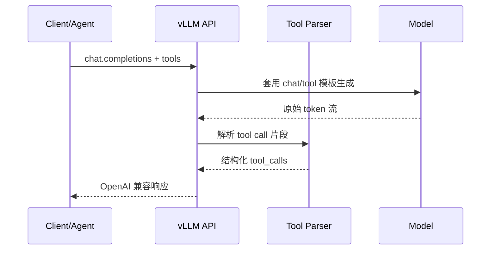

Agent 应用的最小闭环是：模型决定调哪个工具 → 运行时执行 → 把结果塞回对话 → 模型继续推理。另一类需求是：带"思考过程"的模型要把思维链和最终回答拆开，避免把推理草稿直接暴露给终端用户。这一节聚焦 vLLM 的 Tool Calling 与 Reasoning Parser：协议长什么样、解析发生在哪一层、怎么接到 Agent 循环里。

<!-- more -->

## 📑 目录

- [1. 从 Chat 到 Agent：缺的那一块](#1-从-chat-到-agent缺的那一块)
- [2. OpenAI tools 协议要点](#2-openai-tools-协议要点)
- [3. vLLM 如何解析 Tool Calls](#3-vllm-如何解析-tool-calls)
- [4. Reasoning Parser：思维链与最终回答分离](#4-reasoning-parser思维链与最终回答分离)
- [5. 接到 Agent 循环](#5-接到-agent-循环)
- [6. 工程实践与常见坑](#6-工程实践与常见坑)
- [总结](#-总结)
- [自我检验清单](#-自我检验清单)
- [参考资料](#-参考资料)

---

## 1. 从 Chat 到 Agent：缺的那一块

纯 Chat 接口返回一段文本就结束。Agent 需要模型在文本之外表达**结构化动作**：

- 调哪个函数（`name`）
- 参数是什么（JSON `arguments`）
- 是否并行发起多个工具调用

如果让业务侧用正则从自然语言里抠这些信息，脆弱且难维护。Tool Calling 把动作约定成协议：模型按模板生成，服务端解析成 `tool_calls` 字段，客户端只消费结构化结果。

📌 **关键点**：Tool Calling 是**协议 + 解析器 + 模型模板**三件事，缺一不可。换模型常常要换对应的 tool / reasoning parser。

---

## 2. OpenAI tools 协议要点

请求侧核心字段：

| 字段 | 含义 |
|---|---|
| `tools` | 工具定义列表：`name` / `description` / `parameters`(JSON Schema) |
| `tool_choice` | `none` / `auto` / `required` / 指定某工具 |
| `messages` | 可含 `role=tool` 的工具回传消息 |

响应侧常见形态：

```json
{
  "role": "assistant",
  "content": null,
  "tool_calls": [
    {
      "id": "call_1",
      "type": "function",
      "function": {
        "name": "get_weather",
        "arguments": "{\"city\":\"上海\"}"
      }
    }
  ]
}
```

客户端执行工具后，追加：

```json
{"role": "tool", "tool_call_id": "call_1", "content": "{\"temp\":28}"}
```

再发起下一轮 chat completion，直到模型不再返回 `tool_calls`。

🔑 **核心概念**：`tool_choice=auto` 是默认智能路由；对关键路径可用 `required` 或强制指定工具，减少"该调不调"。

---

## 3. vLLM 如何解析 Tool Calls

不同模型家族用不同的特殊 Token / XML / JSON 模板表达工具调用。vLLM 通过 **Tool Parser** 把生成文本解析为 OpenAI 风格的 `tool_calls`：

1. 启动服务时指定与模型匹配的 parser（或自动探测）
2. 解码过程中/结束后识别工具调用片段
3. API 层填充 `message.tool_calls`，并对流式场景做增量解析



与上一节结构化输出的关系：

- **Tool Calling**：约定"何时、以何种协议发起动作"
- **Structured Outputs / Schema**：约束工具参数 JSON 合法

两者可叠加：parser 负责边界与字段抽取，Schema 约束进一步降低参数非法率。

💡 **提示**：不是所有模型都原生擅长 Tool Calling。选已对齐工具调用模板的指令模型，比硬上通用基座再靠 Prompt 挤协议更稳。

---

## 4. Reasoning Parser：思维链与最终回答分离

一类推理模型会先输出长思维链，再给最终答案。常见形态是用特殊起止标记包裹思考段（不同模型家族标记不同，例如成对的 think 标签或自定义 special token）。对终端用户直接展示思维链可能：

- 泄露内部推理与工具细节
- 拉长可见延迟观感
- 污染下游只想要短答案的管道

**Reasoning Parser** 的职责是：

- 识别思维链起止标记（必须与模型模板一致）
- 把思考内容放到独立字段（如 `reasoning` / `reasoning_content`）
- 把面向用户的最终回答留在 `content`
- 在流式场景下尽量边生成边剥离，避免前端拼半包

| 📊 输出通道 | 典型用途 |
|---|---|
| `reasoning*` | 调试、审计、研究；默认不对 C 端展示 |
| `content` | 用户可见最终答案 |
| `tool_calls` | Agent 运行时动作 |

产品策略上常见三种：

1. **完全隐藏**：只返回 `content`（或工具调用）
2. **折叠展示**：UI 提供"查看思考过程"
3. **内部审计**：写入日志平台，不对终端用户开放

⚠️ **注意**：关闭或剥离思维链**不等于**模型内部不算。服务端只是不把草稿当作用户可见 `content`；计费与延迟仍可能包含思考 Token。若思考段极长，还要用 `max_tokens` 与超时防止拖垮 TPOT 观感。

---

## 5. 接到 Agent 循环

最小伪代码：

```python
messages = [{"role": "user", "content": user_query}]
while True:
    resp = client.chat.completions.create(
        model=model,
        messages=messages,
        tools=tools,
        tool_choice="auto",
    )
    msg = resp.choices[0].message
    messages.append(msg)
    if not msg.tool_calls:
        return msg.content
    for call in msg.tool_calls:
        result = dispatch(call.function.name, call.function.arguments)
        messages.append({
            "role": "tool",
            "tool_call_id": call.id,
            "content": result,
        })
```

生产 Agent 还要补齐：

- **超时与重试**：工具失败时返回可解析错误，而不是让模型瞎猜
- **权限沙箱**：工具白名单、参数校验、副作用审批
- **轮次上限**：防止工具调用死循环
- **观测**：记录每次 `tool_calls`、耗时、失败率

---

## 6. 工程实践与常见坑

1. **Parser 与模型不匹配**：表现为 `tool_calls` 为空但 `content` 里塞着半结构化文本——先核对模型卡片与启动参数。
2. **流式半包**：前端若自己拼 XML/JSON，极易截断；优先消费服务端已解析字段。
3. **参数是字符串**：`arguments` 常常是 JSON 字符串，客户端需再 `json.loads`。
4. **与 Reasoning 叠加**：有的模型先思考再调工具；要确认 parser 组合顺序与字段是否齐全。
5. **安全**：模型可能编造不存在的工具名或越权参数——**服务端必须再校验**，不能信模型。

📌 **关键点**：协议兼容只解决"形状"；**安全与正确性永远在业务运行时**。把 vLLM 当可靠传输与解析层，把策略留在 Agent 框架。

---

## 📝 总结

- Tool Calling 让模型以结构化方式表达工具动作，是 Agent 的协议基础。
- OpenAI `tools` / `tool_choice` / `role=tool` 构成请求-执行-回传闭环。
- vLLM 用与模型匹配的 Tool Parser 把生成文本变成 `tool_calls`。
- Reasoning Parser 把思维链与最终回答分离，便于产品展示与审计。
- Agent 循环要自备超时、权限、轮次上限与观测；不可只依赖模型自觉。

## 🎯 自我检验清单

- 能画出一次工具调用的 messages 往返序列
- 能解释 `tool_choice` 各取值的行为差异
- 能说明 Tool Parser 与 Structured Outputs 的分工
- 能说清 Reasoning Parser 分离了哪些字段、为什么要分离
- 能写出带轮次上限的最小 Agent 循环
- 能列举 Parser 不匹配、流式半包、参数二次解析等常见坑

## 📚 参考资料

- [vLLM — Tool Calling](https://docs.vllm.ai/en/latest/features/tool_calling.html)
- [OpenAI — Function Calling](https://platform.openai.com/docs/guides/function-calling)
- [vLLM — Reasoning Outputs](https://docs.vllm.ai/en/latest/features/reasoning_outputs.html)
