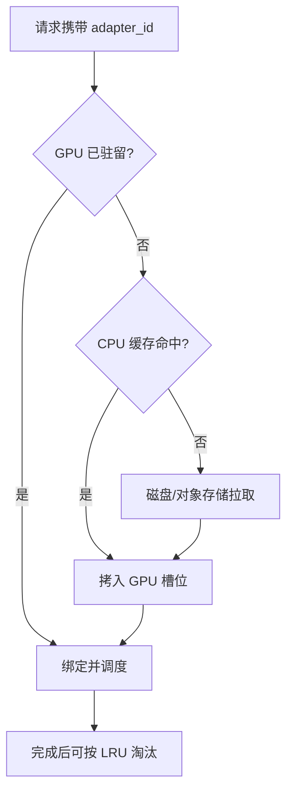

结构化输出与 Tool Calling 解决「形态与动作」（[8.1](./8.1-结构化输出.md)–[8.2](./8.2-Tool-Calling与Reasoning-Parser.md)）。多业务线的现实却是：底座一份，客服/风控/写作各有 LoRA。每租户拉一份全量权重，显存按租户数线性涨。Multi-LoRA 的目标是**一份底座驻留，多个 Adapter 按需加载**——省的是权重副本，不是 KV。这一节用粗算建立「能驻留多少、切换要付多少」的直觉，再谈路由与隔离边界。

<!-- more -->

## 📑 目录

- [1. 问题：全量副本为什么贵](#1-问题全量副本为什么贵)
- [2. 机制：运行时注入 ΔW](#2-机制运行时注入-δw)
- [3. 手算：显存与切换开销](#3-手算显存与切换开销)
- [4. 并发 Adapter 上限直觉](#4-并发-adapter-上限直觉)
- [5. 落地：槽位、路由与预热](#5-落地槽位路由与预热)
- [6. 代价与权衡](#6-代价与权衡)
- [总结](#-总结)
- [自我检验清单](#-自我检验清单)
- [参考资料](#-参考资料)

---

## 1. 问题：全量副本为什么贵

| 形态 | 权重显存 | 运维 | 适用直觉 |
|---|---|---|---|
| 每租户全量副本 | ≈ 租户数 × 底座 | 简单、贵 | 租户极少、SLO 极严 |
| 每请求合并后加载 | 中高 | 切换慢 | 低频批处理 |
| Multi-LoRA 共享底座 | 底座 + Σ Adapter | 中等 | 多租户在线 |

LoRA 把增量写成低秩 $A,B$，参数量通常远小于全量。服务侧在前向把 $\Delta W$ 作用到对应层，即可切换「业务人格」。

📌 **关键点**：Multi-LoRA **省底座权重副本，不省 KV Cache**。并发与上下文长度仍按第 1～2 章显存账本算；LoRA 槽位还会挤占 `gpu_memory_utilization` 留给 KV 的空间。

---

## 2. 机制：运行时注入 ΔW

训练常见：$W' = W + \frac{\alpha}{r} BA$。推理两条路：

1. **权重合并**：$\Delta W$ 写进 $W$——单 Adapter 最快，失去热切换；
2. **运行时注入**：$xW + x(\frac{\alpha}{r}BA)$——多租户共存。

Multi-LoRA 走第二条。同 batch 内请求可挂不同 Adapter，引擎需要：

- 请求级 Adapter ID（`lora_request` / model 别名）；
- 层内按请求收集 A/B；
- 融合算子消化批内异构，避免 Python for-loop 拖垮 Decode（连续批处理背景见 [2.2](../第2章-推理引擎核心技术/2.2-Continuous%20Batching.md)）。



🔑 **核心概念**：能不能加载只是入门；**批内异构 Adapter 是否被高效算子消化**才决定吞吐。

---

## 3. 手算：显存与切换开销

教学示意（**非某仓库实测**；单位 GB / ms）。设：

- 底座权重（含激活常驻）占位 $W = 14\,\mathrm{GB}$（7B 级 FP16 量级直觉）；
- 单 Adapter 稳态占用 $A = 0.15\,\mathrm{GB}$（秩与作用层中等）；
- GPU 可用 $M = 80\,\mathrm{GB}$；引擎预留 KV 与运行时 $K_{\mathrm{target}} = 40\,\mathrm{GB}$；
- 同时驻留槽位上限 $N$。

权重侧粗算：

\[
M_{\mathrm{weights}} \approx W + N \cdot A
\]

要保住 KV 预算，需：

\[
W + N\cdot A + K_{\mathrm{target}} \lesssim M
\quad\Rightarrow\quad
N \lesssim \frac{M - W - K_{\mathrm{target}}}{A}
\]

代入：$N \lesssim (80-14-40)/0.15 \approx 173$。  
**这是显存算术上限，不是吞吐最优 $N$**——批内碎片、加载尖刺会早得多把有效 $N$ 压下去（见下一节）。

切换开销粗算：Adapter 体积 $0.15\,\mathrm{GB} = 150\,\mathrm{MB}$。若 PCIe 有效拷贝 $\approx 12\,\mathrm{GB/s}$：

\[
t_{\mathrm{load}} \approx \frac{0.15}{12} \approx 0.0125\,\mathrm{s} = 12.5\,\mathrm{ms}
\]

再加反序列化/建索引，冷加载 TTFT 尖刺到数十毫秒很常见；从对象存储拉取则到秒级。热路径（已在 GPU）≈ 0 额外拷贝。

| 路径 | 额外延迟直觉 | 对 Goodput |
|---|---|---|
| GPU 命中 | ≈ 0 | 最好 |
| CPU → GPU | 十～数十 ms | TTFT 尖刺 |
| 盘/远端 → GPU | 百 ms～秒 | 易违约，需预热或拒绝 |

取舍句：**把 $N$ 开到显存算数上限，往往用 KV 与冷加载尖刺换「能装更多 Adapter」——SLO 紧时应主动留空。**

对比「每租户全量副本」同一底座 $W=14\,\mathrm{GB}$、3 个热租户：

| 部署 | 权重侧粗占用 | 相对 Multi-LoRA（$N=3$） |
|---|---|---|
| 3× 全量副本 | $3\times 14 = 42\,\mathrm{GB}$ | — |
| Multi-LoRA $N=3$ | $14 + 3\times 0.15 = 14.45\,\mathrm{GB}$ | 约省 $27.5\,\mathrm{GB}$ 给 KV/余量 |

省下的显存应**显式划回 KV 或余量**，而不是继续堆冷 Adapter 槽位——否则密度优化只停在权重账本上，线上仍被 KV 打穿。

---

## 4. 并发 Adapter 上限直觉

三个上限叠在一起，取**最紧**的那个：

| 上限类型 | 约束来源 | 直觉 |
|---|---|---|
| 显存算术 | $N \le (M-W-K)/A$ | 上一节 |
| 引擎槽位 | `--max-loras` 等 | 配置硬顶 |
| 有效吞吐 | 批内异构度、切换频率 | 压测才能钉死 |

经验分层（示意，需自测校准）：

| 同时活跃 Adapter | 常见现象 |
|---|---|
| 1～2 | 接近单 Adapter 基线 |
| 数个～十余 | 可接受；建议亲和路由 |
| 数十且请求均匀打散 | Kernel 效率与切换抖动明显 |
| 逼近算术 $N$ 且冷热剧烈 | KV 被挤、淘汰抖动、TTFT 尖刺 |

S-LoRA 等系统工作追求「数千 Adapter 可服务」，前提是**同时热驻留远小于目录规模** + 分页/统一池调度。产品叙事里的「支持上千」≠ 你这张卡上 **同时热 $N=1000$**。

⚠️ **注意**：批内 $k$ 种 LoRA 时，不要假设吞吐仍是单 LoRA 的 $1/k$ 或不变——用同 QPS、同输出长度对比「单 LoRA 专车」vs「混合 Multi-LoRA」。

---

## 5. 落地：槽位、路由与预热

```bash
# 概念骨架，以当前 vLLM --help 为准
vllm serve <base-model> \
  --enable-lora \
  --max-loras 8 \
  --max-lora-rank 64
```

检查清单：

1. `max-lora-rank` **盖住仓库最大 $r$**，否则大秩直接加载失败；
2. `max-loras` 按「热集合 + 余量」设，不要按目录总数设；
3. 热门租户 **pin / 预热**；长尾允许冷加载或独立池；
4. 路由亲和：同 Adapter 粘到同副本，降批内碎片（多副本时与 [6.4](../第6章-分布式推理/6.4-数据并行与专家并行.md) 的缓存亲和同构）；
5. 监控：命中率、加载次数、加载 P95、因 LoRA 导致的拒绝/抢占、KV 余量。

多租户隔离边界：

| 层级 | 手段 |
|---|---|
| 产品 | 租户→Adapter、配额、限流 |
| 引擎 | 槽位、预热、亲和 |
| 平台 | 关键租户独立 Deployment |
| 安全 | 鉴权、审计、Adapter 发布审批 |

共享进程 + 共享 KV 池 ≠ 安全沙箱。恶意超长请求仍可拖垮邻居（noisy neighbor）。

💡 **提示**：常见稳态拓扑是 **热门独立副本 + 长尾 Multi-LoRA 池**，而不是「全世界塞进一个池」。

压测最小矩阵（改槽位前先填表）：

```text
固定：底座、输出长度、并发目标
对照：
  A) 单 Adapter 专车
  B) Multi-LoRA，热集合=2，亲和开
  C) Multi-LoRA，热集合=8，请求均匀打散
记录：tokens/s、TTFT P95、加载 P95、KV 余量、拒绝率
```

若 C 相对 A 的 tokens/s 掉幅大于产品可接受带，先降有效 $N$ 或拆热门，而不是加 `max-loras`。

---

## 6. 代价与权衡

| 选择 | 收益 | 代价 / 不适用 |
|---|---|---|
| Multi-LoRA 共享底座 | 权重显存密度↑ | 批内异构损耗；运维面↑ |
| 提高 `max-loras` | 少淘汰 | 挤 KV；冷加载抖动面↑ |
| 亲和路由 + 预热 | TTFT/吞吐稳 | 副本间负载可能不均 |
| 全量独立 Deployment | 隔离与 SLO 最好 | 权重显存线性贵 |
| 权重合并单车 | 单租户最快 | 无多 Adapter 热切换 |

适用：Adapter 小、热集合远小于目录、能接受有限进程共享。  
若单 Adapter 极大、合规要进程级隔离、或延迟 SLO 极严且不能容忍冷加载——热门拆走，长尾再进池。

---

## 📝 总结

- Multi-LoRA 用一份底座 + 多 Adapter 换权重密度；KV 与上下文账本不变。
- 显存粗算给出 $N$ 的算术上限；切换可用「体积/带宽」估冷加载 ms 级税。
- 真正上限取显存、槽位、有效吞吐三者最紧；「支持上千」指目录规模而非同时热驻留。
- 落地靠合理 `max-loras`、预热、亲和路由与分层部署；强隔离是平台拓扑问题。

## 🎯 自我检验清单

- 能对比全量副本与 Multi-LoRA 的显存差异来源
- 能写出 $N \lesssim (M-W-K)/A$ 并说明它不是吞吐最优
- 能用 Adapter 体积与带宽粗算冷加载时间
- 能解释批内异构为何降低有效并发上限
- 能列出命中率/加载 P95/KV 余量等监控项
- 能判断何时拆独立 Deployment

## 📚 参考资料

- [vLLM — LoRA Adapters](https://docs.vllm.ai/en/latest/features/lora.html)
- [LoRA: Low-Rank Adaptation of Large Language Models](https://arxiv.org/abs/2106.09685)
- [S-LoRA: Serving Thousands of Concurrent LoRA Adapters](https://arxiv.org/abs/2311.03285)
- [本模块 2.2 Continuous Batching](../第2章-推理引擎核心技术/2.2-Continuous%20Batching.md)
- [本模块 6.4 数据并行与专家并行](../第6章-分布式推理/6.4-数据并行与专家并行.md)
