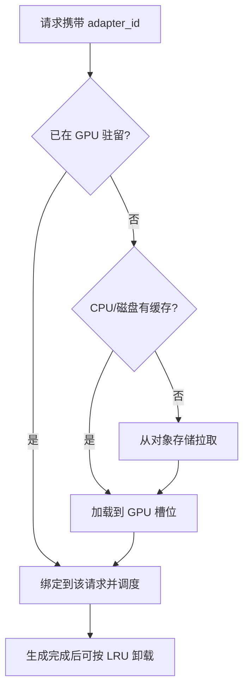

很多团队的现实是：底座模型只有一份，但客服、风控、写作各有自己的 LoRA。若每个 Adapter 起一个完整副本，权重显存会按租户数线性膨胀。Multi-LoRA 服务的目标是——**一份底座权重驻留 GPU，多个 Adapter 按需加载/切换**，在可接受的调度代价下服务多租户。这一节讲清机制、显存账与工程边界。

<!-- more -->

## 📑 目录

- [1. 为什么需要 Multi-LoRA](#1-为什么需要-multi-lora)
- [2. LoRA 推理时怎么接进底座](#2-lora-推理时怎么接进底座)
- [3. 动态加载、卸载与请求路由](#3-动态加载卸载与请求路由)
- [4. 显存与调度影响](#4-显存与调度影响)
- [5. vLLM 工程实践](#5-vllm-工程实践)
- [6. 多租户隔离与运维建议](#6-多租户隔离与运维建议)
- [7. 何时不该用 Multi-LoRA](#7-何时不该用-multi-lora)
- [总结](#-总结)
- [自我检验清单](#-自我检验清单)
- [参考资料](#-参考资料)

---

## 1. 为什么需要 Multi-LoRA

对比三种部署形态：

| 📊 形态 | 显存 | 运维 | 适用 |
|---|---|---|---|
| 每租户全量副本 | 最高 | 简单但贵 | 租户极少、SLO 极严 |
| 每请求合并权重后加载 | 中高 | 切换慢 | 低频批处理 |
| Multi-LoRA 共享底座 | 底座一份 + Adapter 小 | 中等 | 多租户在线服务 |

LoRA（Low-Rank Adaptation）把微调增量表达为低秩矩阵 $A,B$，参数量通常远小于全量权重。服务侧只要能在前向时把 $\Delta W = BA$ 作用到对应层，就能在共享底座上切换"业务人格"。

📌 **关键点**：Multi-LoRA 省的是**底座权重副本**，不是 KV Cache。并发与上下文长度仍然按第 1～2 章的显存账本计算。

---

## 2. LoRA 推理时怎么接进底座

训练时常见写法：$W' = W + \frac{\alpha}{r} BA$。推理服务有两条实现路径：

1. **权重合并**：把 $\Delta W$ 写进 $W$，变成普通模型——最快，但失去多 Adapter 热切换
2. **运行时注入**：前向时对选定线性层做 $xW + x(\frac{\alpha}{r}BA)$——可多租户共存

Multi-LoRA 走第二条。同一 batch 内不同请求可能挂不同 Adapter，引擎需要：

- 请求级 `lora_request` / Adapter ID
- 层内按请求收集对应 A/B
- Kernel 或图编译路径支持"底座 + 增量"融合，避免 Python 级 for-loop 拖垮 Decode

🔑 **核心概念**：Multi-LoRA 的性能取决于**批内异构 Adapter 能否被高效算子消化**，而不只是"能不能加载"。

---

## 3. 动态加载、卸载与请求路由

典型生命周期：



关键旋钮：

- **最大同时驻留 Adapter 数**（GPU 槽位数）
- **CPU 侧缓存**（热 Adapter 免磁盘往返）
- **淘汰策略**（LRU / 显式 pin 关键租户）

路由层常见做法：HTTP Header 或 model 名映射到 Adapter（例如对外暴露 `shop-assistant`，对内解析为 `base + lora_shop`）。

---

## 4. 显存与调度影响

### 4.1 显存

Adapter 本身通常是几十到数百 MB 量级（视秩 $r$、作用层数而定），远小于 7B/70B 底座。但要注意：

- 同时驻留 $N$ 个 Adapter ⇒ 额外显存约线性于 $N$
- 加载峰值可能短暂高于稳态（拷贝缓冲）
- **KV Cache 池**仍由 `gpu_memory_utilization` 等参数决定；LoRA 槽位会挤占可用 KV 空间

### 4.2 调度与吞吐

| 影响面 | 现象 | 缓解 |
|---|---|---|
| 批内 Adapter 碎片 | 同批多个 LoRA，Kernel 效率下降 | 路由亲和：同 Adapter 聚到同副本 |
| 冷加载 | 首次请求 TTFT 尖刺 | 预热、CPU 缓存、异步加载 |
| 槽位打满 | 新 Adapter 触发淘汰抖动 | 提高槽位、pin 热门、限流冷门 |
| 切换过于频繁 | PCIe/HBM 拷贝抢带宽 | 租户级粘滞路由 |

⚠️ **注意**：Multi-LoRA **不是免费的多模型**。极端情况下（Adapter 巨大、批内极度异构），吞吐可能显著低于"单 Adapter 专车副本"。要用压测说话。

---

## 5. vLLM 工程实践

落地检查清单：

1. 启动时开启 LoRA 支持，配置最大 Adapter 数、最大秩 $r$、CPU 缓存
2. 请求携带 LoRA 标识（在线 API 的 model 别名或 lora 字段）
3. 准备 Adapter 仓库路径（本地盘或挂载卷），保证与底座架构匹配
4. 对热门租户做 **prepack / 预热**，避免早高峰冷启动
5. 监控：Adapter 命中率、加载次数、加载延迟、因 LoRA 导致的抢占/拒绝

示意（概念级）：

```bash
vllm serve <base-model> \
  --enable-lora \
  --max-loras 8 \
  --max-lora-rank 64
```

💡 **提示**：`max-lora-rank` 要盖住仓库里最大的 $r$。设小了，大秩 Adapter 直接加载失败。

---

## 6. 多租户隔离与运维建议

Multi-LoRA 提供的是**权重增量隔离**，不是完整的安全沙箱：

- 不同租户仍共享同一进程、同一 KV 池、同一调度器
- 恶意超长请求仍可拖垮邻居（noisy neighbor）
- 机密租户若要求进程级隔离，应拆副本或拆集群

建议分层：

| 层级 | 手段 |
|---|---|
| 产品路由 | 租户 → Adapter 映射、配额、速率限制 |
| 引擎 | 槽位、预热、亲和调度 |
| 平台 | 关键租户独立 Deployment；其它租户共享 Multi-LoRA 池 |
| 安全 | 网关鉴权、审计日志、Adapter 发布审批 |

📌 **关键点**：把 Multi-LoRA 当**密度优化手段**，把强隔离当**平台拓扑问题**。两者不要混为一谈。

---

## 7. 何时不该用 Multi-LoRA

遇到以下情况，共享池往往得不偿失：

- 单个 Adapter 极大（高秩、作用层极多），槽位放不下几个
- 租户间流量极度倾斜，亲和路由后仍打爆单副本
- 合规要求进程级/集群级隔离与独立审计
- 延迟 SLO 极严，无法容忍任何冷加载或批内异构损耗

这时更干净的做法是：**热门租户独立 Deployment，长尾租户留在 Multi-LoRA 池**。

---

## 📝 总结

- Multi-LoRA 用一份底座 + 多 Adapter 服务多业务，显著降低权重显存副本成本。
- 推理时通过运行时注入 $\Delta W$ 实现热切换，而不是每次合并权重。
- 动态加载需要 GPU 槽位、CPU 缓存与淘汰策略；冷加载会伤 TTFT。
- 批内异构 Adapter、槽位抖动会作用于吞吐——需要亲和路由与压测。
- 多租户隔离有限，强安全/强 SLO 租户应独立部署。
- 热门与长尾分层，比"全部塞进一个池"更常见、也更稳。

## 🎯 自我检验清单

- 能对比全量副本与 Multi-LoRA 的显存差异来源
- 能说明运行时注入与权重合并的取舍
- 能描述 Adapter 冷/热加载路径与淘汰策略
- 能分析 Multi-LoRA 对 KV 池与 TTFT 的间接影响
- 能列出亲和路由、预热、pin 热门等缓解手段
- 能判断何时该放弃共享池、改为独立副本

## 📚 参考资料

- [vLLM — LoRA Adapters](https://docs.vllm.ai/en/latest/features/lora.html)
- [LoRA: Low-Rank Adaptation of Large Language Models](https://arxiv.org/abs/2106.09685)
- [S-LoRA: Serving Thousands of Concurrent LoRA Adapters](https://arxiv.org/abs/2311.03285)
