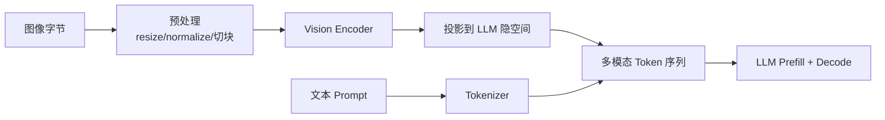

前几节处理的是文本侧可控输出与多租户密度。换上视觉语言模型（VLM），瓶颈常从 Decode 挪到**视觉编码重复算**和**图像展开后的超长 Prefill**。一张图可以变成数百～数千视觉 Token，直接抬 TTFT 与 KV——机制上与长 Prompt 同构，只是「长度」来自像素策略而非用户打字。这一节先算放大账，再谈 Encoder Cache、图像 Hash 前缀缓存（[2.3](../第2章-推理引擎核心技术/2.3-Prefix%20Cache%20与%20RadixAttention.md)）与限流。

<!-- more -->

## 📑 目录

- [1. 问题：多出来的两条成本](#1-问题多出来的两条成本)
- [2. 机制：从字节到多模态序列](#2-机制从字节到多模态序列)
- [3. 手算：图像 Token 放大 Prefill/KV](#3-手算图像-token-放大-prefillkv)
- [4. 两层缓存：Encoder vs 前缀](#4-两层缓存encoder-vs-前缀)
- [5. 落地：限流、模板与观测](#5-落地限流模板与观测)
- [6. 代价与权衡](#6-代价与权衡)
- [总结](#-总结)
- [自我检验清单](#-自我检验清单)
- [参考资料](#-参考资料)

---

## 1. 问题：多出来的两条成本

相对纯文本，VLM 多付：

1. **Vision Encoder 前向**：分辨率高、多图、视频帧时很重；
2. **更长 Prefill + 更大 KV**：视觉 Token 进入 LLM 上下文。

多轮同图对话里，若每轮重跑 Encoder，CPU/GPU 都在做无用功；若每请求新高清大图，缓存帮不上，只能砍分辨率或限流。

📌 **关键点**：优化 VLM 先问两句——**同一张图是否被反复编码？视觉 Token 长度是否被产品默认值打穿？**

---

## 2. 机制：从字节到多模态序列



预处理决定视觉 Token 长相：

| 步骤 | 影响 |
|---|---|
| Resize / Tile / 动态分辨率 | 分辨率↑ ⇒ Token↑ |
| 多图顺序与模板占位 | 错位则「忽略图像」类故障 |
| 视频抽帧 | 帧数 ≈ 按多图累加成本 |

工程注意：客户端过度原图会打爆上行与解码队列；业务应统一分辨率策略，否则缓存键与性能基线一起漂。

🔑 **核心概念**：对 LLM 调度器而言，视觉段就是一段必须 Prefill 的前缀——适用与长文本相同的 TTFT/KV 直觉（[2.1](../第2章-推理引擎核心技术/2.1-PagedAttention.md)、[7.1](../第7章-PD解耦架构/7.1-混合Batching的问题.md)）。

---

## 3. 手算：图像 Token 放大 Prefill/KV

教学示意（**非某 VLM 实测**；具体「每图多少 Token」以模型卡为准）。假设：

- 文本问题 $L_{\mathrm{text}} = 64$ Token；
- 低分辨率策略每图 $L_{\mathrm{img}}=256$ 视觉 Token；
- 高分辨率/多 Tile 每图 $L_{\mathrm{img}}=1024$；
- 单请求 $I$ 张图；
- Prefill 耗时近似与输入长度成正比：$\mathrm{TTFT} \propto L$（忽略 Encoder 时先只看 LLM Prefill）；
- KV 占用近似 $\mathrm{KV} \propto L_{\mathrm{prefill}}$（同精度、同层数）。

总 Prefill 长度：

\[
L = L_{\mathrm{text}} + I \cdot L_{\mathrm{img}}
\]

| 场景 | $I$ | $L_{\mathrm{img}}$ | $L$ | 相对纯文本（64） |
|---|---|---|---|---|
| 纯文本 | 0 | — | 64 | 1× |
| 单图低分 | 1 | 256 | 320 | **5×** |
| 单图高分 | 1 | 1024 | 1088 | **17×** |
| 三图高分 | 3 | 1024 | 3136 | **49×** |

若纯文本 Prefill 墙钟 $40\,\mathrm{ms}$，且近似线性，则三图高分仅 LLM Prefill 就可到：

\[
40 \times \frac{3136}{64} \approx 1960\,\mathrm{ms}
\]

还未加 Vision Encoder。Encoder 再占 $100\sim500\,\mathrm{ms}$ 量级（视分辨率与硬件）时，TTFT 轻易破秒。

KV 侧同理：并发 $C=16$ 个「三图高分」请求同时占满前缀时，前缀 KV 相对纯文本问答放大约 $49\times$（在「长度线性」假设下）。取舍句：**把默认分辨率从「能看清细节」调到「业务刚好够用」，往往比再买一张 Decode 卡更划算。**

再叠 Encoder：

| 情况 | Encoder | LLM Prefill | 优先砍什么 |
|---|---|---|---|
| 多轮同图 | 可缓存命中 | 仍要付视觉 Token KV，除非前缀命中 | 先 Encoder Cache，再前缀缓存 |
| 每请求新图 | 每次必付 | 每次必付 | 降分辨率/限图数 |
| 同图同问法重放 | 可双命中 | 可双命中 | 规范化 Hash + 粘滞路由 |

KV 字节直觉（与 [7.3](../第7章-PD解耦架构/7.3-KV-Cache传输与Connector.md) 同构，**示意**）：设每 Token 每层 KV 合计 $b$ 字节、层数 $L_{\mathrm{layer}}$，则单请求前缀 KV：

\[
\mathrm{KV}_{\mathrm{bytes}} \approx L \cdot L_{\mathrm{layer}} \cdot b
\]

若纯文本 $L=64$ 时前缀 KV 为 $S$，三图高分 $L=3136$ 时约为 $49S$。解耦传输同样按字节付——视觉默认值过猛时，先砍 $L_{\mathrm{img}}$，再谈加网卡。

---

## 4. 两层缓存：Encoder vs 前缀

| 缓存层 | 对象 | 省下什么 |
|---|---|---|
| Encoder Cache | 视觉 embeddings | Vision Encoder 计算 |
| 图像 Hash 前缀缓存 | 含视觉段的 LLM KV | Prefill（引擎支持时） |
| 文本 Prefix Cache | 文本前缀 KV | 系统提示等 |

```text
请求图 ──稳定 key──► Encoder Cache？
                      ├─ 命中：复用 embeddings
                      └─ 未命中：跑 Encoder 并写入
         └──────────► 前缀键（图 Hash + 文本）→ KV 命中？
```

Hash 必须基于**稳定预处理后表示或规范对象 ID**。JPEG 质量变了、旋转、缩放都会改键；产品层尽量传稳定图 ID，服务层规范化 URL。

⚠️ **注意**：Encoder Cache 与 Prefix Cache **层级不同，可叠加**；命中 Encoder 只跳过视觉塔，不自动跳过 LLM Prefill。

---

## 5. 落地：限流、模板与观测

实践清单：

1. 确认模型在多模态支持列表，模板与图像占位顺序匹配；
2. OpenAI 兼容接口用 `image_url` / base64（按部署策略）；
3. 开前缀缓存时确认键含图像信息，而非只哈希文本；
4. **硬限制**：每请求最大图像数、最大边长/像素、视频最大帧数；
5. 观测：Encoder 耗时、视觉 Token 数、TTFT、KV 利用率、两层缓存命中率。

示意请求片段：

```json
{
  "role": "user",
  "content": [
    {"type": "text", "text": "图中有几只猫？"},
    {"type": "image_url", "image_url": {"url": "https://example.com/cat.jpg"}}
  ]
}
```

排障速查：

| 现象 | 优先检查 |
|---|---|
| TTFT 偶然飙高 | 新图未命中 Encoder；分辨率异常 |
| KV 很快打满 | 视觉 Token / 多图失控 |
| 忽略图像 | 模板占位顺序、是否真走多模态路径 |
| 命中率≈0 | Hash 受重编码影响；路由打散同图 |
| CPU 打满 | 解码预处理成瓶颈 → 限流/异步解码池 |

若集群已做 P/D 解耦（第 7 章），长视觉 Prefill 更应进 P 池预算；传输的 KV 字节也随 $L$ 放大（[7.3](../第7章-PD解耦架构/7.3-KV-Cache传输与Connector.md)）。

默认策略建议写成可执行门禁，而不是口头「别传太大图」：

```text
max_images_per_request = 2
max_long_edge_px = 1024   # 或模型卡推荐档
max_video_frames = 8
on_violate = 413 / 降分辨率转码（选一种并监控占比）
```

发布对比至少报：视觉 Token P50/P95、Encoder P95、两层命中率、TTFT P95、KV 利用率。只报「支持 VLM」不算验收。

---

## 6. 代价与权衡

| 选择 | 收益 | 代价 / 不适用 |
|---|---|---|
| 提高分辨率 / Tile | 细节↑ | Prefill/KV/Encoder 全涨 |
| 放宽每请求图数 | 多图推理 | 单请求打穿 batch |
| Encoder Cache | 同图多轮省视觉塔 | 占主机/显存；新图无收益 |
| 图像前缀缓存 | 复用视觉段 KV | Hash 规范化成本；路由要粘 |
| 默认高清多图 | Demo 好看 | 生产 TTFT/显存一起穿 |

适用：同图多轮、文档截图问答、可统一分辨率。  
批量新图理解：预算花在分辨率策略与 Encoder 吞吐，而不是幻想缓存救一切。

---

## 📝 总结

- VLM 的 TTFT/KV 压力常来自视觉 Token 长度与 Encoder，不只 Decode。
- 示意账上，单图高分可相对纯文本放大十余倍 Prefill；多图近线性累加。
- Encoder Cache 省视觉塔；图像 Hash 前缀缓存省 LLM KV；二者可叠加。
- 生产第一杠杆是**限分辨率与图数**，第二才是缓存与粘滞路由。

## 🎯 自我检验清单

- 能画出从图像字节到 Decode 的链路
- 能用 $L = L_{\mathrm{text}} + I\cdot L_{\mathrm{img}}$ 做放大估算
- 能区分 Encoder Cache 与 Prefix Cache 的对象与收益
- 能解释 Hash 不稳定如何把命中率打到 0
- 能提出每请求图数/像素硬限制
- 能说明解耦场景下长视觉 Prefill 为何更伤传输与 P 池

## 📚 参考资料

- [vLLM — Multimodal Inputs](https://docs.vllm.ai/en/latest/features/multimodal_inputs.html)
- [vLLM — Automatic Prefix Caching](https://docs.vllm.ai/en/latest/design/prefix_caching.html)
- 各 VLM 模型卡中的分辨率与 Token 规则
- [本模块 2.3 Prefix Cache 与 RadixAttention](../第2章-推理引擎核心技术/2.3-Prefix%20Cache%20与%20RadixAttention.md)
- [本模块 7.3 KV Cache 传输与 Connector](../第7章-PD解耦架构/7.3-KV-Cache传输与Connector.md)
