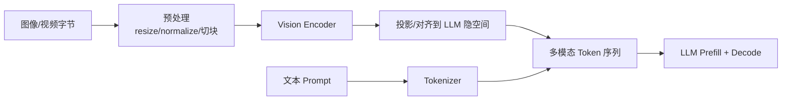

文本 LLM 的输入是 Token 序列；视觉语言模型（VLM）还要把图像（乃至音视频）变成模型可消费的特征，再与文本 Token 一起做自回归生成。多模态推理的瓶颈常常不在 Decode，而在**视觉编码重复计算**和**多模态前缀无法复用**。这一节按链路拆开：预处理、Encoder Cache、图像 Hash 前缀缓存，以及 vLLM 侧的实践要点。

<!-- more -->

## 📑 目录

- [1. VLM 推理链路总览](#1-vlm-推理链路总览)
- [2. 多模态输入预处理](#2-多模态输入预处理)
- [3. Encoder Cache：别让视觉塔白算](#3-encoder-cache别让视觉塔白算)
- [4. 图像 Hash 与前缀缓存](#4-图像-hash-与前缀缓存)
- [5. vLLM 中的 VLM 服务要点](#5-vllm-中的-vlm-服务要点)
- [6. 性能与质量权衡](#6-性能与质量权衡)
- [7. 排障速查](#7-排障速查)
- [总结](#-总结)
- [自我检验清单](#-自我检验清单)
- [参考资料](#-参考资料)

---

## 1. VLM 推理链路总览

一条典型图文请求大致经历：



与纯文本相比，多了两条成本：

- **Vision Encoder 前向**：高分辨率、多图、视频帧时非常重
- **更长的 Prefill**：一张图可能展开成成百上千个视觉 Token，直接抬 TTFT 与 KV 占用

📌 **关键点**：优化 VLM 服务，优先问两句——**同一张图是否被反复编码？同一图文前缀是否命中 KV 缓存？**

---

## 2. 多模态输入预处理

预处理决定"视觉 Token 长什么样"，常见步骤：

| 步骤 | 作用 | 影响 |
|---|---|---|
| 解码与色彩空间 | 得到张量 | CPU/解码器瓶颈 |
| Resize / Pad / Crop | 对齐模型输入尺寸 | 分辨率↑ ⇒ Token↑ |
| Normalize | 匹配训练分布 | 影响精度 |
| Patch / Tile / Dynamic resolution | 切块或动态分辨率 | 细节 vs 长度 |
| 特殊 Token 占位 | 在对话模板插入图像槽位 | 模板必须匹配模型 |

工程注意：

- **客户端压缩 vs 服务端解码**：过大原图会打爆上行带宽与解码队列
- **多图顺序**：模板里的图像占位顺序必须与传入顺序一致
- **视频**：通常先抽帧再按多图路径走；帧率策略直接决定成本

💡 **提示**：同一业务尽量统一分辨率策略。今天 672、明天 1344，缓存键与性能基线都会漂。

---

## 3. Encoder Cache：别让视觉塔白算

很多会话里，用户连发多轮都引用**同一张图**（"看这张图""那左上角呢""再对比一下"）。若每轮重跑 Vision Encoder，CPU/GPU 都在做无用功。

**Encoder Cache** 缓存的是：图像（或预处理后的张量）→ 视觉特征 / 投影后的 embeddings。命中后跳过 Encoder，直接进入 LLM Prefill。

```text
请求图 ──hash/key──► Encoder Cache？
                      ├─ 命中：复用 embeddings
                      └─ 未命中：跑 Encoder 并写入
```

收益画像：

- **多轮看图对话**：Encoder 命中率高，TTFT 显著下降
- **每请求新图**：缓存帮助有限，应把预算花在 Encoder 本身与分辨率策略
- **缓存容量**：特征体积不小，需要上限与淘汰（LRU）

🔑 **核心概念**：Encoder Cache 省的是**视觉塔计算**；Prefix Cache 省的是**LLM 侧 KV**。两者层级不同，可以叠用。

---

## 4. 图像 Hash 与前缀缓存

纯文本 Prefix Cache 用 Token 序列哈希做键。VLM 要额外处理图像字节：

1. 对图像内容做 **Hash**（注意：应基于稳定的预处理后表示或规范编码，避免无意义元数据扰动）
2. 将图像 Hash 与后续文本 Token 一起构成前缀键
3. 命中时复用对应视觉 Token 段的 KV Cache（在引擎支持的前提下）

| 📊 缓存层 | 缓存对象 | 主要收益 |
|---|---|---|
| Encoder Cache | 视觉 embeddings | 跳过 Encoder |
| 图像 Hash 前缀缓存 | LLM KV（含视觉段） | 跳过/缩短 Prefill |
| 文本 Prefix Cache | 文本前缀 KV | 系统提示、多轮文本 |

⚠️ **注意**：有损重编码（JPEG 质量变了）、旋转、缩放都会改 Hash，导致缓存失效。产品层应尽量传稳定图 ID，服务层对同一对象存储 URL 做规范化。

---

## 5. vLLM 中的 VLM 服务要点

实践清单：

1. 确认模型在 vLLM 多模态支持列表中，使用匹配的对话/多模态模板
2. OpenAI 兼容接口用 `image_url`（或本地路径/base64，按部署策略选择）传图
3. 打开前缀缓存相关能力时，确认多模态键包含图像信息，而不是只哈希文本
4. 观察指标：Encoder 耗时、视觉 Token 数、TTFT、KV 利用率、缓存命中率
5. 限制每请求图像数与最大像素，防止单请求挤爆 batch

示意请求片段：

```json
{
  "role": "user",
  "content": [
    {"type": "text", "text": "图中有几只猫？"},
    {"type": "image_url", "image_url": {"url": "https://example.com/cat.jpg"}}
  ]
}
```

---

## 6. 性能与质量权衡

| 旋钮 | 调高时 | 调低时 |
|---|---|---|
| 输入分辨率 / Tile 数 | 更细，视觉 Token↑，更慢更费 KV | 更快，可能丢细节 |
| 最大图像数 | 更强多图推理 | 吞吐更稳 |
| Encoder Cache 容量 | 命中率↑，占显存/主机内存 | 淘汰增多 |
| 前缀缓存 | 多轮/重复图受益 | 管理复杂度↑ |

适用场景速查：

- ✅ 客服看图、文档截图问答、同图多轮：优先 Encoder Cache + 前缀缓存
- ✅ 批量新图理解：控分辨率、批处理 Encoder、偏吞吐
- ❌ 把"无限高清多图"当成默认——很容易把 TTFT 与显存一起打穿

📌 **关键点**：VLM 优化的第一性原理是**减少重复视觉工作 + 控制视觉 Token 长度**，而不是只调 LLM Decode 参数。

---

## 7. 排障速查

| 现象 | 优先检查 |
|---|---|
| TTFT 偶然飙高 | 是否新图未命中 Encoder Cache；分辨率是否异常偏大 |
| KV 很快打满 | 视觉 Token 是否超预期；多图数量是否失控 |
| 答非所问 / 忽略图像 | 模板占位顺序、模型是否真正走到多模态路径 |
| 缓存命中率接近 0 | Hash 是否受重编码影响；路由是否打散同图请求 |
| CPU 打满 | 图像解码与预处理是否成瓶颈，考虑限流或异步解码池 |

---

## 📝 总结

- VLM 在文本链路外增加预处理与 Vision Encoder，TTFT 与 KV 压力往往来自视觉 Token。
- 预处理策略（分辨率、切块、抽帧）直接决定成本与质量。
- Encoder Cache 避免同图重复编码；图像 Hash 前缀缓存进一步复用 LLM KV。
- 两层缓存对象不同，可叠加；Hash 稳定性与规范化是命中率前提。
- 生产上要限制图像规模，并监控 Encoder 耗时与缓存命中。

## 🎯 自我检验清单

- 能画出 VLM 从图像字节到 Decode 的完整链路
- 能说明分辨率/切块如何影响视觉 Token 数
- 能区分 Encoder Cache 与 Prefix Cache 的缓存对象
- 能解释为何图像 Hash 必须基于稳定表示
- 能列出多轮同图场景下的优先优化手段
- 能提出一套防止单请求打爆服务的限流策略

## 📚 参考资料

- [vLLM — Multimodal Inputs](https://docs.vllm.ai/en/latest/features/multimodal_inputs.html)
- [vLLM — Automatic Prefix Caching](https://docs.vllm.ai/en/latest/design/prefix_caching.html)
- 各 VLM 模型卡（LLaVA / Qwen-VL / Pixtral 等）中的分辨率与 Token 规则
