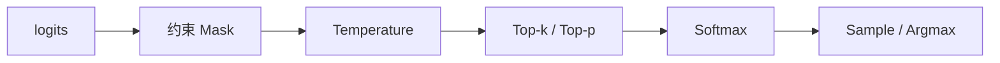

同一套权重，换一组采样参数，风格可以大变；换 `n` 或 Beam，容量账也会变。前面四节把结构约束、工具解析、LoRA 与多模态成本钉过了——采样是最后一层**产品语义控制面**。若凭体感改 $T$，线上会出现「创意更好了但工具参数乱了」或「开了 `n=8` 队列炸了却说不清」。这一节强调**可检验影响**：改参前后比什么、延迟/KV 怎么变、和 [8.1](./8.1-结构化输出.md) / [5.1](../第5章-Speculative-Decoding/5.1-核心原理.md) 如何联合回归。

<!-- more -->

## 📑 目录

- [1. 问题：手感旋钮的代价](#1-问题手感旋钮的代价)
- [2. 机制：从 logits 到 Token](#2-机制从-logits-到-token)
- [3. Temperature / Top-p / Top-k](#3-temperature--top-p--top-k)
- [4. 可检验实验：多样性与正确率](#4-可检验实验多样性与正确率)
- [5. Logprobs、`n` 与 Beam 的容量账](#5-logprobsn-与-beam-的容量账)
- [6. 落地建议与交互](#6-落地建议与交互)
- [7. 代价与权衡](#7-代价与权衡)
- [总结](#-总结)
- [自我检验清单](#-自我检验清单)
- [参考资料](#-参考资料)

---

## 1. 问题：手感旋钮的代价

典型事故：

- 客服把 $T$ 从 $0.2$ 调到 $0.9$「更自然」，工具参数合格率断崖；
- 评测开 $T>0$ 且不固定种子，A/B 结论不可复现；
- 为刷「更好答案」开 `n=8`，Decode 与 KV 近线性涨，P99 拖死邻居。

📌 **关键点**：采样参数**不增加知识上限**，只改变在已有分布上怎么走。胡编有时是 $T$ 过高，有时是模型不会——要用固定集区分。

---

## 2. 机制：从 logits 到 Token

每步 Decode 典型管线：

1. （可选）约束 mask（[8.1](./8.1-结构化输出.md)）；
2. Temperature 缩放；
3. Top-k / Top-p 截断；
4. Softmax；
5. 采样或 argmax；
6. （可选）记录 logprob / top logprobs。



🔑 **核心概念**：`temperature=0`（或等价贪婪）走确定性路径；`temperature>0` 才进入随机采样。排障先确认是不是在比「不可复现」的结果。

Temperature：

\[
p_i = \frac{\exp(z_i / T)}{\sum_j \exp(z_j / T)}
\]

| 参数 | 调高 | 调低 |
|---|---|---|
| $T$ | 更随机、更发散 | 更保守、更稳 |
| Top-k | 候选更多 | 更聚焦头部 |
| Top-p | 尾部更开放 | 截断更狠 |

Top-k 与 Top-p 同时开时以引擎语义为准（常取交集）；不要无脑叠到极端。

---

## 3. Temperature / Top-p / Top-k

场景起点（仍要自测）：

| 场景 | 起点 | 备注 |
|---|---|---|
| 分类/抽取/工具参数 | $T\in[0,0.2]$，可较低 Top-p | 宜叠 Schema |
| 客服助手 | $T\in[0.3,0.7]$，Top-p≈0.9 | 稳与多样折中 |
| 创意生成 | $T\in[0.8,1.1]$ | 安全过滤要跟上 |
| 可复现评测 | 固定 seed + $T=0$ | 性能对比必备 |

⚠️ **注意**：结构化输出下合法集可能很小；过高 $T$ 会在合法集内剧烈抖动，出现怪异但合法的字段值。

单步 Kernel 时间通常对 $T$/Top-p **不敏感**；真正打容量的是 `logprobs`、`n`、Beam（第 5 节）。多样性与正确率却对 $T$ **极敏感**——这正是「可检验」要分开量的原因。

---

## 4. 可检验实验：多样性与正确率

不要只看「好不好读」。用固定评测集做对照（教学表示意数字）：

**实验 A：工具/抽取正确率**

- 集：$N=200$ 条需结构化字段的请求；
- 固定 Schema 约束；只扫 $T\in\{0, 0.3, 0.7, 1.0\}$；
- 指标：字段合格率、可解析率、P95 端到端延迟。

| $T$ | 合格率（示意） | 多样性（独特输出比，示意） | 延迟 |
|---|---|---|---|
| 0 | 0.96 | 低 | 基线 |
| 0.3 | 0.94 | 略升 | ≈基线 |
| 0.7 | 0.88 | 中 | ≈基线 |
| 1.0 | 0.79 | 高 | ≈基线 |

取舍句：**在约束任务上，$T$ 主要买多样性、付正确率；延迟几乎不动——若有人用「延迟没变」证明调参无害，看错了指标。**

**实验 B：开放生成多样性**

- 同 Prompt 重复 $M=20$ 次（或 `n=20` 一次）；
- 指标：独特 n-gram 比例 / Self-BLEU（越低越多样）、安全违规率；
- 期望：提高 $T$ 或 Top-p → 多样性↑，需盯违规↑。

**实验 C：与投机解码联合**（[5.1](../第5章-Speculative-Decoding/5.1-核心原理.md)）

- 固定草稿长度，扫 $T$；
- 指标：接受率、净 tokens/s、质量集合格率；
- 随机性升高常降低草稿接受率——**质量与加速要同一矩阵里报**。

发布门禁：改默认采样配置 = 改产品行为，必须带 A 或 B 类表，禁止只贴两条聊天截图。

---

## 5. Logprobs、`n` 与 Beam 的容量账

### 5.1 Logprobs

用途：置信度代理、候选打分、挖不确定样本、调提示词。  
成本：Top-N 维护、带宽与序列化↑；不是校准置信度，跨模型勿比绝对值。

💡 **提示**：默认关；内部调试租户或短答案打分开。全量长生成开 logprobs 是典型静默烧钱。

### 5.2 并行采样 `n`（Best-of-N）

同 Prompt 出 $n$ 条。前缀 KV 可共享（PagedAttention CoW，[2.1](../第2章-推理引擎核心技术/2.1-PagedAttention.md)），分叉后：

| 维度 | 影响直觉 |
|---|---|
| Decode 算力 | ≈ ×$n$（前缀共享） |
| 分叉后 KV | ≈ ×$n$ |
| 端到端延迟 | 常接近最慢分支；队列压力↑ |
| 计费 | 输出 Token 常按 $n$ 条合计 |

示意：单条 Decode 占 KV $V$，`n=8` 分叉后约 $8V$（前缀另计）。若 GPU KV 池剩 $40\,\mathrm{GB}$、单条分叉段 $0.8\,\mathrm{GB}$，则同时这类请求数粗算 $\lesssim 40/(0.8\times 8)=6.25$——**Best-of-N 直接砍并发**。

延迟侧也可检验：若单分支生成墙钟 $T_{\mathrm{gen}}=1.2\,\mathrm{s}$，`n` 条并行时端到端常 $\approx \max_i T_{\mathrm{gen},i}$（再加调度排队）。服务在高负载下，排队项随占用 KV 上升而变差——所以「本机空载 `n=8` 只慢一点点」推不到生产。

对比实验骨架：

```text
固定 Prompt 集与 max_tokens
  n=1 基线：QPS、TPOT P95、KV 峰值
  n=4 / n=8：同上 + 输出 Token 合计
判定：质量增益（奖励分/人工）是否覆盖 QPS 掉幅与成本倍数
```

### 5.3 Beam Search

维护 $B$ 条前缀，成本随 $B$ 升。短精确匹配任务偶有价值；开放域长文本常更「平庸」，且与 Continuous Batching 不友好。现代在线 LLM 更常见：**低 $T$ / 贪婪 + 后验 Best-of-N**，而不是大宽度 Beam。

---

## 6. 落地建议与交互

| 特性 | 交互 |
|---|---|
| 结构化输出 | 先 mask 再采样；合法集小宜降 $T$ |
| Speculative Decoding | 采样随机性影响接受率，联合回归 |
| 并行采样 `n` | 与前缀缓存友好，仍耗 KV |
| Multi-LoRA（[8.3](./8.3-Multi-LoRA服务.md)） | 不同 Adapter 对同一 $T$ 手感不同 |
| 性能对比 | 固定 $T=0$ 或种子；质量另开采样矩阵 |

把采样配置纳入版本管理：环境手改 = 行为漂移。观测上区分：

- **质量面**：合格率、多样性指标、安全违规；
- **容量面**：`n`/beam/logprobs 开启率、分叉后 KV、P99。

推荐默认发版策略：

1. 性能/容量回归固定 $T=0$（或固定种子）；
2. 产品质量回归另跑采样矩阵，表进变更单；
3. 对工具/JSON 路径默认低 $T$，创意路径单独 model 别名，避免一套全局 $T$ 打天下。

---

## 7. 代价与权衡

| 选择 | 收益 | 代价 / 不适用 |
|---|---|---|
| 提高 $T$/Top-p | 多样性↑ | 抽取/工具正确率↓；投机接受率可能↓ |
| $T=0$ + 固定种子 | 可复现、稳 | 文风单调 |
| 开 logprobs | 可打分/调试 | 带宽与序列化 |
| `n>1` Best-of-N | 质量上限可抬 | Decode/KV ≈×$n$ |
| 大宽度 Beam | 少数短精确任务 | 吞吐差；长文常不值 |

适用：有固定评测集、能把采样当产品配置发版。  
若还在用聊天体感调参、且开着 `n` 却不看 KV，先补第 4～5 节的表。

---

## 📝 总结

- 采样管线在 logits 之后做约束、温度、截断与采样；$T$ 主要改分布形状，不改知识。
- 约束/工具类任务上，$T$ 的可检验影响是**正确率↔多样性**，延迟往往几乎不变。
- `logprobs` / `n` / Beam 才是容量一等公民；`n=8` 可近似按分叉 KV ×8 做并发粗算。
- 改默认采样必须带评测表；与结构化输出、投机解码、Multi-LoRA 联合回归。

## 🎯 自我检验清单

- 能画出从 logits 到 Token 的管线
- 能设计 $T$ 扫描下的合格率—多样性对照表
- 能说明为何「延迟没变」不能证明调 $T$ 无害
- 能估算 `n=8` 对 KV 与并发的粗影响
- 能说出 logprobs 的用途与误用
- 能判断何时用低 $T$，何时用 Best-of-N 而非 Beam

## 📚 参考资料

- [vLLM — Sampling Parameters](https://docs.vllm.ai/en/latest/dev/sampling_params.html)
- [Holtzman et al., The Curious Case of Neural Text Degeneration (Top-p)](https://arxiv.org/abs/1904.09751)
- [OpenAI API — temperature / top_p / n / logprobs](https://platform.openai.com/docs/api-reference/chat/create)
- [本模块 8.1 结构化输出](./8.1-结构化输出.md)
- [本模块 5.1 Speculative Decoding 核心原理](../第5章-Speculative-Decoding/5.1-核心原理.md)
- [本模块 2.1 PagedAttention](../第2章-推理引擎核心技术/2.1-PagedAttention.md)
